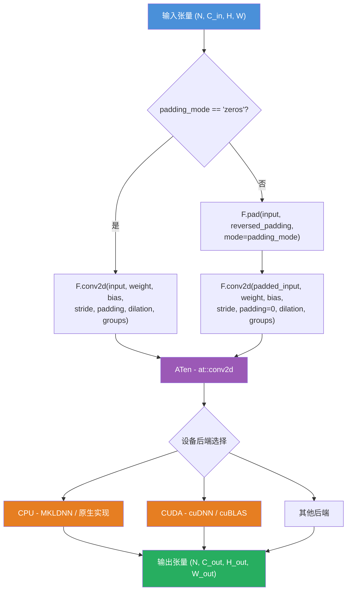
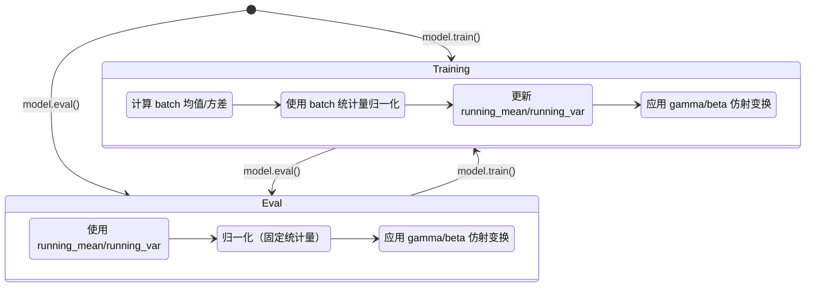

## 1. 概述

PyTorch 在 `torch/nn/modules/` 目录下提供了丰富的预定义网络层。这些层都继承自 `nn.Module`，在内部维护可学习参数（Parameter）和状态（Buffer），并在 `forward()` 方法中委托给 `torch.nn.functional` 中的无状态函数完成实际计算。

本文将深入分析四个最常用的层：**Linear**（全连接层）、**Conv2d**（二维卷积层）、**BatchNorm2d**（批归一化层）和 **MultiheadAttention**（多头注意力层）。

源码文件定位：
- `torch/nn/modules/linear.py`
- `torch/nn/modules/conv.py`
- `torch/nn/modules/batchnorm.py`
- `torch/nn/modules/activation.py`（MultiheadAttention）

## 2. Linear - 全连接层

### 2.1 源码分析

`Linear` 层实现仿射变换 $y = xA^T + b$，定义在 `torch/nn/modules/linear.py`：

```python
class Linear(Module):
    __constants__ = ["in_features", "out_features"]
    in_features: int
    out_features: int
    weight: Tensor

    def __init__(
        self,
        in_features: int,
        out_features: int,
        bias: bool = True,
        device=None,
        dtype=None,
    ) -> None:
        factory_kwargs = {"device": device, "dtype": dtype}
        super().__init__()
        self.in_features = in_features
        self.out_features = out_features
        self.weight = Parameter(
            torch.empty((out_features, in_features), **factory_kwargs)
        )
        if bias:
            self.bias = Parameter(torch.empty(out_features, **factory_kwargs))
        else:
            self.register_parameter("bias", None)
        self.reset_parameters()

    def reset_parameters(self) -> None:
        init.kaiming_uniform_(self.weight, a=math.sqrt(5))
        if self.bias is not None:
            fan_in, _ = init._calculate_fan_in_and_fan_out(self.weight)
            bound = 1 / math.sqrt(fan_in) if fan_in > 0 else 0
            init.uniform_(self.bias, -bound, bound)

    def forward(self, input: Tensor) -> Tensor:
        return F.linear(input, self.weight, self.bias)
```

### 2.2 关键设计要点

**参数形状**：
- `weight` 形状为 `(out_features, in_features)`，即行数为输出维度
- `bias` 形状为 `(out_features,)`
- 计算公式 `F.linear(input, weight, bias)` 内部执行 `input @ weight.T + bias`

**参数初始化**：
- `weight` 使用 Kaiming 均匀分布初始化：`kaiming_uniform_(weight, a=sqrt(5))`
  - `a=sqrt(5)` 这个参数使得实际分布等价于 $\mathcal{U}(-1/\sqrt{k}, 1/\sqrt{k})$，其中 $k = \text{in\_features}$
  - 这一选择是历史原因，详见 [PyTorch Issue #57109](https://github.com/pytorch/pytorch/issues/57109)
- `bias` 使用均匀分布初始化：$\mathcal{U}(-1/\sqrt{k}, 1/\sqrt{k})$

**bias 参数设计**：
- 当 `bias=False` 时，调用 `self.register_parameter("bias", None)` 显式注册一个 None 参数
- 这确保了 `bias` 属性始终存在于 `_parameters` 字典中，避免访问未定义属性的错误
- 在 `state_dict()` 中，值为 None 的参数不会被包含

**F.linear 调用链**：
- Python 层：`torch.nn.functional.linear()`
- C++ 层：`at::linear()`，最终调用矩阵乘法和加法的 ATen 算子

## 3. Conv2d - 二维卷积层

### 3.1 继承结构

Conv2d 的类层次为 `Conv2d -> _ConvNd -> Module`。`_ConvNd` 是所有卷积层（Conv1d、Conv2d、Conv3d）的公共基类：

```python
class _ConvNd(Module):
    __constants__ = [
        "stride", "padding", "dilation", "groups",
        "padding_mode", "output_padding", "in_channels",
        "out_channels", "kernel_size",
    ]

    def __init__(
        self,
        in_channels, out_channels, kernel_size, stride,
        padding, dilation, transposed, output_padding,
        groups, bias, padding_mode, device=None, dtype=None,
    ) -> None:
        factory_kwargs = {"device": device, "dtype": dtype}
        super().__init__()

        # 参数验证
        if groups <= 0:
            raise ValueError("groups must be a positive integer")
        if in_channels % groups != 0:
            raise ValueError("in_channels must be divisible by groups")
        if out_channels % groups != 0:
            raise ValueError("out_channels must be divisible by groups")

        # 存储卷积参数
        self.in_channels = in_channels
        self.out_channels = out_channels
        self.kernel_size = kernel_size
        self.stride = stride
        self.padding = padding
        self.dilation = dilation
        self.groups = groups
        self.padding_mode = padding_mode

        # 创建权重参数
        if transposed:
            self.weight = Parameter(torch.empty(
                (in_channels, out_channels // groups, *kernel_size),
                **factory_kwargs,
            ))
        else:
            self.weight = Parameter(torch.empty(
                (out_channels, in_channels // groups, *kernel_size),
                **factory_kwargs,
            ))

        if bias:
            self.bias = Parameter(torch.empty(out_channels, **factory_kwargs))
        else:
            self.register_parameter("bias", None)

        self.reset_parameters()
```

### 3.2 Conv2d 的 forward 实现

```python
class Conv2d(_ConvNd):
    def __init__(
        self,
        in_channels, out_channels, kernel_size, stride=1,
        padding=0, dilation=1, groups=1, bias=True,
        padding_mode="zeros", device=None, dtype=None,
    ) -> None:
        kernel_size_ = _pair(kernel_size)
        stride_ = _pair(stride)
        padding_ = padding if isinstance(padding, str) else _pair(padding)
        dilation_ = _pair(dilation)
        super().__init__(
            in_channels, out_channels, kernel_size_, stride_,
            padding_, dilation_, False, _pair(0),
            groups, bias, padding_mode, device, dtype,
        )

    def _conv_forward(self, input: Tensor, weight: Tensor, bias: Tensor | None):
        if self.padding_mode != "zeros":
            return F.conv2d(
                F.pad(input, self._reversed_padding_repeated_twice,
                      mode=self.padding_mode),
                weight, bias, self.stride,
                _pair(0), self.dilation, self.groups,
            )
        return F.conv2d(
            input, weight, bias, self.stride,
            self.padding, self.dilation, self.groups,
        )

    def forward(self, input: Tensor) -> Tensor:
        return self._conv_forward(input, self.weight, self.bias)
```

### 3.3 关键参数详解

**weight 形状**：`(out_channels, in_channels // groups, *kernel_size)`

对于 `Conv2d(3, 64, kernel_size=3, groups=1)`，weight 形状为 `(64, 3, 3, 3)`。

**groups 参数**：
- `groups=1`：标准卷积，所有输入通道与所有输出通道全连接
- `groups=in_channels`：深度可分离卷积（depthwise convolution）
- `groups=n`：将输入和输出通道均分为 n 组，每组独立卷积

**padding_mode 处理**：
- `"zeros"`（默认）：直接传给 `F.conv2d`，由 ATen 底层处理
- `"reflect"` / `"replicate"` / `"circular"`：先用 `F.pad` 手动填充，再以 `padding=0` 调用 `F.conv2d`

**`_reversed_padding_repeated_twice`**：由于 `F.pad` 的 padding 顺序与卷积参数顺序相反（`F.pad` 从最后一个维度开始），需要预计算反转后的 padding 值。

### 3.4 卷积计算流程



### 3.5 参数初始化

与 Linear 相同，使用 Kaiming 均匀分布：

```python
def reset_parameters(self) -> None:
    init.kaiming_uniform_(self.weight, a=math.sqrt(5))
    if self.bias is not None:
        fan_in, _ = init._calculate_fan_in_and_fan_out(self.weight)
        if fan_in != 0:
            bound = 1 / math.sqrt(fan_in)
            init.uniform_(self.bias, -bound, bound)
```

对于卷积层，`fan_in = in_channels / groups * kernel_size[0] * kernel_size[1]`。

## 4. BatchNorm2d - 批归一化层

### 4.1 继承结构

`BatchNorm2d -> _BatchNorm -> _NormBase -> Module`

`_NormBase` 是所有归一化层的公共基类，包含参数管理和初始化逻辑。

### 4.2 _NormBase 初始化

```python
class _NormBase(Module):
    def __init__(
        self,
        num_features: int,
        eps: float = 1e-5,
        momentum: float | None = 0.1,
        affine: bool = True,
        track_running_stats: bool = True,
        device=None,
        dtype=None,
    ) -> None:
        super().__init__()
        self.num_features = num_features
        self.eps = eps
        self.momentum = momentum
        self.affine = affine
        self.track_running_stats = track_running_stats

        # 可学习的仿射参数
        if self.affine:
            self.weight = Parameter(torch.empty(num_features, **factory_kwargs))
            self.bias = Parameter(torch.empty(num_features, **factory_kwargs))
        else:
            self.register_parameter("weight", None)
            self.register_parameter("bias", None)

        # 运行统计量（Buffer，不参与梯度计算）
        if self.track_running_stats:
            self.register_buffer("running_mean",
                                 torch.zeros(num_features, **factory_kwargs))
            self.register_buffer("running_var",
                                 torch.ones(num_features, **factory_kwargs))
            self.register_buffer("num_batches_tracked",
                                 torch.tensor(0, dtype=torch.long, ...))
        else:
            self.register_buffer("running_mean", None)
            self.register_buffer("running_var", None)
            self.register_buffer("num_batches_tracked", None)

        self.reset_parameters()

    def reset_parameters(self) -> None:
        self.reset_running_stats()
        if self.affine:
            init.ones_(self.weight)   # gamma 初始化为 1
            init.zeros_(self.bias)    # beta 初始化为 0
```

### 4.3 参数分类

| 属性 | 类型 | 初始值 | 说明 |
|------|------|--------|------|
| `weight` (gamma) | Parameter | 全 1 | 可学习的缩放参数 |
| `bias` (beta) | Parameter | 全 0 | 可学习的偏移参数 |
| `running_mean` | Buffer | 全 0 | 运行均值（推理时使用） |
| `running_var` | Buffer | 全 1 | 运行方差（推理时使用） |
| `num_batches_tracked` | Buffer | 0 | 已处理的 batch 计数 |

### 4.4 _BatchNorm.forward

```python
class _BatchNorm(_NormBase):
    def forward(self, input: Tensor) -> Tensor:
        self._check_input_dim(input)

        if self.momentum is None:
            exponential_average_factor = 0.0
        else:
            exponential_average_factor = self.momentum

        if self.training and self.track_running_stats:
            if self.num_batches_tracked is not None:
                self.num_batches_tracked.add_(1)
                if self.momentum is None:
                    # 累积移动平均
                    exponential_average_factor = 1.0 / float(self.num_batches_tracked)
                else:
                    # 指数移动平均
                    exponential_average_factor = self.momentum

        # 决定是否使用 mini-batch 统计量
        if self.training:
            bn_training = True
        else:
            bn_training = (self.running_mean is None) and (self.running_var is None)

        return F.batch_norm(
            input,
            self.running_mean if not self.training or self.track_running_stats else None,
            self.running_var if not self.training or self.track_running_stats else None,
            self.weight,
            self.bias,
            bn_training,
            exponential_average_factor,
            self.eps,
        )
```

### 4.5 训练模式 vs 推理模式



**训练模式**行为：
1. 计算当前 batch 的均值和方差
2. 使用 batch 统计量进行归一化
3. 更新 `running_mean` 和 `running_var`（指数移动平均）
4. 应用可学习的仿射变换（gamma, beta）

**推理模式**行为：
1. 使用预先计算好的 `running_mean` 和 `running_var`
2. 归一化使用固定的统计量
3. 应用可学习的仿射变换

**momentum 参数**：
- `momentum=0.1`（默认）：`running_mean = (1 - momentum) * running_mean + momentum * batch_mean`
- `momentum=None`：使用累积移动平均，`running_mean = running_mean * (n-1)/n + batch_mean / n`

## 5. MultiheadAttention - 多头注意力层

### 5.1 源码定位

`MultiheadAttention` 定义在 `torch/nn/modules/activation.py`（注意不是 `transformer.py`）。

### 5.2 初始化

```python
class MultiheadAttention(Module):
    def __init__(
        self,
        embed_dim,
        num_heads,
        dropout=0.0,
        bias=True,
        add_bias_kv=False,
        add_zero_attn=False,
        kdim=None,
        vdim=None,
        batch_first=False,
        device=None,
        dtype=None,
    ) -> None:
        super().__init__()
        self.embed_dim = embed_dim
        self.kdim = kdim if kdim is not None else embed_dim
        self.vdim = vdim if vdim is not None else embed_dim
        self._qkv_same_embed_dim = self.kdim == embed_dim and self.vdim == embed_dim

        self.num_heads = num_heads
        self.dropout = dropout
        self.batch_first = batch_first
        self.head_dim = embed_dim // num_heads
        assert self.head_dim * num_heads == self.embed_dim

        if not self._qkv_same_embed_dim:
            # Q, K, V 维度不同时，使用独立的投影矩阵
            self.q_proj_weight = Parameter(torch.empty((embed_dim, embed_dim)))
            self.k_proj_weight = Parameter(torch.empty((embed_dim, self.kdim)))
            self.v_proj_weight = Parameter(torch.empty((embed_dim, self.vdim)))
            self.register_parameter("in_proj_weight", None)
        else:
            # Q, K, V 维度相同时，使用合并的投影矩阵
            self.in_proj_weight = Parameter(
                torch.empty((3 * embed_dim, embed_dim))
            )
            self.register_parameter("q_proj_weight", None)
            self.register_parameter("k_proj_weight", None)
            self.register_parameter("v_proj_weight", None)

        # 输入投影偏置
        if bias:
            self.in_proj_bias = Parameter(torch.empty(3 * embed_dim))
        else:
            self.register_parameter("in_proj_bias", None)

        # 输出投影
        self.out_proj = NonDynamicallyQuantizableLinear(
            embed_dim, embed_dim, bias=bias
        )
```

### 5.3 关键设计

**合并投影矩阵**：当 Q、K、V 维度相同（`_qkv_same_embed_dim=True`，最常见的情况），使用单一的 `in_proj_weight`（形状 `(3*embed_dim, embed_dim)`），将 Q、K、V 三个投影矩阵沿第 0 维拼接。这样可以用一次矩阵乘法完成三个投影，效率更高。

**head_dim**：`embed_dim // num_heads`，要求 `embed_dim` 必须能被 `num_heads` 整除。

**输出投影**：使用 `NonDynamicallyQuantizableLinear`（本质上是 `Linear` 的子类，仅用于避免量化时的脚本化错误），形状为 `(embed_dim, embed_dim)`。

### 5.4 forward 调用

`MultiheadAttention.forward()` 最终委托给 `F.multi_head_attention_forward()`，该函数内部：
1. 使用 `in_proj_weight` 对 Q、K、V 进行线性投影
2. 将投影结果 reshape 为多头形式
3. 调用 `scaled_dot_product_attention()` 计算注意力
4. 拼接多头结果
5. 通过 `out_proj` 输出投影

当满足特定条件时（如 self-attention + batch_first + 推理模式），PyTorch 会使用 `scaled_dot_product_attention` 的优化实现（FlashAttention、Memory-efficient attention 等）。

## 6. 层对比总结

| 特性 | Linear | Conv2d | BatchNorm2d | MultiheadAttention |
|------|--------|--------|-------------|-------------------|
| 源文件 | `linear.py` | `conv.py` | `batchnorm.py` | `activation.py` |
| 参数类型 | weight, bias | weight, bias | weight, bias (affine) | in_proj_weight, out_proj |
| Buffer | 无 | 无 | running_mean, running_var, num_batches_tracked | 无 |
| 初始化 | Kaiming uniform | Kaiming uniform | ones/zeros | Xavier uniform |
| forward 委托 | `F.linear` | `F.conv2d` | `F.batch_norm` | `F.multi_head_attention_forward` |
| train/eval 差异 | 无 | 无 | 有（统计量选择） | 有（dropout, 快速路径） |

## 7. 设计模式总结

通过分析这四个层的源码，可以提炼出 PyTorch 网络层的通用设计模式：

1. **继承 Module**：利用 `__setattr__` 自动注册参数和子模块
2. **参数在 `__init__` 中创建**：使用 `Parameter(torch.empty(...))` 创建未初始化的参数张量
3. **`reset_parameters()` 负责初始化**：与创建分离，允许用户在需要时重新初始化
4. **`forward()` 委托给 functional**：保持 Module 层的简洁性，将实际计算逻辑下沉到 `torch.nn.functional`
5. **`register_parameter(name, None)` 处理可选参数**：确保属性始终存在，简化后续访问逻辑
6. **`register_buffer` 管理非学习状态**：如 BatchNorm 的运行统计量，参与序列化但不参与梯度计算
7. **`__constants__` 声明**：用于 TorchScript 编译时的常量标记
