## 1. 概述

PyTorch 提供了两套互补的 API 来构建神经网络：

- **`torch.nn.Module`**（简称 `nn.*`）：有状态的面向对象 API，内部维护可学习参数
- **`torch.nn.functional`**（简称 `F.*`）：无状态的函数式 API，纯函数，不持有任何参数

这两套 API 并非竞争关系，而是协作关系。大多数 `nn.Module` 子类的 `forward()` 方法都会委托给对应的 `F.*` 函数完成实际计算。理解两者的关系和适用场景，是编写简洁 PyTorch 代码的关键。

## 2. functional 提供无状态纯函数

`torch.nn.functional` 模块（文件：`torch/nn/functional.py`）提供一系列无状态的神经网络操作函数。"无状态"意味着这些函数不维护任何内部状态，每次调用的结果完全由输入参数决定。

### 2.1 常见的 functional 函数

```python
import torch.nn.functional as F

# 激活函数
out = F.relu(x)
out = F.gelu(x)
out = F.softmax(x, dim=-1)
out = F.sigmoid(x)

# 线性变换（需要手动传入 weight 和 bias）
out = F.linear(input, weight, bias)

# 卷积（需要手动传入 weight 和 bias）
out = F.conv2d(input, weight, bias, stride=1, padding=0)

# 损失函数
loss = F.cross_entropy(logits, targets)
loss = F.mse_loss(predictions, targets)

# 正则化
out = F.dropout(x, p=0.5, training=True)
out = F.batch_norm(input, running_mean, running_var, weight, bias, training)

# 池化
out = F.max_pool2d(x, kernel_size=2)
out = F.adaptive_avg_pool2d(x, output_size=(1, 1))
```

### 2.2 关键特征

1. **所有参数都通过函数参数传入**：`F.linear(input, weight, bias)` 需要显式传入权重和偏置
2. **不持有任何可学习参数**：没有 `Parameter` 对象，没有 `state_dict`
3. **没有 training 状态**：`F.dropout` 需要显式传入 `training` 参数
4. **可直接用于 eager 计算**：无需先创建模块实例

## 3. Module 包装 functional 并管理状态

`nn.Module` 子类的核心职责是：
1. 在 `__init__` 中创建并管理可学习参数（`Parameter`）
2. 在 `forward()` 中将这些参数传给对应的 `F.*` 函数

### 3.1 对比示例

以 Linear 层为例：

```python
# ===== 使用 Module =====
linear = nn.Linear(784, 256)  # 自动创建 weight 和 bias
output = linear(x)             # 调用 forward()，自动使用内部参数

# ===== 使用 functional =====
weight = torch.randn(256, 784, requires_grad=True)
bias = torch.randn(256, requires_grad=True)
output = F.linear(x, weight, bias)  # 需要手动管理参数
```

### 3.2 Module.forward 委托给 functional

实际的 Module 源码直观地展示了这种委托关系：

```python
# nn.Linear 的 forward
class Linear(Module):
    def forward(self, input: Tensor) -> Tensor:
        return F.linear(input, self.weight, self.bias)

# nn.Conv2d 的 forward
class Conv2d(_ConvNd):
    def forward(self, input: Tensor) -> Tensor:
        return self._conv_forward(input, self.weight, self.bias)

    def _conv_forward(self, input, weight, bias):
        return F.conv2d(input, weight, bias, self.stride,
                        self.padding, self.dilation, self.groups)

# nn.BatchNorm2d 的 forward
class _BatchNorm(_NormBase):
    def forward(self, input: Tensor) -> Tensor:
        return F.batch_norm(
            input, self.running_mean, self.running_var,
            self.weight, self.bias, bn_training,
            exponential_average_factor, self.eps,
        )
```

模式非常清晰：**Module 持有参数，forward() 将参数传给 F.* 函数执行计算**。

## 4. 调用链分析

```mermaid
flowchart LR
    subgraph user["用户代码层"]
        Call["model(input)"]
    end

    subgraph module_layer["nn.Module 层"]
        direction TB
        CallImpl["__call__ / _call_impl"]
        Hooks["Hook 执行"]
        Forward["forward()"]
        CallImpl --> Hooks
        Hooks --> Forward
    end

    subgraph functional_layer["nn.functional 层"]
        direction TB
        FFunc["F.linear / F.conv2d / ..."]
        Dispatch["Python 参数处理与分发"]
        FFunc --> Dispatch
    end

    subgraph aten_layer["ATen / C++ 层"]
        direction TB
        ATenOp["at::linear / at::conv2d / ..."]
        Backend["后端实现<br/>(CPU / CUDA / MPS / ...)"]
        ATenOp --> Backend
    end

    Call --> CallImpl
    Forward --> FFunc
    Dispatch --> ATenOp

    style user fill:#4A90D9,color:#fff
    style module_layer fill:#50B5A9,color:#fff
    style functional_layer fill:#F5A623,color:#fff
    style aten_layer fill:#9B59B6,color:#fff
```



完整调用链：
1. **用户调用 `model(x)`** -> 触发 `Module.__call__`
2. **`__call__`** -> 执行 Hook，然后调用 `forward()`
3. **`forward()`** -> 调用 `F.linear(input, self.weight, self.bias)` 等 functional 函数
4. **`F.linear`** -> 进行参数校验，调用 `torch._C._nn.linear` 等 C++ 绑定
5. **ATen 层** -> 分发到具体后端实现（CPU/CUDA/MPS 等）

## 5. 何时使用哪种 API

### 5.1 使用 nn.Module 的场景

**有可学习参数的操作**必须使用 Module：

```python
class MyModel(nn.Module):
    def __init__(self):
        super().__init__()
        # 这些层有可学习参数，必须用 Module
        self.conv1 = nn.Conv2d(3, 64, 3, padding=1)
        self.bn1 = nn.BatchNorm2d(64)
        self.fc = nn.Linear(64, 10)
```

**需要在 train/eval 模式下行为不同的操作**推荐使用 Module：

```python
# 推荐：Module 自动感知 training 状态
self.dropout = nn.Dropout(0.5)

# 也可以用 functional，但需要手动传 training
F.dropout(x, p=0.5, training=self.training)
```

### 5.2 使用 functional 的场景

**无参数的简单操作**可以直接使用 functional：

```python
class MyModel(nn.Module):
    def forward(self, x):
        # 无参数的激活函数，直接用 F
        x = F.relu(self.conv1(x))
        x = F.max_pool2d(x, 2)

        # 计算损失时用 F
        loss = F.cross_entropy(logits, targets)
        return loss
```

**需要灵活控制的场景**使用 functional：

```python
class CustomAttention(nn.Module):
    def forward(self, q, k, v, mask=None):
        # 使用 F 可以精确控制每个计算步骤
        attn_weights = torch.bmm(q, k.transpose(1, 2))
        attn_weights = attn_weights / math.sqrt(q.size(-1))
        if mask is not None:
            attn_weights = attn_weights.masked_fill(mask == 0, float('-inf'))
        attn_weights = F.softmax(attn_weights, dim=-1)
        attn_weights = F.dropout(attn_weights, p=self.dropout_p,
                                 training=self.training)
        return torch.bmm(attn_weights, v)
```

### 5.3 选择指南总结

| 条件 | 推荐 API | 原因 |
|------|----------|------|
| 有可学习参数 | `nn.Module` | 自动管理参数的注册、序列化、设备迁移 |
| 有运行时状态（running stats） | `nn.Module` | Buffer 自动随模型保存/加载/迁移 |
| train/eval 行为不同 | `nn.Module`（推荐）或 `F.*` | Module 自动感知 `self.training` |
| 无参数的激活函数 | `F.*` 或 `nn.Module` 均可 | `F.relu(x)` 更简洁；`nn.ReLU()` 可出现在 `Sequential` 中 |
| 损失函数 | `F.*` 更常见 | 通常无需作为模型的子模块 |
| 需要精细控制的计算 | `F.*` | 更灵活，可自由组合 |

## 6. 激活函数 - 两种 API 的典型对比

激活函数是 Module 与 functional 重叠最多的领域。以 ReLU 为例：

```python
# functional 风格
class Model_F(nn.Module):
    def __init__(self):
        super().__init__()
        self.fc1 = nn.Linear(784, 256)
        self.fc2 = nn.Linear(256, 10)

    def forward(self, x):
        x = F.relu(self.fc1(x))
        return self.fc2(x)

# Module 风格
class Model_M(nn.Module):
    def __init__(self):
        super().__init__()
        self.fc1 = nn.Linear(784, 256)
        self.relu = nn.ReLU()
        self.fc2 = nn.Linear(256, 10)

    def forward(self, x):
        x = self.relu(self.fc1(x))
        return self.fc2(x)

# Sequential 风格（要求所有操作都是 Module）
model_seq = nn.Sequential(
    nn.Linear(784, 256),
    nn.ReLU(),         # 必须用 Module 版本
    nn.Linear(256, 10),
)
```

三者在功能上完全等价。选择哪种风格取决于代码组织需求：
- `F.relu` 更简洁，适合在 `forward()` 中直接使用
- `nn.ReLU()` 在模型打印和 `Sequential` 中更清晰
- 带参数的激活（如 `nn.PReLU`）必须用 Module 版本

## 7. functional 内部实现

`F.linear` 的简化实现：

```python
# torch/nn/functional.py (简化)
def linear(input, weight, bias=None):
    # 对于 2D 输入和有 bias 的情况
    # 调用 torch.addmm（矩阵乘加融合操作）
    if input.dim() == 2 and bias is not None:
        return torch.addmm(bias, input, weight.t())
    # 通用路径
    output = input.matmul(weight.t())
    if bias is not None:
        output += bias
    return output
```

实际的 `F.linear` 直接调用 C++ 实现的 `torch._C._nn.linear`，上述代码仅展示逻辑等价关系。关键点在于：functional 函数本身也只是 ATen 算子的薄包装，真正的计算发生在 C++ 层。

## 8. 总结

Module 和 functional 的关系可以概括为一句话：**Module 负责"what"（持有什么参数），functional 负责"how"（如何计算）**。

```
nn.Linear                    →   管理 weight, bias
  └── forward()              →   调用 F.linear(input, self.weight, self.bias)
        └── F.linear()       →   调用 ATen 算子执行矩阵运算
```

在实际开发中，推荐的最佳实践是：
1. 模型的整体结构使用 `nn.Module` 组织
2. 有状态的层（有参数或 Buffer）使用 `nn.Module` 封装
3. 无状态的操作在 `forward()` 中直接使用 `F.*` 函数
4. 构建 `Sequential` 流水线时使用 Module 版本的激活函数和操作
