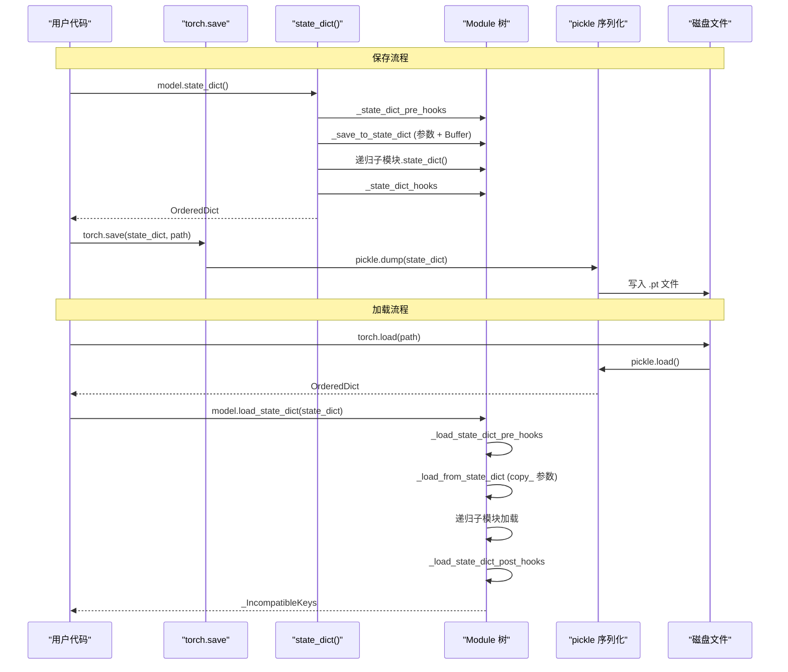

## 1. 概述

模型序列化是深度学习工程中的核心环节。训练好的模型需要保存到磁盘以供推理使用；训练过程需要定期保存 checkpoint 以支持断点续训。PyTorch 的序列化机制围绕 `state_dict`（状态字典）设计，提供了清晰、灵活的模型保存与加载方案。

本文将从源码层面分析 `state_dict()`、`load_state_dict()`、序列化格式、以及状态字典钩子的实现。

源码位置：`torch/nn/modules/module.py`

## 2. state_dict() - 导出状态字典

### 2.1 源码分析

`state_dict()` 将模块中所有参数和持久化 Buffer 导出为一个有序字典：

```python
def state_dict(self, *args, destination=None, prefix="", keep_vars=False):
    # 初始化目标字典
    if destination is None:
        destination = OrderedDict()
        destination._metadata = OrderedDict()

    # 记录版本信息
    local_metadata = dict(version=self._version)
    if hasattr(destination, "_metadata"):
        destination._metadata[prefix[:-1]] = local_metadata

    # 1. 执行 state_dict pre hooks
    for hook in self._state_dict_pre_hooks.values():
        hook(self, prefix, keep_vars)

    # 2. 保存当前模块的参数和 Buffer
    self._save_to_state_dict(destination, prefix, keep_vars)

    # 3. 递归保存子模块
    for name, module in self._modules.items():
        if module is not None:
            module.state_dict(
                destination=destination,
                prefix=prefix + name + ".",
                keep_vars=keep_vars,
            )

    # 4. 执行 state_dict post hooks
    for hook in self._state_dict_hooks.values():
        hook_result = hook(self, destination, prefix, local_metadata)
        ...

    return destination
```

### 2.2 _save_to_state_dict

实际的保存逻辑在 `_save_to_state_dict` 中：

```python
def _save_to_state_dict(self, destination, prefix, keep_vars):
    # 保存参数
    for name, param in self._parameters.items():
        if param is not None:
            destination[prefix + name] = param if keep_vars else param.detach()

    # 保存持久化 Buffer（排除 non-persistent 的）
    for name, buf in self._buffers.items():
        if buf is not None and name not in self._non_persistent_buffers_set:
            destination[prefix + name] = buf if keep_vars else buf.detach()
```

关键行为：
- **Parameter**：全部保存（值为 None 的除外）
- **Buffer**：只保存 `persistent=True` 的（默认行为）
- **`keep_vars=False`（默认）**：保存的 Tensor 会经过 `detach()`，切断计算图
- **`keep_vars=True`**：保存原始 Tensor，保留计算图（罕见用法）

### 2.3 键名规则

键名使用 `.` 分隔的层次路径，例如：

```python
model = nn.Sequential(
    nn.Linear(10, 20),   # prefix = "0."
    nn.Linear(20, 5),    # prefix = "1."
)

state = model.state_dict()
# OrderedDict([
#   ('0.weight', tensor(...)),
#   ('0.bias', tensor(...)),
#   ('1.weight', tensor(...)),
#   ('1.bias', tensor(...)),
# ])
```

对于嵌套结构：

```python
class MyModel(nn.Module):
    def __init__(self):
        super().__init__()
        self.encoder = nn.Sequential(
            nn.Linear(784, 256),
            nn.ReLU(),
            nn.Linear(256, 128),
        )
        self.decoder = nn.Linear(128, 10)

state = model.state_dict()
# 键名示例:
# 'encoder.0.weight', 'encoder.0.bias',
# 'encoder.2.weight', 'encoder.2.bias',
# 'decoder.weight', 'decoder.bias'
```

### 2.4 _metadata

`state_dict` 中附带一个 `_metadata` 属性，记录每个模块的版本信息：

```python
destination._metadata[prefix[:-1]] = dict(version=self._version)
```

版本信息用于向后兼容。例如 BatchNorm 在版本 2 中添加了 `num_batches_tracked` Buffer，加载旧版本的 state_dict 时可以根据版本号自动补充缺失的字段。

## 3. load_state_dict() - 加载状态字典

### 3.1 源码分析

```python
def load_state_dict(
    self, state_dict: Mapping[str, Any],
    strict: bool = True,
    assign: bool = False,
):
    missing_keys: list[str] = []
    unexpected_keys: list[str] = []
    error_msgs: list[str] = []

    # 复制 state_dict 以避免修改原始数据
    metadata = getattr(state_dict, "_metadata", None)
    state_dict = OrderedDict(state_dict)
    if metadata is not None:
        state_dict._metadata = metadata

    def load(module, local_state_dict, prefix="") -> None:
        local_metadata = (
            {} if metadata is None
            else metadata.get(prefix[:-1], {})
        )
        if assign:
            local_metadata["assign_to_params_buffers"] = assign

        # 调用模块的 _load_from_state_dict
        module._load_from_state_dict(
            local_state_dict, prefix, local_metadata,
            True, missing_keys, unexpected_keys, error_msgs,
        )

        # 递归加载子模块
        for name, child in module._modules.items():
            if child is not None:
                child_prefix = prefix + name + "."
                child_state_dict = {
                    k: v for k, v in local_state_dict.items()
                    if k.startswith(child_prefix)
                }
                load(child, child_state_dict, child_prefix)

        # 执行 post hooks
        incompatible_keys = _IncompatibleKeys(missing_keys, unexpected_keys)
        for hook in module._load_state_dict_post_hooks.values():
            hook(module, incompatible_keys)

    load(self, state_dict)
    del load

    # strict 模式下检查键的匹配
    if strict:
        if len(unexpected_keys) > 0:
            error_msgs.insert(0,
                "Unexpected key(s) in state_dict: "
                f"{', '.join(unexpected_keys)}. "
            )
        if len(missing_keys) > 0:
            error_msgs.insert(0,
                "Missing key(s) in state_dict: "
                f"{', '.join(missing_keys)}. "
            )

    if len(error_msgs) > 0:
        raise RuntimeError(...)

    return _IncompatibleKeys(missing_keys, unexpected_keys)
```

### 3.2 _load_from_state_dict

每个模块的实际加载逻辑：

```python
def _load_from_state_dict(
    self, state_dict, prefix, local_metadata, strict,
    missing_keys, unexpected_keys, error_msgs,
) -> None:
    # 执行 pre hooks
    for hook in self._load_state_dict_pre_hooks.values():
        hook(state_dict, prefix, local_metadata, strict,
             missing_keys, unexpected_keys, error_msgs)

    persistent_buffers = {
        k: v for k, v in self._buffers.items()
        if k not in self._non_persistent_buffers_set
    }
    local_name_params = itertools.chain(
        self._parameters.items(), persistent_buffers.items()
    )
    local_state = {k: v for k, v in local_name_params if v is not None}

    for name, param in local_state.items():
        key = prefix + name
        if key in state_dict:
            input_param = state_dict[key]
            # 形状检查、dtype 匹配等
            ...
            # 将值复制到现有参数中
            with torch.no_grad():
                param.copy_(input_param)
        elif strict:
            missing_keys.append(key)

    if strict:
        for key in state_dict.keys():
            if key.startswith(prefix):
                input_name = key[len(prefix):]
                input_name = input_name.split(".", 1)[0]
                if input_name not in self._modules and input_name not in local_state:
                    unexpected_keys.append(key)
```

### 3.3 strict 参数

- **`strict=True`（默认）**：state_dict 的键必须与模型的键完全匹配。多余的键或缺失的键都会引发 `RuntimeError`
- **`strict=False`**：允许键不匹配，只加载匹配的部分。返回值中包含 `missing_keys` 和 `unexpected_keys`

```python
# strict=False 常用于迁移学习
result = model.load_state_dict(pretrained_state, strict=False)
print(f"Missing keys: {result.missing_keys}")
print(f"Unexpected keys: {result.unexpected_keys}")
```

### 3.4 assign 参数

- **`assign=False`（默认）**：使用 `param.copy_(input_param)` 将值复制到现有参数中，保持参数对象不变
- **`assign=True`**：直接替换参数对象。这在加载不同 dtype 或 device 的 state_dict 时更高效

```python
# assign=True 适用于跨设备加载
state_dict = torch.load("model.pt", map_location="cpu")
model.load_state_dict(state_dict, assign=True)
```

## 4. 序列化流程

### 4.1 推荐方式 - 保存 state_dict

```python
# 保存
torch.save(model.state_dict(), "model_weights.pt")

# 加载
model = MyModel()  # 先创建模型结构
state_dict = torch.load("model_weights.pt", weights_only=True)
model.load_state_dict(state_dict)
```

### 4.2 不推荐方式 - 保存整个模型

```python
# 保存整个模型
torch.save(model, "model_full.pt")

# 加载
model = torch.load("model_full.pt")
```

**不推荐的原因**：
1. `torch.save(model)` 使用 Python 的 `pickle` 序列化整个对象，包括类定义的引用路径
2. 加载时要求类定义的模块路径与保存时完全一致
3. 代码重构（类名、模块路径变更）会导致加载失败
4. 存在安全风险：`pickle` 可以执行任意代码

### 4.3 保存 Checkpoint（断点续训）

训练中间状态通常需要保存优化器状态、epoch 数等额外信息：

```python
# 保存 checkpoint
checkpoint = {
    "epoch": epoch,
    "model_state_dict": model.state_dict(),
    "optimizer_state_dict": optimizer.state_dict(),
    "loss": loss,
    "best_acc": best_acc,
}
torch.save(checkpoint, f"checkpoint_epoch_{epoch}.pt")

# 加载 checkpoint
checkpoint = torch.load("checkpoint_epoch_50.pt", weights_only=True)
model.load_state_dict(checkpoint["model_state_dict"])
optimizer.load_state_dict(checkpoint["optimizer_state_dict"])
start_epoch = checkpoint["epoch"] + 1
best_acc = checkpoint["best_acc"]
```

### 4.4 序列化流程图



## 5. 序列化格式结构

### 5.1 state_dict 内部结构

```mermaid
graph TD
    subgraph sd["state_dict (OrderedDict)"]
        direction TB
        Meta["_metadata (OrderedDict)"]
        P1["'encoder.conv1.weight' -> Tensor (64, 3, 3, 3)"]
        P2["'encoder.conv1.bias' -> Tensor (64,)"]
        P3["'encoder.bn1.weight' -> Tensor (64,)"]
        P4["'encoder.bn1.bias' -> Tensor (64,)"]
        B1["'encoder.bn1.running_mean' -> Tensor (64,)"]
        B2["'encoder.bn1.running_var' -> Tensor (64,)"]
        B3["'encoder.bn1.num_batches_tracked' -> Tensor (scalar)"]
        P5["'classifier.weight' -> Tensor (10, 64)"]
        P6["'classifier.bias' -> Tensor (10,)"]
    end

    subgraph meta["_metadata 内容"]
        direction TB
        M0["'' -> {version: 1}"]
        M1["'encoder' -> {version: 1}"]
        M2["'encoder.conv1' -> {version: 1}"]
        M3["'encoder.bn1' -> {version: 2}"]
        M4["'classifier' -> {version: 1}"]
    end

    Meta -.-> meta

    style P1 fill:#9B59B6,color:#fff
    style P2 fill:#9B59B6,color:#fff
    style P3 fill:#9B59B6,color:#fff
    style P4 fill:#9B59B6,color:#fff
    style P5 fill:#9B59B6,color:#fff
    style P6 fill:#9B59B6,color:#fff
    style B1 fill:#E74C3C,color:#fff
    style B2 fill:#E74C3C,color:#fff
    style B3 fill:#E74C3C,color:#fff
    style Meta fill:#3498DB,color:#fff
```



> 紫色条目为可学习参数（Parameter），红色条目为持久化缓冲区（Buffer）。

### 5.2 torch.save 的底层格式

`torch.save` 默认使用 Python 的 `pickle` 协议，但对 Tensor 数据做了特殊处理：

1. **pickle** 序列化 Python 对象结构（字典、键名等）
2. **Tensor 数据** 以连续的二进制块存储，pickle 只记录引用
3. 整体打包为一个 ZIP 文件（PyTorch 1.6+ 默认格式）

ZIP 文件内部结构：
```
model.pt (ZIP archive)
├── archive/
│   ├── data.pkl          # pickle 序列化的对象结构
│   ├── data/0            # 第 1 个 Tensor 的原始数据
│   ├── data/1            # 第 2 个 Tensor 的原始数据
│   ├── ...
│   └── data/N            # 第 N 个 Tensor 的原始数据
└── archive/version       # 格式版本号
```

## 6. 状态字典 Hook

### 6.1 导出阶段的 Hook

**State Dict Pre Hook**：在 `_save_to_state_dict` 之前触发：

```python
def my_pre_hook(module, prefix, keep_vars):
    print(f"About to save {prefix}")

model.register_state_dict_pre_hook(my_pre_hook)
```

**State Dict Post Hook**：在所有子模块保存完成后触发：

```python
def my_post_hook(module, state_dict, prefix, local_metadata):
    # 可以修改 state_dict，例如添加额外的元数据
    state_dict[prefix + "custom_info"] = torch.tensor([1, 2, 3])

model._register_state_dict_hook(my_post_hook)
```

### 6.2 加载阶段的 Hook

**Load State Dict Pre Hook**：在 `_load_from_state_dict` 之前触发：

```python
def rename_keys_hook(module, state_dict, prefix, local_metadata,
                     strict, missing_keys, unexpected_keys, error_msgs):
    # 重命名旧版本的键名
    old_key = prefix + "old_param_name"
    new_key = prefix + "new_param_name"
    if old_key in state_dict:
        state_dict[new_key] = state_dict.pop(old_key)

model.register_load_state_dict_pre_hook(rename_keys_hook)
```

**Load State Dict Post Hook**：在加载完成后触发：

```python
def check_loaded_hook(module, incompatible_keys):
    if incompatible_keys.missing_keys:
        print(f"Warning: missing keys: {incompatible_keys.missing_keys}")

model.register_load_state_dict_post_hook(check_loaded_hook)
```

### 6.3 实战 - 版本迁移

利用 Hook 处理模型版本升级时的参数变更：

```python
class MyModelV2(nn.Module):
    _version = 2

    def __init__(self):
        super().__init__()
        self.fc = nn.Linear(10, 20)
        self.new_layer = nn.Linear(20, 20)  # V2 新增的层

    def _load_from_state_dict(
        self, state_dict, prefix, local_metadata, strict,
        missing_keys, unexpected_keys, error_msgs,
    ):
        version = local_metadata.get("version", 1)
        if version < 2:
            # V1 没有 new_layer，用默认初始化
            # 从 missing_keys 中移除以避免 strict 模式报错
            new_layer_keys = [
                prefix + "new_layer.weight",
                prefix + "new_layer.bias",
            ]
            for key in new_layer_keys:
                if key in missing_keys:
                    missing_keys.remove(key)

        super()._load_from_state_dict(
            state_dict, prefix, local_metadata, strict,
            missing_keys, unexpected_keys, error_msgs,
        )
```

## 7. 跨设备加载

### 7.1 map_location 参数

```python
# 将 GPU 模型加载到 CPU
state_dict = torch.load("model_gpu.pt", map_location="cpu")

# 将 CPU 模型加载到指定 GPU
state_dict = torch.load("model_cpu.pt", map_location="cuda:0")

# 使用函数进行自定义映射
state_dict = torch.load("model.pt",
    map_location=lambda storage, loc: storage.cuda(0))
```

### 7.2 常见模式

```python
# 模式 1：保存时在 GPU，加载到 CPU
torch.save(model.state_dict(), "model.pt")
# 加载时
model = MyModel()
model.load_state_dict(
    torch.load("model.pt", map_location="cpu", weights_only=True)
)

# 模式 2：DataParallel 模型（带 module. 前缀）加载到单 GPU
state_dict = torch.load("dp_model.pt", weights_only=True)
# 去除 "module." 前缀
new_state_dict = {
    k.replace("module.", ""): v
    for k, v in state_dict.items()
}
model.load_state_dict(new_state_dict)
```

## 8. weights_only 安全加载

从 PyTorch 2.6 开始，`torch.load` 默认要求 `weights_only=True`：

```python
# 安全加载（推荐）
state_dict = torch.load("model.pt", weights_only=True)

# 允许 unpickling（仅在信任文件来源时使用）
state_dict = torch.load("model.pt", weights_only=False)
```

`weights_only=True` 使用受限的 unpickler，只允许反序列化 Tensor、基础 Python 类型和 NumPy 数组等安全对象。这防止了恶意 pickle 文件执行任意代码。

## 9. 总结

| 操作 | 推荐方式 | 说明 |
|------|----------|------|
| 保存模型权重 | `torch.save(model.state_dict(), path)` | 只保存参数和 Buffer |
| 加载模型权重 | `model.load_state_dict(torch.load(path, weights_only=True))` | 需要先创建模型结构 |
| 保存 checkpoint | `torch.save({model, optimizer, epoch, ...}, path)` | 包含训练状态 |
| 保存整个模型 | `torch.save(model, path)` | 不推荐 - 依赖类路径 |
| 迁移学习加载 | `model.load_state_dict(state, strict=False)` | 允许键不匹配 |
| 跨设备加载 | `torch.load(path, map_location="cpu")` | 指定目标设备 |
| 版本迁移 | 重写 `_load_from_state_dict` 或使用 Hook | 处理参数变更 |

state_dict 的设计遵循"关注点分离"原则：模型结构（Python 代码）与模型参数（Tensor 数据）分开管理。这使得代码可以自由演进，只要保持参数名称的一致性，旧的权重就能加载到新的代码中。
