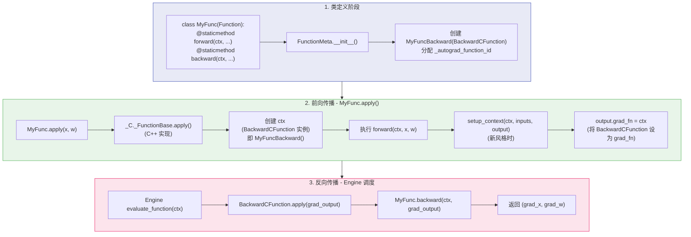
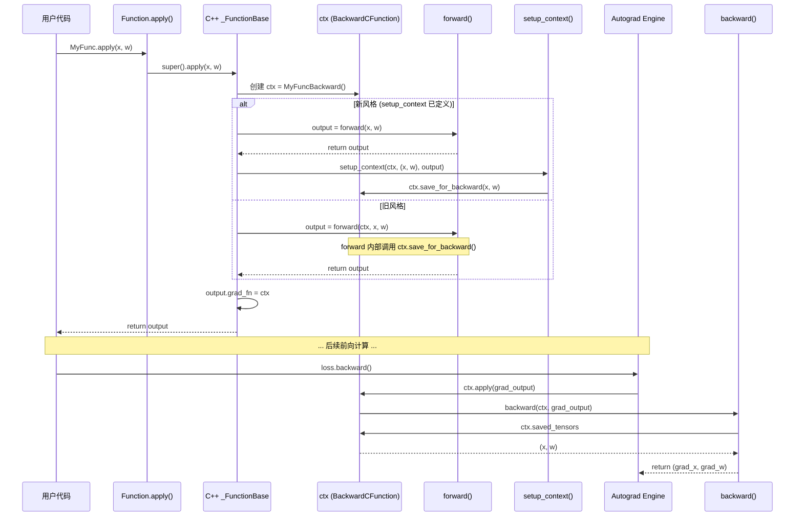

## 1. 概述

PyTorch 内建了大量运算的自动微分支持，但在实际开发中，你可能需要：

- 实现一个新的数学运算，并定义其梯度公式
- 对某个计算过程进行手动梯度优化（例如用数值稳定的公式替换自动推导的梯度）
- 封装一段不可微的操作（如量化、采样），但仍需要梯度通过它流动（如 Straight-Through Estimator）

`torch.autograd.Function` 提供了标准的扩展接口，允许用户自定义前向计算和反向梯度逻辑，并将其无缝集成到 Autograd 计算图中。

本文将从源码角度解析自定义 Function 的完整协议，包括 `FunctionCtx`、`FunctionMeta` 元类、`BackwardCFunction` 桥接类，以及新旧两种编写风格的区别。

## 2. 核心类体系

自定义 Function 涉及的类体系定义在 `torch/autograd/function.py` 中：

```
Function (用户子类化的入口)
  └── _SingleLevelFunction
        ├── _C._FunctionBase    (C++ 基类，处理 apply 调度)
        ├── FunctionCtx         (上下文管理，save_for_backward 等)
        ├── _HookMixin          (钩子注册)
        └── metaclass=FunctionMeta (元类，自动创建 backward 类)
```

### 2.1 FunctionCtx - 上下文对象

`FunctionCtx` 是传递给 `forward()` 和 `backward()` 的 `ctx` 参数的类型。它提供了在前向和反向之间传递信息的接口：

```python
# torch/autograd/function.py
class FunctionCtx:
    def save_for_backward(self, *tensors: torch.Tensor):
        """保存张量，供 backward 中使用。
        比直接在 ctx 上保存张量更安全：
        - 启用版本检测（检测 in-place 修改）
        - 支持 saved_tensors_hooks
        """
        self.to_save = tensors

    def save_for_forward(self, *tensors: torch.Tensor):
        """保存张量，供 jvp (前向模式 AD) 使用"""
        self.saved_for_forward = tensors

    def mark_dirty(self, *args: torch.Tensor):
        """标记在 forward 中被原地修改的输入张量"""
        self.dirty_tensors = args

    def mark_non_differentiable(self, *args: torch.Tensor):
        """标记不需要梯度的输出张量"""
        self.non_differentiable = args

    def set_materialize_grads(self, value: bool):
        """控制是否将 None 梯度转为零张量再传给 backward"""
        self.materialize_grads = value
```

**`save_for_backward()` 与直接保存的区别：**

通过 `ctx.save_for_backward(x)` 保存的张量会被包装为 `SavedVariable`，享受以下保护：

1. **版本检测**：如果保存的张量在前向和反向之间被原地修改，反向传播时会报错
2. **Hooks 支持**：支持 `torch.autograd.graph.saved_tensors_hooks`，允许自定义保存/恢复逻辑（例如梯度检查点中将张量移到 CPU）
3. **内存管理**：在 `retain_graph=False` 时，引擎会在反向传播后释放保存的张量

访问保存的张量通过 `ctx.saved_tensors` 属性（返回解包后的张量元组）。

### 2.2 FunctionMeta - 元类

`FunctionMeta` 是 `Function` 的元类，在类定义时自动执行：

```python
class FunctionMeta(type):
    def __init__(cls, name, bases, attrs):
        # 自动创建对应的 backward 类
        backward_fn = type(
            name + "Backward",
            (BackwardCFunction,),
            {"_forward_cls": cls}
        )
        # 分配全局唯一 ID
        backward_fn._autograd_function_id = next(AUTOGRAD_FUNCTION_COUNTER)
        cls._backward_cls = backward_fn
        super().__init__(name, bases, attrs)
```

当你定义 `class MyReLU(Function)` 时，FunctionMeta 会自动：

1. 创建一个名为 `MyReLUBackward` 的类，继承自 `BackwardCFunction`
2. 将 `MyReLU` 存为 `MyReLUBackward._forward_cls`，使 backward 类能访问用户定义的 `backward()` 方法
3. 从全局计数器 `AUTOGRAD_FUNCTION_COUNTER` 分配一个唯一 ID

### 2.3 BackwardCFunction - C++ 桥接

`BackwardCFunction` 是连接 Python 自定义函数和 C++ Autograd 引擎的桥梁：

```python
class BackwardCFunction(_C._FunctionBase, FunctionCtx, _HookMixin):
    def apply(self, *args):
        """Engine 在反向传播时调用此方法"""
        backward_fn = self._forward_cls.backward
        vjp_fn = self._forward_cls.vjp
        if backward_fn is not Function.backward and vjp_fn is not Function.vjp:
            raise RuntimeError(
                "Implementing both 'backward' and 'vjp' for a custom "
                "Function is not allowed."
            )
        user_fn = vjp_fn if vjp_fn is not Function.vjp else backward_fn
        return user_fn(self, *args)
```

当 Engine 执行到自定义函数对应的节点时，会调用 `BackwardCFunction.apply()`。它内部将调用转发给用户定义的 `backward()` 或 `vjp()` 静态方法，并将 `self`（即 `ctx`）作为第一个参数传入。

## 3. 自定义 Function 执行流程

### 3.1 完整执行流程图



### 3.2 apply() 的内部机制

`Function.apply()` 是用户调用自定义函数的入口。它在 `torch/autograd/function.py` 中定义，关键逻辑如下：

```python
@classmethod
def apply(cls, *args, **kwargs):
    is_setup_ctx_defined = _is_setup_context_defined(cls.setup_context)
    if is_setup_ctx_defined:
        args = bind_default_args(cls.forward, *args, **kwargs)

    if not torch._C._are_functorch_transforms_active():
        args = _functorch.utils.unwrap_dead_wrappers(args)
        return super().apply(*args, **kwargs)  # 调用 C++ 实现

    # functorch 路径
    return custom_function_call(cls, *args, **kwargs)
```

C++ 侧的 `_FunctionBase.apply()` 完成核心工作：

1. 创建 `cls._backward_cls` 的实例（即 BackwardCFunction 子类的实例）作为 `ctx`
2. 检查是否定义了 `setup_context`
3. 如果是新风格（定义了 `setup_context`）：调用 `forward(*args)` -> `setup_context(ctx, inputs, output)`
4. 如果是旧风格（未定义 `setup_context`）：调用 `forward(ctx, *args)`
5. 设置输出张量的 `grad_fn` 为 `ctx`
6. 建立 `ctx.next_edges` 连接到输入张量的 `grad_fn`

## 4. 两种编写风格

### 4.1 旧风格 - forward(ctx, ...)

旧风格将前向计算和上下文设置放在同一个 `forward()` 方法中：

```python
class LinearFunction(torch.autograd.Function):
    @staticmethod
    def forward(ctx, input, weight, bias=None):
        ctx.save_for_backward(input, weight, bias)
        output = input.mm(weight.t())
        if bias is not None:
            output += bias.unsqueeze(0).expand_as(output)
        return output

    @staticmethod
    def backward(ctx, grad_output):
        input, weight, bias = ctx.saved_tensors
        grad_input = grad_weight = grad_bias = None

        if ctx.needs_input_grad[0]:
            grad_input = grad_output.mm(weight)
        if ctx.needs_input_grad[1]:
            grad_weight = grad_output.t().mm(input)
        if bias is not None and ctx.needs_input_grad[2]:
            grad_bias = grad_output.sum(0)

        return grad_input, grad_weight, grad_bias
```

### 4.2 新风格 - forward() + setup_context()

新风格将前向计算与上下文设置分离，使 Function 与 `torch.func` 变换（vmap、grad 等）兼容：

```python
class LinearFunction(torch.autograd.Function):
    @staticmethod
    def forward(input, weight, bias=None):
        # forward 不再接收 ctx
        output = input.mm(weight.t())
        if bias is not None:
            output += bias.unsqueeze(0).expand_as(output)
        return output

    @staticmethod
    def setup_context(ctx, inputs, output):
        # 专门的上下文设置方法
        input, weight, bias = inputs
        ctx.save_for_backward(input, weight, bias)

    @staticmethod
    def backward(ctx, grad_output):
        input, weight, bias = ctx.saved_tensors
        grad_input = grad_weight = grad_bias = None
        if ctx.needs_input_grad[0]:
            grad_input = grad_output.mm(weight)
        if ctx.needs_input_grad[1]:
            grad_weight = grad_output.t().mm(input)
        if bias is not None and ctx.needs_input_grad[2]:
            grad_bias = grad_output.sum(0)
        return grad_input, grad_weight, grad_bias
```

**新风格的优势**：

- `forward()` 是纯计算函数，不依赖 `ctx` 副作用
- 与 `torch.func.vmap`、`torch.func.grad` 等函数式变换兼容
- 更清晰的职责分离

### 4.3 forward/backward/setup_context 协议时序



## 5. @once_differentiable 装饰器

`@once_differentiable` 用于标记一个 `backward` 方法不支持二阶微分（double backward）：

```python
def once_differentiable(fn):
    @functools.wraps(fn)
    def wrapper(ctx, *args, **kwargs):
        with torch.no_grad():
            outputs = fn(ctx, *args, **kwargs)

        if not torch.is_grad_enabled():
            return outputs

        # 如果输入需要梯度，给输出附加一个会报错的 grad_fn
        # ...
        return outputs
    return wrapper
```

它的作用是：

1. 在 `torch.no_grad()` 上下文中执行 backward，不为梯度计算构建新的计算图
2. 如果有人尝试对 backward 的输出再求导（二阶微分），会抛出错误

当你的 backward 中使用了不可微操作或中间张量时，应该使用此装饰器：

```python
class MyFunc(Function):
    @staticmethod
    def forward(ctx, x):
        ctx.save_for_backward(x)
        return x.clamp(min=0)

    @staticmethod
    @once_differentiable
    def backward(ctx, grad_output):
        x, = ctx.saved_tensors
        return grad_output * (x > 0).float()
```

## 6. 实战示例

### 6.1 自定义 ReLU

```python
class CustomReLU(torch.autograd.Function):
    @staticmethod
    def forward(x):
        return x.clamp(min=0)

    @staticmethod
    def setup_context(ctx, inputs, output):
        x, = inputs
        ctx.save_for_backward(x)

    @staticmethod
    def backward(ctx, grad_output):
        x, = ctx.saved_tensors
        grad_input = grad_output.clone()
        grad_input[x < 0] = 0
        return grad_input

# 使用
x = torch.randn(5, requires_grad=True)
y = CustomReLU.apply(x)
y.sum().backward()
print(x.grad)
```

### 6.2 自定义线性层

```python
class CustomLinear(torch.autograd.Function):
    @staticmethod
    def forward(input, weight, bias=None):
        output = input @ weight.t()
        if bias is not None:
            output = output + bias
        return output

    @staticmethod
    def setup_context(ctx, inputs, output):
        input, weight, bias = inputs
        ctx.save_for_backward(input, weight, bias)

    @staticmethod
    def backward(ctx, grad_output):
        input, weight, bias = ctx.saved_tensors
        grad_input = grad_output @ weight
        grad_weight = grad_output.t() @ input
        grad_bias = grad_output.sum(0) if bias is not None else None
        return grad_input, grad_weight, grad_bias

# 使用
x = torch.randn(4, 3, requires_grad=True)
w = torch.randn(5, 3, requires_grad=True)
b = torch.randn(5, requires_grad=True)
y = CustomLinear.apply(x, w, b)
y.sum().backward()
```

### 6.3 支持 Double Backward 的自定义函数

当需要支持高阶微分时，backward 本身的操作也需要可微：

```python
class CustomSquare(torch.autograd.Function):
    @staticmethod
    def forward(x):
        return x * x

    @staticmethod
    def setup_context(ctx, inputs, output):
        x, = inputs
        ctx.save_for_backward(x)

    @staticmethod
    def backward(ctx, grad_output):
        x, = ctx.saved_tensors
        # 使用 PyTorch 操作而非 numpy/原地操作
        # 这样 autograd 可以追踪 backward 中的运算
        return 2 * x * grad_output

# 验证二阶微分
x = torch.tensor(3.0, requires_grad=True)
y = CustomSquare.apply(x)

# 一阶导数
dy_dx, = torch.autograd.grad(y, x, create_graph=True)
print(dy_dx)  # tensor(6.)  即 2x = 6

# 二阶导数
d2y_dx2, = torch.autograd.grad(dy_dx, x)
print(d2y_dx2)  # tensor(2.)  即 d(2x)/dx = 2
```

关键点：

- **不使用** `@once_differentiable`，允许 autograd 追踪 backward 中的操作
- backward 中只使用 PyTorch 操作（`2 * x * grad_output`），不用 numpy 或不可微操作
- 验证时使用 `create_graph=True` 以构建二阶梯度的计算图

## 7. 梯度检查 - gradcheck

PyTorch 提供了 `torch.autograd.gradcheck` 工具来验证自定义 Function 的梯度正确性：

```python
from torch.autograd import gradcheck

x = torch.randn(3, 4, requires_grad=True, dtype=torch.double)
w = torch.randn(5, 4, requires_grad=True, dtype=torch.double)
b = torch.randn(5, requires_grad=True, dtype=torch.double)

# gradcheck 用数值差分验证解析梯度
result = gradcheck(CustomLinear.apply, (x, w, b), eps=1e-6, atol=1e-4)
print(result)  # True 表示梯度正确
```

注意事项：

- 输入必须使用 `dtype=torch.double`（float64），单精度的数值差分误差太大
- `gradcheck` 会修改输入张量的 `requires_grad`，传入前确保设置正确
- 对于支持 double backward 的函数，使用 `gradgradcheck` 验证二阶梯度

## 8. C++ 侧的集成机制

### 8.1 BackwardCFunction 在计算图中的角色

在 C++ 侧，自定义 Python Function 对应的反向节点是 `PyNode`（定义在 `torch/csrc/autograd/python_function.h` 中）。当 Engine 遍历到该节点时：

1. Engine 调用 `PyNode::apply()`
2. `PyNode::apply()` 通过 Python/C API 调用 `BackwardCFunction.apply()`
3. `BackwardCFunction.apply()` 调用用户定义的 `backward()` 或 `vjp()`
4. 返回的梯度被传回 C++ Engine 进行后续分发

### 8.2 _autograd_function_id

每个自定义 Function 类在定义时由 `FunctionMeta` 分配一个全局唯一 ID：

```python
AUTOGRAD_FUNCTION_COUNTER = itertools.count()

class FunctionMeta(type):
    def __init__(cls, name, bases, attrs):
        backward_fn._autograd_function_id = next(AUTOGRAD_FUNCTION_COUNTER)
```

这个 ID 被 Compiled Autograd（`torch.compile` 的 backward 部分）用来识别和缓存自定义函数的编译结果。

## 9. 常见陷阱与最佳实践

### 9.1 不要在 ctx 上直接存储张量

```python
# 错误做法
class Bad(Function):
    @staticmethod
    def forward(ctx, x):
        ctx.x = x  # 直接保存，没有版本检测和 hooks 支持
        return x * 2

# 正确做法
class Good(Function):
    @staticmethod
    def forward(ctx, x):
        ctx.save_for_backward(x)
        return x * 2
```

### 9.2 backward 返回值必须与 forward 输入数量匹配

```python
class MyFunc(Function):
    @staticmethod
    def forward(ctx, x, y, scale):
        # 3 个输入
        ctx.save_for_backward(x, y)
        ctx.scale = scale
        return x * y * scale

    @staticmethod
    def backward(ctx, grad_output):
        x, y = ctx.saved_tensors
        # 必须返回 3 个值（对应 x, y, scale）
        return grad_output * y * ctx.scale, grad_output * x * ctx.scale, None
```

对于不需要梯度的输入（如非张量参数），返回 `None`。

### 9.3 使用 needs_input_grad 优化

```python
@staticmethod
def backward(ctx, grad_output):
    x, w = ctx.saved_tensors
    grad_x = grad_w = None

    # 只在需要时计算梯度
    if ctx.needs_input_grad[0]:
        grad_x = grad_output @ w
    if ctx.needs_input_grad[1]:
        grad_w = grad_output.t() @ x

    return grad_x, grad_w
```

`ctx.needs_input_grad` 是一个布尔元组，对应每个 forward 输入是否需要梯度。利用它可以跳过不必要的梯度计算。

## 10. 小结

| 组件 | 位置 | 职责 |
|------|------|------|
| `Function` | `torch/autograd/function.py` | 用户子类化的入口基类 |
| `FunctionCtx` | `torch/autograd/function.py` | `ctx` 对象，`save_for_backward()` 等接口 |
| `FunctionMeta` | `torch/autograd/function.py` | 元类，自动创建 Backward 类和分配 ID |
| `BackwardCFunction` | `torch/autograd/function.py` | 桥接 Python backward 到 C++ Engine |
| `_C._FunctionBase` | C++ 实现 | 处理 `apply()` 调度和计算图连接 |
| `@once_differentiable` | `torch/autograd/function.py` | 标记不支持二阶微分的 backward |

自定义 `autograd.Function` 是 PyTorch 可扩展性的关键基础设施。通过理解其内部协议 - 元类自动创建 backward 类、`BackwardCFunction` 作为 Python 和 C++ Engine 的桥梁、`setup_context` 实现关注点分离 - 开发者可以更好地编写正确、高效的自定义微分操作。对于新项目，推荐使用 `forward()` + `setup_context()` 的新风格，以获得与 `torch.func` 变换的兼容性。
