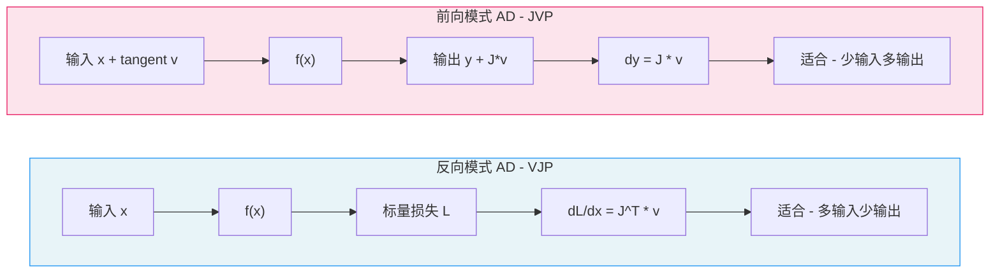
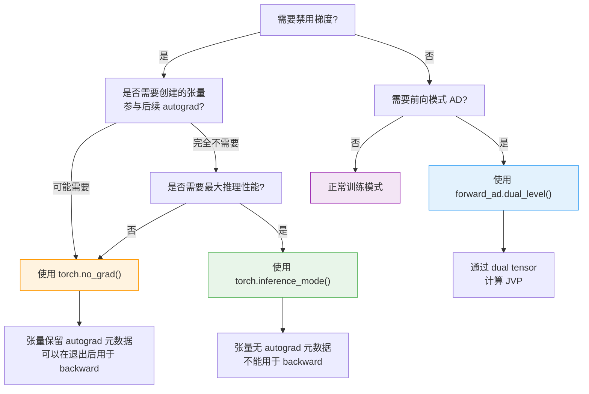

## 概述

PyTorch 的 autograd 系统提供了多种模式控制机制，用于在不同场景下精确控制梯度计算行为。本文深入分析三种核心模式的源码实现：**GradMode**（梯度模式）、**InferenceMode**（推理模式）和 **Forward-mode AD**（前向模式自动微分），帮助读者理解它们的内部机制及适用场景。

---

## 1. 线程局部状态基础 - AutogradState

所有模式控制的底层基础是 `AutogradState`，它是一个线程局部（thread-local）状态容器，定义在 `c10/core/AutogradState.h` 中：

```cpp
// c10/core/AutogradState.h
struct C10_API AutogradState {
  static AutogradState& get_tls_state();
  static void set_tls_state(AutogradState state);

  AutogradState(
      bool grad_mode,
      bool inference_mode,
      bool fw_grad_mode,
      bool multithreading_enabled)
      : grad_mode_(grad_mode),
        inference_mode_(inference_mode),
        fw_grad_mode_(fw_grad_mode),
        multithreading_enabled_(multithreading_enabled),
        view_replay_enabled_(false) {}

 private:
  bool grad_mode_ : 1;
  bool inference_mode_ : 1;
  bool fw_grad_mode_ : 1;
  bool multithreading_enabled_ : 1;
  bool view_replay_enabled_ : 1;
};
```

这些布尔标志位以 bit-field 形式存储，极其紧凑。每个线程拥有独立的 `AutogradState` 实例，确保多线程环境下模式切换互不干扰。

---

## 2. GradMode - 梯度模式

### 2.1 核心接口

`GradMode` 定义在 `c10/core/GradMode.h` 中，提供最基本的梯度计算开关：

```cpp
// c10/core/GradMode.h
struct C10_API GradMode {
  static bool is_enabled();
  static void set_enabled(bool enabled);
};
```

`is_enabled()` 和 `set_enabled()` 直接读写 `AutogradState` 中的 `grad_mode_` 标志位。

### 2.2 RAII 守卫

PyTorch 采用 RAII（Resource Acquisition Is Initialization）模式实现自动的状态恢复：

```cpp
// AutoGradMode - 通用守卫
struct C10_API AutoGradMode {
  AutoGradMode(bool enabled) : prev_mode(GradMode::is_enabled()) {
    GradMode::set_enabled(enabled);
  }
  ~AutoGradMode() {
    GradMode::set_enabled(prev_mode);  // 析构时自动恢复
  }
  bool prev_mode;
};

// NoGradGuard - 禁用梯度的便捷守卫
struct C10_API NoGradGuard : public AutoGradMode {
  NoGradGuard() : AutoGradMode(/*enabled=*/false) {}
};
```

### 2.3 Python 层接口

Python 中的 `torch.no_grad()` 和 `torch.enable_grad()` 最终都调用 C++ 层的 `GradMode::set_enabled()`。它们既可以作为上下文管理器，也可以作为装饰器使用：

```python
# 作为上下文管理器
with torch.no_grad():
    output = model(input)

# 作为装饰器
@torch.no_grad()
def inference(input):
    return model(input)
```

当 `GradMode` 被禁用时，新创建的张量不会记录计算图。已有张量的 `requires_grad` 属性不受影响，但不会为它们构建新的梯度追踪边。

---

## 3. InferenceMode - 推理模式

### 3.1 设计动机

`InferenceMode` 是 `no_grad` 的增强版本，提供更激进的性能优化。它不仅禁用梯度记录，还会跳过 autograd 相关的所有内部记录（如版本计数器和 autograd 元数据的维护）。

### 3.2 源码实现

`InferenceMode` 定义在 `c10/core/InferenceMode.h` 中，其构造函数同时操作多个状态：

```cpp
// c10/core/InferenceMode.h
InferenceMode(bool enabled = true)
    : prev_mode(AutogradState::get_tls_state()),
      prev_keyset(c10::impl::tls_local_dispatch_key_set()) {
  // 1. 设置 autograd 状态：禁用 grad_mode、fw_grad_mode，启用 inference_mode
  AutogradState::set_tls_state(AutogradState(
      /* grad_mode */ !enabled,
      /* inference_mode */ enabled,
      /* fw_grad_mode */ !enabled,
      /* multithreading_enabled */ !enabled));

  // 2. 修改 dispatch key set
  DispatchKeySet included = enabled
      ? prev_keyset.included_.remove(c10::DispatchKey::ADInplaceOrView)
      : prev_keyset.included_.add(c10::DispatchKey::ADInplaceOrView);
  DispatchKeySet excluded = enabled
      ? (prev_keyset.excluded_ | c10::autograd_dispatch_keyset)
      : (prev_keyset.excluded_ - c10::autograd_dispatch_keyset);
  // ... 设置新的 dispatch key set
}
```

关键操作包含两部分：

1. **AutogradState 修改**：同时关闭梯度模式、前向梯度模式和多线程
2. **DispatchKey 修改**：
   - 从 included set 中移除 `ADInplaceOrView`（跳过 inplace/view 追踪）
   - 将 Autograd dispatch keys 加入 excluded set（完全跳过 autograd 分发）

### 3.3 推理张量的特殊性

在 `InferenceMode` 下创建的张量被标记为"推理张量"（inference tensor），具有以下特点：

- **无版本计数器**：不跟踪 inplace 操作的版本变化
- **无 autograd 元数据**：不携带 `grad_fn`、`requires_grad` 等信息
- **不能被保存用于反向传播**：`SavedVariable` 的构造函数会显式检查并拒绝

```cpp
// torch/csrc/autograd/saved_variable.cpp
TORCH_CHECK(
    !variable.is_inference(),
    "Inference tensors cannot be saved for backward. "
    "Please do not use Tensors created in inference mode "
    "in computation tracked by autograd.");
```

### 3.4 Python 接口

```python
with torch.inference_mode():
    # 所有操作跳过 autograd 开销
    output = model(input)
    # output 是推理张量，没有 grad_fn
```

---

## 4. Forward-mode AD - 前向模式自动微分

### 4.1 反向模式 vs 前向模式

PyTorch 默认使用**反向模式 AD**（reverse-mode AD），通过 VJP（vector-Jacobian product）计算梯度。而前向模式 AD 使用 JVP（Jacobian-vector product），在某些场景下更高效。



**核心区别**：

| 特性 | 反向模式 (VJP) | 前向模式 (JVP) |
|------|---------------|---------------|
| 计算方向 | 从输出到输入 | 从输入到输出 |
| 计算产物 | vector-Jacobian product | Jacobian-vector product |
| 需要存储 | 前向过程中间值 | 无需存储中间值 |
| 最佳场景 | 输出维度远小于输入维度 | 输入维度远小于输出维度 |
| 典型应用 | 神经网络训练（标量 loss） | Jacobian 列计算、方向导数 |

### 4.2 Dual Tensor 机制

前向模式 AD 的核心概念是 **Dual Tensor**（对偶张量），它将原始值（primal）和切线向量（tangent）打包在一起。源码位于 `torch/autograd/forward_ad.py`：

```python
# 全局变量跟踪当前 dual level
_current_level = -1

def make_dual(tensor, tangent, *, level=None):
    """将张量和切线向量组合成 dual tensor"""
    if level is None:
        level = _current_level
    if level < 0:
        raise RuntimeError("需要先调用 enter_dual_level()")
    # 委托给 C++ 实现
    return torch._VF._make_dual(tensor, tangent, level=level)

def unpack_dual(tensor, *, level=None):
    """从 dual tensor 中分离出 primal 和 tangent"""
    if level is None:
        level = _current_level
    if level < 0:
        return UnpackedDualTensor(tensor, None)
    primal, dual = torch._VF._unpack_dual(tensor, level=level)
    return UnpackedDualTensor(primal, dual)
```

### 4.3 dual_level 上下文管理器

使用前向模式 AD 必须在 `dual_level` 上下文中进行：

```python
class dual_level(_DecoratorContextManager):
    def __enter__(self):
        return enter_dual_level()  # 进入新的 dual level

    def __exit__(self, exc_type, exc_value, traceback):
        exit_dual_level()  # 退出并清理该 level 的梯度
```

实际使用示例：

```python
from torch.autograd.forward_ad import dual_level, make_dual, unpack_dual

x = torch.randn(5)
tangent = torch.ones(5)  # 方向向量

with dual_level():
    # 创建 dual tensor
    dual_input = make_dual(x, tangent)
    # 前向计算自动传播 tangent
    dual_output = torch.sin(dual_input)
    # 解包得到 JVP 结果
    value, jvp = unpack_dual(dual_output)
    # jvp = cos(x) * tangent，即 Jacobian-vector product
```

### 4.4 前向梯度模式控制

C++ 层通过 `AutoFwGradMode` RAII 守卫控制前向梯度：

```cpp
// c10/core/GradMode.h
struct C10_API AutoFwGradMode {
  AutoFwGradMode(bool enabled)
      : prev_mode(AutogradState::get_tls_state().get_fw_grad_mode()) {
    AutogradState::get_tls_state().set_fw_grad_mode(enabled);
  }
  ~AutoFwGradMode() {
    AutogradState::get_tls_state().set_fw_grad_mode(prev_mode);
  }
};
```

---

## 5. 模式对比与选择指南

### 5.1 决策树



### 5.2 综合对比表

| 特性 | `torch.no_grad()` | `torch.inference_mode()` | `model.eval()` |
|------|-------------------|-------------------------|-----------------|
| **作用层级** | autograd 引擎 | autograd 引擎 + dispatcher | `nn.Module` |
| **梯度记录** | 禁用 | 禁用 | 不影响 |
| **版本计数器** | 保留 | 移除 | 不影响 |
| **autograd 元数据** | 保留 | 移除 | 不影响 |
| **Dropout/BatchNorm** | 不影响 | 不影响 | 切换到评估行为 |
| **张量可用于 backward** | 是（退出后） | 否 | 是 |
| **性能提升** | 中等 | 显著 | 无直接性能提升 |
| **典型用途** | 验证集评估、梯度裁剪 | 纯推理部署 | 模型行为切换 |

### 5.3 使用建议

**验证阶段**：组合使用 `model.eval()` + `torch.no_grad()`

```python
model.eval()
with torch.no_grad():
    output = model(val_input)
    loss = criterion(output, val_target)
```

**生产推理**：组合使用 `model.eval()` + `torch.inference_mode()`

```python
model.eval()
with torch.inference_mode():
    output = model(input)  # 最大性能
```

**计算 Jacobian 列**：使用前向模式 AD

```python
# 计算 f 在 x 处的完整 Jacobian 矩阵
def compute_jacobian(f, x):
    jacobian_columns = []
    for i in range(x.shape[0]):
        tangent = torch.zeros_like(x)
        tangent[i] = 1.0
        with dual_level():
            dual_x = make_dual(x, tangent)
            dual_out = f(dual_x)
            _, jvp = unpack_dual(dual_out)
            jacobian_columns.append(jvp)
    return torch.stack(jacobian_columns, dim=-1)
```

---

## 6. 实现细节要点

### 6.1 线程安全性

所有模式状态均为线程局部存储（TLS），因此：
- 主线程中设置 `no_grad()` 不影响 DataLoader 的 worker 线程
- 每个线程需要独立管理自己的梯度模式
- Engine 的 `GraphTask` 在创建时会快照当前的 `ThreadLocalState`

### 6.2 InferenceMode 与 DispatchKey 的关系

进入 `InferenceMode` 时，除了设置 `AutogradState` 标志外，还修改了 dispatch key set。这意味着 Autograd dispatch key 对应的内核（如 `ADInplaceOrView`）将被完全跳过，减少了每个算子的分发开销。这是 `InferenceMode` 比 `no_grad()` 性能更优的根本原因。

### 6.3 嵌套行为

这三种模式都支持嵌套使用，通过 RAII 守卫自动管理状态栈：

```python
with torch.no_grad():
    # grad_mode = False
    with torch.enable_grad():
        # grad_mode = True（内层覆盖外层）
        y = x * 2  # 会记录梯度
    # grad_mode = False（自动恢复）
```

但 `InferenceMode` 和 `no_grad()`/`enable_grad()` 的嵌套需要格外注意：在 `InferenceMode` 内部使用 `enable_grad()` 不会恢复完整的 autograd 功能，因为 dispatch key set 仍被修改。

---

## 总结

PyTorch 通过线程局部的 `AutogradState` 和 RAII 守卫模式，提供了灵活而高效的梯度模式控制。`GradMode` 是最基础的开关，`InferenceMode` 在其基础上进一步优化 dispatcher 路径，而 `Forward-mode AD` 则开辟了正向微分的计算范式。理解这些机制的源码实现，有助于在不同场景下做出最优的模式选择。

**关键源码文件**：

| 文件路径 | 说明 |
|---------|------|
| `c10/core/AutogradState.h` | 线程局部 autograd 状态容器 |
| `c10/core/GradMode.h` | GradMode 和 RAII 守卫定义 |
| `c10/core/InferenceMode.h` | InferenceMode RAII 守卫定义 |
| `torch/autograd/forward_ad.py` | 前向模式 AD 的 Python API |
| `torch/autograd/grad_mode.py` | no_grad/enable_grad 等 Python 接口 |
