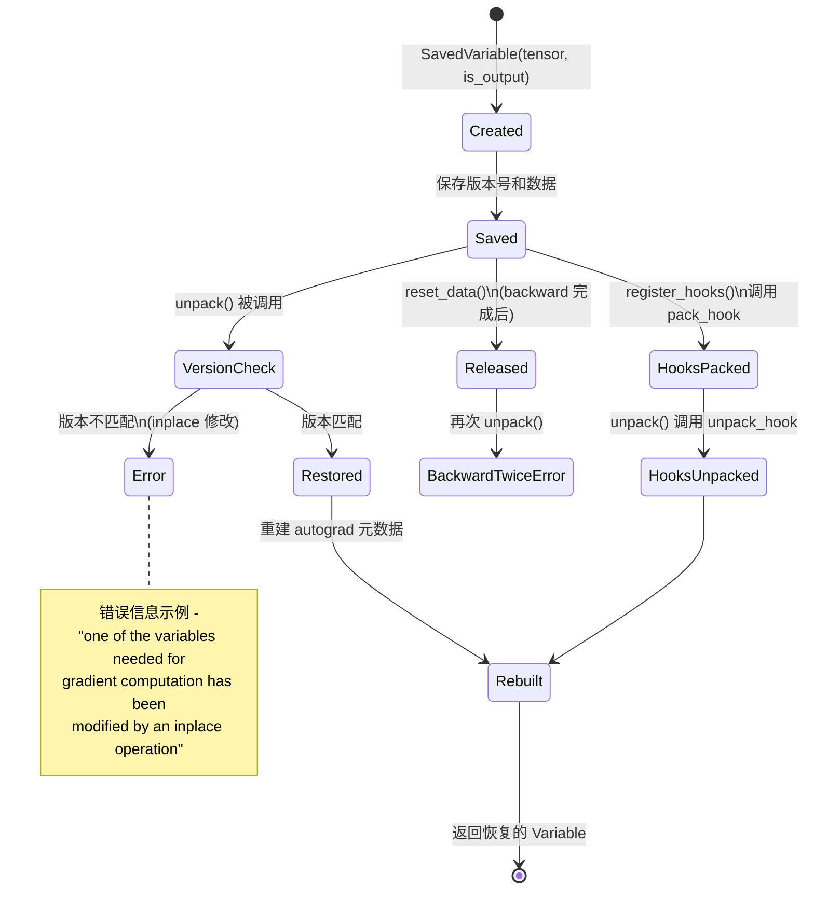
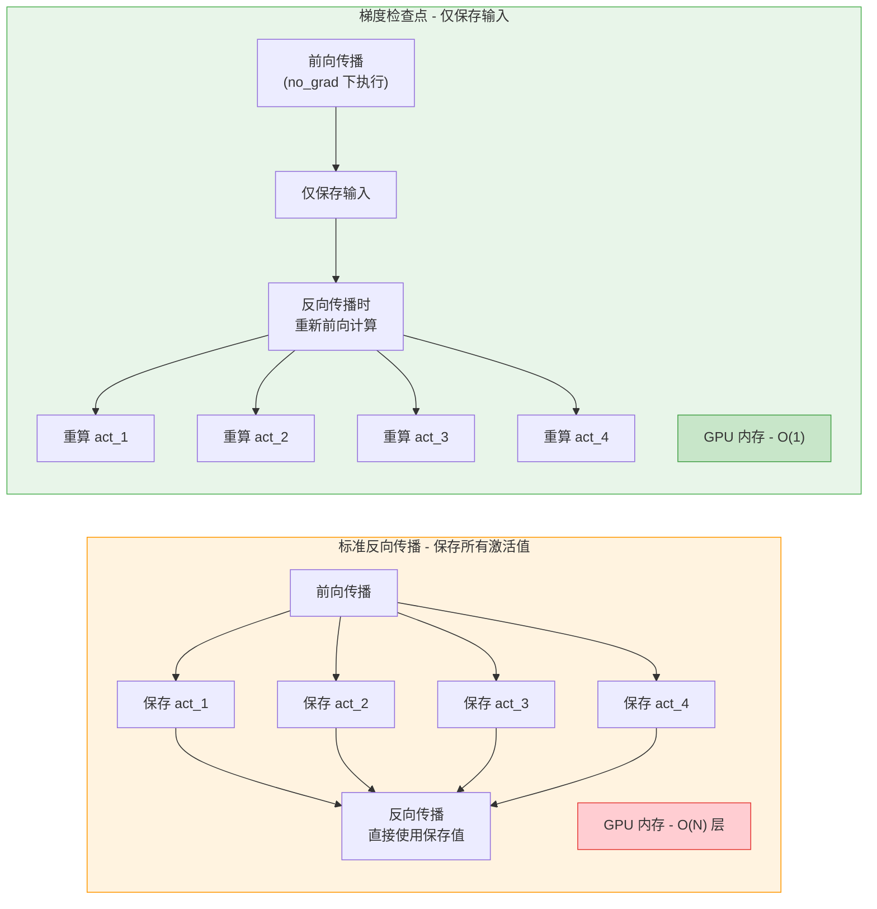

## 概述

在深度学习训练中，前向传播保存的中间激活值是反向传播计算梯度的必要输入，但它们也是 GPU 显存消耗的主要来源。PyTorch 提供了一套完整的机制来管理这些保存的张量：**SavedVariable** 负责底层的张量保存与恢复，**saved_tensors_hooks** 提供用户自定义的打包/解包钩子，**gradient checkpointing** 实现计算换内存的策略，而 **anomaly detection** 则用于调试梯度计算中的异常。本文深入分析这些机制的源码实现。

---

## 1. SavedVariable - 张量保存的核心抽象

### 1.1 类定义

`SavedVariable` 定义在 `torch/csrc/autograd/saved_variable.h` 中，是 autograd 系统中保存中间张量的核心类：

```cpp
// torch/csrc/autograd/saved_variable.h
class TORCH_API SavedVariable {
 public:
  SavedVariable() = default;
  SavedVariable(const Variable& variable, bool is_output,
                bool is_inplace_on_view = false);

  // 恢复保存的变量
  Variable unpack(std::shared_ptr<Node> saved_for = nullptr) const;

  // 注册自定义 hooks
  void register_hooks(std::unique_ptr<SavedVariableHooks>&& hooks);

  void reset_data();

 private:
  at::Tensor data_;                      // 保存的张量数据
  std::shared_ptr<ForwardGrad> fw_grad_; // 前向梯度
  std::weak_ptr<Node> weak_grad_fn_;     // 弱引用（避免循环引用）

  uint32_t saved_version_ = 0;           // 保存时的版本号
  uint32_t output_nr_ = 0;              // 输出编号
  bool was_default_constructed_ = true;  // 是否默认构造
  bool is_inplace_on_view_ = false;     // 是否是 view 上的 inplace 操作
  bool saved_original_ = false;          // 是否保存了原始张量
  bool is_leaf_ = false;                // 是否是叶子节点
  bool is_output_ = false;              // 是否是某个 Node 的输出

  std::unique_ptr<SavedVariableHooks> hooks_;  // 自定义 pack/unpack hooks
  std::shared_ptr<Node> grad_fn_;              // 梯度函数
  std::shared_ptr<Node> grad_accumulator_;     // 梯度累积器
  bool requires_grad_ = false;
};
```

### 1.2 构造过程 - 保存张量

当一个 autograd 操作需要保存张量用于反向传播时，`SavedVariable` 的构造函数被调用：

```cpp
// torch/csrc/autograd/saved_variable.cpp
SavedVariable::SavedVariable(
    const Variable& variable, bool is_output, bool is_inplace_on_view) {
  if (variable.defined()) {
    // 1. 推理张量不能保存 - 会导致静默错误
    TORCH_CHECK(!variable.is_inference(),
        "Inference tensors cannot be saved for backward.");

    // 2. 记录版本号
    was_default_constructed_ = false;
    saved_version_ = variable._version();
    is_leaf_ = variable.is_leaf();
    is_output_ = is_output;

    // 3. 检查是否有默认 hooks
    std::unique_ptr<SavedVariableHooks> maybe_hooks =
        at::SavedTensorDefaultHooks::is_enabled()
            ? get_default_hooks() : nullptr;

    if (maybe_hooks && !variable.unsafeGetTensorImpl()->is_wrapped_number()) {
      save_metadata(variable);
      set_hooks_and_pack_data(std::move(maybe_hooks), variable);
      return;
    }

    // 4. 非输出或叶子节点 -> 直接保存原始张量（无循环引用风险）
    if (!is_output || is_leaf_) {
      saved_original_ = true;
      data_ = variable;
      return;
    }

    // 5. 输出张量 -> 保存 tensor_data()（避免循环引用）
    save_metadata(variable);
    data_ = variable.tensor_data();
  }
}
```

**循环引用规避策略**：如果保存的张量是当前 Node 的输出，直接保存会形成循环引用（Node -> SavedVariable -> Tensor -> grad_fn -> Node）。因此，对于输出张量，只保存 `tensor_data()`（不含 autograd 元数据），并单独保存 `grad_fn` 等元数据。

### 1.3 unpack() - 恢复张量

反向传播时通过 `unpack()` 恢复保存的张量：

```cpp
// torch/csrc/autograd/saved_variable.cpp
Variable SavedVariable::unpack(std::shared_ptr<Node> saved_for) const {
  // 1. 默认构造的 SavedVariable 返回空张量
  if (was_default_constructed_)
    return Variable();

  // 2. 数据已释放且无 hooks -> 二次 backward 错误
  if (!data_.defined())
    TORCH_CHECK(hooks_, ERR_BACKWARD_TWICE);

  // 3. 版本检查（仅在无 hooks 时检查）
  if (!hooks_) {
    auto current_version = impl::version_counter(data_).current_version();
    if (saved_version_ != current_version) {
      // 详细的错误信息：指出哪个张量被 inplace 修改
      TORCH_CHECK(false, "...modified by an inplace operation...");
    }
  }

  // 4. 如果保存了原始张量，直接返回
  if (!hooks_ && saved_original_)
    return data_;

  // 5. 通过 hooks 或 tensor_data 恢复
  auto data = hooks_ ? hooks_->call_unpack_hook() : data_;

  // 6. 重建 Variable 的 autograd 元数据
  Variable var;
  if (grad_fn)
    var = make_variable(data, Edge(std::move(grad_fn), output_nr_));
  else
    var = make_variable(data, requires_grad_);

  impl::set_grad_accumulator(var, grad_accumulator_);
  impl::set_version_counter(var, impl::version_counter(data));

  // 7. 恢复前向梯度
  if (fw_grad_ && !fw_grad_->empty()) {
    auto new_fw_grad = fw_grad_->value(0);
    var._set_fw_grad(new_fw_grad, 0, false);
  }

  return var;
}
```



### 1.4 版本检查机制

版本检查是 autograd 安全性的关键保障。每个张量都有一个版本计数器（`VersionCounter`），每次 inplace 操作都会递增。`SavedVariable` 在保存时记录版本号，在恢复时对比：

```cpp
if (saved_version_ != current_version) {
  // 构造详细的错误信息
  message << "one of the variables needed for gradient computation "
          << "has been modified by an inplace operation: ["
          << data_.toString() << ' ' << data_.sizes() << ']';
  if (grad_fn)
    message << ", which is output " << output_nr_ << " of " << grad_fn->name();
  message << " is at version " << current_version
          << "; expected version " << saved_version_;
}
```

---

## 2. saved_tensors_hooks - 自定义保存策略

### 2.1 接口设计

`saved_tensors_hooks` 是一个上下文管理器，允许用户控制中间张量的保存和恢复方式。定义在 `torch/autograd/graph.py`：

```python
# torch/autograd/graph.py
class saved_tensors_hooks:
    """设置 saved tensors 的 pack/unpack hooks。

    pack_hook(tensor: Tensor) -> Any
    unpack_hook(Any) -> Tensor
    """
    def __init__(self, pack_hook, unpack_hook):
        self.pack_hook = pack_hook
        self.unpack_hook = unpack_hook

    def __enter__(self):
        torch._C._autograd._push_saved_tensors_default_hooks(
            self.pack_hook, self.unpack_hook)

    def __exit__(self, *args):
        torch._C._autograd._pop_saved_tensors_default_hooks()
```

当进入上下文时，hooks 被注册为全局默认 hooks。之后所有保存张量的操作都会先调用 `pack_hook`，恢复时调用 `unpack_hook`。

### 2.2 save_on_cpu - 内置的显存优化策略

PyTorch 提供了 `save_on_cpu` 作为 `saved_tensors_hooks` 的实用子类：

```python
# torch/autograd/graph.py
class save_on_cpu(saved_tensors_hooks):
    """将保存的张量转移到 CPU，backward 时再搬回 GPU。"""
    def __init__(self, pin_memory=False, device_type="cuda"):
        device_module = getattr(torch, device_type, torch.cuda)

        def pack_to_cpu(tensor):
            if not pin_memory:
                return (tensor.device, tensor.cpu())
            packed = torch.empty(
                tensor.size(), dtype=tensor.dtype, layout=tensor.layout,
                pin_memory=(device_module.is_available() and not tensor.is_sparse))
            packed.copy_(tensor)
            return (tensor.device, packed)

        def unpack_from_cpu(packed):
            device, tensor = packed
            return tensor.to(device, non_blocking=pin_memory)

        super().__init__(pack_to_cpu, unpack_from_cpu)
```

使用示例：

```python
# 节省 GPU 显存：中间结果暂存到 CPU
with torch.autograd.graph.save_on_cpu(pin_memory=True):
    output = model(input)  # 中间激活值保存在 CPU pinned memory
loss = criterion(output, target)
loss.backward()  # backward 时中间值从 CPU 异步拷回 GPU
```

### 2.3 C++ 层的 Hooks 集成

在 `SavedVariable` 构造时，如果检测到默认 hooks 已启用，会自动调用：

```cpp
// saved_variable.cpp - 构造函数中
if (maybe_hooks && !variable.unsafeGetTensorImpl()->is_wrapped_number()) {
    save_metadata(variable);
    set_hooks_and_pack_data(std::move(maybe_hooks), variable);
    return;
}

// set_hooks_and_pack_data 实现
void SavedVariable::set_hooks_and_pack_data(
    std::unique_ptr<SavedVariableHooks>&& hooks, const Variable& data) {
  hooks_ = std::move(hooks);
  at::NoGradGuard guard;  // pack_hook 中不记录梯度
  const auto version = impl::version_counter(data).current_version();
  hooks_->call_pack_hook(saved_original_ ? data.detach() : data);
  // 检查 pack_hook 没有修改输入
  TORCH_CHECK(version == impl::version_counter(data).current_version(),
      "A saved tensor pack hook is modifying its input in place.");
}
```

---

## 3. Gradient Checkpointing - 以计算换内存

### 3.1 核心思想

Gradient checkpointing（梯度检查点）是一种经典的内存优化策略：不保存前向传播的中间激活值，而是在反向传播需要时重新计算它们。这用额外的前向计算开销换取显存节省。



**内存复杂度对比**：

| 策略 | 内存复杂度 | 计算复杂度 |
|------|-----------|-----------|
| 标准反向传播 | O(N) | 1x 前向 + 1x 反向 |
| 全量 checkpoint | O(1) | 2x 前向 + 1x 反向 |
| 分段 checkpoint (sqrt) | O(sqrt(N)) | ~1.5x 前向 + 1x 反向 |

### 3.2 checkpoint() 函数

`torch.utils.checkpoint.checkpoint()` 是核心 API，定义在 `torch/utils/checkpoint.py`：

```python
def checkpoint(function, *args, use_reentrant=True, **kwargs):
    """对 function 的执行应用梯度检查点。

    前向传播在 no_grad 模式下执行（不保存中间值）。
    反向传播时重新执行前向传播以获取中间激活值。
    """
    if use_reentrant:
        return CheckpointFunction.apply(function, preserve, *args)
    else:
        # 非重入版本使用 saved_tensors_hooks
        ...
```

### 3.3 CheckpointFunction 实现原理

```python
class CheckpointFunction(torch.autograd.Function):
    @staticmethod
    def forward(ctx, run_function, preserve_rng_state, *args):
        # 1. 保存输入和函数引用（不保存中间激活值）
        ctx.run_function = run_function
        ctx.save_for_backward(*args)

        # 2. 保存 RNG 状态（确保重算时随机性一致）
        if preserve_rng_state:
            ctx.fwd_cpu_state = torch.random.get_rng_state()
            ctx.fwd_gpu_state = torch.cuda.get_rng_state()

        # 3. 在 no_grad 下执行前向传播
        with torch.no_grad():
            outputs = run_function(*args)

        return outputs

    @staticmethod
    def backward(ctx, *args):
        inputs = ctx.saved_tensors

        # 1. 恢复 RNG 状态
        rng_devices = []
        if ctx.preserve_rng_state:
            # ... 恢复 CPU 和 GPU 的随机状态

        # 2. 分离输入并启用梯度追踪
        detached_inputs = detach_variable(inputs)

        # 3. 重新执行前向传播（这次会记录梯度）
        with torch.enable_grad():
            outputs = ctx.run_function(*detached_inputs)

        # 4. 对重算的输出执行 backward
        torch.autograd.backward(outputs, args)

        # 5. 返回输入的梯度
        grads = tuple(
            inp.grad if isinstance(inp, torch.Tensor) else None
            for inp in detached_inputs
        )
        return (None, None) + grads
```

### 3.4 checkpoint_sequential()

对于顺序模型（如 `nn.Sequential`），`checkpoint_sequential` 提供了便捷的分段 checkpoint：

```python
def checkpoint_sequential(functions, segments, input, **kwargs):
    """将 functions 列表分成 segments 段，每段应用 checkpoint。"""
    # 将层列表平均分段
    segment_size = len(functions) // segments

    def run_segment(start, end, *inputs):
        for j in range(start, end):
            inputs = functions[j](*inputs)
        return inputs

    # 对每段应用 checkpoint
    for start in range(0, len(functions), segment_size):
        end = min(start + segment_size, len(functions))
        input = checkpoint(run_segment, start, end, input, **kwargs)

    return input
```

使用示例：

```python
model = nn.Sequential(
    nn.Linear(784, 512), nn.ReLU(),
    nn.Linear(512, 256), nn.ReLU(),
    nn.Linear(256, 128), nn.ReLU(),
    nn.Linear(128, 10),
)

# 分成 4 段，每段应用 checkpoint
output = checkpoint_sequential(model, segments=4, input=x)
```

### 3.5 Selective Activation Checkpointing (SAC)

PyTorch 还支持选择性激活检查点，允许用户细粒度控制哪些操作需要保存激活值：

```python
class CheckpointPolicy(enum.Enum):
    ALWAYS = "always"  # 总是保存
    NEVER = "never"    # 从不保存（重算）
    PREFER_RECOMPUTE = "prefer_recompute"  # 倾向于重算
    PREFER_SAVE = "prefer_save"            # 倾向于保存
```

---

## 4. Anomaly Detection - 异常检测模式

### 4.1 功能概述

异常检测模式（`torch.autograd.detect_anomaly`）是强大的调试工具，定义在 `torch/autograd/anomaly_mode.py`：

```python
# torch/autograd/anomaly_mode.py
class detect_anomaly:
    """启用 autograd 异常检测的上下文管理器。

    功能：
    1. 前向传播时记录调用栈，backward 出错时打印
    2. 检测 backward 中产生的 NaN 值
    """
    def __init__(self, check_nan=True):
        self.prev = torch.is_anomaly_enabled()
        self.check_nan = check_nan
        self.prev_check_nan = torch.is_anomaly_check_nan_enabled()
        warnings.warn("Anomaly Detection has been enabled. "
                      "This mode will increase the runtime.")

    def __enter__(self):
        torch.set_anomaly_enabled(True, self.check_nan)

    def __exit__(self, *args):
        torch.set_anomaly_enabled(self.prev, self.prev_check_nan)
```

### 4.2 Engine 中的异常检测

在 Engine 的 `evaluate_function` 中，当异常检测启用时会进行 NaN 检查：

```cpp
// torch/csrc/autograd/engine.cpp - evaluate_function()
if (AnomalyMode::is_enabled() && AnomalyMode::should_check_nan()) {
  AutoGradMode grad_mode(false);
  for (const auto i : c10::irange(num_outputs)) {
    auto& output = outputs[i];
    at::OptionalDeviceGuard guard(device_of(output));
    TORCH_CHECK(
        !output.defined() || !isnan(output)._is_any_true().item<bool>(),
        "Function '", fn.name(), "' returned nan values in its ",
        i, "th output.");
  }
}
```

当 `GraphTask` 出错时，如果异常检测启用，会打印创建该节点的前向调用栈：

```cpp
// graph_task.h - set_exception_without_signal()
void GraphTask::set_exception_without_signal(const std::shared_ptr<Node>& fn) {
  if (!has_error_.exchange(true)) {
    if (AnomalyMode::is_enabled() && fn) {
      fn->metadata()->print_stack(fn->name());  // 打印前向传播的栈轨迹
    }
  }
}
```

### 4.3 使用示例

```python
# 场景：调试 NaN 梯度
with torch.autograd.detect_anomaly():
    x = torch.randn(3, requires_grad=True)
    y = x ** 2
    z = torch.log(y)     # 如果 y 含负数，log 会产生 NaN
    z.sum().backward()
    # detect_anomaly 会报告 NaN 产生的位置和前向调用栈
```

### 4.4 set_detect_anomaly

`set_detect_anomaly` 可以作为函数调用全局启用/禁用：

```python
class set_detect_anomaly:
    def __init__(self, mode: bool, check_nan: bool = True):
        self.prev = torch.is_anomaly_enabled()
        self.prev_check_nan = torch.is_anomaly_check_nan_enabled()
        torch.set_anomaly_enabled(mode, check_nan)

    def __enter__(self):
        pass

    def __exit__(self, *args):
        torch.set_anomaly_enabled(self.prev, self.prev_check_nan)
```

---

## 5. 版本检查与 SavedVariable 的错误信息

### 5.1 常见错误场景

**错误 1：Inplace 修改了保存的张量**

```python
x = torch.randn(3, requires_grad=True)
y = x * 2
x.add_(1)      # inplace 修改了 x
y.backward()    # 报错：版本不匹配
```

错误信息来自 `saved_variable.cpp` 的 `unpack()`：

```
RuntimeError: one of the variables needed for gradient computation has been
modified by an inplace operation: [torch.FloatTensor [3]], which is output 0
of MulBackward0, is at version 1; expected version 0 instead.
```

**错误 2：二次 backward**

```python
x = torch.randn(3, requires_grad=True)
y = x ** 2
y.sum().backward()  # 第一次 backward 后中间值被释放
y.sum().backward()  # 报错：中间值已释放
```

错误信息：

```
RuntimeError: Trying to backward through the graph a second time (or directly
access saved tensors after they have already been freed). Saved intermediate
values of the graph are freed when you call .backward() or autograd.grad().
Specify retain_graph=True if you need to backward through the graph a second time.
```

### 5.2 解决方案

```python
# 方案 1：retain_graph=True
y.sum().backward(retain_graph=True)
y.sum().backward()  # 第二次可以成功

# 方案 2：使用 .detach() 而非 inplace 操作
x_new = x.detach() + 1  # 创建新张量，不影响原始 x
```

---

## 6. 综合应用 - 大模型训练内存优化

以下是综合使用多种机制优化训练内存的示例：

```python
import torch
from torch.utils.checkpoint import checkpoint_sequential
from torch.autograd.graph import save_on_cpu

class LargeModel(torch.nn.Module):
    def __init__(self):
        super().__init__()
        self.layers = torch.nn.ModuleList([
            torch.nn.Linear(4096, 4096) for _ in range(48)
        ])

    def forward(self, x):
        # 策略 1：对整个模型使用 checkpoint_sequential
        # 分成 12 段，每段仅保存输入
        return checkpoint_sequential(self.layers, segments=12, input=x)

# 策略 2：结合 save_on_cpu 将中间值卸载到 CPU
model = LargeModel().cuda()
optimizer = torch.optim.Adam(model.parameters())

for batch in dataloader:
    input = batch.cuda()

    with save_on_cpu(pin_memory=True):
        output = model(input)

    loss = criterion(output, target)
    loss.backward()
    optimizer.step()
    optimizer.zero_grad()
```

---

## 总结

PyTorch 的张量保存与恢复机制形成了一个完整的层次体系：

1. **SavedVariable**：底层抽象，负责张量的安全保存、版本检查和恢复
2. **saved_tensors_hooks**：中间层 API，允许自定义保存策略（如卸载到 CPU）
3. **Gradient Checkpointing**：高层策略，以重算代替存储
4. **Anomaly Detection**：调试工具，追踪异常梯度的来源

理解这些机制，对于训练大规模模型时的显存优化和调试异常梯度问题至关重要。

**关键源码文件**：

| 文件路径 | 说明 |
|---------|------|
| `torch/csrc/autograd/saved_variable.h` | SavedVariable 类定义 |
| `torch/csrc/autograd/saved_variable.cpp` | SavedVariable 构造、unpack、版本检查 |
| `torch/autograd/graph.py` | saved_tensors_hooks、save_on_cpu 实现 |
| `torch/utils/checkpoint.py` | gradient checkpointing 实现 |
| `torch/autograd/anomaly_mode.py` | 异常检测模式实现 |
| `torch/csrc/autograd/engine.cpp` | Engine 中的 NaN 检查和异常处理 |
