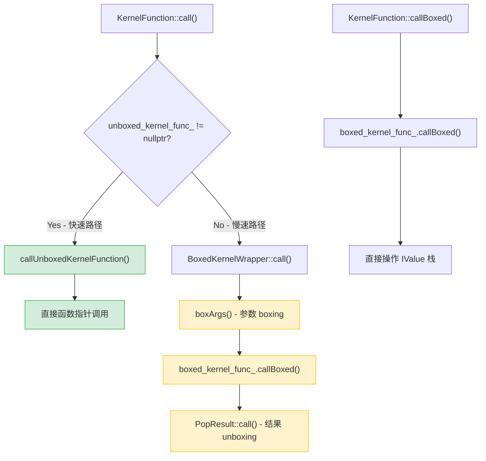
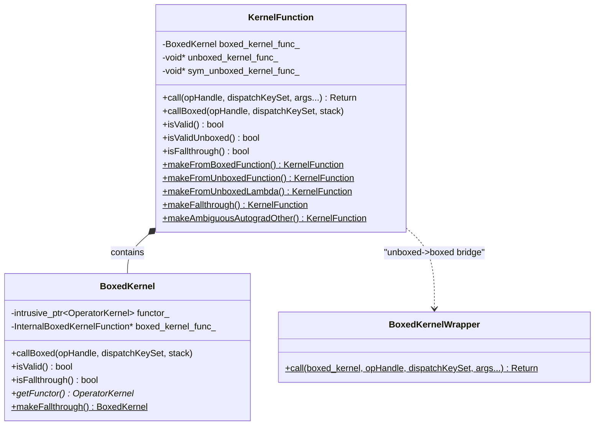
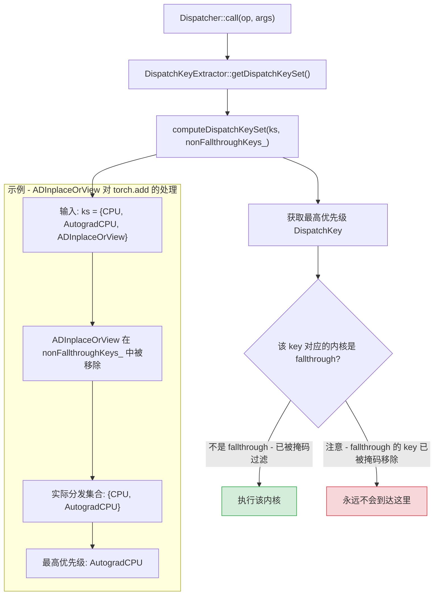

> Boxing 和 Fallthrough 是 PyTorch 分发系统中两个深层机制。Boxing 解决"如何在类型擦除的世界里调用强类型内核"的问题，Fallthrough 解决"如何让某些 DispatchKey 对特定算子透明跳过"的问题。理解它们，才能真正理解 Python fallback、JIT 执行、functorch 转换等高级功能的底层运作。

---

## 1. 概述

PyTorch 的分发器（Dispatcher）在设计上面临两个核心挑战：

1. **调用约定的统一**：不同内核的签名千差万别（参数数量、类型各不相同），但分发器需要以统一的方式存储和调用它们。Boxing 机制通过 `IValue` 栈提供了类型擦除的调用路径，使得任意签名的内核可以通过统一接口调用。

2. **分发链的灵活跳过**：并非所有 DispatchKey 对所有算子都有意义。例如 `ADInplaceOrView` 对纯 functional 算子没有任何工作要做。Fallthrough 机制允许算子在特定 DispatchKey 上"透传"，跳过该层直接进入下一层分发。

这两个机制共同构成了分发系统灵活性和性能的基石。

## 2. 前置知识

阅读本篇前建议先掌握以下内容：

| 前置篇目 | 核心内容 | 与本篇的关系 |
|---------|---------|------------|
| 00 - 分发入门教程 | DispatchKey、分发表、`torch.library` | 理解分发的基本流程 |
| 01 - DispatchKey 体系 | 功能键与后端键的组合、优先级排序 | 理解 fallthrough 跳过的是哪些键 |
| 02 - Dispatcher 核心 | `OperatorHandle`、`OperatorEntry`、分发表计算 | 理解 KernelFunction 在分发表中的位置 |
| 03 - 算子注册 | `TORCH_LIBRARY` 宏、内核注册流程 | 理解 boxed/unboxed 内核如何被注册 |

## 3. Boxed vs Unboxed 调用约定

PyTorch 的内核调用存在两套并行的调用约定：

### 3.1 Unboxed 调用 - 强类型直接调用

Unboxed 是最直接的调用方式。编译器在编译期就知道函数签名，通过函数指针直接调用，没有任何中间转换开销。

```cpp
// 源码路径: aten/src/ATen/core/boxing/KernelFunction_impl.h (L142-L186)
template <class Return, class... Args>
C10_ALWAYS_INLINE Return KernelFunction::call(
    const OperatorHandle& opHandle,
    DispatchKeySet dispatchKeySet,
    Args... args) const {
  // 快速路径：直接通过 unboxed 函数指针调用
  if (C10_LIKELY(unboxed_kernel_func_ != nullptr)) {
    auto* functor = boxed_kernel_func_.getFunctor();
    return callUnboxedKernelFunction<Return, Args...>(
        unboxed_kernel_func_, functor, dispatchKeySet,
        std::forward<Args>(args)...);
  }
  // 慢速路径：通过 boxing 桥接到 boxed 内核
  return impl::BoxedKernelWrapper<Return(Args...)>::call(
      boxed_kernel_func_, opHandle, dispatchKeySet,
      std::forward<Args>(args)...);
}
```

关键点：`C10_LIKELY` 标注表明 unboxed 路径是预期的热路径。只有当没有 unboxed 函数指针时，才回退到 boxing 路径。

### 3.2 Boxed 调用 - 通过 IValue 栈

Boxed 调用将所有参数打包到一个 `IValue` 栈上，内核从栈上取参数、执行计算、将结果压栈返回。

```cpp
// 源码路径: aten/src/ATen/core/boxing/KernelFunction_impl.h (L88-L93)
inline void KernelFunction::callBoxed(
    const OperatorHandle& opHandle,
    DispatchKeySet dispatchKeySet,
    Stack* stack) const {
  boxed_kernel_func_.callBoxed(opHandle, dispatchKeySet, stack);
}
```

### 3.3 两种调用约定的对比

| 特性 | Unboxed | Boxed |
|-----|---------|-------|
| 类型安全 | 编译期类型检查 | 运行时 IValue tag 检查 |
| 性能开销 | 零额外开销 | boxing/unboxing 转换开销 |
| 通用性 | 需要知道具体签名 | 可处理任意签名 |
| 适用场景 | `at::` 命名空间的正常调用 | Python fallback、JIT、tracing |

### 3.4 调用路径选择



### 3.5 何时使用 Boxed 调用

以下场景必须使用 boxed 调用，因为调用方不知道（或不关心）具体的函数签名：

- **Python fallback**：从 Python 端调用 C++ 算子时，参数以 `IValue` 形式传入
- **JIT 解释器**：TorchScript 解释器以栈机器方式执行，天然使用 IValue 栈
- **Tracing / FX**：追踪执行图时需要类型擦除的统一接口
- **functorch 变换**：`vmap`、`grad` 等变换通过 boxed fallback 拦截所有算子

## 4. IValue - 统一值类型

`c10::IValue`（Interpreter Value）是 boxing 机制的基础，它是一个 tagged union，能够存储 PyTorch 支持的所有值类型。

### 4.1 IValue 的内存布局

```cpp
// 源码路径: aten/src/ATen/core/ivalue.h (L152-L157)
// IValue 是一个 16 字节对象：8 字节 payload + 8 字节 tag
// tag 目前使用 4 字节标识类型，1 字节标识是否为 intrusive_ptr

struct TORCH_API IValue final {
  // 8 字节 payload，存储实际值或指针
  // 8 字节 tag，标识 payload 中存储的类型
};
```

### 4.2 IValue 支持的类型标签

```cpp
// 源码路径: aten/src/ATen/core/ivalue.h (L159-L187)
#define TORCH_FORALL_TAGS(_) \
  _(None)           \
  _(Tensor)         \
  _(Storage)        \
  _(Double)         \
  _(ComplexDouble)   \
  _(Int)            \
  _(SymInt)         \
  _(SymFloat)       \
  _(SymBool)        \
  _(Bool)           \
  _(Tuple)          \
  _(String)         \
  _(GenericList)    \
  _(GenericDict)    \
  _(Future)         \
  _(Device)         \
  _(Object)         \
  _(PyObject)       \
  // ... 更多类型
```

### 4.3 Boxing 过程 - 参数打包

Boxing 是将强类型参数转换为 `IValue` 栈的过程。核心实现在 `boxArgs` 函数中：

```cpp
// 源码路径: aten/src/ATen/core/boxing/impl/boxing.h (L82-L89)
template <class... Args>
torch::jit::Stack boxArgs(Args... args) {
  torch::jit::Stack stack;
  stack.reserve(sizeof...(Args));
  torch::jit::push(stack, std::forward<Args>(args)...);
  return stack;
}
```

`TensorOptions` 是一个特殊情况 - 它在 boxing 时会被展开为 4 个独立的 `IValue`（dtype、layout、device、pinned_memory）：

```cpp
// 源码路径: aten/src/ATen/core/boxing/impl/boxing.h (L125-L132)
C10_ALWAYS_INLINE_UNLESS_MOBILE void boxToStack(
    IValue*& dest, c10::TensorOptions options) {
  new (dest++) IValue(c10::typeMetaToScalarType(options.dtype()));
  new (dest++) IValue(options.layout());
  new (dest++) IValue(options.device());
  new (dest++) IValue(options.pinned_memory());
}
```

### 4.4 Unboxing 过程 - 结果提取

Unboxing 是从 `IValue` 栈中提取强类型结果的过程：

```cpp
// 源码路径: aten/src/ATen/core/boxing/impl/boxing.h (L149-L160)
template <class Result>
struct PopResult final {
  static Result call(Stack& stack) {
    TORCH_INTERNAL_ASSERT_DEBUG_ONLY(stack.size() == 1, ...);
    return std::move(stack[0]).to<Result>();  // IValue::to<T>() 完成类型转换
  }
};
```

对于返回 `std::tuple` 的算子，`PopResult` 有模板特化来处理多返回值的情况。

## 5. KernelFunction 的内部结构

`KernelFunction` 是分发表中每个条目存储的核心对象，它封装了 boxed 和 unboxed 两种调用方式。

### 5.1 三个函数指针

```cpp
// 源码路径: aten/src/ATen/core/boxing/KernelFunction.h (L290-L292)
class TORCH_API KernelFunction final {
 private:
  BoxedKernel boxed_kernel_func_;        // Boxed 内核（通过 IValue 栈调用）
  void* unboxed_kernel_func_;            // Unboxed 函数指针（直接调用）
  void* sym_unboxed_kernel_func_;        // SymInt 变体的 unboxed 指针
};
```

三个指针各司其职：

- `boxed_kernel_func_`：始终有效（对于有效的 KernelFunction），封装了 `BoxedKernel` 对象
- `unboxed_kernel_func_`：当内核以 unboxed 方式注册时有值，用于快速路径
- `sym_unboxed_kernel_func_`：当内核签名包含 `SymInt` 参数时使用的专门路径

### 5.2 调用优先级

在 `KernelFunction::call()` 中，三个指针有明确的调用优先级：

```cpp
// 源码路径: aten/src/ATen/core/boxing/KernelFunction_impl.h (L142-L186)
// 当参数包含 SymInt 时:
//   1. 优先尝试 sym_unboxed_kernel_func_（原生 SymInt 支持）
//   2. 回退到 unboxed_kernel_func_（通过 unpackSymInt 转换）
//   3. 最后回退到 boxed 路径
//
// 当参数不包含 SymInt 时:
//   1. 优先尝试 unboxed_kernel_func_
//   2. 回退到 boxed 路径
```

### 5.3 工厂方法

`KernelFunction` 提供多个静态工厂方法来创建不同类型的内核：

```cpp
// 源码路径: aten/src/ATen/core/boxing/KernelFunction.h (L163-L251)

// 从 boxed 函数创建（内核接收 IValue 栈）
template <BoxedKernelFunction* func>
static KernelFunction makeFromBoxedFunction();

// 从 unboxed 函数创建（编译期已知函数指针，可内联优化）
template <class FuncPtr, bool AllowLegacyTypes = false>
static KernelFunction makeFromUnboxedFunction(FuncPtr);

// 从 unboxed lambda 创建
template <bool AllowLegacyTypes = false, class Lambda>
static KernelFunction makeFromUnboxedLambda(Lambda&& lambda);

// 创建 fallthrough 标记
static KernelFunction makeFallthrough();

// 创建 AutogradOther 歧义标记
static KernelFunction makeAmbiguousAutogradOther();
```

### 5.4 有效性检查

```cpp
// 源码路径: aten/src/ATen/core/boxing/KernelFunction_impl.h (L72-L86)
inline bool KernelFunction::isValidUnboxed() const {
  return unboxed_kernel_func_ != nullptr;
}

inline bool KernelFunction::isValid() const {
  return boxed_kernel_func_.isValid();  // boxed 函数指针非空
}

inline bool KernelFunction::isFallthrough() const {
  return boxed_kernel_func_.isFallthrough();
  // 内部判断: boxed_kernel_func_ == &fallthrough_kernel
}
```

### 5.5 KernelFunction 结构图



## 6. Fallthrough 机制

### 6.1 什么是 Fallthrough

Fallthrough 是分发系统中的一种特殊内核标记。当某个算子在某个 `DispatchKey` 上注册了 fallthrough 内核时，分发器会**跳过**该 key，继续查找下一个优先级的 key。

```cpp
// 源码路径: aten/src/ATen/core/boxing/KernelFunction.cpp (L8-L20)
// fallthrough_kernel 是一个"假"内核，它实际上不执行任何操作。
// 分发表会特殊处理它：跳过当前 dispatch key，重新分发到下一个 key。
void fallthrough_kernel(OperatorKernel*, const OperatorHandle&,
                        DispatchKeySet, Stack*) {
  TORCH_INTERNAL_ASSERT(0,
    "fallthrough_kernel was executed but it should have been "
    "short-circuited by the dispatcher. ...");
}
```

关键设计：`fallthrough_kernel` 如果真的被执行了，说明出了 bug - 它的存在仅仅是作为一个可识别的函数指针，让分发器在查表时检测到并跳过。

### 6.2 Fallthrough 的实现原理

Fallthrough 的核心实现不在内核本身，而是在 `DispatchKeyExtractor` 中的 `nonFallthroughKeys_` 掩码：

```cpp
// 源码路径: aten/src/ATen/core/dispatch/DispatchKeyExtractor.h (L267-L277)
struct TORCH_API DispatchKeyExtractor final {
 private:
  // 记录哪些 key 不是 fallthrough 的掩码
  DispatchKeySet nonFallthroughKeys_;
  // 每个后端独立的 fallthrough 掩码（用于 per-backend functionality key）
  std::array<DispatchKeySet, num_backends> nonFallthroughKeysPerBackend_;
  // 是否需要按后端区分
  bool requiresBitsetPerBackend_{false};
};
```

当计算最终的 dispatch key 时，`nonFallthroughKeys_` 作为掩码参与运算：

```cpp
// 源码路径: aten/src/ATen/core/dispatch/DispatchKeyExtractor.h (L24-L47)
inline DispatchKeySet computeDispatchKeySet(
    DispatchKeySet ks,
    DispatchKeySet key_mask) {  // key_mask 即 nonFallthroughKeys_
  c10::impl::LocalDispatchKeySet local =
      c10::impl::tls_local_dispatch_key_set();
  return (((ks | local.included_) - local.excluded_) & key_mask);
  //                                                  ^^^^^^^^
  //                               fallthrough 的 key 在 key_mask 中被置 0，
  //                               因此会从结果中被排除
}
```

### 6.3 注册和更新 Fallthrough 状态

```cpp
// 源码路径: aten/src/ATen/core/dispatch/DispatchKeyExtractor.cpp (L8-L55)
void DispatchKeyExtractor::setOperatorHasFallthroughForKey(
    DispatchKey k, bool has_fallthrough) {
  // (1) 更新全局 nonFallthroughKeys_
  if (has_fallthrough) {
    nonFallthroughKeys_ = nonFallthroughKeys_.remove(k);
  } else {
    nonFallthroughKeys_ = nonFallthroughKeys_.add(k);
  }
  // (2) 如果是 per-backend functionality key，还需要更新对应后端的掩码
  if (isPerBackendFunctionalityKey(toFunctionalityKey(k))) {
    auto backend_idx = static_cast<uint8_t>(toBackendComponent(k)) - 1;
    // 更新特定后端的掩码 ...
  }
}
```

### 6.4 Fallthrough 分发流程



### 6.5 常见 Fallthrough 场景

| DispatchKey | Fallthrough 的算子类型 | 原因 |
|------------|---------------------|------|
| ADInplaceOrView | 非 inplace/非 view 操作 | 只需要处理 inplace 和 view 操作的版本记录 |
| Functionalize | 非 inplace/非 view 操作 | 只需要功能化 inplace 和 view 操作 |
| BackendSelect | 大部分有 Tensor 参数的算子 | 只需要处理没有 Tensor 参数的工厂函数 |
| Batched | 未实现 batching rule 的算子 | 交给 CompositeImplicitAutograd 分解 |

## 7. BackendSelect 机制

### 7.1 问题背景

考虑 `torch.randn(3, 4)` 这个调用 - 它没有任何 `Tensor` 参数。分发器通常通过输入 Tensor 的 `key_set()` 来确定分发到哪个后端（CPU / CUDA），但工厂函数没有输入 Tensor，分发器如何决定使用哪个后端？

### 7.2 BackendSelect 的解决方案

`BackendSelect` 是一个特殊的 DispatchKey，专门用于处理这类"无法从输入 Tensor 推断后端"的算子。

默认情况下，`BackendSelect` 对所有算子注册了 fallthrough：

```cpp
// 源码路径: aten/src/ATen/core/BackendSelectFallbackKernel.cpp (L1-L5)
#include <torch/library.h>

TORCH_LIBRARY_IMPL(_, BackendSelect, m) {
  m.fallback(torch::CppFunction::makeFallthrough());
}
```

对于需要 BackendSelect 的算子（如 `randn`、`empty`、`zeros` 等），代码生成器会覆盖这个 fallthrough，注册一个专门的 BackendSelect 内核。该内核会：

1. 从参数中提取 `device` 信息
2. 根据 `device` 设置正确的 DispatchKey
3. 使用该 key 重新分发（redispatch）到正确的后端

### 7.3 工作流程

对于 `torch.randn(3, 4, device="cuda")`：
1. 初始 DispatchKeySet 为空（没有 Tensor 输入）
2. BackendSelect 内核被触发
3. 内核从 `device="cuda"` 参数中提取后端信息
4. 以 `CUDA` 作为 DispatchKey 重新分发
5. CUDA 后端的 `randn` 实现被调用

## 8. CompositeImplicitAutograd 与 CompositeExplicitAutograd

这两个是别名（alias）DispatchKey，用于标记算子的实现方式。

### 8.1 CompositeImplicitAutograd

含义：算子完全由其他已有算子组合实现，autograd 的反向传播可以自动推导（通过组成算子的 autograd 规则自动组合）。

```yaml
# native_functions.yaml 中的声明方式 - 不指定 dispatch
- func: addmv(Tensor self, Tensor mat, Tensor vec, ...) -> Tensor
  # 没有 dispatch: 字段，默认注册到 CompositeImplicitAutograd
```

特点：
- 不需要手写 autograd 公式
- 对所有后端自动生效
- 如果某个后端注册了专门的实现，后端实现优先

### 8.2 CompositeExplicitAutograd

含义：算子由其他算子组合实现，但不能自动推导 autograd - 需要手动注册 autograd 内核（或者该算子不需要 autograd 支持）。

```yaml
# native_functions.yaml 中的声明方式
- func: _fw_primal(Tensor(a) self, int level) -> Tensor(a)
  variants: method
  dispatch:
    CompositeExplicitAutograd: _fw_primal
```

### 8.3 选择指南

| 条件 | 使用 |
|------|------|
| 实现只使用其他 ATen 算子，且自动微分正确 | `CompositeImplicitAutograd` |
| 实现使用其他 ATen 算子，但自动微分需要特殊处理 | `CompositeExplicitAutograd` + 手写 autograd |
| 需要直接访问 Tensor 内部存储 | 在具体后端（CPU/CUDA）上分别注册 |

### 8.4 与 Fallthrough 的关系

当一个算子注册了 `CompositeImplicitAutograd` 内核时，所有具体后端（CPU、CUDA 等）如果没有注册自己的实现，就会"穿过"后端 key 的 fallthrough，最终落到 `CompositeImplicitAutograd` 内核上。

## 9. Functionalization Dispatch Key

### 9.1 Functionalization 的作用

Functionalization 变换的目标是消除 inplace 和 view 操作，将它们转换为 functional（纯函数）等价形式。这对于编译器优化至关重要 - `torch.compile` 的 Inductor 后端要求输入图不包含 inplace/view 操作。

### 9.2 FunctionalizeFallback 内核

Functionalization 通过注册 boxed fallback 内核来拦截所有算子调用：

```cpp
// 源码路径: aten/src/ATen/FunctionalizeFallbackKernel.cpp (L384-L386)
TORCH_LIBRARY_IMPL(_, Functionalize, m) {
  m.fallback(
    torch::CppFunction::makeFromBoxedFunction<&functionalizeFallback>());
}
```

这个 fallback 内核的工作流程：

```cpp
// 源码路径: aten/src/ATen/FunctionalizeFallbackKernel.cpp (L55-L148)
void functionalizeFallback(const c10::OperatorHandle& op,
    c10::DispatchKeySet dispatchKeySet, torch::jit::Stack* stack) {
  // 1. 检查 schema 是否有 alias 注解（如果有，说明需要专门处理）
  // 2. 遍历所有输入参数：
  //    - 如果是 FunctionalTensor，先 sync 更新，然后解包为普通 Tensor
  // 3. 跳过 Functionalize key，重新分发
  // 4. 遍历所有输出：
  //    - 将普通 Tensor 包装为 FunctionalTensor
}
```

### 9.3 专门注册的 Functionalize 内核

对于 inplace/view 操作，需要专门的 functionalize 内核，不能使用通用 fallback：

```cpp
// 源码路径: aten/src/ATen/FunctionalizeFallbackKernel.cpp (L388-L398)
TORCH_LIBRARY_IMPL(aten, Functionalize, m) {
  m.impl("resize_", TORCH_FN(resize__functionalization));
  m.impl("lift", TORCH_FN(lift_functionalize));
  m.impl("lift_fresh", TORCH_FN(lift_fresh_functionalize));
  m.impl("_to_copy", TORCH_FN(_to_copy_functionalize));
  m.impl("_unsafe_view", TORCH_FN(_unsafe_view_functionalize));
  m.impl("set_.source_Tensor", TORCH_FN(set__functionalize));
}
```

这些专门内核覆盖了 boxed fallback 对这些算子的处理，提供了正确的 view/inplace 语义转换。

## 10. 实战示例

### 10.1 创建 Boxed 内核

```cpp
#include <torch/library.h>

// 定义一个 boxed 内核 - 通过 IValue 栈操作
void my_boxed_kernel(
    const c10::OperatorHandle& op,
    c10::DispatchKeySet dispatchKeySet,
    torch::jit::Stack* stack) {
  // 从栈上获取参数
  auto args = torch::jit::pop(*stack, op.schema().arguments().size());

  // 处理逻辑...
  at::Tensor result = args[0].toTensor() + args[1].toTensor();

  // 将结果压栈
  torch::jit::push(*stack, std::move(result));
}

// 注册为某个 DispatchKey 的 fallback
TORCH_LIBRARY_IMPL(_, MyCustomKey, m) {
  m.fallback(torch::CppFunction::makeFromBoxedFunction<&my_boxed_kernel>());
}
```

### 10.2 注册 Fallthrough

```cpp
#include <torch/library.h>

// 方式 1: 为整个 DispatchKey 注册 fallthrough（backend fallback）
TORCH_LIBRARY_IMPL(_, BackendSelect, m) {
  m.fallback(torch::CppFunction::makeFallthrough());
}

// 方式 2: 为特定算子在特定 key 上注册 fallthrough
TORCH_LIBRARY_IMPL(aten, ADInplaceOrView, m) {
  // 对 add 操作注册 fallthrough（add 不是 inplace 操作）
  m.impl("add.Tensor", torch::CppFunction::makeFallthrough());
}
```

### 10.3 查看 Fallthrough 状态

在 Python 中可以通过以下方式诊断分发表状态：

```python
import torch

# 查看 torch.add 的完整分发表
print(torch._C._dispatch_dump("aten::add.Tensor"))
# 输出中带有 "fallthrough" 标记的条目表示该 key 上注册了 fallthrough

# 查看特定 key 上注册的内核
print(torch._C._dispatch_dump_table("aten::add.Tensor"))
```

### 10.4 从 Unboxed 函数创建 KernelFunction

```cpp
// 直接使用 unboxed 函数（编译期函数指针 - 最佳性能）
at::Tensor my_add(const at::Tensor& self, const at::Tensor& other) {
  return self + other;
}

// 注册为 unboxed 内核
TORCH_LIBRARY_IMPL(aten, CPU, m) {
  m.impl("add.Tensor",
         torch::CppFunction::makeFromUnboxedFunction(TORCH_FN(my_add)));
}
// 系统会自动生成 boxing wrapper，使得 boxed 调用路径也能工作
```

## 11. 小结

| 概念 | 核心作用 | 关键实现 |
|------|---------|---------|
| Unboxed 调用 | 零开销的强类型直接调用 | `KernelFunction::call()` 中的 `unboxed_kernel_func_` 快速路径 |
| Boxed 调用 | 通过 IValue 栈的类型擦除统一调用 | `BoxedKernelWrapper::call()` 完成 boxing/unboxing 桥接 |
| IValue | 统一值类型，16 字节 tagged union | `aten/src/ATen/core/ivalue.h` |
| KernelFunction | 封装 boxed + unboxed 双路径 | 三个函数指针 + 工厂方法 |
| Fallthrough | 让特定 key 对特定算子透明跳过 | `nonFallthroughKeys_` 掩码在 `computeDispatchKeySet` 中过滤 |
| BackendSelect | 为无 Tensor 参数的工厂函数选择后端 | 默认 fallthrough，对工厂函数注册专门内核 |
| CompositeImplicitAutograd | 用其他算子组合实现，autograd 自动推导 | 别名 key，所有后端共享 |
| CompositeExplicitAutograd | 用其他算子组合实现，需手动 autograd | 别名 key，需额外注册 Autograd 内核 |
| Functionalize | 消除 inplace/view 操作 | Boxed fallback + 特定算子覆盖 |

## 延伸阅读

- **源码文件索引**：
  - `aten/src/ATen/core/boxing/KernelFunction.h` - KernelFunction 类定义
  - `aten/src/ATen/core/boxing/KernelFunction_impl.h` - KernelFunction 调用路径实现
  - `aten/src/ATen/core/boxing/impl/boxing.h` - Boxing/Unboxing 桥接逻辑
  - `aten/src/ATen/core/boxing/BoxedKernel.h` - BoxedKernel 定义与 fallthrough_kernel 声明
  - `aten/src/ATen/core/boxing/KernelFunction.cpp` - fallthrough_kernel 等特殊内核实现
  - `aten/src/ATen/core/dispatch/DispatchKeyExtractor.h` - nonFallthroughKeys_ 掩码
  - `aten/src/ATen/core/dispatch/DispatchKeyExtractor.cpp` - setOperatorHasFallthroughForKey
  - `aten/src/ATen/core/BackendSelectFallbackKernel.cpp` - BackendSelect fallthrough
  - `aten/src/ATen/FunctionalizeFallbackKernel.cpp` - Functionalize fallback 内核

- **设计文档**：
  - `Note [Plumbing Keys Through The Dispatcher]` - DispatchKeySet 如何在内核间传递
  - `Note [Ambiguity in AutogradOther kernel]` - AutogradOther 歧义处理
  - `Note [named_not_supported_kernel]` - Named tensor 的特殊处理

- **后续篇目**：
  - 06 - Autograd 分发层：如何与 boxing 机制配合完成自动微分
  - 07 - torch.compile 中的分发：FakeTensor 和 ProxyTorchDispatchMode 如何利用 boxed fallback
