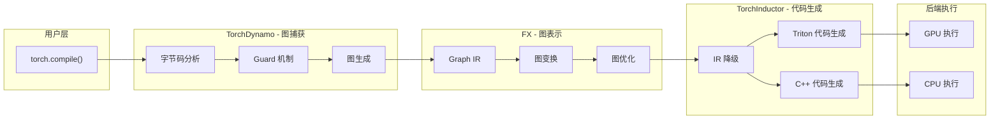
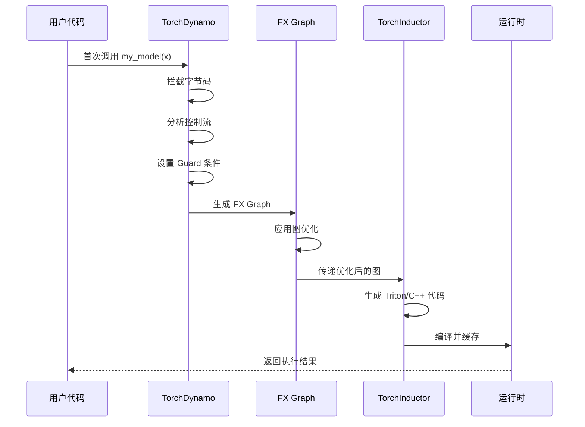
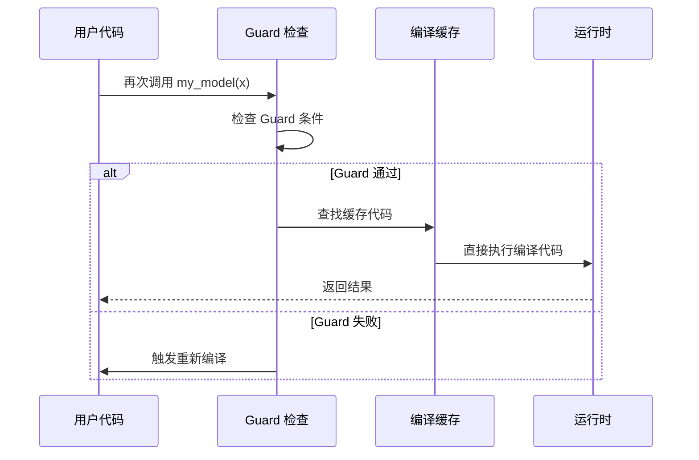
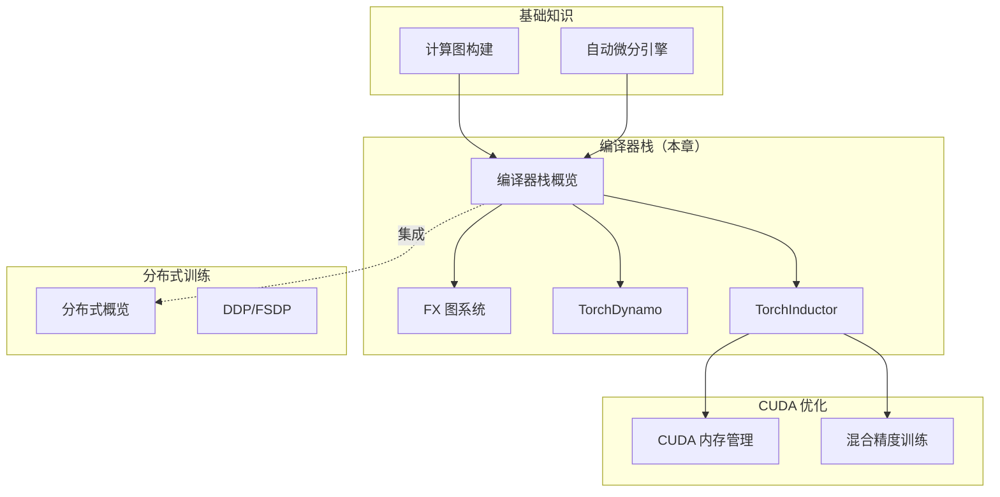

## 概述

PyTorch 2.0 引入了全新的编译器栈，通过 **TorchDynamo**、**FX** 和 **TorchInductor** 三个核心组件，实现了端到端的模型优化和代码生成。本章将为你提供 PyTorch 编译器栈的全局视角。

## PyTorch 编译器栈架构



## 三大核心组件

### 1. TorchDynamo - 图捕获引擎

**核心功能**：
- 拦截 Python 字节码执行
- 动态追踪模型执行流程
- 生成 FX 图表示

**关键机制**：
- **字节码分析**：解析 Python 字节码指令
- **Guard 系统**：确保图的有效性条件
- **图断点处理**：处理动态控制流

**详细内容**：
- [TorchDynamo 教程](../04-dynamo-tutorial/)
- [字节码分析机制](../05-bytecode-analysis/)
- [Guard 保护机制](../06-guard-mechanism/)

### 2. FX - 图表示和变换

**核心功能**：
- 提供统一的图中间表示（IR）
- 支持灵活的图变换和优化
- 作为编译器栈的中间层

**关键概念**：
- **Graph**：计算图的容器
- **Node**：图中的操作节点
- **GraphModule**：可执行的图模块

**详细内容**：
- [FX 图系统教程](../02-fx-tutorial/)
- [Graph 和 Node 深度解析](../03-graph-and-node/)

### 3. TorchInductor - 代码生成后端

**核心功能**：
- 将 FX 图编译为高性能代码
- 支持 GPU（Triton）和 CPU（C++）后端
- 自动优化和融合

**关键技术**：
- **IR 降级**：将高级操作降级为低级操作
- **算子融合**：合并多个操作以减少内存访问
- **Triton 集成**：生成高性能 GPU kernel

**详细内容**：
- [TorchInductor 概览](../07-inductor-overview/)
- [Triton 代码生成](../08-triton-codegen/)

## 编译流程详解

### 阶段 1：模型装饰

```python
import torch

@torch.compile
def my_model(x):
    return x * 2 + 1

# 等价于
my_model = torch.compile(my_model)
```

### 阶段 2：首次执行触发编译



### 阶段 3：后续执行（快速路径）



## 性能优化机制

### 1. 算子融合

**融合前**：
```python
x = a + b    # Kernel 1
y = x * c    # Kernel 2
z = y - d    # Kernel 3
```

**融合后**：
```python
z = (a + b) * c - d  # 单个 Kernel
```

### 2. 内存优化

- **In-place 操作**：减少内存分配
- **视图重用**：避免不必要的拷贝
- **缓冲区复用**：重用临时张量

### 3. 并行化

- **循环并行化**：利用多线程/多 GPU
- **向量化**：SIMD 指令优化
- **异步执行**：重叠计算和通信

## 使用示例

### 基础使用

```python
import torch

# 定义模型
def model(x, y):
    a = torch.sin(x)
    b = torch.cos(y)
    return a + b

# 编译模型
compiled_model = torch.compile(model)

# 执行
x = torch.randn(1000, device='cuda')
y = torch.randn(1000, device='cuda')

# 首次调用会触发编译（较慢）
result1 = compiled_model(x, y)

# 后续调用直接使用编译代码（快速）
result2 = compiled_model(x, y)
```

### 配置编译选项

```python
# 选择不同的后端
compiled_model = torch.compile(
    model,
    backend="inductor",  # 默认，性能最好
    # backend="aot_eager",  # 提前编译，适合调试
    # backend="cudagraphs",  # CUDA Graphs 后端
)

# 配置编译模式
compiled_model = torch.compile(
    model,
    mode="default",      # 平衡编译时间和运行时间
    # mode="reduce-overhead",  # 减少 Python 开销
    # mode="max-autotune",     # 最大化性能（编译慢）
)
```

## 调试技巧

### 1. 查看生成的代码

```python
import torch._dynamo as dynamo

# 重置并启用详细日志
dynamo.reset()
torch._dynamo.config.verbose = True

# 查看生成的 Triton 代码
torch._inductor.config.debug = True
```

### 2. 禁用特定优化

```python
# 禁用算子融合
torch._inductor.config.disable_fusion = True

# 禁用特定 Pass
torch._inductor.config.pattern_matcher = False
```

### 3. Guard 调试

```python
import torch._dynamo.config as dynamo_config

# 打印 Guard 失败信息
dynamo_config.print_guards = True
```

## 与其他章节的关系



## 性能基准

| 场景 | 未编译 | torch.compile | 加速比 |
|------|--------|---------------|--------|
| ResNet50 训练 | 100% | 143% | 1.43x |
| BERT 推理 | 100% | 230% | 2.30x |
| Transformer 训练 | 100% | 168% | 1.68x |

> 数据来源：PyTorch 官方基准测试（A100 GPU）

## 最佳实践

1. **首次编译开销**：首次调用会触发编译，后续调用才能看到加速效果
2. **Guard 优化**：尽量使用固定形状的输入，避免频繁重编译
3. **模式选择**：开发阶段使用 `mode="default"`，生产环境考虑 `mode="max-autotune"`
4. **渐进式应用**：从性能瓶颈函数开始应用 `torch.compile`，逐步扩展
5. **监控 Guard 失败**：使用日志监控 Guard 失败次数，优化输入模式

## 下一步

- 深入学习 [FX 图系统](../02-fx-tutorial/)
- 理解 [TorchDynamo 工作原理](../04-dynamo-tutorial/)
- 探索 [TorchInductor 代码生成](../07-inductor-overview/)
- 了解 [分布式训练集成](../09-distributed-overview/)

## 参考资源

- [PyTorch 2.0 发布博客](https://pytorch.org/blog/pytorch-2.0-release/)
- [TorchDynamo 设计文档](https://github.com/pytorch/torchdynamo/blob/main/DESIGN.md)
- [TorchInductor 架构](https://dev-discuss.pytorch.org/t/torchinductor-a-pytorch-native-compiler/683)
