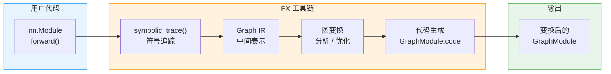
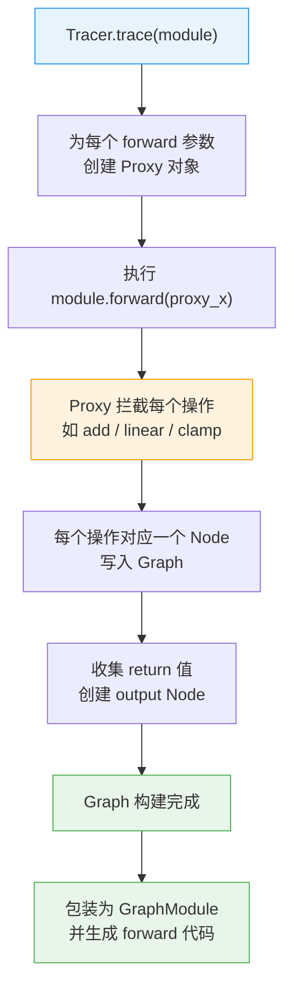
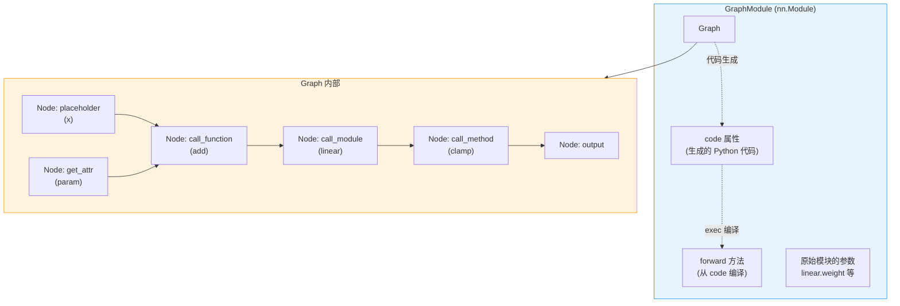
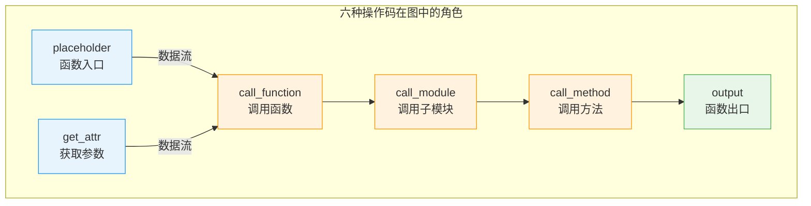
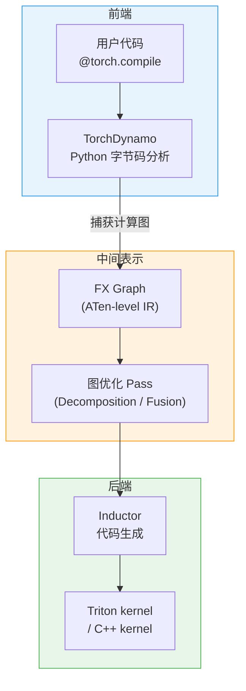

> 本文面向 PyTorch 初学者，从零开始介绍 FX（Functional Transformations）的核心概念：符号追踪、Graph / Node / GraphModule 数据结构、简单图变换，以及 FX 在 `torch.compile` 编译栈中的定位。

---

## 1. 概述

当你编写一个 `nn.Module`，PyTorch 默认以**即时执行（eager）** 模式运行 —— 每行 Python 代码立即产出结果。这对调试友好，但编译器无法看到"全貌"，也就无法做跨算子的优化。

FX 解决的正是这个问题：它提供了一套 **Python-to-Python** 的变换工具链，能够将 `nn.Module` 的 `forward` 方法"录制"为一张中间表示（IR）图，然后在图上做分析或变换，最后再生成等价的 Python 代码。



FX 的三大组件：

| 组件 | 作用 | 核心类 / 函数 |
|------|------|--------------|
| **符号追踪 (Symbolic Tracer)** | 通过 Proxy 对象执行 forward，录制所有操作 | `symbolic_trace()`, `Tracer` |
| **中间表示 (IR)** | 以 `Graph` + `Node` 表示计算图 | `Graph`, `Node` |
| **代码生成 (CodeGen)** | 从 Graph 生成等价 Python 代码，封装为可调用模块 | `GraphModule` |

> 源码入口：`torch/fx/__init__.py`（第 103-116 行）导出了全部公开 API。

---

## 2. 前置知识

阅读本文前，你需要了解：

| 前置知识 | 说明 |
|----------|------|
| `nn.Module` | PyTorch 模型的基类，包含参数和 `forward()` 方法 |
| Python 基本反射 | `getattr`、`callable` 等基础概念 |
| 计算图的概念 | 节点表示操作，边表示数据依赖 |

不需要提前了解 TorchScript、Dynamo 或 Inductor。

---

## 3. symbolic_trace() 基础

### 3.1 最小示例

```python
import torch
import torch.nn as nn
from torch.fx import symbolic_trace

class MyModel(nn.Module):
    def __init__(self):
        super().__init__()
        self.param = nn.Parameter(torch.rand(3, 4))
        self.linear = nn.Linear(4, 5)

    def forward(self, x):
        return self.linear(x + self.param).clamp(min=0.0, max=1.0)

model = MyModel()
traced = symbolic_trace(model)

# 查看生成的 Graph IR
print(traced.graph)
# graph():
#     %x : [num_users=1] = placeholder[target=x]
#     %param : [num_users=1] = get_attr[target=param]
#     %add : [num_users=1] = call_function[target=operator.add](args = (%x, %param), kwargs = {})
#     %linear : [num_users=1] = call_module[target=linear](args = (%add,), kwargs = {})
#     %clamp : [num_users=1] = call_method[target=clamp](args = (%linear,), kwargs = {min: 0.0, max: 1.0})
#     return clamp

# 查看生成的 Python 代码
print(traced.code)
# def forward(self, x):
#     param = self.param
#     add = x + param;  x = param = None
#     linear = self.linear(add);  add = None
#     clamp = linear.clamp(min = 0.0, max = 1.0);  linear = None
#     return clamp
```

### 3.2 符号追踪的工作原理

`symbolic_trace(m)` 等价于 `Tracer().trace(m)`。它的核心思想是**符号执行**：不使用真实张量，而是向 `forward()` 传入 `Proxy` 对象。`Proxy` 重载了所有算术、比较、属性访问等魔术方法，每次操作都会在内部的 `Graph` 上插入一个 `Node`。

> 源码位置：`torch/fx/_symbolic_trace.py`（第 258 行起 `Tracer` 类定义，第 1321 行 `symbolic_trace` 函数）



### 3.3 符号追踪的局限

符号追踪**无法处理动态控制流**，因为 Proxy 对象不携带真实值：

```python
class BadModel(nn.Module):
    def forward(self, x):
        if x.sum() > 0:     # Proxy 无法求值 -> TraceError
            return x
        return -x
```

这正是后来 `torch._dynamo`（TorchDynamo）诞生的原因之一 —— 它通过 Python 字节码分析来处理控制流，而不依赖符号执行。

---

## 4. GraphModule 概念

### 4.1 什么是 GraphModule

`GraphModule` 是 FX 的核心产出物。它继承自 `torch.nn.Module`，因此可以像普通模型一样调用。它内部持有一个 `Graph` 对象，并根据该 Graph 动态生成 `forward` 方法。

> 源码位置：`torch/fx/graph_module.py`（第 465 行 `GraphModule` 类定义）

```python
traced = symbolic_trace(model)

# GraphModule 是一个 nn.Module
assert isinstance(traced, torch.nn.Module)

# 可以正常推理
x = torch.randn(3, 4)
output = traced(x)

# 核心属性
traced.graph      # Graph 对象（IR）
traced.code       # 生成的 Python forward 代码（字符串）
traced.forward    # 由代码生成的可调用 forward 方法
```

### 4.2 GraphModule 的关键特性

| 特性 | 说明 |
|------|------|
| 可调用 | 继承 `nn.Module`，可直接 `traced(input)` |
| 可序列化 | 支持 `torch.save` / `torch.load` |
| 可打印 | `print(traced.graph)` 输出人类可读的 IR |
| 代码可见 | `traced.code` 展示等价 Python 代码 |
| 可修改 | 修改 `graph` 后调用 `recompile()` 即可更新 `forward` |

### 4.3 Graph、Node 与 GraphModule 的关系



---

## 5. Graph 和 Node 基础

### 5.1 Graph 类

`Graph` 是 FX IR 的容器，内部维护一个 `Node` 的双向链表。可以通过 `graph.nodes` 进行遍历。

> 源码位置：`torch/fx/graph.py`（第 1287 行 `Graph.__init__`）

```python
for node in traced.graph.nodes:
    print(f"op={node.op:20s} name={node.name:10s} target={node.target}")
```

### 5.2 Node 类与六种操作码

每个 `Node` 代表图中的一个操作。`Node.op` 属性标识操作类型，共有**六种操作码（opcode）**：

> 源码位置：`torch/fx/node.py`（第 245-262 行，六种 opcode 的语义定义）

| opcode | 含义 | target 的类型 | 示例 |
|--------|------|--------------|------|
| `placeholder` | 函数输入参数 | 参数名（str） | `%x = placeholder[target=x]` |
| `get_attr` | 获取模块属性/参数 | 属性路径（str） | `%param = get_attr[target=param]` |
| `call_function` | 调用自由函数 | 函数对象（callable） | `call_function[target=operator.add]` |
| `call_method` | 调用方法 | 方法名（str） | `call_method[target=clamp]` |
| `call_module` | 调用子模块 forward | 模块路径（str） | `call_module[target=linear]` |
| `output` | 函数返回值 | 固定为 `"output"` | `return clamp` |

### 5.3 Node 的关键属性

```python
node = list(traced.graph.nodes)[3]  # 取第 4 个节点 (call_module: linear)

node.op        # "call_module"
node.name      # "linear"（此 Node 产出值的名称）
node.target    # "linear"（子模块在 module hierarchy 中的路径）
node.args      # (%add,)  —— 输入节点的引用
node.kwargs    # {}
node.users     # {clamp_node: None} —— 使用此 Node 输出的后续节点
node.meta      # dict —— 元数据（shape、dtype 等，由 pass 填充）
```

### 5.4 用操作码理解上面的例子

将之前 `MyModel` 的 Graph IR 映射到六种操作码：

```
graph():
    %x     = placeholder[target=x]                          # 输入参数 x
    %param = get_attr[target=param]                         # 获取 self.param
    %add   = call_function[target=operator.add](%x, %param) # x + param
    %linear= call_module[target=linear](%add)               # self.linear(add)
    %clamp = call_method[target=clamp](%linear, min=0, max=1) # linear.clamp(...)
    return %clamp                                           # output
```



---

## 6. 简单图变换示例

FX 的核心价值在于**图变换**。下面演示一个经典示例：将模型中所有的 `relu` 替换为 `gelu`。

### 6.1 原始模型

```python
import torch
import torch.nn as nn
from torch.fx import symbolic_trace

class SimpleNet(nn.Module):
    def __init__(self):
        super().__init__()
        self.linear1 = nn.Linear(10, 20)
        self.linear2 = nn.Linear(20, 10)

    def forward(self, x):
        x = torch.relu(self.linear1(x))
        x = torch.relu(self.linear2(x))
        return x

net = SimpleNet()
traced = symbolic_trace(net)
print(traced.graph)
```

### 6.2 替换 relu 为 gelu

```python
import torch.nn.functional as F
from torch.fx import Graph, Node

# 遍历所有节点
for node in traced.graph.nodes:
    # 找到 call_function 且 target 是 torch.relu 的节点
    if node.op == "call_function" and node.target == torch.relu:
        # 将 target 替换为 torch.nn.functional.gelu
        node.target = F.gelu

# 修改 graph 后必须 recompile
traced.recompile()

# 验证变换结果
print(traced.code)
# def forward(self, x):
#     linear1 = self.linear1(x);  x = None
#     gelu = torch.nn.functional.gelu(linear1);  linear1 = None
#     linear2 = self.linear2(gelu);  gelu = None
#     gelu_1 = torch.nn.functional.gelu(linear2);  linear2 = None
#     return gelu_1

# 验证可以正常运行
x = torch.randn(5, 10)
output = traced(x)
print(output.shape)  # torch.Size([5, 10])
```

### 6.3 变换流程总结

图变换的通用模式为三步：

1. **遍历** `graph.nodes`，找到目标节点
2. **修改** 节点属性（`op`、`target`、`args` 等），或插入 / 删除节点
3. **重编译** 调用 `graph_module.recompile()` 更新生成代码

---

## 7. FX vs TorchScript 对比

FX 并非 PyTorch 第一次尝试获取模型的 IR。TorchScript（`torch.jit.script` / `torch.jit.trace`）是更早期的方案。下面对比两者的设计哲学：

| 维度 | TorchScript | FX |
|------|------------|-----|
| IR 类型 | 自定义 IR（TorchScript IR） | Python AST 级别的 IR（Graph + Node） |
| 追踪方式 | `jit.trace` 录制真实执行 / `jit.script` 编译 Python 子集 | 符号执行（Proxy） |
| 控制流 | `jit.script` 支持 if/for | 不支持动态控制流 |
| 输出格式 | 序列化为 `.pt` 文件，脱离 Python | 生成等价 Python 代码，保留 Python 生态 |
| 可调试性 | 独立运行时，调试困难 | 生成代码可直接阅读和断点调试 |
| 适用场景 | 部署到 C++ 运行时 | 编译优化、模型分析、图变换 |
| 当前状态 | 维护模式，不再积极开发 | `torch.compile` 栈的核心组件 |

FX 诞生的初衷是：**在保留 Python 灵活性的前提下，提供编译器可消费的 IR**。TorchScript 试图覆盖整个 Python 语言子集，实现复杂且难以维护；FX 选择了更轻量的路径 —— 只关注 `forward` 中的张量操作，不试图成为通用 Python 编译器。

---

## 8. FX 在 torch.compile 中的角色

在 PyTorch 2.x 的编译栈中，FX Graph 是连接前端（Dynamo）和后端（Inductor）的**核心中间表示**。



### 8.1 Dynamo 如何生成 FX Graph

当 `@torch.compile` 装饰的函数被调用时：

1. **TorchDynamo** 在 Python 字节码层面拦截执行，分析控制流
2. 对于可追踪的**直线代码段（guard region）**，Dynamo 生成对应的 FX Graph
3. 遇到无法追踪的代码（如 print、外部调用），Dynamo 在该处"断开图"（graph break），将前后分为多个子图

与 `symbolic_trace()` 不同，Dynamo 生成的 FX Graph 使用 ATen 级别的操作（如 `aten.add.Tensor`），而非 Python 级别的操作（如 `operator.add`）。这使得后端优化器可以直接操作标准化的算子集合。

### 8.2 FX Graph 的两个"口味"

| 层级 | 生成方式 | Node.target 示例 | 用途 |
|------|---------|-------------------|------|
| **Torch 级别** | `symbolic_trace()` | `torch.relu`, `operator.add` | 模型分析、简单变换 |
| **ATen 级别** | `torch._dynamo` / `make_fx` | `torch.ops.aten.add.Tensor` | 编译优化、Inductor 消费 |

### 8.3 从 FX Graph 到 Inductor

Inductor 接收 ATen 级别的 FX Graph 后，执行以下步骤：

1. **Lowering**：将 ATen 算子进一步分解为更底层的原语
2. **Fusion**：将多个算子融合为一个 kernel（减少内存带宽消耗）
3. **CodeGen**：生成 Triton kernel（GPU）或 C++ kernel（CPU）
4. **编译运行**：JIT 编译生成的代码并执行

FX Graph 在整个流程中充当了"**通用语言**"的角色 —— 前端只需生成 FX Graph，后端只需消费 FX Graph，两端可以独立演进。

---

## 9. 小结

| 概念 | 说明 |
|------|------|
| FX | PyTorch 的 Python-to-Python 模型变换工具链 |
| `symbolic_trace()` | 通过 Proxy 符号执行，将 forward 录制为 Graph |
| `GraphModule` | 包装 Graph 的 `nn.Module`，持有生成的 `code` 和 `forward` |
| `Graph` | 计算图的容器，内部是 Node 的双向链表 |
| `Node` | 图中的单个操作，有六种 opcode |
| 六种 opcode | `placeholder` / `get_attr` / `call_function` / `call_method` / `call_module` / `output` |
| 图变换 | 遍历节点 -> 修改属性 -> `recompile()` |
| FX vs TorchScript | FX 保留 Python 生态，TorchScript 追求脱离 Python 的部署 |
| FX 在 torch.compile 中 | 作为 Dynamo 和 Inductor 之间的核心 IR |

**核心要点回顾：**

1. FX 将模型的 `forward` 方法录制为图（Graph），图由六种操作码的 Node 组成
2. `GraphModule` 是 FX 的核心产出物，它既是 `nn.Module` 又携带可检查的 IR
3. 图变换遵循"遍历 - 修改 - 重编译"三步模式
4. FX 选择了"保持 Python"的设计路线，与 TorchScript 的"脱离 Python"形成对比
5. 在 `torch.compile` 栈中，FX Graph 是连接 Dynamo 前端和 Inductor 后端的桥梁

---

## 延伸阅读

**本模块后续文章：**

- [Graph 与 Node 深度解析](./01-graph-node-deep-dive.md) -- Node 的完整属性、Graph 的增删改查 API、双向链表实现
- [Proxy 与 Tracer 机制](./02-proxy-tracer-internals.md) -- Proxy 如何拦截操作、Tracer 的子类化扩展
- [图变换实战](./03-graph-transforms.md) -- subgraph_rewriter、Interpreter / Transformer 模式
- [GraphModule 代码生成](./04-codegen-internals.md) -- CodeGen 如何从 Graph 生成 Python 代码并 exec 执行
- [FX 与 Dynamo 的衔接](./05-fx-dynamo-bridge.md) -- Dynamo 如何生成 ATen 级别 FX Graph、OutputGraph 机制

**关联模块：**

- [Module 0 - 架构总览](../module-00-overview/00-architecture-overview.md) -- FX 在 PyTorch 整体架构中的位置
- [Module 5 - 算子分发入门](../module-05-dispatch/00-dispatch-tutorial.md) -- FX Graph 中的算子如何被分发执行
- [Module 8 - TorchDynamo](../module-08-dynamo/00-dynamo-tutorial.md) -- Dynamo 如何捕获 FX Graph
- [Module 9 - Inductor](../module-09-inductor/00-inductor-tutorial.md) -- Inductor 如何消费 FX Graph 并生成高效内核
