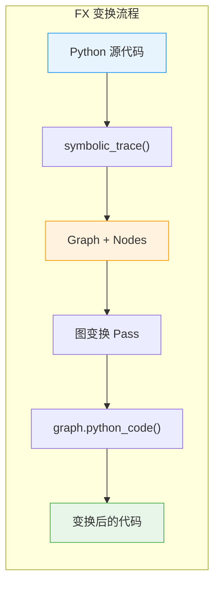
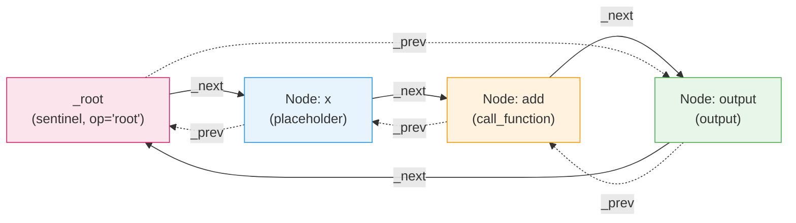
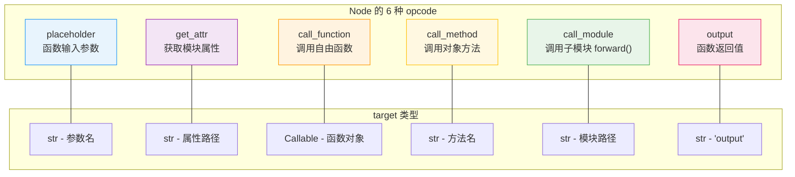
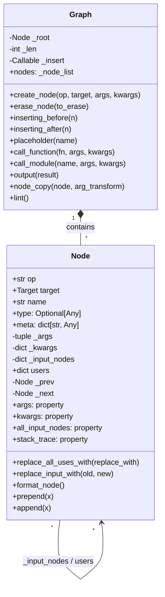
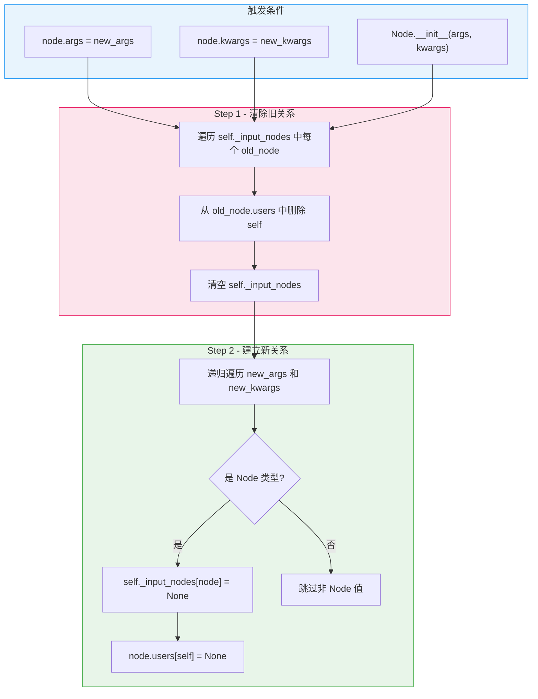
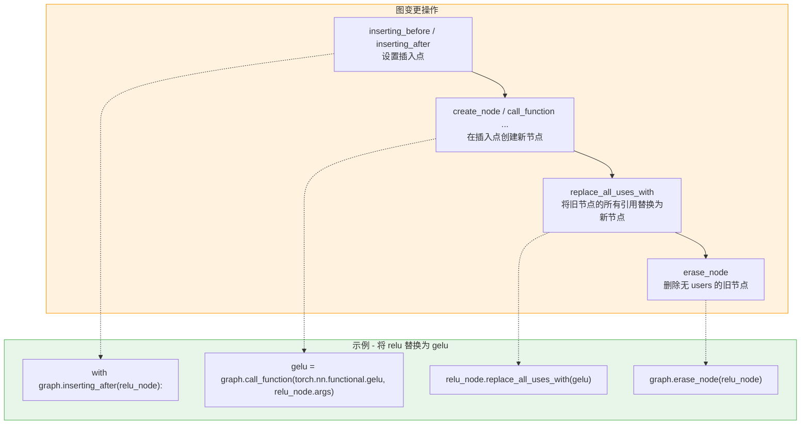

> 本文深入解析 `torch.fx` 的两个核心类 `Graph` 和 `Node`。Graph 采用双向链表结构管理节点序列，Node 通过 6 种 opcode 表达计算图中的所有操作。文章涵盖数据结构设计、Use-Def 自动追踪机制、图构建 API 与变更操作，帮助读者掌握 FX 图的底层运作原理。

---

## 1. 概述

`torch.fx` 是 PyTorch 的 Python-to-Python 程序变换框架。它将 Python 函数（或 `nn.Module` 的 `forward` 方法）通过符号追踪转化为一个中间表示（IR），这个 IR 就是 `Graph`。`Graph` 内部由一系列 `Node` 组成，每个 `Node` 对应原始代码中的一步操作。

FX IR 有别于传统编译器 IR 的一个显著特征：它的节点存储在**双向链表**中，而非数组。这一设计决策使得在图变换过程中的插入和删除操作极其高效。



**核心源码文件：**

| 文件 | 说明 |
|------|------|
| `torch/fx/graph.py` | Graph 类，图的构建与变换 API |
| `torch/fx/node.py` | Node 类，节点数据结构与属性 |
| `torch/csrc/fx/node.cpp` | NodeBase C++ 实现，性能关键路径 |

---

## 2. 前置知识

阅读本文前，建议了解以下概念：

| 概念 | 说明 |
|------|------|
| 双向链表 | 每个节点持有 `_prev` 和 `_next` 指针，支持 O(1) 插入/删除 |
| 哨兵节点 (Sentinel) | 链表头部的特殊节点，不参与实际计算，简化边界处理 |
| Use-Def 链 | 编译器中追踪值的定义点与使用点的数据结构 |
| DAG (有向无环图) | FX Graph 的逻辑结构是 DAG，物理存储是链表 |

---

## 3. Graph 双向链表结构

### 3.1 Graph 初始化

`Graph.__init__` 创建一个空图，核心动作是建立哨兵节点 `_root`：

```python
# torch/fx/graph.py (L1287-L1306)
class Graph:
    def __init__(
        self,
        owning_module: Optional["GraphModule"] = None,
        tracer_cls: Optional[type["Tracer"]] = None,
        tracer_extras: Optional[dict[str, Any]] = None,
    ):
        self._root: Node = Node(self, "", "root", "", (), {})
        self._used_names: dict[str, int] = {}
        self._insert = self._root.prepend  # 默认插入点：_root 之前（即链表末尾）
        self._len = 0
        self._graph_namespace = _Namespace()
        self._owning_module = owning_module
```

`_root` 是一个 op 为 `"root"` 的特殊节点，它不属于图的逻辑内容，仅作为链表的哨兵。由于 `_root._prev` 和 `_root._next` 初始时都指向自身，空图形成了一个只有哨兵的环形结构。

### 3.2 链表结构图解

当图中包含 `placeholder -> call_function -> output` 三个节点时，物理结构如下：



这是一个**环形双向链表**：`_root._next` 指向第一个节点，`_root._prev` 指向最后一个节点。这种设计让"在末尾插入"等价于"在 `_root` 之前插入"，统一了所有插入操作的接口。

### 3.3 _node_list 迭代器

`Graph.nodes` 属性返回 `_node_list` 对象，它跳过哨兵节点，仅遍历有效节点：

```python
# torch/fx/graph.py (L268-L284)
class _node_list:
    def __init__(self, graph: "Graph", direction: Literal["_prev", "_next"] = "_next"):
        self.graph = graph
        self.direction = direction

    def __len__(self):
        return self.graph._len

    def __iter__(self):
        return _NodeIter(self.graph._root, self.direction == "_prev")

    def __reversed__(self):
        return _node_list(self.graph, "_next" if self.direction == "_prev" else "_prev")
```

`_NodeIter` 是 C++ 实现的迭代器，从 `_root._next` 开始沿 `_next` 方向遍历，遇到 `_root` 时停止。支持 `reversed()` 反向遍历，只需改变方向为 `_prev`。

---

## 4. Node 的 6 种 opcode

每个 Node 都有一个 `op` 属性，取值为以下 6 种 opcode 之一。opcode 决定了 `target`、`args`、`kwargs` 的语义。

### 4.1 opcode 总览



### 4.2 各 opcode 详解

**placeholder** -- 表示函数输入参数：

```python
# target = 参数名（str），args = () 或 (default_value,)
# 对应生成代码中的函数参数
%x : [num_users=1] = placeholder[target=x]
```

**get_attr** -- 从模块层级结构中获取属性（参数、buffer）：

```python
# target = 属性全限定路径（str），args = (), kwargs = {}
%weight : [num_users=1] = get_attr[target=linear.weight]
```

**call_function** -- 调用自由函数（`torch.add`、`operator.add` 等）：

```python
# target = Callable（函数对象本身），args/kwargs = 函数参数
%add : [num_users=1] = call_function[target=torch.add](args = (%x, %y), kwargs = {})
```

**call_method** -- 在值上调用方法：

```python
# target = 方法名（str），args[0] = self 对象，其余为方法参数
%relu : [num_users=1] = call_method[target=relu](args = (%add,), kwargs = {})
```

**call_module** -- 调用子模块的 `forward()` 方法：

```python
# target = 模块全限定名（str），args/kwargs 不含 self
%linear : [num_users=1] = call_module[target=layers.0](args = (%x,), kwargs = {})
```

**output** -- 表示函数的返回值：

```python
# target = "output", args[0] = 返回值（Node 或 Node 的 tuple）
return (%relu,)
```

### 4.3 opcode 与 target 类型约束

```python
# torch/fx/node.py (L339-L352)
if op == "call_function":
    if not callable(target):
        raise ValueError(...)
else:
    if op not in _legal_ops:
        raise AssertionError(f"op '{op}' is not in _legal_ops")
    if not isinstance(target, str):
        raise ValueError(...)
```

只有 `call_function` 的 target 是 `Callable`，其余 5 种 opcode 的 target 都必须是 `str`。这个约束在 `Node.__init__` 中强制执行。

---

## 5. Node 核心属性

### 5.1 类属性定义

```python
# torch/fx/node.py (L265-L300)
class Node(_NodeBase):
    _args: tuple["Argument", ...]        # 位置参数
    _kwargs: dict[str, "Argument"]       # 关键字参数
    graph: "Graph"                        # 所属图
    name: str                             # 唯一名称，如 "add", "add_1"
    op: str                               # opcode，6 种之一
    target: "Target"                      # 操作目标
    _input_nodes: dict["Node", None]      # 当前节点的所有输入节点（有序集合）
    users: dict["Node", None]             # 使用本节点输出的所有节点（有序集合）
    type: Optional[Any]                   # 输出类型注解
    _sort_key: Any                        # 拓扑排序键
    _repr_fn: Optional[Callable]          # 自定义 repr 函数
    meta: dict[str, Any]                  # 元数据字典
```



### 5.2 关键属性说明

**`_input_nodes` 与 `users`**：这两个 `dict[Node, None]` 实质上是**有序集合**（ordered set），dict 的 key 是有意义的，value（`None`）无意义。它们构成了 Use-Def 链的两端：

- `_input_nodes`：该节点依赖哪些节点的输出（即该节点的"定义依赖"）
- `users`：哪些节点使用了该节点的输出（即该节点的"使用者"）

**`meta`**：元数据字典，在各种变换 Pass 中存储附加信息。常见的 key 包括：

| key | 说明 |
|-----|------|
| `tensor_meta` | `TensorMetadata` 命名元组（shape, dtype, stride 等） |
| `val` | FakeTensor 或 SymInt，用于形状推断 |
| `stack_trace` | 原始 Python 调用栈字符串 |
| `example_value` | 示例输出值 |
| `nn_module_stack` | 原始 `nn.Module` 层级信息 |

---

## 6. Use-Def 自动追踪

### 6.1 核心机制

FX 的 Use-Def 追踪是**全自动**的：每当修改 Node 的 `args` 或 `kwargs` 时，系统自动更新 `_input_nodes` 和相关节点的 `users`。

这一逻辑在 C++ 层实现（`torch/csrc/fx/node.cpp`），关键函数是 `_update_args_kwargs`：

```cpp
// torch/csrc/fx/node.cpp (L307-L350)
static PyObject* NodeBase__update_args_kwargs(
    PyObject* self, PyObject* const* args, Py_ssize_t nargs) {
  auto node = reinterpret_cast<NodeBase*>(self);
  auto input_nodes = node->_input_nodes;

  // Step 1: 清除旧的 _input_nodes，同时从旧输入节点的 users 中移除自身
  if (PyDict_GET_SIZE(input_nodes) > 0) {
    PyObject *key = nullptr, *value = nullptr;
    Py_ssize_t pos = 0;
    while (PyDict_Next(input_nodes, &pos, &key, &value)) {
      PyDict_DelItem(reinterpret_cast<NodeBase*>(key)->users, self);
    }
    PyDict_Clear(input_nodes);
  }

  // Step 2: 遍历新的 args/kwargs，收集所有 Node 类型的值
  //         将它们加入 _input_nodes，同时在对应节点的 users 中注册自身
  auto visit_fn = [self, input_nodes](PyObject* x) {
    if (is_node(x)) {
      PyDict_SetDefault(input_nodes, x, Py_None);    // self._input_nodes[x] = None
      PyDict_SetDefault(
          reinterpret_cast<NodeBase*>(x)->users, self, Py_None);  // x.users[self] = None
    }
    return Py_NewRef(x);
  };
  // ... map_aggregate(new_args, visit_fn), map_aggregate(new_kwargs, visit_fn)
}
```

### 6.2 追踪流程图



### 6.3 all_input_nodes 属性

`all_input_nodes` 是 `_input_nodes` 的公开只读接口：

```python
# torch/fx/node.py (L476-L488)
@property
def all_input_nodes(self) -> list["Node"]:
    """
    Return all Nodes that are inputs to this Node.
    """
    return list(self._input_nodes.keys())
```

它返回一个列表，保持了节点在 args/kwargs 中首次出现的顺序。

### 6.4 Use-Def 追踪示例

```python
import torch
import torch.fx

graph = torch.fx.Graph()
x = graph.placeholder("x")
y = graph.placeholder("y")
add = graph.call_function(torch.add, (x, y))

# 自动建立的 Use-Def 关系
print(add.all_input_nodes)  # [x, y]
print(x.users)              # {add: None}
print(y.users)              # {add: None}

# 修改 args 后，关系自动更新
z = graph.placeholder("z")
add.args = (x, z)           # 用 z 替换 y
print(add.all_input_nodes)  # [x, z]
print(y.users)              # {} -- y 不再被使用
print(z.users)              # {add: None}
```

---

## 7. Graph 构建 API

### 7.1 create_node -- 底层统一入口

所有节点创建最终都经过 `create_node`：

```python
# torch/fx/graph.py (L1421-L1483)
def create_node(
    self,
    op: str,
    target: "Target",
    args: Optional[tuple["Argument", ...]] = None,
    kwargs: Optional[dict[str, "Argument"]] = None,
    name: Optional[str] = None,
    type_expr: Optional[Any] = None,
) -> Node:
    candidate = name if name is not None else self._target_to_str(target)
    name = self._graph_namespace.create_name(candidate, None)   # 确保名称唯一
    n = Node(self, name, op, target, args, kwargs, type_expr)   # 创建节点
    self._insert(n)                                              # 插入到当前插入点
    self._find_nodes_lookup_table.insert(n)                      # 加入快速查找表
    self._len += 1
    return n
```

### 7.2 便捷方法

Graph 为每种 opcode 提供了对应的便捷方法，减少手动指定 `op` 字符串的负担：

```python
# 各便捷方法的签名与 target 类型

graph.placeholder("x")                                  # op="placeholder", target="x"
graph.get_attr("layer.weight")                           # op="get_attr", target="layer.weight"
graph.call_function(torch.relu, (x,))                    # op="call_function", target=torch.relu
graph.call_method("reshape", (x, (2, 3)))                # op="call_method", target="reshape"
graph.call_module("linear", (x,))                        # op="call_module", target="linear"
graph.output(result)                                     # op="output", target="output"
```

### 7.3 完整构建示例

```python
import torch
import torch.fx
import operator

graph = torch.fx.Graph()

# Step 1: 创建输入
x = graph.placeholder("x")
y = graph.placeholder("y")

# Step 2: 构建计算
add = graph.call_function(operator.add, (x, y))
relu = graph.call_function(torch.relu, (add,))

# Step 3: 设置输出
graph.output(relu)

# 查看生成的代码
print(graph)
# def forward(self, x, y):
#     add = operator.add(x, y)
#     relu = torch.relu(add)
#     return relu
```

---

## 8. Graph 变更操作

### 8.1 插入点控制

`inserting_before()` 和 `inserting_after()` 是上下文管理器，用于控制新节点的插入位置：

```python
# torch/fx/graph.py (L1537-L1585)
def inserting_before(self, n: Optional[Node] = None):
    if n is None:
        return self.inserting_after(self._root)     # 插入到图的开头
    return _InsertPoint(self, n.prepend)

def inserting_after(self, n: Optional[Node] = None):
    if n is None:
        return self.inserting_before(self._root)    # 插入到图的末尾
    return _InsertPoint(self, n.append)
```

`_InsertPoint` 的实现非常简洁，它临时替换 `graph._insert` 函数指针：

```python
# torch/fx/graph.py (L256-L265)
class _InsertPoint:
    def __init__(self, graph, new_insert):
        self.graph = graph
        self.orig_insert, graph._insert = graph._insert, new_insert

    def __enter__(self):
        pass

    def __exit__(self, type, value, tb):
        self.graph._insert = self.orig_insert
```

使用示例：

```python
# 在 add 节点之后插入新操作
with graph.inserting_after(add):
    neg = graph.call_function(torch.neg, (add,))

# 在 relu 节点之前插入新操作
with graph.inserting_before(relu):
    mul = graph.call_function(torch.mul, (neg, x))
```

### 8.2 erase_node -- 删除节点

```python
# torch/fx/graph.py (L1497-L1535)
def erase_node(self, to_erase: Node) -> None:
    if len(to_erase.users) > 0:
        raise RuntimeError(
            f"Tried to erase Node {to_erase} but it still had "
            f"{len(to_erase.users)} users in the graph: {to_erase.users}!"
        )

    self._find_nodes_lookup_table.remove(to_erase)
    to_erase._remove_from_list()               # 从链表中摘除
    to_erase._erased = True
    self._len -= 1

    # 清空 args/kwargs，自动触发 Use-Def 更新
    to_erase._update_args_kwargs(
        map_arg(to_erase._args, lambda n: None),
        map_arg(to_erase._kwargs, lambda n: None),
    )
```

`erase_node` 有一个关键前置条件：**被删除的节点不能有 users**。如果某个节点的输出仍被其他节点引用，必须先通过 `replace_all_uses_with` 替换掉所有引用。

### 8.3 replace_all_uses_with -- 替换所有引用

```python
# torch/fx/node.py (L691-L735)
def replace_all_uses_with(
    self,
    replace_with: "Node",
    delete_user_cb: Optional[Callable[["Node"], bool]] = None,
    *,
    propagate_meta: bool = False,
) -> list["Node"]:
    to_process = [*self.users]
    result = []
    for use_node in to_process:
        if delete_user_cb is not None and not delete_user_cb(use_node):
            continue
        result.append(use_node)
        use_node._replace_input_with(self, replace_with)
    return result
```

### 8.4 node_copy -- 跨图复制节点

```python
# torch/fx/graph.py (L1820-L1854)
def node_copy(
    self, node: Node, arg_transform: Callable[[Node], "Argument"] = lambda x: x
) -> Node:
    args = map_arg(node.args, arg_transform)
    kwargs = map_arg(node.kwargs, arg_transform)
    result_node = self.create_node(node.op, node.target, args, kwargs, node.name, node.type)
    result_node.meta = copy.copy(node.meta)
    return result_node
```

`arg_transform` 参数用于将源图中的 Node 引用映射到目标图中的对应 Node。

### 8.5 变更操作流程



---

## 9. Graph.lint() 验证

`lint()` 方法对图的一致性进行全面检查：

```python
# torch/fx/graph.py (L2041-L2118)
def lint(self):
    seen_names: set[str] = set()
    seen_values: set[Node] = set()
    for node in self.nodes:
        # 检查 1: opcode 合法性
        if node.op not in _legal_ops:
            raise RuntimeError(f"Node {node} had unknown opcode {node.op}!")

        # 检查 2: 节点归属
        if node.graph is not self:
            raise RuntimeError(f"Node '{node}' does not belong to this Graph!")

        # 检查 3: 拓扑排序 -- 所有输入节点必须在当前节点之前出现
        for arg in node._input_nodes:
            if arg not in seen_values:
                raise RuntimeError(
                    f"Argument '{arg}' was used before it has been defined!"
                )
        seen_values.add(node)

        # 检查 4: 名称唯一性
        if node.name in seen_names:
            raise RuntimeError(f"Node redefined name {node.name}!")
        seen_names.add(node.name)

    # 检查 5: 如果有 owning_module，验证 target 引用的合法性
    if self.owning_module:
        for node in self.nodes:
            if node.op in ["get_attr", "call_module"]:
                # 逐级验证 target 路径中每个属性都存在
                ...
```

`lint()` 确保的几项不变量：

| 检查项 | 说明 |
|--------|------|
| opcode 合法性 | `op` 必须是 6 种合法 opcode 之一 |
| 节点归属 | 每个 Node 的 `graph` 属性必须指向当前 Graph |
| 拓扑有序 | 节点的所有 `_input_nodes` 必须出现在该节点之前 |
| 名称唯一 | 不存在重名节点 |
| target 可达 | `get_attr` 和 `call_module` 引用的属性/模块在 `owning_module` 中存在 |

---

## 10. 实战示例

### 10.1 手动构建图并执行变换

以下示例演示了完整的"构建 -> 遍历 -> 修改"工作流：

```python
import torch
import torch.fx
import torch.nn.functional as F

# === Step 1: 通过 symbolic_trace 获取图 ===
class MyModule(torch.nn.Module):
    def __init__(self):
        super().__init__()
        self.linear = torch.nn.Linear(10, 20)

    def forward(self, x):
        x = self.linear(x)
        x = torch.relu(x)
        return x

traced = torch.fx.symbolic_trace(MyModule())
graph = traced.graph

# === Step 2: 遍历节点 ===
for node in graph.nodes:
    print(f"op={node.op:16s} name={node.name:12s} target={node.target}")
# op=placeholder       name=x            target=x
# op=call_module       name=linear        target=linear
# op=call_function     name=relu          target=<built-in method relu ...>
# op=output            name=output        target=output

# === Step 3: 将 relu 替换为 gelu ===
for node in graph.nodes:
    if node.op == "call_function" and node.target == torch.relu:
        with graph.inserting_after(node):
            new_node = graph.call_function(F.gelu, node.args, node.kwargs)
        node.replace_all_uses_with(new_node)
        graph.erase_node(node)

# === Step 4: 验证与查看结果 ===
graph.lint()
traced.recompile()
print(traced.code)
# def forward(self, x):
#     linear = self.linear(x)
#     gelu = torch.nn.functional.gelu(linear)
#     return gelu
```

### 10.2 分析图中的 Use-Def 关系

```python
import torch
import torch.fx

def analyze_graph(graph: torch.fx.Graph):
    """打印图中每个节点的 Use-Def 关系"""
    for node in graph.nodes:
        inputs = [n.name for n in node.all_input_nodes]
        users = [n.name for n in node.users.keys()]
        print(f"{node.name:12s} | inputs: {inputs:30s} | users: {users}")

class Net(torch.nn.Module):
    def forward(self, x, y):
        a = x + y
        b = a * x
        c = torch.relu(b)
        return c

traced = torch.fx.symbolic_trace(Net())
analyze_graph(traced.graph)
# x            | inputs: []                             | users: ['add', 'mul']
# y            | inputs: []                             | users: ['add']
# add          | inputs: ['x', 'y']                     | users: ['mul']
# mul          | inputs: ['add', 'x']                   | users: ['relu']
# relu         | inputs: ['mul']                        | users: ['output']
# output       | inputs: ['relu']                       | users: []
```

---

## 小结

| 概念 | 说明 |
|------|------|
| Graph 链表结构 | 环形双向链表，`_root` 哨兵节点不参与计算，`_node_list` 提供迭代 |
| 6 种 opcode | `placeholder`、`get_attr`、`call_function`、`call_method`、`call_module`、`output` |
| Node 核心属性 | `op`、`target`、`args`、`kwargs`、`name`、`type`、`users`、`_input_nodes`、`meta` |
| Use-Def 追踪 | 修改 `args`/`kwargs` 时自动更新 `_input_nodes` 和 `users`，C++ 层实现 |
| 构建 API | `create_node()` 统一入口，6 个便捷方法对应 6 种 opcode |
| 变更操作 | `inserting_before/after` 控制插入点，`erase_node` 删除，`replace_all_uses_with` 替换引用 |
| lint() | 检查 opcode 合法性、节点归属、拓扑有序、名称唯一、target 可达 |

---

## 延伸阅读

**本模块后续文章：**

- [Tracer 符号追踪机制](./02-tracer-symbolic-trace.md) -- `symbolic_trace` 如何将 Python 代码转为 Graph
- [GraphModule 与代码生成](./03-graph-module-codegen.md) -- Graph 如何生成可执行的 Python 代码
- [FX Pass 编写实战](./04-fx-pass-writing.md) -- 基于 Graph 变换的优化 Pass 编写指南
- [SubgraphMatcher 子图匹配](./05-subgraph-matcher.md) -- 模式匹配与子图替换

**关联模块：**

- [Module 0 - 架构总览](../module-00-overview/00-architecture-overview.md) -- PyTorch 整体架构中 FX 的位置
- [Module 8 - Dynamo](../module-08-dynamo/00-dynamo-overview.md) -- Dynamo 如何利用 FX Graph 作为后端 IR
- [Module 9 - Inductor](../module-09-inductor/00-inductor-overview.md) -- Inductor 编译器如何消费 FX Graph
