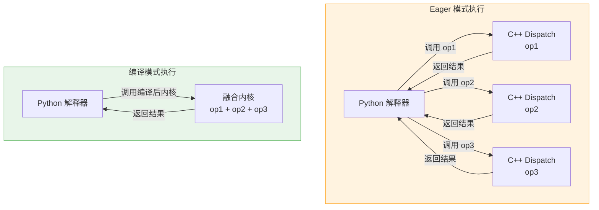
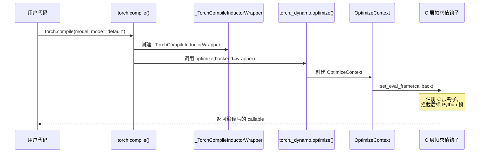
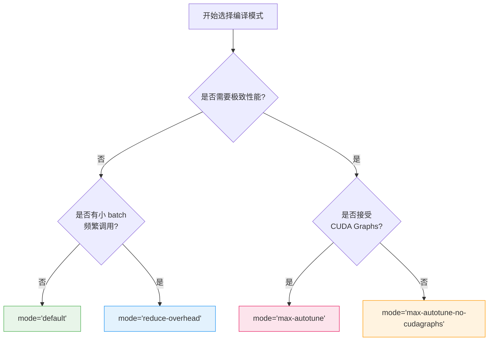
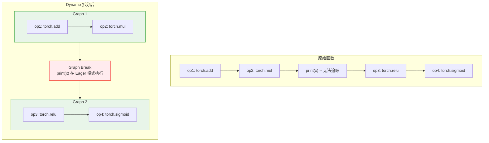
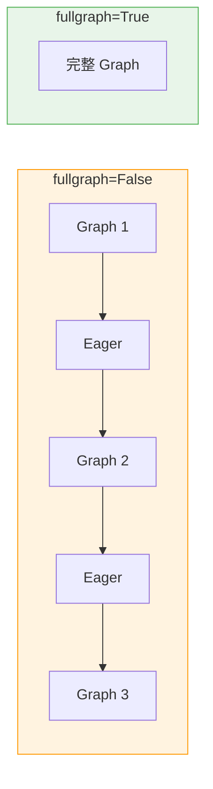

> TorchDynamo 是 PyTorch 2.x 编译器栈的前端，它通过 Python 帧求值钩子（frame evaluation hook）在运行时捕获 PyTorch 操作图，交由后端编译器进行优化，在不改变用户代码语义的前提下实现显著的性能提升。

---

## 1. 概述

### 1.1 本文在整体架构中的位置

TorchDynamo 是 `torch.compile()` 背后的核心引擎。当用户调用 `torch.compile(model)` 时，实际调用链如下：

```
torch.compile() -> torch._dynamo.optimize() -> eval_frame 注册帧求值钩子 -> 运行时捕获 FX Graph -> 后端编译
```

在 PyTorch 编译器栈中，Dynamo 位于最前端，负责**图捕获**（graph capture）这一关键步骤：


### 1.2 本文目标

本教程面向 PyTorch 初学者，介绍以下内容：

- Eager 模式的局限性与编译优化的动机
- `torch.compile()` 的基本用法与各编译模式
- 如何用 `torch._dynamo.explain()` 理解编译过程
- Graph Break 的概念、成因及其对性能的影响
- 一个可运行的性能对比示例

---

## 2. 前置知识

| 知识点 | 说明 | 重要程度 |
|--------|------|----------|
| Python 基础 | 函数、装饰器、上下文管理器 | 必须 |
| PyTorch 基础 | `torch.Tensor` 操作、`nn.Module` 定义 | 必须 |
| FX Graph | `torch.fx.GraphModule` 的基本概念 | 建议了解 |
| CUDA 基础 | GPU 执行模型、CUDA stream | 有助于理解性能优化 |

---

## 3. Eager 模式的局限性

### 3.1 什么是 Eager 模式

PyTorch 默认以 Eager 模式执行：每个算子在 Python 层逐条派发到 C++ 后端执行。这种模式调试友好，但存在以下性能瓶颈：



### 3.2 Eager 模式的三大瓶颈

| 瓶颈 | 说明 | 编译模式的对策 |
|-------|------|----------------|
| **Python 开销** | 每个算子都经过 Python 解释器派发，产生大量 Python 帧调用 | 将多个算子捕获为一张图，一次性执行 |
| **算子融合缺失** | 逐元素操作（pointwise ops）各自独立启动 GPU kernel | Inductor 后端将可融合的算子合并为单个 Triton kernel |
| **内存带宽浪费** | 中间张量反复写入/读取显存 | 融合后中间结果保留在寄存器或共享内存中 |

---

## 4. torch.compile() 基本用法

### 4.1 公共 API 入口

`torch.compile()` 定义在 `torch/__init__.py`（第 2572 行），其函数签名如下：

```python
def compile(
    model: Callable | None = None,
    *,
    fullgraph: bool = False,
    dynamic: bool | None = None,
    backend: str | Callable = "inductor",
    mode: str | None = None,
    options: dict | None = None,
    disable: bool = False,
) -> Callable:
```

在内部，`torch.compile()` 最终调用 `torch._dynamo.optimize()`（`torch/_dynamo/eval_frame.py` 第 1463 行），后者是 TorchDynamo 的真正入口：

```python
# torch/__init__.py 第 2758 行
return torch._dynamo.optimize(
    backend=backend,
    nopython=fullgraph,
    dynamic=dynamic,
    disable=disable,
    guard_filter_fn=guard_filter_fn,
)(model)
```

### 4.2 调用链全景



### 4.3 三种使用方式

```python
import torch

# 方式一：装饰器
@torch.compile
def fn_a(x):
    return torch.sin(x) + torch.cos(x)

# 方式二：显式调用
def fn_b(x):
    return torch.sin(x) + torch.cos(x)

compiled_fn_b = torch.compile(fn_b)

# 方式三：编译 nn.Module
model = torch.nn.Linear(128, 64)
compiled_model = torch.compile(model)
```

---

## 5. 编译模式详解

### 5.1 mode 参数

`torch.compile()` 提供四种预设模式，通过 `mode` 参数指定。每种模式对应 Inductor 后端的一组配置项，可通过 `torch._inductor.list_mode_options(mode)` 查看。

在 `torch/__init__.py` 第 2389 行，`_TorchCompileInductorWrapper` 类负责将 mode 转换为 Inductor 配置：

```python
class _TorchCompileInductorWrapper:
    def apply_mode(self, mode: str | None):
        if mode and mode != "default":
            from torch._inductor import list_mode_options
            self.apply_options(list_mode_options(mode, self.dynamic))
```

### 5.2 模式对比

| 模式 | 编译耗时 | 运行速度 | 内存占用 | 适用场景 |
|------|----------|----------|----------|----------|
| `"default"` | 中等 | 较快 | 基准 | 通用场景，平衡编译成本与性能 |
| `"reduce-overhead"` | 中等 | 更快 | 较高 | 小 batch、频繁调用，通过 CUDA Graphs 减少 Python 开销 |
| `"max-autotune"` | 较长 | 最快 | 较高 | 追求极致性能，自动调优矩阵乘法、启用 CUDA Graphs |
| `"max-autotune-no-cudagraphs"` | 较长 | 快 | 基准 | 自动调优但不使用 CUDA Graphs（避免内存池限制） |

```python
# 使用不同模式
model = torch.nn.Sequential(
    torch.nn.Linear(1024, 512),
    torch.nn.ReLU(),
    torch.nn.Linear(512, 256),
)

compiled_default = torch.compile(model, mode="default")
compiled_ro = torch.compile(model, mode="reduce-overhead")
compiled_ma = torch.compile(model, mode="max-autotune")
```

### 5.3 模式选择决策流程



### 5.4 后端（backend）概览

除了默认的 `inductor` 后端，Dynamo 还支持多种后端。可通过以下方式查看：

```python
# 查看稳定后端
torch._dynamo.list_backends()
# 查看所有后端（含实验性后端）
torch._dynamo.list_backends(None)
```

后端注册机制在 `torch/_dynamo/backends/registry.py`（第 138 行）中实现，支持通过 Python entry_points 注册第三方后端。

---

## 6. Graph Break - 图中断

### 6.1 什么是 Graph Break

TorchDynamo 尝试将用户函数中的 PyTorch 操作捕获为一张完整的 FX Graph。当遇到无法被追踪的 Python 语句时，Dynamo 被迫中断当前图，产生 **Graph Break**。图中断会将一个函数拆分为多个子图：



### 6.2 常见 Graph Break 原因

| 原因 | 示例 | 替代方案 |
|------|------|----------|
| **调用 print** | `print(tensor)` | 删除或使用日志模块 |
| **pdb 断点** | `import pdb; pdb.set_trace()` | 编译前移除断点 |
| **不支持的内置函数** | 某些 Python 内置函数 | 查看 Dynamo 支持列表 |
| **数据依赖的控制流** | `if tensor.item() > 0:` | 使用 `torch.where` 或 `torch.cond` |
| **动态 Python 特性** | `setattr(module, name, val)` 等动态操作 | 使用静态属性 |
| **不兼容的第三方库** | 调用未被 Dynamo 追踪的外部库 | 使用 `torch._dynamo.allow_in_graph` |

Graph Break 相关的异常处理定义在 `torch/_dynamo/exc.py`（第 472 行），允许回退到 eager 执行的异常包括 `DataDependentOutputException`、`DynamicOutputShapeException` 等。

### 6.3 手动插入 Graph Break

在调试或特殊场景下，可使用 `torch._dynamo.graph_break()` 手动中断图（`torch/_dynamo/decorators.py` 第 597 行）：

```python
def my_function(x):
    y = torch.sin(x)
    torch._dynamo.graph_break()  # 强制中断
    z = torch.cos(y)
    return z
```

---

## 7. fullgraph=True 模式

### 7.1 作用

当设置 `fullgraph=True` 时，Dynamo 要求整个函数必须被完整捕获为单张图，任何 Graph Break 都会抛出异常。这对应 `torch._dynamo.optimize()` 中的 `nopython=True` 参数。

在 `torch/_dynamo/eval_frame.py`（第 1542 行），当 `nopython=True` 时会调用 `optimize_assert`：

```python
if nopython and not config.debug_force_graph_break_on_leaf_return:
    return optimize_assert(
        backend,
        dynamic=dynamic,
        hooks=hooks,
        rebuild_ctx=rebuild_ctx,
        package=package,
    )
```

### 7.2 使用场景

```python
# 确保无 Graph Break，适用于性能关键路径
@torch.compile(fullgraph=True)
def critical_path(x, weight):
    return torch.nn.functional.linear(x, weight).relu()

# 如果函数内有 print 等不可追踪操作，fullgraph=True 会报错
@torch.compile(fullgraph=True)
def will_fail(x):
    print("debug")  # 这里会导致编译错误
    return x + 1
```

### 7.3 fullgraph 的价值



`fullgraph=True` 的优势：

- 后端编译器能看到完整的操作序列，做出更好的优化决策（算子融合、内存规划）
- 避免图与 eager 之间频繁切换带来的开销
- 在 `reduce-overhead` 模式下能更有效地利用 CUDA Graphs

---

## 8. torch._dynamo.explain() 编译诊断

### 8.1 工作原理

`torch._dynamo.explain()` 定义在 `torch/_dynamo/eval_frame.py`（第 1592 行），它对函数进行一次试编译，收集所有子图和 Graph Break 信息，返回一个 `ExplainOutput` 对象。

内部实现使用一个累积式编译器 `dynamo_graph_accumulating_compiler`，每次产生新的子图时都记录下来：

```python
def explain(f, *extra_args, **extra_kwargs):
    def inner(*args, **kwargs):
        graphs = []
        break_reasons = []
        op_count = 0
        ops_per_graph = []

        def dynamo_graph_accumulating_compiler(gm, example_inputs):
            # 累积每个子图的信息
            ...
            return gm.forward

        opt_f = optimize(
            dynamo_graph_accumulating_compiler,
            nopython=False,
            guard_export_fn=guard_export_print,
        )(f)
        opt_f(*args, **kwargs)

        return ExplainOutput(
            graphs, graph_count, graph_break_count,
            break_reasons, op_count, ops_per_graph,
            out_guards, compile_time,
        )
    return inner
```

### 8.2 ExplainOutput 结构

`ExplainOutput` 类定义在 `torch/_dynamo/backends/debugging.py`（第 537 行），包含以下字段：

| 字段 | 类型 | 说明 |
|------|------|------|
| `graphs` | `list[GraphModule]` | 捕获到的所有子图 |
| `graph_count` | `int` | 子图总数 |
| `graph_break_count` | `int` | Graph Break 数量（= graph_count - 1） |
| `break_reasons` | `list[GraphCompileReason]` | 每次 Graph Break 的原因 |
| `op_count` | `int` | 所有子图中的算子总数 |
| `ops_per_graph` | `list[list[Target]]` | 每个子图包含的算子列表 |
| `out_guards` | `list[Guard]` | 编译时生成的守卫条件 |
| `compile_times` | `str` | 编译耗时统计 |

### 8.3 使用示例

```python
import torch

def my_model(x):
    y = torch.sin(x)
    print("intermediate:", y.shape)  # 会导致 Graph Break
    z = torch.cos(y)
    return z

explanation = torch._dynamo.explain(my_model)(torch.randn(8, 8))
print(explanation)
# 输出：
# Graph Count: 2
# Graph Break Count: 1
# Op Count: 2
# Break Reasons:
#   Break Reason 1:
#     Reason: builtin: print ...
```

---

## 9. 核心配置项

TorchDynamo 的配置系统定义在 `torch/_dynamo/config.py` 中。以下是入门阶段最常用的配置项：

| 配置项 | 默认值 | 说明 | 源码位置 |
|--------|--------|------|----------|
| `recompile_limit` | `8` | 同一代码对象的最大重编译次数 | `config.py` 第 94 行 |
| `verbose` | `False` | 打印完整堆栈信息 | `config.py` 第 37 行 |
| `verify_correctness` | `False` | 验证编译后输出的正确性 | `config.py` 第 40 行 |
| `assume_static_by_default` | `True` | 默认将形状视为静态 | `config.py` 第 145 行 |
| `automatic_dynamic_shapes` | `True` | 自动检测动态形状并重编译 | `config.py` 第 151 行 |
| `replay_side_effects` | `True` | 图执行后重放 Python 副作用 | `config.py` 第 78 行 |

使用 `torch._dynamo.config.patch` 可以临时修改配置：

```python
# 作为上下文管理器
with torch._dynamo.config.patch(verbose=True):
    compiled_fn(x)

# 作为装饰器
@torch._dynamo.config.patch(recompile_limit=2)
def test_something():
    ...
```

---

## 10. 实战示例

### 10.1 基础编译示例

```python
import torch
import torch.nn as nn

class SimpleModel(nn.Module):
    def __init__(self):
        super().__init__()
        self.fc1 = nn.Linear(784, 256)
        self.fc2 = nn.Linear(256, 128)
        self.fc3 = nn.Linear(128, 10)

    def forward(self, x):
        x = torch.relu(self.fc1(x))
        x = torch.relu(self.fc2(x))
        x = self.fc3(x)
        return x

model = SimpleModel().cuda()
x = torch.randn(32, 784, device="cuda")

# 编译模型
compiled_model = torch.compile(model)

# 首次调用触发编译
output = compiled_model(x)
print(f"Output shape: {output.shape}")  # torch.Size([32, 10])
```

### 10.2 使用 explain 进行诊断

```python
import torch

def model_with_breaks(x):
    y = torch.sin(x) + torch.cos(x)
    # 数据依赖的控制流会导致 Graph Break
    if y.sum().item() > 0:
        z = y * 2
    else:
        z = y * 3
    return torch.relu(z)

x = torch.randn(4, 4)
explanation = torch._dynamo.explain(model_with_breaks)(x)
print(explanation)
# 查看 Graph Break 数量和原因
print(f"共 {explanation.graph_count} 个子图, "
      f"{explanation.graph_break_count} 次 Graph Break")
```

### 10.3 性能对比基准

```python
import torch
import torch.nn as nn
import time

class TransformerBlock(nn.Module):
    def __init__(self, d_model=512, nhead=8):
        super().__init__()
        self.attn = nn.MultiheadAttention(d_model, nhead, batch_first=True)
        self.norm1 = nn.LayerNorm(d_model)
        self.norm2 = nn.LayerNorm(d_model)
        self.ffn = nn.Sequential(
            nn.Linear(d_model, 2048),
            nn.GELU(),
            nn.Linear(2048, d_model),
        )

    def forward(self, x):
        attn_out, _ = self.attn(x, x, x)
        x = self.norm1(x + attn_out)
        x = self.norm2(x + self.ffn(x))
        return x

device = "cuda" if torch.cuda.is_available() else "cpu"
model = TransformerBlock().to(device)
x = torch.randn(16, 128, 512, device=device)

def benchmark(fn, x, warmup=10, repeat=100):
    """简单的计时基准函数"""
    # 预热
    for _ in range(warmup):
        fn(x)
    if device == "cuda":
        torch.cuda.synchronize()

    start = time.perf_counter()
    for _ in range(repeat):
        fn(x)
    if device == "cuda":
        torch.cuda.synchronize()
    elapsed = time.perf_counter() - start
    return elapsed / repeat * 1000  # 转换为毫秒

# Eager 基准
eager_time = benchmark(model, x)
print(f"Eager:              {eager_time:.3f} ms")

# torch.compile default 模式
compiled_default = torch.compile(model, mode="default")
default_time = benchmark(compiled_default, x)
print(f"Compiled (default): {default_time:.3f} ms")

# torch.compile reduce-overhead 模式
torch._dynamo.reset()
compiled_ro = torch.compile(model, mode="reduce-overhead")
ro_time = benchmark(compiled_ro, x)
print(f"Compiled (reduce):  {ro_time:.3f} ms")

# torch.compile max-autotune 模式
torch._dynamo.reset()
compiled_ma = torch.compile(model, mode="max-autotune")
ma_time = benchmark(compiled_ma, x)
print(f"Compiled (max-at):  {ma_time:.3f} ms")

print(f"\n加速比 (default):       {eager_time / default_time:.2f}x")
print(f"加速比 (reduce-overhead): {eager_time / ro_time:.2f}x")
print(f"加速比 (max-autotune):    {eager_time / ma_time:.2f}x")
```

### 10.4 fullgraph 模式实战

```python
import torch

# 一个可以完整捕获的函数
@torch.compile(fullgraph=True, backend="inductor")
def clean_function(x, weight):
    h = torch.nn.functional.linear(x, weight)
    h = torch.nn.functional.gelu(h)
    return h.sum()

x = torch.randn(32, 128, device="cuda")
w = torch.randn(64, 128, device="cuda")
result = clean_function(x, w)
print(f"fullgraph 编译成功, result = {result.item():.4f}")

# 验证 fullgraph 模式下 Graph Break 会报错
try:
    @torch.compile(fullgraph=True)
    def broken_function(x):
        print("this will cause an error")
        return x + 1

    broken_function(torch.randn(4))
except Exception as e:
    print(f"预期的错误: {type(e).__name__}")
```

---

## 11. 小结

| 要点 | 说明 |
|------|------|
| **torch.compile 的作用** | 通过 TorchDynamo 捕获 PyTorch 操作图，交由 Inductor 等后端编译优化，减少 Python 开销并启用算子融合 |
| **入口函数调用链** | `torch.compile()` -> `torch._dynamo.optimize()` -> `OptimizeContext` -> C 层 `set_eval_frame` |
| **四种编译模式** | `default`（均衡）、`reduce-overhead`（减少调度开销）、`max-autotune`（极致性能）、`max-autotune-no-cudagraphs` |
| **Graph Break** | Dynamo 遇到无法追踪的 Python 代码时中断图捕获；使用 `explain()` 可诊断中断原因 |
| **fullgraph=True** | 要求完整捕获函数为单张图，有 Graph Break 则报错；适用于性能关键路径 |
| **explain() 的价值** | 诊断编译过程，了解子图数量、Graph Break 原因、算子分布，指导代码优化 |
| **配置系统** | `torch._dynamo.config` 控制重编译限制、动态形状策略等，使用 `config.patch` 临时修改 |

---

## 12. 延伸阅读

| 主题 | 链接 / 文件 |
|------|-------------|
| PyTorch Compiler 官方教程 | [torch.compiler Tutorial](https://pytorch.org/tutorials/intermediate/torch_compile_tutorial.html) |
| TorchDynamo 深入源码 | `torch/_dynamo/eval_frame.py` - 帧求值核心逻辑 |
| Inductor 后端 | `torch/_inductor/` 目录 |
| AOTAutograd | `torch/_functorch/aot_autograd.py` |
| Graph Break 注册表 | `torch/_dynamo/exc.py` 中的 `format_graph_break_message` |
| Dynamo 配置详解 | `torch/_dynamo/config.py` |
| 后端注册机制 | `torch/_dynamo/backends/registry.py` |
| 编译器自定义后端指南 | [Custom Backends](https://pytorch.org/docs/main/user_guide/torch_compiler/torch.compiler_custom_backends.html) |
