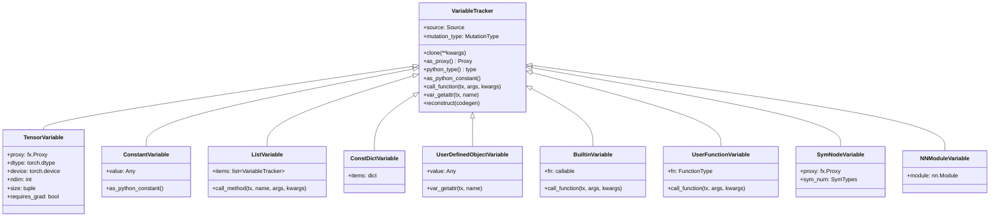

> *"Dynamo 的核心在于：将 Python 的动态字节码执行过程，转化为一张静态的 FX 计算图。"*

---

## 1. 概述

TorchDynamo 的编译流程中，**符号执行**（Symbolic Execution）是最关键的阶段。当 `torch.compile` 捕获到一个 Python 帧时，Dynamo 并不会真正执行这些字节码，而是通过 `InstructionTranslator` 逐条**模拟**字节码的执行过程。在模拟过程中，所有的值都用 `VariableTracker` 的子类来表示（例如 `TensorVariable` 表示张量、`ConstantVariable` 表示常量），所有对张量的操作会被记录到 `OutputGraph` 持有的 FX 图中，而对 Python 对象的副作用修改则由 `SideEffects` 负责追踪。

本文将深入分析以下四大核心组件：

| 组件 | 源文件 | 核心职责 |
|------|--------|----------|
| `InstructionTranslator` | `torch/_dynamo/symbolic_convert.py` | 符号化字节码解释器，逐条处理指令 |
| `VariableTracker` 层次体系 | `torch/_dynamo/variables/*.py` | 表示符号化的值，构成符号栈和符号局部变量 |
| `OutputGraph` | `torch/_dynamo/output_graph.py` | 累积 FX 图节点，管理编译和 guard 收集 |
| `SideEffects` | `torch/_dynamo/side_effects.py` | 追踪副作用（对象突变），保证编译正确性 |


---

## 2. 前置知识

### 2.1 Python 字节码基础

Python 源码在执行前会被编译为字节码指令序列。每条指令由操作码（opcode）和可选参数组成。可以使用 `dis` 模块查看：

```python
import dis

def example(x, y):
    return x + y

dis.dis(example)
#  LOAD_FAST    0 (x)
#  LOAD_FAST    1 (y)
#  BINARY_ADD
#  RETURN_VALUE
```

Dynamo 关心的核心字节码类别：

| 类别 | 典型指令 | 说明 |
|------|---------|------|
| 加载/存储 | `LOAD_FAST`, `STORE_FAST`, `LOAD_GLOBAL` | 操作局部变量、全局变量 |
| 运算 | `BINARY_ADD`, `BINARY_OP`, `COMPARE_OP` | 二元/一元运算 |
| 函数调用 | `CALL_FUNCTION`, `CALL` (3.11+) | 调用函数 |
| 控制流 | `JUMP_FORWARD`, `POP_JUMP_IF_TRUE` | 条件跳转、循环 |
| 返回 | `RETURN_VALUE`, `RETURN_CONST` (3.12+) | 函数返回 |

### 2.2 FX 图简介

`torch.fx.Graph` 是 PyTorch 的中间表示（IR），由一系列 `Node` 组成。每个 `Node` 有以下关键属性：

- `op` - 操作类型：`placeholder`（输入）、`call_function`（函数调用）、`output`（输出）等
- `target` - 具体的调用目标（如 `torch.add`）
- `args`, `kwargs` - 参数

Dynamo 的目标就是将 Python 字节码中的张量操作转化为这种 FX 图表示。

---

## 3. InstructionTranslator - 符号化字节码解释器

### 3.1 类层次结构


**`BytecodeDispatchTableMeta`**（元类）在类创建时为每个子类安装一个 `dispatch_table`，这是一个 256 项的列表，将 opcode 直接映射到对应的处理方法。这种设计避免了运行时字符串查找，显著提高了分发效率：

```python
# torch/_dynamo/symbolic_convert.py - BytecodeDispatchTableMeta.__init__
dispatch_table = {
    op: getattr(cls, opname, functools.partial(_missing, opname))
    for opname, op in dis.opmap.items()
}
cls.dispatch_table = [dispatch_table.get(i) for i in range(2**8)]
```

### 3.2 核心状态

`InstructionTranslatorBase` 维护的关键状态如下：

```
InstructionTranslatorBase
  |
  |-- output: OutputGraph            # 持有 FX 图、side_effects、编译入口
  |-- symbolic_locals: dict          # 符号化的局部变量表 (name -> VariableTracker)
  |-- symbolic_globals: dict         # 符号化的全局变量表
  |-- stack: list[VariableTracker]   # 符号化的操作数栈
  |-- instructions: list[Instruction]# 待处理的字节码指令序列
  |-- instruction_pointer: int       # 当前指令位置
  |-- block_stack: list              # 异常处理/with 块栈
  |-- inline_depth: int              # 当前内联深度
  |-- current_speculation            # 投机执行状态（用于 graph break 回滚）
```

其中 `symbolic_locals` 和 `stack` 是最重要的两个数据结构。它们共同构成了对 CPython 执行状态的符号化镜像。

### 3.3 主循环 - `step()` 和 `run()`

`run()` 方法是入口，它在循环中反复调用 `step()` 直到返回 `False`：

```python
# torch/_dynamo/symbolic_convert.py - InstructionTranslatorBase.run()
def run(self) -> None:
    with self.run_ctx_mgr():
        self.output.push_tx(self)
        self.start_point = self.instruction_pointer
        while self.step():
            pass
```

`step()` 方法处理单条指令，其核心逻辑如下：


关键分发逻辑只有一行代码：

```python
self.dispatch_table[inst.opcode](self, inst)
```

这里 `dispatch_table` 是由元类 `BytecodeDispatchTableMeta` 预计算的 opcode 到方法的映射表。例如 `LOAD_FAST` 对应 `self.LOAD_FAST(inst)`，`CALL` 对应 `self.CALL(inst)`。

### 3.4 核心指令处理器

#### 3.4.1 LOAD_FAST / STORE_FAST - 局部变量访问

```python
# torch/_dynamo/symbolic_convert.py
def LOAD_FAST(self, inst: Instruction) -> None:
    name = inst.argval
    self.push(self.symbolic_locals[name].unwrap())

def STORE_FAST(self, inst: Instruction) -> None:
    name = inst.argval
    loaded_vt = self.pop()
    loaded_vt.set_name_hint(name)
    self.symbolic_locals[name] = loaded_vt
```

`LOAD_FAST` 从 `symbolic_locals` 字典中取出对应名称的 `VariableTracker` 并压入符号栈。`STORE_FAST` 则从栈顶弹出并存回 `symbolic_locals`。这与 CPython 的行为完全对称——只是操作的是符号值而非实际值。

#### 3.4.2 CALL / CALL_FUNCTION - 函数调用

函数调用是最复杂的指令之一。Python 3.11+ 使用 `CALL` 指令：

```python
# torch/_dynamo/symbolic_convert.py
def _call(self, inst: Instruction, call_kw: bool = False) -> None:
    contents = self.popn(inst.arg + 2)
    fn = contents[0]           # 被调用的函数 (VariableTracker)
    args = contents[2:]        # 位置参数
    kwargs = {}                # 关键字参数（如果有）
    self.call_function(fn, args, kwargs)
```

`call_function` 会调用 `fn.call_function(self, args, kwargs)`，根据 `fn` 的具体类型分发到不同的处理逻辑：

- 如果 `fn` 是 `TorchVariable`（如 `torch.add`），会通过 `OutputGraph.create_proxy()` 在 FX 图中创建节点
- 如果 `fn` 是 `UserFunctionVariable`（用户函数），会通过 `InliningInstructionTranslator.inline_call()` 内联追踪
- 如果 `fn` 是 `BuiltinVariable`（如 `len`、`print`），会尝试符号化求值或触发 graph break

#### 3.4.3 BINARY_OP - 二元运算

Python 3.11+ 统一使用 `BINARY_OP` 指令，通过 `inst.arg` 区分具体的运算符：

```python
def BINARY_OP(self, inst: Instruction) -> None:
    assert inst.arg is not None
    return _binary_op_lookup[inst.arg](self, inst)
```

其中 `_binary_op_lookup` 是一个预构建的表，将运算编号映射到如 `BINARY_ADD`、`BINARY_MULTIPLY` 等对应的处理方法。

#### 3.4.4 RETURN_VALUE - 函数返回与编译触发

`RETURN_VALUE` 是触发编译的关键时刻。`InstructionTranslator._return()` 的核心逻辑：

```python
def _return(self, inst: Instruction) -> None:
    # 如果图中没有任何 op 且不强制编译，则跳过当前帧
    if not config.allow_empty_graphs and self.output.count_calls() == 0:
        raise exc.SkipFrame(...)

    self.instruction_pointer = None  # 标记执行结束
    # 触发子图编译
    self.output.compile_subgraph(
        self,
        reason=GraphCompileReason("return_value", ...),
        stack_pops=1,
    )
    raise ReturnValueOp  # 通过异常退出 step() 循环
```

### 3.5 投机执行与 Graph Break

当符号执行遇到无法处理的情况时（如调用无法追踪的 C 扩展函数），Dynamo 需要执行 **graph break**——将已经追踪到的部分编译为一个子图，然后让剩余代码回退到 Python 解释器执行。


投机执行的核心思想是：在栈为空时（这些位置是安全的分割点），Dynamo 会保存当前状态作为检查点。如果后续遇到 graph break，可以回滚到最近的检查点，将之前已追踪的部分编译出来，并生成**恢复函数**（resume function）来继续执行剩余代码。

---

## 4. VariableTracker 层次体系

### 4.1 设计理念

`VariableTracker` 是 Dynamo 中所有符号值的基类。它在符号执行过程中替代了真实的 Python 对象，每个子类负责模拟对应 Python 类型的行为。

> 源文件：`torch/_dynamo/variables/base.py`

```python
class VariableTracker(metaclass=VariableTrackerMeta):
    """
    Base class for tracked locals and stack values.
    VariableTracker instances are immutable and should be copied
    in order to change them.
    """
    _nonvar_fields = {"value", "guards", "source", "mutation_type", ...}
```

每个 `VariableTracker` 实例拥有以下关键属性：

| 属性 | 类型 | 说明 |
|------|------|------|
| `source` | `Source` | 追踪该值的来源（用于 guard 生成） |
| `mutation_type` | `MutationType` | 标记值的可变性和来源（新/旧） |

### 4.2 类继承体系



### 4.3 TensorVariable - FX 图节点的桥梁

`TensorVariable` 是整个体系中最重要的子类。它通过持有一个 `torch.fx.Proxy` 对象，将对张量的操作映射到 FX 图的节点创建。

> 源文件：`torch/_dynamo/variables/tensor.py`

```python
class TensorVariable(VariableTracker):
    """A torch.Tensor input or an intermediate value in the FX graph"""

    def __init__(self, proxy: torch.fx.Proxy, *, dtype, device, layout,
                 ndim, requires_grad, ...):
        self.proxy = proxy
        self.dtype = dtype
        self.device = device
        self.ndim = ndim
        # ...
```

当一个 `TensorVariable` 参与运算时（如 `x + y`），其 `call_function` 逻辑最终会调用 `OutputGraph.create_proxy()` 来在 FX 图中创建一个 `call_function` 节点，并返回一个新的 `TensorVariable` 包裹新生成的 Proxy。


`TensorVariable` 还缓存了大量元数据（dtype, device, ndim, size, stride 等），这些信息从 `FakeTensor` 上提取。这使得很多属性查询（如 `x.dtype`、`x.shape`）可以直接在编译期求值，不需要插入 FX 节点。

### 4.4 ConstantVariable - 常量传播

`ConstantVariable` 直接持有一个 Python 常量值。它支持 `as_python_constant()` 方法返回真实值，这使得 Dynamo 可以在编译期进行**常量折叠**。

```python
class ConstantVariable(VariableTracker):
    def __init__(self, value, **kwargs):
        super().__init__(**kwargs)
        self.value = value

    def as_python_constant(self):
        return self.value
```

例如，`if x.dtype == torch.float32:` 中的 `torch.float32` 是一个 `ConstantVariable`，Dynamo 可以在编译期决定分支走向，不需要在图中表示。

### 4.5 MutationType 系统 - 突变追踪标记

每个 `VariableTracker` 的 `mutation_type` 属性决定了 Dynamo 如何处理对该值的修改。这是一个精巧的两维分类：


**"New" vs "Existing"** 的区别至关重要：

- **New**（`scope >= 1`）：值在 Dynamo 追踪过程中创建。如果该值没有逃逸到 Python 世界，其突变可以被优化掉
- **Existing**（`scope == 0`）：值在 Dynamo 追踪开始之前就存在。对其的突变必须在图执行后通过 `SideEffects` 回放

**"Value" vs "Attribute"** 的区别：

- **ValueMutation**：值本身可以被替换（如列表的 `append`、`clear` 等操作）
- **AttributeMutation**：对象的属性可以被修改（如 `obj.x = 5`）

---

## 5. OutputGraph - FX 图的构建中枢

### 5.1 职责概览

`OutputGraph` 是一个 1:1 与处理帧对应的管理器，职责包括：

1. **FX 图构建** - 通过 `SubgraphTracer` 创建 proxy 和节点
2. **编译触发** - `compile_subgraph()` 将图交给后端编译器
3. **Guard 管理** - 收集和安装运行时 guard
4. **副作用管理** - 持有 `SideEffects` 实例
5. **代码生成** - 输出修改后的字节码

> 源文件：`torch/_dynamo/output_graph.py`

### 5.2 核心结构

```python
class OutputGraph(OutputGraphCommon):
    """
    Wrapper class to hold outputs of InstructionTranslator.
    Mainly the generated fx.Graph.
    """
    side_effects: SideEffects

    def __init__(self, code_options, compiler_fn, root_tx, export, ...):
        self.tracers = [SubgraphTracer(self, is_export=export)]
        self.input_source_to_var: dict[Source, VariableTracker] = {}
        self.side_effects = SideEffects(self)
        self.variable_tracker_cache: dict[Source, VariableTracker] = {}
        self.code_options = dict(code_options)
        self.output_instructions: list[Instruction] = []
        self.compiler_fn = compiler_fn
        self.root_tx = root_tx
        # ...
```

### 5.3 create_proxy - 创建 FX 节点

`OutputGraph.create_proxy()` 是创建 FX 图节点的核心入口。它委托给当前的 `SubgraphTracer`：

```python
# OutputGraph
def create_proxy(self, *args, **kwargs) -> torch.fx.Proxy:
    return self.current_tracer.create_proxy(*args, **kwargs)
```

`SubgraphTracer.create_proxy()` 的核心逻辑：

```python
# SubgraphTracer._create_proxy()
def _create_proxy(self, kind, target, args, kwargs, name=None, ...):
    # 如果在嵌套 HOP 中，需要将自由变量提升为子图输入
    if self.parent is not None:
        flat_args, tree_spec = pytree.tree_flatten((args, kwargs))
        new_flat_args = [
            self.maybe_lift_tracked_freevar_to_input(arg)
            for arg in flat_args
        ]
        args, kwargs = pytree.tree_unflatten(new_flat_args, tree_spec)

    rv = super().create_proxy(kind, target, args, kwargs, name, ...)
    return rv
```

### 5.4 compile_subgraph - 编译触发

当遇到 `RETURN_VALUE` 或 graph break 时，`compile_subgraph()` 被调用。这是从符号执行过渡到实际编译的桥梁：


### 5.5 call_user_compiler - 调用后端编译器

```python
def call_user_compiler(self, gm: fx.GraphModule,
                        example_inputs: list[Tensor]) -> CompiledFn:
    compiled_fn = compiler_fn(gm, example_inputs)
    assert callable(compiled_fn), "compiler_fn did not return callable"
    return compiled_fn
```

这里的 `compiler_fn` 就是用户通过 `torch.compile(backend=...)` 指定的后端。对于默认的 `inductor` 后端，这将触发整个 Inductor 编译流水线（lowering、调度、代码生成）。

---

## 6. SideEffects - 副作用追踪

### 6.1 问题背景

Python 代码在执行过程中经常会修改对象的状态——修改列表、设置对象属性、修改全局变量等。当 Dynamo 将一段代码编译为 FX 图时，图只包含张量操作，那些对 Python 对象的修改必须在图执行后被**回放**，否则程序语义就会不正确。

`SideEffects` 类正是负责记录和回放这些修改。

> 源文件：`torch/_dynamo/side_effects.py`

### 6.2 核心数据结构

```python
class SideEffects:
    id_to_variable: dict[int, VariableTracker]
    # 记录对象属性的修改：object -> {attr_name -> new_value}
    store_attr_mutations: dict[VariableTracker, dict[str, VariableTracker]]
    keepalive: list[Any]  # 保持引用活跃
    tensor_hooks: dict[...]  # 张量钩子追踪
    save_for_backward: list[...]  # autograd save_for_backward 追踪
```

### 6.3 追踪流程


### 6.4 关键方法

#### track_object_existing - 追踪已有对象

```python
def track_object_existing(self, item, variable):
    return self._track_obj(
        item, variable,
        mutation_type_cls=AttributeMutationExisting,
    )
```

当 Dynamo 开始追踪一个已存在于 Python 世界的对象时（如函数参数 `self`），调用此方法注册该对象。后续对该对象属性的修改都会被 `store_attr` 记录。

#### track_object_new - 追踪新建对象

```python
def track_object_new(self, cls_source, user_cls, variable_cls, options):
    obj = object_new(user_cls)
    variable = variable_cls(
        obj, mutation_type=AttributeMutationNew(cls_source), **options
    )
    self.id_to_variable[id(obj)] = variable
    self.keepalive.append(obj)
    return variable
```

对于在追踪过程中新创建的对象，Dynamo 需要决定：如果这个对象最终会被返回或赋值给外部变量（"逃逸"），则需要在代码生成时重建它；否则可以完全在编译期消除。

#### store_attr - 记录属性修改

```python
def store_attr(self, item, name, value):
    assert self.is_attribute_mutation(item)
    self.check_allowed_side_effect(item)
    if item not in self.store_attr_mutations:
        self.store_attr_mutations[item] = {}
    self.store_attr_mutations[item][name] = value
```

### 6.5 HigherOrderOp 中的作用域安全检查

`SideEffects` 中的 `check_allowed_side_effect` 方法在 HigherOrderOperator（如 `torch.vmap`、`torch.cond`）的上下文中尤为重要。Dynamo 使用 `MutationType.scope` 来追踪变量的创建层级：

- `scope == 0`：变量在 Dynamo 追踪开始前就存在
- `scope == 1`：在顶级作用域中创建
- `scope >= 2`：在嵌套的 HigherOrderOp 中创建

只有在同一作用域内创建的变量才允许被修改，这防止了嵌套 HOP 闭包中对外部变量的不安全修改。

---

## 7. 完整符号执行流程

下面以一个具体的例子串联所有组件：

```python
@torch.compile
def f(x, y):
    z = x + y
    z = z * 2
    return z
```

对应的字节码（Python 3.11+）：

```
LOAD_FAST     x
LOAD_FAST     y
BINARY_OP     ADD
STORE_FAST    z
LOAD_FAST     z
LOAD_CONST    2
BINARY_OP     MULTIPLY
STORE_FAST    z
LOAD_FAST     z
RETURN_VALUE
```


最终生成的 FX 图：

```python
def forward(self, x, y):
    add = operator.add(x, y)
    mul = operator.mul(add, 2)
    return (mul,)
```

---

## 8. 实战示例

### 8.1 带有副作用的函数追踪

```python
class Counter:
    def __init__(self):
        self.count = 0

@torch.compile
def f(x, counter):
    counter.count += 1      # 副作用：修改 Existing 对象属性
    result = x * 2
    return result
```

在这个例子中，`counter` 是一个已存在的 Python 对象。Dynamo 处理流程：

1. `counter` 被包装为 `UserDefinedObjectVariable`，其 `mutation_type` 为 `AttributeMutationExisting`
2. `counter.count += 1` 被 `SideEffects.store_attr(counter_var, "count", new_value)` 记录
3. `x * 2` 正常记录到 FX 图中
4. 编译时，`SideEffects` 在图调用之后生成 `setattr(counter, "count", counter.count + 1)` 的字节码

### 8.2 Graph Break 场景

```python
@torch.compile
def f(x):
    y = x + 1           # 图 1
    print(y.shape)       # graph break: print 不可追踪
    z = y * 2            # 图 2
    return z
```

处理流程：

1. `x + 1` 正常追踪，创建 FX 节点
2. 遇到 `print(y.shape)` 时，`print` 是一个 `BuiltinVariable`，Dynamo 无法将其纳入图中
3. Dynamo 在最近的检查点处触发 `compile_subgraph()`，编译图 1
4. 生成恢复函数（resume function），从 `print(y.shape)` 开始执行
5. 恢复函数再次被 Dynamo 捕获，`y * 2` 被追踪为图 2

### 8.3 调试技巧

使用以下环境变量可以观察 Dynamo 的追踪过程：

```bash
# 查看每条字节码的追踪日志
TORCH_LOGS="+bytecode" python script.py

# 查看生成的 FX 图
TORCH_LOGS="+graph_code" python script.py

# 查看 guard 信息
TORCH_LOGS="+guards" python script.py

# 查看 graph break 原因
TORCH_LOGS="+graph_breaks" python script.py
```

也可以在代码中启用：

```python
import torch._dynamo
import logging

torch._logging.set_logs(bytecode=True, graph_code=True)
```

---

## 9. 小结

本文从源码层面分析了 TorchDynamo 符号执行引擎的四大核心组件：

| 组件 | 核心思想 | 关键入口方法 |
|------|---------|-------------|
| **InstructionTranslator** | 用 dispatch table 逐条模拟字节码 | `step()`, `run()` |
| **VariableTracker** | 以类型化的符号值替代 Python 运行时值 | `call_function()`, `as_proxy()` |
| **OutputGraph** | 通过 Proxy 机制将张量操作记录为 FX 图 | `create_proxy()`, `compile_subgraph()` |
| **SideEffects** | 缓冲对 Python 对象的修改并在图执行后回放 | `store_attr()`, `track_object_*()` |

这四个组件协同工作，使 Dynamo 能够将任意 Python 代码中的张量计算提取为高效可优化的 FX 图，同时保持非张量部分的语义正确性。理解这些组件的交互方式，是深入 PyTorch 编译器开发的基础。


---

## 10. 延伸阅读

### 相关源码文件

| 文件 | 说明 |
|------|------|
| `torch/_dynamo/symbolic_convert.py` | 字节码符号执行主逻辑 |
| `torch/_dynamo/variables/base.py` | VariableTracker 基类和 MutationType 体系 |
| `torch/_dynamo/variables/tensor.py` | TensorVariable - 张量符号表示 |
| `torch/_dynamo/variables/constant.py` | ConstantVariable - 常量值 |
| `torch/_dynamo/variables/lists.py` | ListVariable, TupleVariable 等容器类型 |
| `torch/_dynamo/variables/user_defined.py` | 用户定义对象的符号表示 |
| `torch/_dynamo/variables/builtin.py` | 内建函数的符号处理 |
| `torch/_dynamo/output_graph.py` | FX 图构建和编译管理 |
| `torch/_dynamo/side_effects.py` | 副作用追踪和回放 |
| `torch/_dynamo/guards.py` | Guard 生成和安装 |
| `torch/_dynamo/bytecode_transformation.py` | 字节码变换工具 |
| `torch/_dynamo/codegen.py` | Python 字节码代码生成器 |

### 推荐阅读顺序

1. **入门**：先阅读 `VariableTracker` 基类，理解符号值的抽象
2. **核心**：阅读 `InstructionTranslatorBase.step()` 的主循环
3. **深入**：逐个分析 `LOAD_FAST`、`CALL`、`BINARY_OP` 等处理器
4. **图构建**：研究 `OutputGraph.create_proxy()` 和 `SubgraphTracer` 的交互
5. **正确性**：分析 `SideEffects` 如何保证突变回放的正确性
6. **高阶**：研究 graph break、投机执行和 HigherOrderOperator 处理
