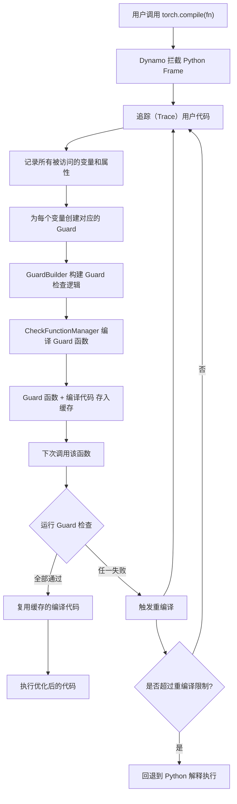
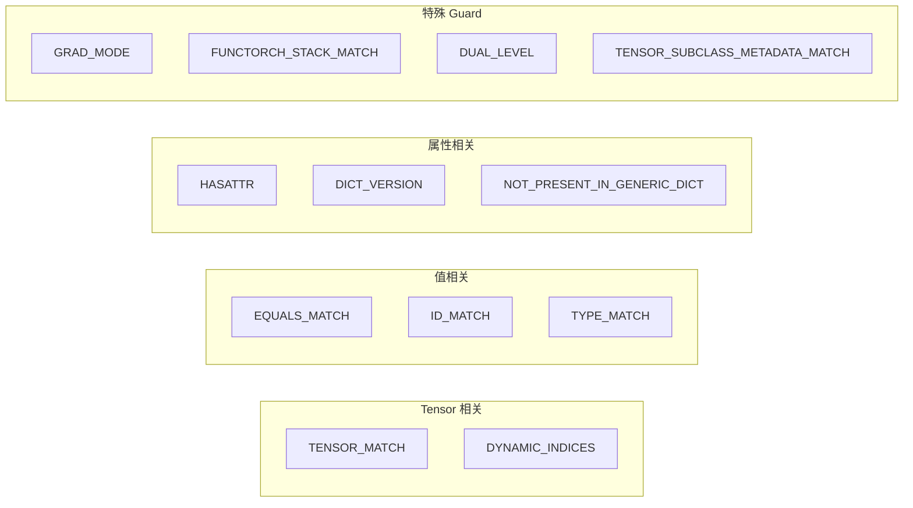
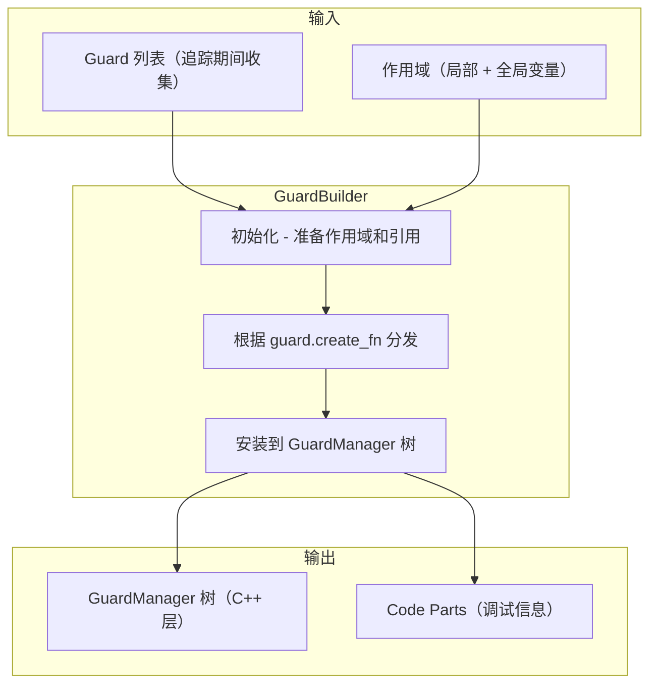
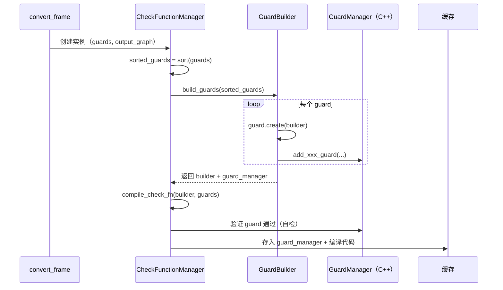
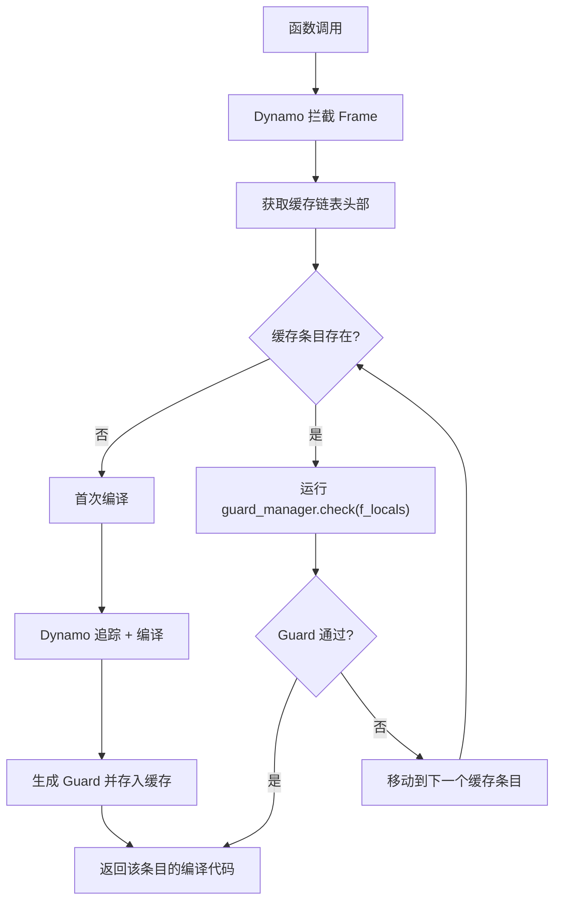
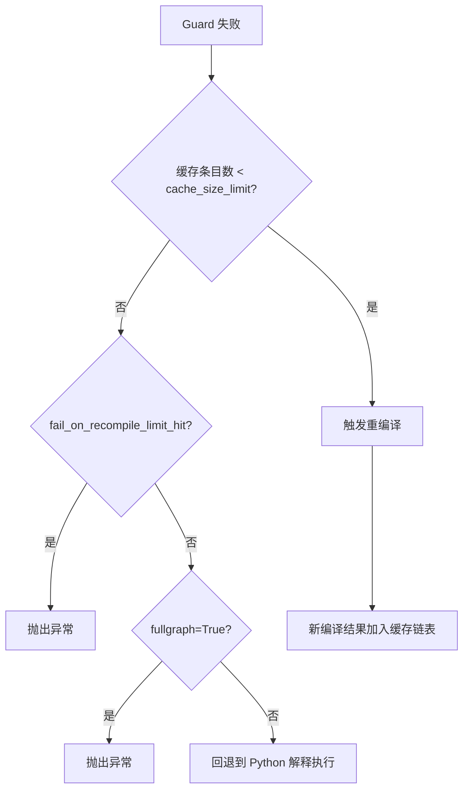
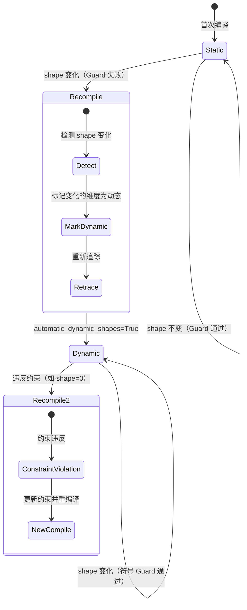

> 编译一次，守护无数次 -- Guard 是 Dynamo 决定"已编译代码是否仍然有效"的核心判定系统。

---

## 1. 概述

PyTorch Dynamo 通过拦截 Python 字节码并将其编译为优化后的计算图来加速模型执行。然而，编译是有代价的：一次编译通常只对**特定的输入条件**有效。如果输入 tensor 的 shape 变了、dtype 变了、甚至一个普通 Python 变量的值变了，之前编译的代码可能就不再正确。

**Guard（守卫）** 就是 Dynamo 用来回答这个问题的机制：

> "当前的输入条件，是否与上次编译时的条件一致？"

每当一个函数被 `torch.compile` 编译后，Dynamo 会为该次编译生成一组 guard 条件。在后续每次调用时，Dynamo 首先检查这些 guard：

- **全部通过** -- 复用已编译的代码（快速路径）
- **任一失败** -- 触发重编译（recompilation），生成新的编译结果和新的 guard

Guard 机制的设计目标是在**正确性**和**性能**之间取得平衡：guard 太松会导致错误结果，guard 太紧则会导致过多的重编译。

```
用户代码                    Dynamo 编译流程
  |                              |
  v                              v
def fn(x, y):              [Trace & 编译]
    return x + y                |
                                v
                          [生成 Guard 集合]
                          - x.shape == (4, 8)
                          - x.dtype == float32
                          - x.device == cuda:0
                          - type(y) == int
                                |
                                v
第二次调用 fn(x2, y2) --> [检查所有 Guard]
                          - x2.shape == (4, 8)?  YES
                          - x2.dtype == float32?  YES
                          - x2.device == cuda:0?  YES
                          - type(y2) == int?      YES
                          --> 全部通过, 复用编译结果!

第三次调用 fn(x3, y3) --> [检查所有 Guard]
                          - x3.shape == (8, 16)?  NO!
                          --> Guard 失败, 触发重编译
```

---

## 2. 前置知识

阅读本文之前，建议先了解以下内容：

| 概念 | 说明 |
|------|------|
| `torch.compile` 基本用法 | 了解如何使用 `torch.compile` 装饰器 |
| Dynamo 追踪流程 | 了解 Dynamo 如何拦截字节码并构建 FX Graph |
| FX Graph | 了解 PyTorch FX 中间表示的基本概念 |
| Python 字节码 | 基本了解 CPython 的 frame 和 code object |

### 2.1 核心源码文件

| 文件路径 | 职责 |
|---------|------|
| `torch/_dynamo/guards.py` | Guard 系统的核心实现，包括 `GuardBuilder`、`CheckFunctionManager` |
| `torch/_guards.py` | Guard 基础类型定义，如 `Guard`、`GuardSource`、`GuardBuilderBase` |
| `torch/_dynamo/mutation_guard.py` | 对象变更追踪，检测 `nn.Module` 的属性变化 |
| `torch/_dynamo/convert_frame.py` | Guard 检查的调用入口，重编译决策 |
| `torch/_dynamo/cache_size.py` | 缓存大小管理，重编译次数限制 |
| `torch/_dynamo/config.py` | Guard 相关的配置项 |

---

## 3. Guard 的生命周期

一个 guard 从创建到发挥作用，会经历以下完整的生命周期：



### 3.1 生命周期各阶段详解

**阶段 1 - 追踪与收集**：Dynamo 追踪用户代码时，每当访问一个外部变量（函数参数、全局变量、闭包变量等），都会记录该变量的"来源"（Source）以及需要对其施加的 guard 类型。

**阶段 2 - Guard 构建**：追踪完成后，`GuardBuilder` 遍历所有收集到的 guard 需求，将其转化为具体的检查逻辑。大部分 guard 最终被安装到 C++ 层的 `GuardManager` 树形结构中。

**阶段 3 - Guard 编译**：`CheckFunctionManager` 将所有 guard 整合为一个高效的检查函数。C++ 实现的 `RootGuardManager` 负责快速执行这些检查。

**阶段 4 - 运行时检查**：每次函数调用时，Dynamo 从缓存链表头部开始，依次对每个缓存条目运行其 guard 函数。第一个通过的缓存条目就是要复用的编译结果。

---

## 4. Guard 类型详解

Dynamo 定义了多种 guard 类型，每种类型对应不同的检查策略。理解这些类型是掌握 guard 机制的关键。

### 4.1 类型总览



### 4.2 TENSOR_MATCH

`TENSOR_MATCH` 是最核心的 guard 类型，负责检查 tensor 的各种元数据属性是否与编译时一致。

**检查项包括：**

| 属性 | 说明 |
|------|------|
| `dtype` | 数据类型（float32, int64 等） |
| `device` | 所在设备（cpu, cuda:0 等） |
| `requires_grad` | 是否需要梯度 |
| `ndimension` | 维度数量 |
| `size` | 各维度大小 |
| `stride` | 各维度步长 |
| dispatch keys | 调度键集合 |
| Python type | Python 类型（Tensor, Parameter 等） |

源码位于 `torch/_dynamo/guards.py` 的 `GuardBuilder.TENSOR_MATCH` 方法：

```python
# torch/_dynamo/guards.py (简化)
def TENSOR_MATCH(self, guard: Guard, value: Optional[Any] = None) -> None:
    if match_on_id_for_tensor(guard):
        # 对于 FX 图模块中的 tensor，ID 匹配即可
        self.ID_MATCH(guard)
    else:
        value = value if value is not None else self.get(guard)
        pytype = type(value)
        dispatch_keys = torch._C._dispatch_keys(value)

        # 获取 size/stride 元数据
        metadata = output_graph.input_source_to_sizes_strides[
            guard.originating_source
        ]
        size = convert_to_concrete_values(metadata["size"])
        stride = convert_to_concrete_values(metadata["stride"])

        # 安装 C++ 层的 tensor match guard
        guard_manager.add_tensor_match_guard(
            value, size, stride, tensor_name,
            verbose_code_parts, user_stack,
            pytype, dispatch_keys,
        )
```

`TENSOR_MATCH` 的重要特性：
- 在非导出模式下，guard 逻辑被下沉到 C++ 层执行（`guards.cpp`），性能远优于 Python 检查
- 同时会安装 **no tensor aliasing guard**，确保不同输入 tensor 不是同一个对象的别名
- 被默认纳入 **diff guard manager**，用于优化重复检查

### 4.3 EQUALS_MATCH

`EQUALS_MATCH` 使用 Python 的 `==` 运算符进行值相等性检查，适用于不可变（或准不可变）类型：

```python
# 适用类型包括：
# int, float, bool, str, bytes, NoneType, type,
# tuple, frozenset, slice, range, torch.Size, ...
```

典型场景：

```python
@torch.compile
def fn(x, mode="train"):
    if mode == "train":
        return x * 2
    return x

# Dynamo 会为 mode 生成 EQUALS_MATCH guard:
# guard: L['mode'] == 'train'
```

源码中有一些特殊处理：
- `float("nan")` 无法通过 `==` 比较，因此使用 `math.isnan` 检查
- 对于可变类型（`list`, `set`），会进行 `deepcopy` 以避免指针相等性优化带来的误判

### 4.4 TYPE_MATCH

`TYPE_MATCH` 检查对象的类型是否与编译时一致，使用 `id(type(x)) == expected_type_id` 进行比较：

```python
def TYPE_MATCH(self, guard: Guard) -> None:
    value = self.get(guard)
    t = type(value)
    obj_id = self.id_ref(t, f"type({guard.name})")
    # 安装类型检查 guard
    self.get_guard_manager(guard).add_type_match_guard(
        obj_id, verbose_code_parts, guard.user_stack,
    )
```

典型场景：Dynamo 在追踪过程中遇到一个变量，需要确认其类型以决定追踪策略时，会安装 `TYPE_MATCH` guard。

### 4.5 ID_MATCH

`ID_MATCH` 是最严格的 guard 类型，检查对象身份（`id(x) == expected_id`）。这意味着必须是**完全相同的 Python 对象**（而不仅仅是值相等）。

```python
def ID_MATCH(self, guard: Guard, recompile_hint=None) -> None:
    # 如果 source 是 TypeSource，优化为 TYPE_MATCH
    if isinstance(guard.originating_source, TypeSource):
        return self.TYPE_MATCH(...)

    val = self.get(guard)
    id_val = self.id_ref(val, guard.name)
    # 安装 ID 检查 guard
    self.get_guard_manager(guard).add_id_match_guard(
        id_val, verbose_code_parts, guard.user_stack,
    )
```

典型使用场景：
- `nn.Module` 实例的身份检查（在 specialized mode 下）
- 全局对象引用（如 `torch.float32`、函数对象等）
- 闭包变量引用

**重要特性**：`ID_MATCH` 会追踪被匹配对象的弱引用。当同一个参数位置传入不同的 `nn.Module` 实例时，Dynamo 能够识别出这不是真正的"重编译"，而是不同对象各自的第一次编译。这影响缓存大小的计算逻辑。

---

## 5. Guard 来源（GuardSource）

每个 guard 都有一个"来源"，标识该 guard 对应的变量是从哪里获取的。`GuardSource` 枚举定义了所有可能的来源：

```python
# torch/_guards.py
class GuardSource(enum.Enum):
    LOCAL = 0                                    # 函数局部变量
    GLOBAL = 1                                   # 全局变量
    LOCAL_SPECIALIZED_NN_MODULE = 2              # 特化的本地 nn.Module
    GLOBAL_SPECIALIZED_NN_MODULE = 3             # 特化的全局 nn.Module
    CONSTANT = 4                                 # 常量
    RANDOM_VALUE = 5                             # 随机数相关
    SHAPE_ENV = 6                                # 符号形状环境
    LOCAL_FSDP_MODULE = 7                        # 本地 FSDP 模块
    GLOBAL_FSDP_MODULE = 8                       # 全局 FSDP 模块
    BACKWARD_STATE = 9                           # 反向传播状态
    EPHEMERAL = 10                               # 临时变量
    SYNTHETIC_LOCAL = 11                         # 合成局部变量
    LOCAL_UNSPECIALIZED_NN_MODULE = 12           # 未特化的本地 nn.Module
    GLOBAL_UNSPECIALIZED_NN_MODULE = 13          # 未特化的全局 nn.Module
    LOCAL_UNSPECIALIZED_BUILTIN_NN_MODULE = 14   # 未特化的内置 nn.Module
    GLOBAL_UNSPECIALIZED_BUILTIN_NN_MODULE = 15  # 未特化的内置 nn.Module
    TEMP_LOCAL = 16                              # 临时局部变量
```

`GuardSource` 的分类直接影响 guard 的安装方式。例如，`SPECIALIZED_NN_MODULE` 来源的 guard 会对整个模块实例做 `ID_MATCH`，而 `UNSPECIALIZED_NN_MODULE` 来源则只 guard 模块的各个属性值。

---

## 6. GuardBuilder - Guard 构建器

`GuardBuilder` 是 guard 系统的核心类，负责在追踪完成后将收集到的 guard 需求转化为实际的检查逻辑。

### 6.1 架构概览



### 6.2 Guard 分发机制

每个 `Guard` 对象携带一个 `create_fn` 属性，指向 `GuardBuilder` 上对应的方法。当调用 `guard.create(builder)` 时，会触发分发：

```python
# torch/_guards.py 中的 Guard.create 方法
def create(self, builder: GuardBuilderBase) -> Any:
    return self.create_fn(builder, self)

# 使用示例：追踪期间创建 guard
guard = Guard(source, GuardBuilder.TENSOR_MATCH)
# 后续 guard.create(builder) 会调用 builder.TENSOR_MATCH(guard)
```

### 6.4 GuardManager 树

Guard 的实际检查逻辑被组织为一棵树，由 C++ 实现的 `RootGuardManager` 作为根节点。树的结构与变量的访问路径对应：

```
RootGuardManager
├── L['x']  (LocalSource)
│   ├── TENSOR_MATCH guard
│   └── .grad  (AttrSource)
│       └── TENSOR_MATCH guard
├── L['model']  (LocalSource)
│   ├── ID_MATCH guard
│   └── .__dict__  (GenericDict)
│       ├── ['_parameters']
│       │   └── ['weight']
│       │       └── TENSOR_MATCH guard
│       └── ['training']
│           └── EQUALS_MATCH guard
└── G['torch']  (GlobalSource)
    └── ID_MATCH guard
```

`get_guard_manager` 方法负责根据 guard 的 source 在树上定位或创建对应的 `GuardManager` 节点，然后在该节点上安装 guard。

---

## 7. Guard 函数的生成与运行时检查

### 7.1 CheckFunctionManager

`CheckFunctionManager` 是连接 guard 构建和运行时检查的桥梁。它的核心职责是：

1. 驱动 `GuardBuilder` 构建所有 guard
2. 将 guard 编译为高效的检查函数
3. 将检查函数与编译代码一起存入缓存



### 7.2 运行时 Guard 检查流程

当用户再次调用被编译的函数时，Dynamo 在 C++ 层（`_eval_frame.c`）拦截 frame，然后遍历缓存链表：



Guard 检查在 C++ 层执行，核心是 `RootGuardManager.check_nopybind` 方法，它直接操作 Python 的 `f_locals` 字典，避免了 Python 层面的函数调用开销。

### 7.4 Diff Guard Manager

为了进一步优化 guard 检查性能，Dynamo 引入了 **Diff Guard Manager** 机制。核心思想是：如果之前的 guard 检查是因为某个特定 guard 失败的，那么下次检查时优先检查该 guard。

```python
# GuardManagerWrapper 中的 diff guard 逻辑
def collect_diff_guard_sources(self):
    # 遍历 guard 树，收集 fail_count > 0 的节点
    # 这些节点是"高风险"的，优先检查
    def visit(node):
        is_diff_guard_node = (
            node.get_source() in self.diff_guard_sources
            or node.fail_count() > 0
        )
        for child_mgr in node.get_child_managers():
            is_diff_guard_node |= visit(child_mgr)
        if is_diff_guard_node:
            self.diff_guard_sources.add(node.get_source())
        return is_diff_guard_node
    visit(self.root)
```

---

## 8. 重编译机制

### 8.1 Guard 失败与重编译触发

当 guard 检查失败时，Dynamo 会记录失败原因并判断是否需要重编译：

```python
# torch/_dynamo/guards.py
def get_and_maybe_log_recompilation_reasons(cache_entry, frame, backend):
    reasons = []
    while cache_entry is not None:
        reason = get_guard_fail_reason(
            cache_entry.guard_manager,
            cache_entry.code,
            frame.f_locals,
            cache_entry.compile_id,
            backend,
        )
        if reason:
            reasons.append(reason)
        cache_entry = cache_entry.next
    return reasons
```

### 8.2 缓存大小限制

Dynamo 通过两个配置项控制重编译次数：

| 配置项 | 默认值 | 说明 |
|--------|--------|------|
| `torch._dynamo.config.cache_size_limit` | 8 | 每个 frame 的最大缓存条目数（别名 `recompile_limit`） |
| `torch._dynamo.config.accumulated_cache_size_limit` | 256 | 跨所有 frame 的累计编译次数上限（别名 `accumulated_recompile_limit`） |

当缓存大小超过限制时的处理策略：



### 8.3 ID_MATCH 与缓存大小

一个容易被忽视的细节：当使用 `ID_MATCH` guard 时，如果不同的调用传入了**不同的对象实例**，这些调用各自只有一个缓存条目，不算作"重编译"。

例如，有 64 个不同的 `nn.Module` 实例，每个实例的 `ID_MATCH` 各产生一个缓存条目。虽然缓存中有 64 条记录，但 Dynamo 不会认为这是重编译问题，因为每个对象都只编译了一次。

```python
# torch/_dynamo/cache_size.py
# 缓存大小计算会考虑 id_matched_objs 的影响
# 只有同一个对象多次触发不同的编译时，才计入重编译次数
```

---

## 9. 动态形状（Dynamic Shapes）

### 9.1 静态形状 vs 动态形状

默认情况下（`assume_static_by_default=True`），Dynamo 将所有 tensor 的 shape 视为静态值，生成精确的 shape guard。当输入 shape 变化时，就会触发重编译。

动态形状机制允许 Dynamo 将某些维度标记为"动态的"，生成符号化的 shape guard（如 `s0 > 0` 而非 `s0 == 32`），从而避免因 shape 变化导致的重编译。

### 9.2 手动标记 - mark_dynamic

用户可以通过 `torch._dynamo.mark_dynamic` 手动指定哪些维度是动态的：

```python
import torch

x = torch.randn(4, 8)
torch._dynamo.mark_dynamic(x, 0)  # 标记第 0 维为动态
torch._dynamo.mark_dynamic(x, 1, min=1, max=128)  # 标记第 1 维为动态，带约束

@torch.compile
def fn(x):
    return x.sum(dim=0)

fn(x)  # 编译时第 0 维是符号化的
```

标记后的 tensor 会带上 `_dynamo_dynamic_indices` 属性，guard 会检查新输入的动态维度是否是已编译版本动态维度的子集：

```python
# TENSOR_MATCH 中的动态维度 guard
if hasattr(value, "_dynamo_dynamic_indices"):
    dynamic_indices = value._dynamo_dynamic_indices
    code_part = (
        f"(({tensor_name}._dynamo_dynamic_indices"
        f".issubset({dynamic_indices})) "
        f"if hasattr({tensor_name}, '_dynamo_dynamic_indices') "
        f"else True)"
    )
```

### 9.3 自动动态形状

`torch._dynamo.config.automatic_dynamic_shapes`（默认开启）使 Dynamo 能够在检测到 shape 变化时自动将维度提升为动态：



工作流程：

1. **首次编译**：所有 shape 静态化，例如 `x.shape[0] == 32`
2. **第二次调用 shape 变化**：Guard 失败（`x.shape[0] == 32` 不满足）
3. **自动提升**：Dynamo 检测到是 shape 变化导致的失败，将对应维度标记为动态
4. **重编译**：使用符号 shape（如 `s0`）重新追踪，guard 变为 `s0 >= 1`
5. **后续调用**：只要符号约束满足，就复用编译结果

相关配置项：

```python
# 是否启用自动动态形状（默认 True）
torch._dynamo.config.automatic_dynamic_shapes = True

# 自动动态标记的模式："dynamic" 或 "unbacked"
torch._dynamo.config.automatic_dynamic_shapes_mark_as = "dynamic"

# 是否默认假设静态形状（默认 True）
torch._dynamo.config.assume_static_by_default = True
```

---

## 10. Mutation Guard - 变更守卫

`MutationTracker`（`torch/_dynamo/mutation_guard.py`）是一个独立于主 guard 系统的补充机制，专门用于检测 `nn.Module` 属性的运行时变更。

### 10.1 工作原理

`MutationTracker` 通过 monkey-patch `__setattr__` 来拦截属性修改：

```python
class MutationTracker:
    db: ExactWeakKeyDictionary = ExactWeakKeyDictionary()

    def on_mutation(self, name: str) -> None:
        self.mutation_count += 1
        # 通知所有关联的 guarded_code 失效
        for ref in self.watchers:
            guarded = ref()
            if guarded is not None:
                guarded.invalidate(ref)

def ensure_patched(cls):
    """Monkey-patch cls.__setattr__ 以拦截属性修改"""
    original_setattr = cls.__setattr__

    def custom_setattr(self, key, value):
        try:
            MutationTracker.db[self].on_mutation(key)
        except KeyError:
            pass
        return original_setattr(self, key, value)

    cls.__setattr__ = custom_setattr
```

### 10.2 GenerationTracker

`GenerationTracker` 追踪 `nn.Module` 的创建时间点，用于检测在 `forward` 方法内部动态创建的模块：

```python
class GenerationTracker:
    generation: int = 0

    @classmethod
    def tag(cls, obj):
        cls.generation_values[obj] = cls.generation

    @classmethod
    def check(cls, obj):
        return (
            obj in cls.generation_values
            and cls.generation_values[obj] == cls.generation
        )
```

通过 monkey-patch `nn.Module.__init__`，每当一个新模块被创建时，都会被打上当前 generation 的标签。如果模块的 generation 值不等于当前 generation（说明是在当前追踪期间动态创建的），Dynamo 会采用不同的处理策略。

---

## 11. 实战示例

### 11.1 查看 Guard 信息

使用 `TORCH_LOGS` 环境变量可以输出详细的 guard 信息：

```bash
# 查看 guard 列表
TORCH_LOGS="+guards" python my_script.py

# 查看详细 guard（包含调用栈）
TORCH_LOGS="+verbose_guards" python my_script.py

# 查看重编译原因
TORCH_LOGS="recompiles" python my_script.py

# 查看详细重编译信息
TORCH_LOGS="recompiles_verbose" python my_script.py
```

### 11.2 观察 Guard 和重编译

```python
import torch

@torch.compile
def fn(x, flag):
    if flag:
        return x * 2
    return x + 1

# 第一次调用：编译并生成 guard
x = torch.randn(4, 4)
result1 = fn(x, True)
# Guard 集合包含：
#   TENSOR_MATCH(L['x']): shape=(4,4), dtype=float32, ...
#   EQUALS_MATCH(L['flag']): True

# 第二次调用：guard 全部通过，复用编译结果
x2 = torch.randn(4, 4)
result2 = fn(x2, True)  # 快速路径

# 第三次调用：flag 变化，EQUALS_MATCH 失败，触发重编译
result3 = fn(x2, False)  # 重编译
# 现在缓存中有两个条目，分别对应 flag=True 和 flag=False
```

### 11.3 动态形状实验

```python
import torch

@torch.compile
def fn(x):
    return x.sum()

# 静态 shape 编译
x1 = torch.randn(4, 8)
fn(x1)

# shape 变化，触发重编译
# 如果 automatic_dynamic_shapes=True，第 0 维和第 1 维会被自动标记为动态
x2 = torch.randn(8, 16)
fn(x2)

# 此后任何 shape 都不会再触发重编译（只要满足基本约束）
x3 = torch.randn(32, 64)
fn(x3)  # 复用第二次的编译结果
```

### 11.4 手动控制缓存大小

```python
import torch._dynamo.config

# 增大缓存限制（允许更多重编译）
torch._dynamo.config.cache_size_limit = 64

# 在超过限制时立即报错（而非静默回退）
torch._dynamo.config.fail_on_recompile_limit_hit = True

# 在任何重编译时报错（用于调试）
torch._dynamo.config.error_on_recompile = True
```

### 11.5 Guard 对 nn.Module 的处理

```python
import torch
import torch.nn as nn

class MyModel(nn.Module):
    def __init__(self, use_relu=True):
        super().__init__()
        self.linear = nn.Linear(10, 10)
        self.use_relu = use_relu

    def forward(self, x):
        x = self.linear(x)
        if self.use_relu:
            x = torch.relu(x)
        return x

model = MyModel()
compiled = torch.compile(model)

x = torch.randn(4, 10)
compiled(x)

# 修改模块属性会触发 MutationTracker，使缓存失效
model.use_relu = False
compiled(x)  # 重编译，因为 mutation guard 检测到属性变化

# config.guard_nn_modules 控制是否对 nn.Module 的属性安装 guard
# 默认为 True
print(torch._dynamo.config.guard_nn_modules)  # True
```

---

## 12. 高级主题 - Guard 优化

### 12.1 Recursive Dict Tag 优化

对于 `nn.Module` 的 `__dict__`，Dynamo 支持一种"递归字典标签"优化（`use_recursive_dict_tags_for_guards`）。核心思路是：如果字典中所有值都是不可变的（包含 tensor），那么只需检查字典的 tag（版本号），就能快速判断整个子树是否有变化。

```python
# GuardManagerWrapper.find_tag_safe_roots 方法
# 识别 "tag safe" 节点：
# 1. 不可变值（tensor、基本类型等）
# 2. 嵌套的 tag safe 字典
# 3. 纯 nn.Module（仅暴露 __dict__）
#
# 对于 tag safe root，只需检查顶层字典的 tag 即可跳过整个子树
```

### 12.2 Guard 排序

Guard 在构建前会按照 `Guard.sort_key()` 排序：

```python
def sort_key(self):
    return (
        is_duplicate_input,      # 重复输入 guard 放最后
        self.source.value,       # 按 source 类型排序
        len(self.name),          # 短名称优先
        self.name,               # 字典序
        self.inner_create_fn().__code__.co_firstlineno,  # 定义顺序
    )
```

排序的目的是让简单、快速的 guard 先执行，这样如果它们失败了就能尽早退出，避免执行昂贵的 guard 检查。

### 12.3 Shape Env Guard

符号形状的 guard 表达式由 `ShapeEnv` 生成，安装在 guard 树的特殊位置。它们在所有 `TENSOR_MATCH` guard 之后执行，因为符号形状 guard 假设输入确实是 tensor：

```python
# shape_env guard 被分离到 builder.shape_env_code 中
# 确保在 tensor match guard 之后运行
self.shape_env_code: list[GuardCodeList] = []

# 最终安装
if builder.shape_env_code:
    install_symbolic_shape_guard(...)
```

---

## 13. 小结

| 概念 | 要点 |
|------|------|
| **Guard 是什么** | 编译结果有效性的运行时验证条件 |
| **核心 Guard 类型** | `TENSOR_MATCH`（tensor 元数据）、`EQUALS_MATCH`（值相等）、`TYPE_MATCH`（类型检查）、`ID_MATCH`（对象身份） |
| **GuardBuilder** | 将追踪期间收集的 guard 需求转化为 C++ 层 `GuardManager` 树中的检查逻辑 |
| **运行时检查** | 遍历缓存链表，C++ 层执行 guard 函数，全部通过则复用编译结果 |
| **重编译** | Guard 失败时触发，受 `cache_size_limit` 和 `accumulated_cache_size_limit` 限制 |
| **动态形状** | 通过 `mark_dynamic` 或 `automatic_dynamic_shapes` 将 shape 从静态提升为符号化 |
| **Mutation Guard** | 通过 monkey-patch `__setattr__` 检测 `nn.Module` 属性变更，使缓存失效 |
| **性能优化** | Diff Guard Manager、Recursive Dict Tag、Guard 排序、C++ 实现 |

Guard 机制是 Dynamo 能够在保证正确性的同时高效复用编译结果的基石。理解 guard 的工作原理，对于诊断重编译问题、优化模型编译性能、以及深入理解 `torch.compile` 的行为都至关重要。

---

## 14. 延伸阅读

### 14.1 源码导航

| 起点 | 路径 |
|------|------|
| Guard 创建 | `torch/_guards.py` -> `Guard` dataclass |
| Guard 构建 | `torch/_dynamo/guards.py` -> `GuardBuilder` |
| Guard 编译 | `torch/_dynamo/guards.py` -> `CheckFunctionManager` |
| Guard 检查入口 | `torch/_dynamo/convert_frame.py` -> `_compile` |
| 缓存管理 | `torch/_dynamo/cache_size.py` -> `exceeds_recompile_limit` |
| 动态形状 | `torch/_dynamo/decorators.py` -> `mark_dynamic` |
| C++ Guard 实现 | `torch/csrc/dynamo/guards.cpp` |

### 14.2 调试命令速查

```bash
# 查看所有 guard
TORCH_LOGS="+guards" python my_script.py

# 查看重编译原因
TORCH_LOGS="recompiles" python my_script.py

# 同时查看 guard 和重编译
TORCH_LOGS="+guards,recompiles" python my_script.py

# 生成 guard 性能 profile
TORCH_LOGS="guards" python my_script.py
# 日志中会包含 "Guard eval latency = X.XX us"
```

### 14.3 相关配置一览

```python
import torch._dynamo.config as config

config.cache_size_limit                  # 每帧最大缓存条目数 (默认 8)
config.accumulated_cache_size_limit      # 累计编译次数上限 (默认 256)
config.automatic_dynamic_shapes          # 自动动态形状 (默认 True)
config.assume_static_by_default          # 默认假设静态形状 (默认 True)
config.guard_nn_modules                  # 是否对 nn.Module 属性安装 guard (默认 True)
config.error_on_recompile                # 重编译时报错 (默认 False)
config.fail_on_recompile_limit_hit       # 超限时报错 (默认 False)
config.specialize_int                    # 是否特化 int 输入 (默认 False)
config.specialize_float                  # 是否特化 float 输入 (默认 False)
```

### 14.4 推荐阅读

- PyTorch 官方文档: [TorchDynamo Deep Dive](https://pytorch.org/docs/stable/torch.compiler_deepdive.html)
- PyTorch 官方文档: [Dynamic Shapes](https://pytorch.org/docs/stable/torch.compiler_dynamic_shapes.html)
- PyTorch 官方文档: [Troubleshooting](https://pytorch.org/docs/stable/torch.compiler_troubleshooting.html)
- 本系列文档: Module 06 - Dynamo 其他章节
