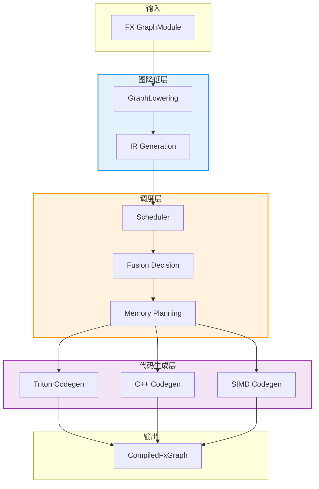
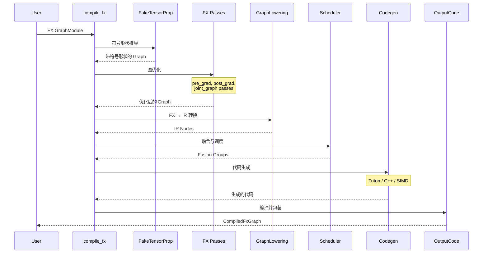
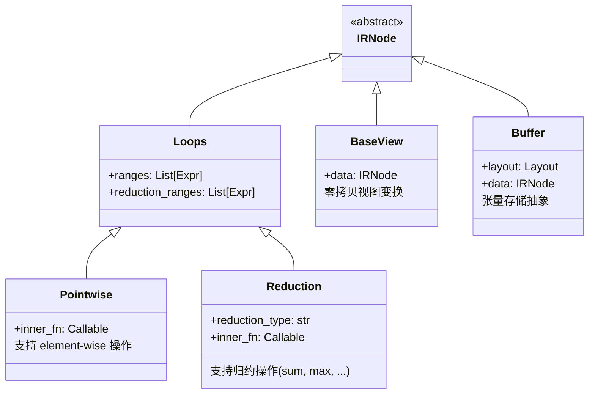

> TorchInductor 是 PyTorch 的官方编译器后端,为 torch.compile 提供动态形状感知的代码生成能力

---

## 1. 什么是 TorchInductor

TorchInductor 是 PyTorch 2.x 引入的**动态形状感知编译器后端**,作为 `torch.compile` 的默认后端,负责将 FX 图编译为高性能的机器代码。

### 核心特性

- **动态形状支持**: 使用符号形状(Symbolic Shapes)处理动态尺寸的张量
- **自动内核融合**: 智能融合多个算子为单一内核,减少内存访问
- **多后端代码生成**: 支持 Triton、C++、SIMD 等多种后端
- **设备无关**: 同时支持 CUDA、CPU、ROCm、MPS 等硬件

### 在 torch.compile 栈中的位置


**工作流程**:
1. **Dynamo** 捕获 Python 字节码,生成 FX Graph
2. **FX** 对图进行符号形状推导和优化
3. **Inductor** 将 FX Graph 编译为优化的内核代码
4. **Runtime** 执行生成的代码

---

## 2. 核心架构

### 整体架构



### 核心组件

| 组件 | 文件 | 职责 |
|------|------|------|
| **GraphLowering** | `graph.py` | FX Graph → IR 转换 |
| **IR** | `ir.py` | 中间表示层(Pointwise、Reduction 等) |
| **Lowering** | `lowering.py` | 算子 → IR 映射(1000+ 算子) |
| **Scheduler** | `scheduler.py` | 融合决策、内存规划 |
| **Triton Codegen** | `codegen/triton.py` | 生成 Triton GPU 内核 |
| **C++ Codegen** | `codegen/cpp.py` | 生成 CPU C++ 内核 |
| **CodeCache** | `codecache.py` | 编译缓存管理 |
| **OutputCode** | `output_code.py` | 包装为可调用对象 |

---

## 3. 目录结构详解

```
torch/_inductor/
├── __init__.py                  # 公共 API: compile_fx, aoti_compile_and_package
├── compile_fx.py                # 主编译流程 (2500+ 行)
├── compile_fx_async.py          # 异步编译支持
├── graph.py                     # GraphLowering 类 (FX → IR)
├── ir.py                        # IR 定义 (4700+ 行)
│   ├── IRNode, Loops, Pointwise, Reduction
│   ├── View 类型 (Permute, Expand, Slice...)
│   └── Layout (FixedLayout, FlexibleLayout)
├── lowering.py                  # 算子 lowering (7400+ 行)
├── scheduler.py                 # 融合与调度 (6800+ 行)
├── select_algorithm.py          # 算法选择与自动调优
├── codecache.py                 # 编译缓存
├── config.py                    # 400+ 配置选项
├── memory.py                    # 内存规划
├── dependencies.py              # 依赖分析
├── virtualized.py               # 虚拟算子接口
├── pattern_matcher.py           # 模式匹配优化
│
├── codegen/                     # 代码生成后端
│   ├── triton.py               # Triton 内核生成 (5500+ 行)
│   ├── cpp.py                  # C++ 代码生成
│   ├── cpp_wrapper_cpu.py      # CPU wrapper
│   ├── cpp_wrapper_gpu.py      # GPU wrapper
│   ├── simd.py                 # SIMD 优化
│   ├── cuda/                   # CUDA 特定代码
│   ├── rocm/                   # ROCm 后端
│   ├── cutlass/                # CUTLASS 模板
│   └── halide.py               # Halide 后端
│
├── fx_passes/                   # FX 图优化 passes (39+ 文件)
│   ├── pre_grad.py             # 梯度前优化
│   ├── post_grad.py            # 梯度后优化
│   ├── fuse_attention.py       # Attention 融合
│   ├── mkldnn_fusion.py        # MKLDNN 融合
│   └── quantization.py         # 量化优化
│
├── kernel/                      # 特殊内核模板
│   ├── mm.py                   # 矩阵乘法
│   ├── conv.py                 # 卷积
│   └── flex/                   # Flex Attention
│
└── runtime/                     # 运行时工具
    ├── triton_heuristics.py    # Triton 启发式
    ├── hints.py                # 内核提示
    └── autotune_cache.py       # 自动调优缓存
```

---

## 4. 核心编译流程

### compile_fx 主流程

```python
# torch/_inductor/compile_fx.py
def compile_fx(
    model: GraphModule,
    example_inputs: List[torch.Tensor],
    *,
    inner_compile=None,
    config_patches=None,
):
    """
    编译 FX GraphModule 为优化的可执行代码

    流程:
    1. 符号形状推导 (FakeTensorProp)
    2. FX passes 优化
    3. GraphLowering (FX → IR)
    4. Scheduler 融合决策
    5. Codegen 生成代码
    6. 编译并包装
    """
    return compile_fx_inner(
        model, example_inputs,
        cudagraphs=config.triton.cudagraphs,
        ...
    )
```

### 编译阶段流程图



---

## 5. IR 中间表示

Inductor 使用分层的 IR 表示计算:

### IR 层级结构



**关键 IR 类型**:
- **Pointwise**: Element-wise 操作 (如 `add`, `relu`)
- **Reduction**: 归约操作 (如 `sum`, `max`, `softmax`)
- **View**: 零拷贝变换 (如 `transpose`, `reshape`)
- **Buffer**: 张量存储,包含 Layout 信息

---

## 6. 简单示例

### 使用 torch.compile

```python
import torch

# 定义模型
def model(x, y):
    a = x + y
    b = a * 2
    return b.sum()

# 编译模型
compiled_model = torch.compile(model, backend="inductor")

# 运行
x = torch.randn(1024, 1024, device="cuda")
y = torch.randn(1024, 1024, device="cuda")

result = compiled_model(x, y)
```

### 编译过程

1. **Dynamo 捕获**: 捕获 `model` 的计算图
2. **生成 FX Graph**:
   ```
   graph():
       %x : [num_users=1] = placeholder[target=x]
       %y : [num_users=1] = placeholder[target=y]
       %add : [num_users=1] = call_function[target=operator.add](args = (%x, %y))
       %mul : [num_users=1] = call_function[target=operator.mul](args = (%add, 2))
       %sum : [num_users=1] = call_method[target=sum](args = (%mul,))
       return sum
   ```
3. **Inductor 编译**:
   - `add` + `mul` 融合为单一 Pointwise 内核
   - `sum` 编译为 Reduction 内核
4. **生成 Triton 代码**: 两个优化内核
5. **执行**: 直接运行编译后的代码

---

## 7. 配置系统

Inductor 提供 400+ 配置选项,通过 `torch._inductor.config` 访问:

```python
import torch._inductor.config as config

# 调试选项
config.debug = True                    # 打印详细信息
config.trace.enabled = True            # 追踪编译过程

# 优化选项
config.epilogue_fusion = True          # 启用 epilogue 融合
config.max_autotune = True             # 最大化自动调优

# 代码生成选项
config.cpp_wrapper = True              # 使用 C++ wrapper
config.triton.cudagraphs = True        # 启用 CUDA Graphs

# 缓存选项
config.fx_graph_cache = True           # FX 图缓存
config.autotune_local_cache = True     # 自动调优缓存
```

### 关键配置类别

| 类别 | 配置项示例 | 用途 |
|------|----------|------|
| **融合** | `epilogue_fusion`, `pattern_matcher` | 控制内核融合策略 |
| **调优** | `max_autotune`, `coordinate_descent_tuning` | 自动调优行为 |
| **代码生成** | `cpp_wrapper`, `triton.unique_kernel_names` | 代码生成选项 |
| **调试** | `debug`, `trace.enabled`, `output_code` | 调试与追踪 |
| **性能** | `benchmark_kernel`, `epilogue_fusion_first` | 性能优化 |

---

## 8. 与其他编译器对比

| 特性 | TorchInductor | TorchScript | ONNX Runtime | TVM |
|------|---------------|-------------|--------------|-----|
| **动态形状** | ✅ 原生支持 | ❌ 需静态形状 | ⚠️ 部分支持 | ⚠️ 部分支持 |
| **自动融合** | ✅ 智能融合 | ❌ 手动优化 | ✅ 有限融合 | ✅ 需手动调优 |
| **Python 兼容** | ✅ 完全兼容 | ⚠️ 受限子集 | ❌ 需导出 | ❌ 需导出 |
| **多后端** | ✅ Triton/C++/SIMD | ❌ 仅解释执行 | ✅ 多后端 | ✅ 多后端 |
| **调试性** | ✅ 可读生成代码 | ⚠️ 字节码难读 | ⚠️ 中等 | ❌ 较难 |
| **上手难度** | 🟢 低(自动) | 🟡 中等 | 🟡 中等 | 🔴 高 |

---

## 9. 下一步

- **[编译管线流程](./01-compile-pipeline.md)**: 深入 `compile_fx` 的完整流程
- **[IR 与 Lowering](./02-ir-lowering.md)**: 详解中间表示和算子降低
- **[调度器与融合](./03-scheduler-fusion.md)**: 融合策略与内存优化
- **[Triton 代码生成](./04-triton-codegen.md)**: GPU 内核生成细节
- **[C++ 代码生成](./05-cpp-codegen.md)**: CPU 内核生成细节
- **[调试指南](./06-inductor-debug.md)**: 调试技巧与常见问题

---

## 10. 关键文件速查

| 功能 | 文件路径 | 说明 |
|------|---------|------|
| 编译入口 | `torch/_inductor/compile_fx.py` | `compile_fx()`, `compile_fx_inner()` |
| 图降低 | `torch/_inductor/graph.py` | `GraphLowering` 类 |
| IR 定义 | `torch/_inductor/ir.py` | IRNode, Loops, Pointwise, Reduction |
| 算子映射 | `torch/_inductor/lowering.py` | `lowerings` 字典,1000+ 算子 |
| 融合调度 | `torch/_inductor/scheduler.py` | `Scheduler`, 融合逻辑 |
| Triton 生成 | `torch/_inductor/codegen/triton.py` | `TritonKernel` 类 |
| C++ 生成 | `torch/_inductor/codegen/cpp.py` | C++ codegen |
| 配置 | `torch/_inductor/config.py` | 所有配置选项 |

---

> **提示**: Inductor 是 PyTorch 2.x 的核心组件,理解其架构是深入 torch.compile 的关键。建议从编译流程开始,逐步深入 IR、调度和代码生成细节。
