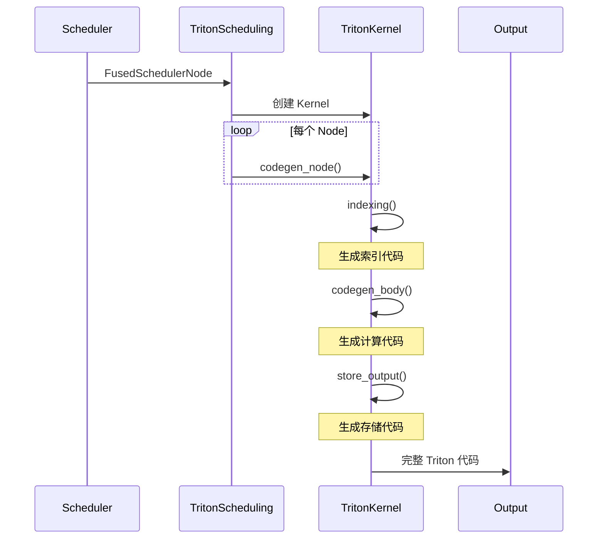

> 深入解析 Inductor 如何生成高性能 Triton GPU 内核

---

## 1. Triton 后端概述

**Triton** 是一个 GPU 编程语言,提供类 Python 语法编写高性能 CUDA 内核。Inductor 使用 Triton 作为主要的 GPU 代码生成后端。

### Triton vs CUDA

| 特性 | Triton | CUDA C++ |
|------|--------|----------|
| **语法** | Python-like | C++ |
| **内存管理** | 自动分块 | 手动管理 |
| **并行模型** | Block-level | Thread-level |
| **上手难度** | 🟢 低 | 🔴 高 |
| **性能** | 🟡 接近手写 CUDA | 🟢 最优 |

---

## 2. TritonKernel 类

### 核心结构

```python
# torch/_inductor/codegen/triton.py
class TritonKernel:
    """Triton 内核生成器"""

    def __init__(self, *groups, index_dtype, mutations, pid_cache):
        self.args = KernelArgs()         # 内核参数
        self.loads = []                  # 加载操作列表
        self.stores = []                 # 存储操作列表
        self.compute = []                # 计算操作列表
        self.indexing_code = []          # 索引计算代码
        self.suffix = []                 # 后缀代码(如断言)

    def codegen_kernel(self, name):
        """生成完整的 Triton 内核"""
        # 1. 生成索引代码
        index_code = self.indexing()

        # 2. 生成计算代码
        compute_code = self.codegen_body()

        # 3. 组装内核
        kernel_code = f"""
@triton.jit
def {name}({self.args.signature()}):
{indent(index_code)}
{indent(compute_code)}
"""
        return kernel_code
```

---

## 3. 代码生成流程

### 主流程



---

## 4. 索引生成 (indexing)

### Program ID 计算

```python
def indexing(self):
    """生成索引计算代码"""
    code = []

    # 1. 获取 program_id
    for i, range_expr in enumerate(self.ranges):
        code.append(f"pid_{i} = tl.program_id({i})")

    # 2. 计算块偏移
    for i, (range_expr, block_size) in enumerate(
        zip(self.ranges, self.block_sizes)
    ):
        code.append(
            f"offset_{i} = pid_{i} * {block_size} + tl.arange(0, {block_size})"
        )

    # 3. 生成 mask
    for i, range_expr in enumerate(self.ranges):
        code.append(f"mask_{i} = offset_{i} < {range_expr}")

    return "\n".join(code)
```

**生成代码示例**:
```python
# 2D 索引
pid_0 = tl.program_id(0)
pid_1 = tl.program_id(1)

offset_0 = pid_0 * XBLOCK + tl.arange(0, XBLOCK)
offset_1 = pid_1 * YBLOCK + tl.arange(0, YBLOCK)

mask_0 = offset_0 < xnumel
mask_1 = offset_1 < ynumel
```

---

## 5. 加载代码生成

### load() 操作

```python
def load(self, name, index):
    """生成 tl.load 代码"""
    # 1. 计算内存地址
    ptr = f"{name}_ptr + {self.codegen_indexing(index)}"

    # 2. 生成 mask
    mask = self.codegen_mask(index)

    # 3. 生成 load 代码
    load_code = f"tl.load({ptr}, mask={mask})"

    # 4. 添加到 loads 列表
    tmp_var = f"tmp{len(self.loads)}"
    self.loads.append(f"{tmp_var} = {load_code}")

    return tmp_var
```

**生成代码示例**:
```python
# 加载 x[i, j]
tmp0 = tl.load(x_ptr + offset_0 * stride_x0 + offset_1 * stride_x1,
               mask=mask_0 & mask_1)
```

---

## 6. 计算代码生成

### Pointwise 操作

```python
def codegen_pointwise(self, node: Pointwise):
    """生成 Pointwise 计算代码"""
    # 1. 加载输入
    inputs = []
    for input_name in node.get_read_names():
        tmp = self.load(input_name, index)
        inputs.append(tmp)

    # 2. 生成计算
    result = self.codegen_inner_fn(node.inner_fn, inputs)

    # 3. 存储结果
    self.store(node.get_name(), index, result)
```

**示例 - 融合的 Pointwise**:
```python
# inner_fn: relu((x + 1) * 2)

# 生成代码
tmp0 = tl.load(x_ptr + offset, mask=mask)
tmp1 = tmp0 + 1.0
tmp2 = tmp1 * 2.0
tmp3 = tl.where(tmp2 > 0, tmp2, 0.0)  # relu
tl.store(out_ptr + offset, tmp3, mask=mask)
```

### Reduction 操作

```python
def codegen_reduction(self, node: Reduction):
    """生成 Reduction 代码"""
    reduction_type = node.reduction_type

    # 1. 初始化累加器
    if reduction_type == "sum":
        acc_init = "0.0"
    elif reduction_type == "max":
        acc_init = "float('-inf')"

    code = [f"acc = {acc_init}"]

    # 2. Reduction 循环
    code.append(f"for roffset in range(0, {reduction_range}, RBLOCK):")

    # 3. 加载数据
    load_code = self.load_reduction(node, "roffset")
    code.append(f"    val = {load_code}")

    # 4. 累加
    if reduction_type == "sum":
        code.append("    acc += val")
    elif reduction_type == "max":
        code.append("    acc = tl.maximum(acc, val)")

    # 5. 存储结果
    code.append(f"tl.store(out_ptr + offset, acc, mask=mask)")

    return "\n".join(code)
```

**生成代码示例 - Sum Reduction**:
```python
# sum(x, dim=1)
acc = 0.0
for roffset in range(0, reduction_numel, RBLOCK):
    ridx = roffset + tl.arange(0, RBLOCK)
    rmask = ridx < reduction_numel
    val = tl.load(x_ptr + offset_0 * stride_x0 + ridx * stride_x1,
                  mask=mask_0 & rmask)
    acc += val

tl.store(out_ptr + offset_0, acc, mask=mask_0)
```

---

## 7. 自动调优 (Autotuning)

### Triton 配置空间

```python
# torch/_inductor/select_algorithm.py
class TritonChoice:
    """Triton 自动调优选择"""

    def __init__(self, configs):
        self.configs = configs  # 配置列表

    def autotune(self, example_inputs):
        """自动调优选择最优配置"""
        best_config = None
        best_time = float("inf")

        for config in self.configs:
            # 1. 使用该配置编译内核
            kernel = compile_with_config(config)

            # 2. 基准测试
            time = benchmark_kernel(kernel, example_inputs)

            # 3. 更新最优配置
            if time < best_time:
                best_time = time
                best_config = config

        return best_config
```

### 配置参数

```python
# Block sizes 配置
configs = [
    triton.Config(
        {"XBLOCK": 256, "YBLOCK": 64}, num_warps=4, num_stages=2
    ),
    triton.Config(
        {"XBLOCK": 512, "YBLOCK": 32}, num_warps=8, num_stages=3
    ),
    triton.Config(
        {"XBLOCK": 1024, "YBLOCK": 16}, num_warps=16, num_stages=4
    ),
]
```

**调优参数**:
- `XBLOCK`, `YBLOCK`: Block 大小
- `num_warps`: Warp 数量(每个 SM 上的并行度)
- `num_stages`: Pipeline 阶段(软件流水线)

---

## 8. 完整 Kernel 示例

### 融合 Add + ReLU

**输入 IR**:
```python
# y = relu(x + 1)
pointwise = Pointwise.create(
    inner_fn=lambda idx: ops.relu(ops.add(x[idx], 1.0)),
    ranges=[sympy.Symbol("s0")],
)
```

**生成的 Triton 代码**:
```python
@triton.jit
def fused_add_relu_kernel(
    x_ptr,
    out_ptr,
    xnumel,
    XBLOCK: tl.constexpr,
):
    # 索引计算
    pid = tl.program_id(0)
    xoffset = pid * XBLOCK
    xindex = xoffset + tl.arange(0, XBLOCK)
    xmask = xindex < xnumel

    # 加载
    tmp0 = tl.load(x_ptr + xindex, mask=xmask)

    # 计算
    tmp1 = tmp0 + 1.0
    tmp2 = tl.where(tmp1 > 0, tmp1, 0.0)  # relu

    # 存储
    tl.store(out_ptr + xindex, tmp2, mask=xmask)


# 启动配置
grid = lambda meta: (triton.cdiv(xnumel, meta["XBLOCK"]),)
fused_add_relu_kernel[grid](x, out, xnumel, XBLOCK=256)
```

---

## 9. Reduction Tree

### Online Softmax

```python
# Softmax 使用 Reduction Tree 优化
@triton.jit
def softmax_kernel(x_ptr, out_ptr, ...):
    # Stage 1: 计算 max (使用 tree reduction)
    max_val = float("-inf")
    for i in range(0, N, BLOCK):
        val = tl.load(x_ptr + i)
        max_val = tl.maximum(max_val, val)

    # Warp-level reduction
    max_val = tl.max(max_val, axis=0)

    # Stage 2: 计算 sum(exp(x - max))
    sum_exp = 0.0
    for i in range(0, N, BLOCK):
        val = tl.load(x_ptr + i)
        exp_val = tl.exp(val - max_val)
        sum_exp += exp_val

    sum_exp = tl.sum(sum_exp, axis=0)

    # Stage 3: 归一化
    for i in range(0, N, BLOCK):
        val = tl.load(x_ptr + i)
        result = tl.exp(val - max_val) / sum_exp
        tl.store(out_ptr + i, result)
```

---

## 10. TMA 支持

### Tensor Memory Accelerator

```python
# Hopper GPU (H100) 的 TMA 支持
@triton.jit
def matmul_tma_kernel(a_ptr, b_ptr, c_ptr, ...):
    # 使用 TMA 加载
    a_block = tl.experimental.tma.load(a_desc, [pid_m, pid_k])
    b_block = tl.experimental.tma.load(b_desc, [pid_k, pid_n])

    # 矩阵乘法
    acc = tl.dot(a_block, b_block)

    # TMA 存储
    tl.experimental.tma.store(c_desc, acc, [pid_m, pid_n])
```

---

## 11. 调试生成代码

### 查看生成的 Triton 代码

```python
import torch._inductor.config as config

# 启用代码输出
config.debug = True
config.trace.enabled = True

# 编译模型
model = torch.compile(my_model, backend="inductor")

# 生成的代码保存在:
# /tmp/torchinductor_<user>/<hash>/kernel_*.py
```

### 手动运行 Triton 内核

```python
import triton

# 加载生成的内核
from /tmp/torchinductor_xxx.kernel_0 import fused_kernel

# 准备输入
x = torch.randn(1024, device="cuda")
out = torch.empty(1024, device="cuda")

# 手动调用
grid = (triton.cdiv(1024, 256),)
fused_kernel[grid](x, out, 1024, XBLOCK=256)
```

---

## 12. 性能优化技巧

### Block Size 选择

```python
# 小 Tensor: 使用小 Block
# 大 Tensor: 使用大 Block

# 启发式
if numel < 1024:
    XBLOCK = 64
elif numel < 1024 * 1024:
    XBLOCK = 256
else:
    XBLOCK = 1024
```

### Memory Coalescing

```python
# 好的访问模式(连续)
for i in range(0, N, BLOCK):
    idx = i + tl.arange(0, BLOCK)  # 连续索引
    val = tl.load(ptr + idx)

# 差的访问模式(跨步)
for i in range(0, N, BLOCK):
    idx = i * stride + tl.arange(0, BLOCK)  # stride >> 1
    val = tl.load(ptr + idx)
```

---

## 13. 下一步

- **[C++ 代码生成](./05-cpp-codegen.md)**: CPU 后端的代码生成
- **[Inductor 调试](./06-inductor-debug.md)**: 调试技巧与常见问题

---

## 14. 总结

| 组件 | 职责 | 关键文件 |
|------|------|---------|
| **TritonKernel** | 代码生成核心 | `codegen/triton.py` |
| **indexing** | 索引计算 | `TritonKernel.indexing()` |
| **codegen_body** | 计算逻辑 | `TritonKernel.codegen_body()` |
| **Autotuning** | 配置搜索 | `select_algorithm.py` |
| **TritonChoice** | 配置管理 | `select_algorithm.py` |

Triton 后端是 Inductor GPU 性能的关键,通过自动分块、融合和调优,生成接近手写 CUDA 的高性能内核。
