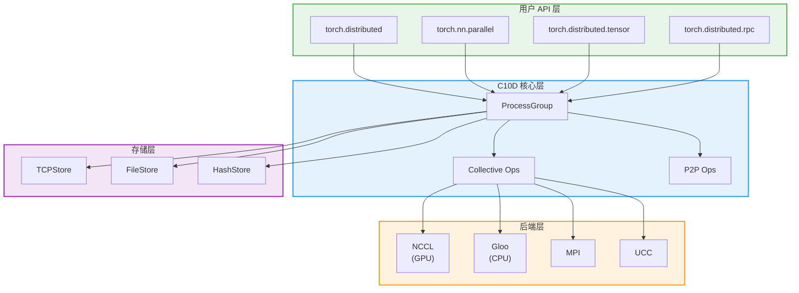
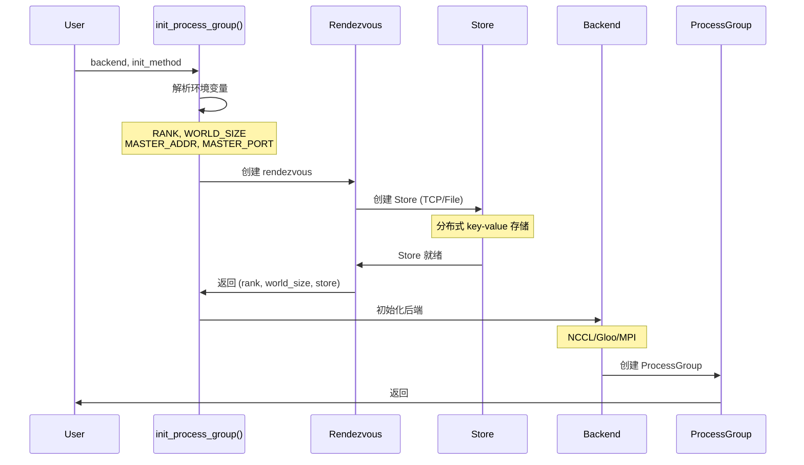
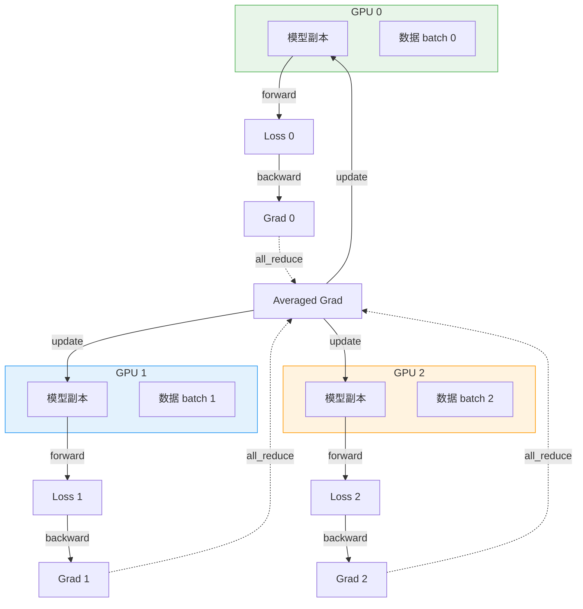
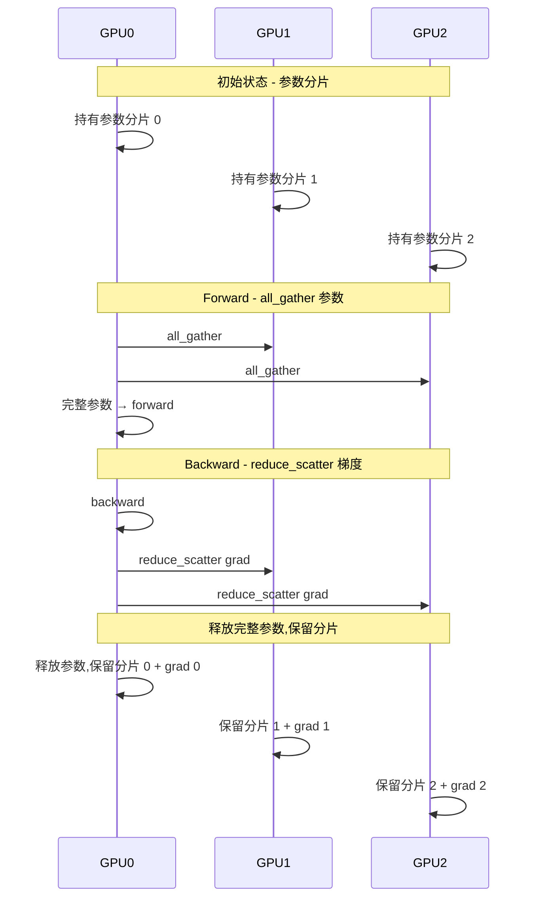

> PyTorch 分布式训练的完整架构与核心组件导航

---

## 1. 为什么需要分布式训练

### 训练挑战

| 挑战 | 问题 | 分布式解决方案 |
|------|------|---------------|
| **模型过大** | 单卡放不下 | 模型并行、流水线并行 |
| **数据量大** | 训练时间长 | 数据并行 |
| **显存不足** | OOM | FSDP 参数分片 |
| **通信瓶颈** | 梯度同步慢 | 梯度压缩、Ring AllReduce |

### 并行策略对比

```mermaid
flowchart TD
    subgraph dp["数据并行 (Data Parallel)"]
        D1["GPU 0<br/>模型副本"]
        D2["GPU 1<br/>模型副本"]
        D3["GPU 2<br/>模型副本"]
    end

    subgraph mp["模型并行 (Model Parallel)"]
        M1["GPU 0<br/>Layer 1-5"]
        M2["GPU 1<br/>Layer 6-10"]
        M3["GPU 2<br/>Layer 11-15"]
    end

    subgraph tp["张量并行 (Tensor Parallel)"]
        T1["GPU 0<br/>权重分片 0"]
        T2["GPU 1<br/>权重分片 1"]
        T3["GPU 2<br/>权重分片 2"]
    end

    subgraph pp["流水线并行 (Pipeline Parallel)"]
        P1["GPU 0<br/>Stage 0"]
        P2["GPU 1<br/>Stage 1"]
        P3["GPU 2<br/>Stage 2"]
    end

    D1 -.梯度同步.-> D2
    D2 -.梯度同步.-> D3

    M1 -->|激活传递| M2
    M2 -->|激活传递| M3

    T1 -.部分计算.-> T2
    T2 -.部分计算.-> T3

    P1 -->|Micro-batch| P2
    P2 -->|Micro-batch| P3

    style dp fill:#e8f5e9,stroke:#4caf50
    style mp fill:#e3f2fd,stroke:#2196f3
    style tp fill:#fff3e0,stroke:#ff9800
    style pp fill:#f3e5f5,stroke:#9c27b0
```



---

## 2. PyTorch 分布式架构

### 整体架构



---

## 3. 目录结构详解

### 核心目录

```
torch/distributed/
├── __init__.py                 # 核心 API 入口
├── distributed_c10d.py         # C10D 实现 (6288 行核心)
├── device_mesh.py              # 设备网格拓扑
├── rendezvous.py               # 分布式初始化协调
│
├── algorithms/                 # 分布式算法
│   ├── ddp_comm_hooks/         # DDP 通信钩子
│   └── join.py                 # Uneven inputs 处理
│
├── fsdp/                       # Fully Sharded Data Parallel
│   ├── fully_sharded_data_parallel.py  # FSDP 主类
│   ├── _flat_param.py          # Flat Parameter 管理 (2837 行)
│   ├── _runtime_utils.py       # Forward/Backward Hook
│   ├── _optim_utils.py         # 优化器状态分片 (2113 行)
│   └── api.py                  # FSDP API
│
├── tensor/                     # DTensor (分布式张量)
│   ├── _api.py                 # DTensor API
│   ├── placement_types.py      # Placement 类型
│   ├── _redistribute.py        # 重分布机制
│   ├── _sharding_prop.py       # 分片传播
│   └── parallel/               # 张量并行
│       ├── style.py            # ColwiseParallel / RowwiseParallel
│       └── api.py              # parallelize_module()
│
├── rpc/                        # Remote Procedure Call
│   ├── api.py                  # RPC API (37037 行核心)
│   ├── backend_registry.py     # 后端注册
│   └── options.py              # RPC 配置
│
├── optim/                      # 分布式优化器
│   ├── zero_redundancy_optimizer.py  # ZeRO Optimizer
│   └── optimizer.py            # DistributedOptimizer
│
├── nn/                         # 分布式神经网络模块
│   ├── parallel/               # 并行封装
│   │   ├── distributed.py      # DistributedDataParallel (DDP)
│   │   └── replicate.py        # DataParallel (已弃用)
│   └── functional.py           # 分布式 functional ops
│
├── elastic/                    # Elastic Training
│   ├── multiprocessing/        # 多进程管理
│   ├── rendezvous/             # Elastic rendezvous
│   └── metrics/                # 指标收集
│
└── c10d_logger.py              # 日志工具
```

---

## 4. 核心概念

### 4.1 ProcessGroup

**ProcessGroup** 是分布式通信的核心抽象:

```python
# torch/distributed/distributed_c10d.py
class ProcessGroup:
    """进程组抽象"""

    def __init__(self, rank: int, size: int):
        self.rank = rank  # 当前进程在组内的 rank
        self.size = size  # 组内总进程数

    # 集合通信
    def allreduce(self, tensors, op=ReduceOp.SUM):
        """全局归约"""

    def broadcast(self, tensors, src=0):
        """广播"""

    def all_gather(self, output_tensors, input_tensor):
        """全局收集"""
```

### 4.2 Backend 类型

```python
# 支持的后端
class Backend:
    NCCL = "nccl"      # NVIDIA GPU (推荐)
    GLOO = "gloo"      # CPU 和 GPU
    MPI = "mpi"        # 通用 MPI
    UCC = "ucc"        # Unified Collective Communication
```

**后端选择指南**:

| Backend | 设备 | 性能 | 适用场景 |
|---------|------|------|----------|
| **NCCL** | GPU | ⭐⭐⭐⭐⭐ | GPU 训练(首选) |
| **Gloo** | CPU/GPU | ⭐⭐⭐ | CPU 训练、调试 |
| **MPI** | CPU/GPU | ⭐⭐⭐⭐ | HPC 环境 |
| **UCC** | GPU | ⭐⭐⭐⭐ | 多厂商 GPU |

---

## 5. 启动方式

### 5.1 torchrun (推荐)

```bash
# torchrun 是官方推荐的启动方式
torchrun \
    --nproc_per_node=4 \      # 每个节点 4 个进程
    --nnodes=2 \               # 2 个节点
    --node_rank=0 \            # 当前节点 rank
    --master_addr="10.0.0.1" \ # master 地址
    --master_port=29500 \      # master 端口
    train.py
```

**对应的 Python 代码**:
```python
# train.py
import torch
import torch.distributed as dist

def main():
    # 1. 初始化进程组
    dist.init_process_group(backend="nccl")

    # 2. 获取 rank 和 world_size
    rank = dist.get_rank()
    world_size = dist.get_world_size()

    print(f"Rank {rank}/{world_size}")

    # 3. 训练逻辑
    model = MyModel().cuda(rank)
    ddp_model = torch.nn.parallel.DistributedDataParallel(
        model,
        device_ids=[rank],
    )

    # 4. 清理
    dist.destroy_process_group()

if __name__ == "__main__":
    main()
```

### 5.2 torch.distributed.launch (已弃用)

```bash
# 旧的启动方式(不推荐)
python -m torch.distributed.launch \
    --nproc_per_node=4 \
    train.py
```

### 5.3 手动启动

```python
import os
import torch.distributed as dist

# 手动设置环境变量
os.environ["MASTER_ADDR"] = "localhost"
os.environ["MASTER_PORT"] = "29500"
os.environ["RANK"] = "0"
os.environ["WORLD_SIZE"] = "4"

# 初始化
dist.init_process_group(backend="nccl")
```

---

## 6. 初始化流程

### init_process_group 流程



---

## 7. 集合通信操作

### 六种基本操作

```mermaid
flowchart LR
    subgraph allreduce["all_reduce"]
        AR1["[1,2]"] -.sum.-> AR2["[6,8]"]
        AR3["[3,4]"] -.sum.-> AR4["[6,8]"]
        AR5["[2,2]"] -.sum.-> AR6["[6,8]"]
    end

    subgraph broadcast["broadcast"]
        BR1["[1,2]"] -->|"src=0"| BR2["[1,2]"]
        BR3["[?,?]"] -->|"src=0"| BR4["[1,2]"]
        BR5["[?,?]"] -->|"src=0"| BR6["[1,2]"]
    end

    subgraph allgather["all_gather"]
        AG1["[1]"] --> AG2["[1,2,3]"]
        AG3["[2]"] --> AG4["[1,2,3]"]
        AG5["[3]"] --> AG6["[1,2,3]"]
    end

    subgraph reduce["reduce"]
        R1["[1,2]"] -.sum.-> R2["[6,8]"]
        R3["[3,4]"] -.sum.-> R4[""]
        R5["[2,2]"] -.sum.-> R6[""]
    end

    subgraph scatter["scatter"]
        S1["[1,2,3]"] -->|"src=0"| S2["[1]"]
        S3[""] -->|"src=0"| S4["[2]"]
        S5[""] -->|"src=0"| S6["[3]"]
    end

    subgraph gather["gather"]
        G1["[1]"] -->|"dst=0"| G2["[1,2,3]"]
        G3["[2]"] -->|"dst=0"| G4[""]
        G5["[3]"] -->|"dst=0"| G6[""]
    end

    style allreduce fill:#e8f5e9,stroke:#4caf50
    style broadcast fill:#e3f2fd,stroke:#2196f3
    style allgather fill:#fff3e0,stroke:#ff9800
```

**使用示例**:
```python
import torch.distributed as dist

# 1. all_reduce - 所有进程归约并广播
tensor = torch.tensor([rank + 1])
dist.all_reduce(tensor, op=dist.ReduceOp.SUM)
# 结果: tensor = [1+2+3+4] = [10] (所有进程)

# 2. broadcast - 广播
tensor = torch.tensor([rank]) if rank == 0 else torch.zeros(1)
dist.broadcast(tensor, src=0)
# 结果: tensor = [0] (所有进程)

# 3. all_gather - 收集到所有进程
tensor = torch.tensor([rank])
tensor_list = [torch.zeros(1) for _ in range(world_size)]
dist.all_gather(tensor_list, tensor)
# 结果: tensor_list = [[0], [1], [2], [3]] (所有进程)

# 4. reduce - 归约到指定进程
tensor = torch.tensor([rank + 1])
dist.reduce(tensor, dst=0, op=dist.ReduceOp.SUM)
# 结果: rank 0: tensor = [10], 其他: 不变

# 5. scatter - 分发
if rank == 0:
    scatter_list = [torch.tensor([i]) for i in range(world_size)]
else:
    scatter_list = None
tensor = torch.zeros(1)
dist.scatter(tensor, scatter_list, src=0)
# 结果: rank i: tensor = [i]

# 6. gather - 收集到指定进程
tensor = torch.tensor([rank])
if rank == 0:
    gather_list = [torch.zeros(1) for _ in range(world_size)]
else:
    gather_list = None
dist.gather(tensor, gather_list, dst=0)
# 结果: rank 0: gather_list = [[0], [1], [2], [3]]
```

---

## 8. DDP vs FSDP

### 对比

| 特性 | DDP | FSDP |
|------|-----|------|
| **原理** | 每个进程完整副本 | 参数分片 |
| **内存占用** | 高(N 个副本) | 低(分片) |
| **通信开销** | 梯度 all_reduce | 参数 all_gather + 梯度 reduce_scatter |
| **适用场景** | 模型较小 | 大模型(LLM) |
| **最大模型** | 单卡可放下 | 超过单卡 |

### DDP 原理



### FSDP 原理



---

## 9. DTensor 概述

### Placement 类型

```python
# torch/distributed/tensor/placement_types.py
class Placement:
    """张量放置策略"""
    pass

class Replicate(Placement):
    """副本复制 - 所有设备持有完整副本"""
    pass

class Shard(Placement):
    """分片 - 沿指定维度分片"""
    def __init__(self, dim: int):
        self.dim = dim

class Partial(Placement):
    """部分归约 - 未完全同步的中间状态"""
    def __init__(self, reduce_op: ReduceOp = ReduceOp.SUM):
        self.reduce_op = reduce_op
```

**示例**:
```python
from torch.distributed.tensor import DTensor, DeviceMesh, Shard, Replicate

# 1. 创建设备网格
device_mesh = DeviceMesh("cuda", list(range(4)))

# 2. 创建分片张量
# 在维度 0 上分片,其他维度复制
tensor = torch.randn(8, 4)
dtensor = DTensor.from_local(
    tensor,
    device_mesh,
    placements=[Shard(0)],
)

# 3. 重分布
# 从 Shard(0) 转换为 Replicate
dtensor_replicated = dtensor.redistribute(
    device_mesh,
    placements=[Replicate()],
)
```

---

## 10. 完整示例

### 数据并行训练

```python
import torch
import torch.distributed as dist
import torch.nn as nn
from torch.nn.parallel import DistributedDataParallel as DDP

def setup(rank, world_size):
    """初始化进程组"""
    dist.init_process_group("nccl", rank=rank, world_size=world_size)

def cleanup():
    """清理进程组"""
    dist.destroy_process_group()

def train(rank, world_size):
    setup(rank, world_size)

    # 1. 创建模型
    model = nn.Linear(10, 5).cuda(rank)
    ddp_model = DDP(model, device_ids=[rank])

    # 2. 创建优化器
    optimizer = torch.optim.SGD(ddp_model.parameters(), lr=0.01)

    # 3. 训练循环
    for epoch in range(10):
        # 前向
        inputs = torch.randn(20, 10).cuda(rank)
        outputs = ddp_model(inputs)
        loss = outputs.sum()

        # 反向
        optimizer.zero_grad()
        loss.backward()
        optimizer.step()

        if rank == 0:
            print(f"Epoch {epoch}, Loss: {loss.item()}")

    cleanup()

if __name__ == "__main__":
    world_size = 4
    torch.multiprocessing.spawn(
        train,
        args=(world_size,),
        nprocs=world_size,
        join=True,
    )
```

---

## 11. 下一步

- **[C10D 后端](./01-c10d-backend.md)**: ProcessGroup 与后端实现
- **[集合通信](./02-collective-ops.md)**: 通信操作详解
- **[DDP 与 FSDP](./03-ddp-fsdp.md)**: 数据并行详解
- **[DTensor](./04-dtensor.md)**: 分布式张量抽象
- **[RPC 框架](./05-rpc-framework.md)**: 远程过程调用
- **[分布式调试](./06-distributed-debug.md)**: 调试技巧

---

## 12. 总结

| 组件 | 职责 | 关键文件 |
|------|------|---------|
| **C10D** | 核心通信层 | `distributed_c10d.py` |
| **ProcessGroup** | 进程组抽象 | `ProcessGroup` 类 |
| **Backend** | 通信后端 | NCCL/Gloo/MPI |
| **DDP** | 数据并行 | `nn/parallel/distributed.py` |
| **FSDP** | 全分片数据并行 | `fsdp/` |
| **DTensor** | 分布式张量 | `tensor/` |
| **RPC** | 远程调用 | `rpc/` |

PyTorch 分布式系统提供了从底层通信到高层并行策略的完整解决方案,支持从小规模到超大规模的训练需求。
