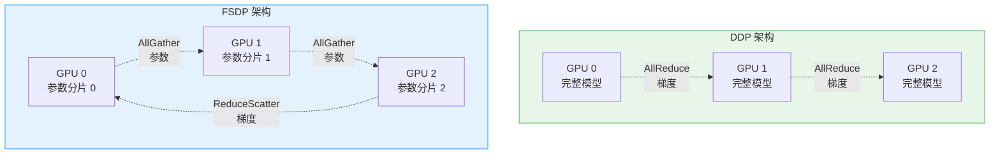
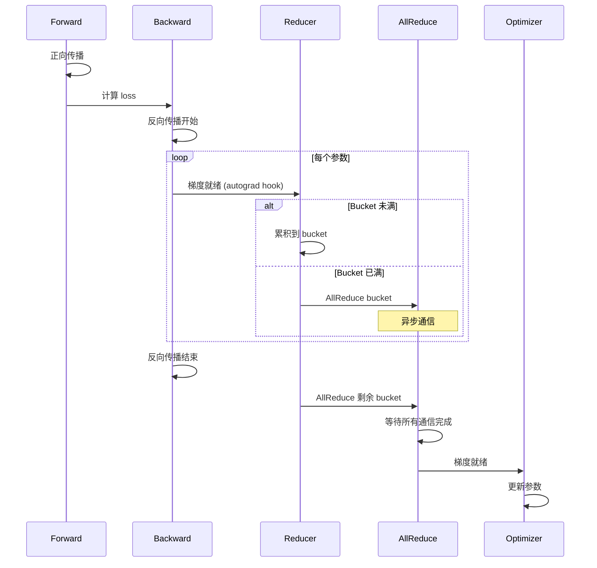
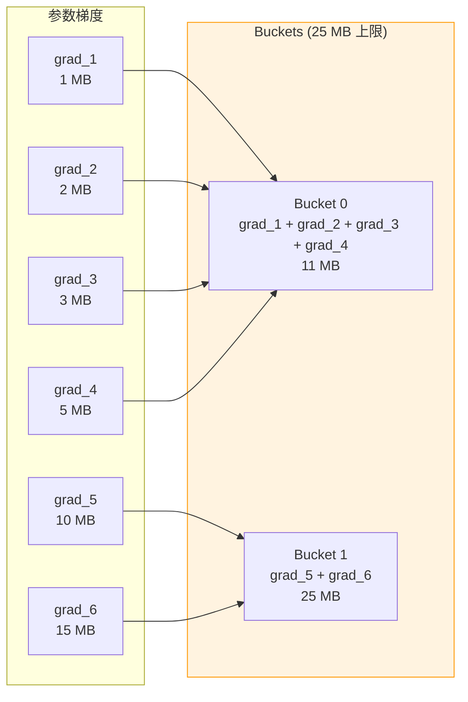
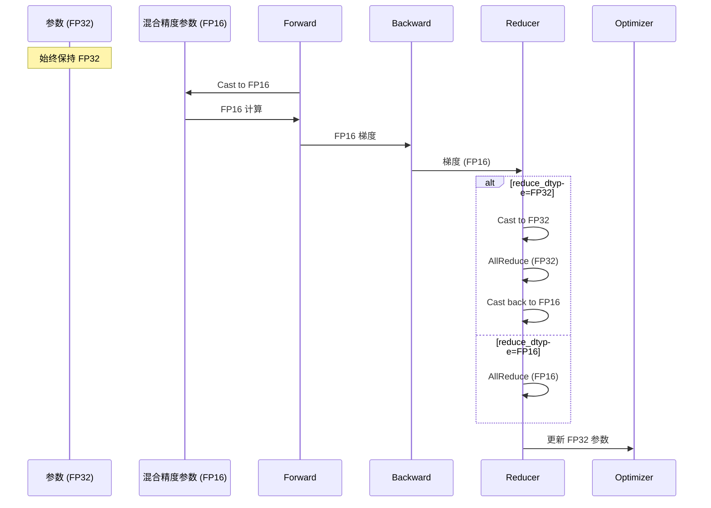
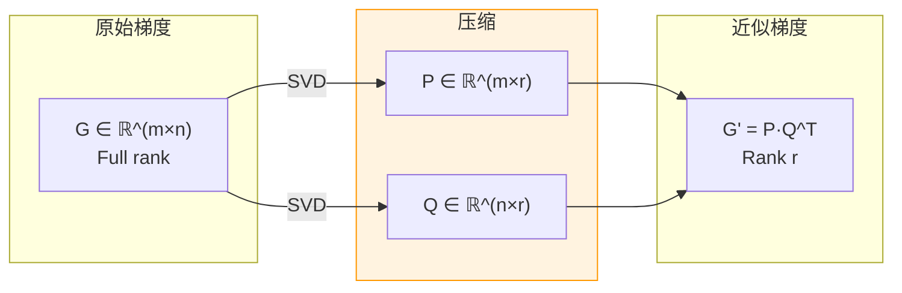
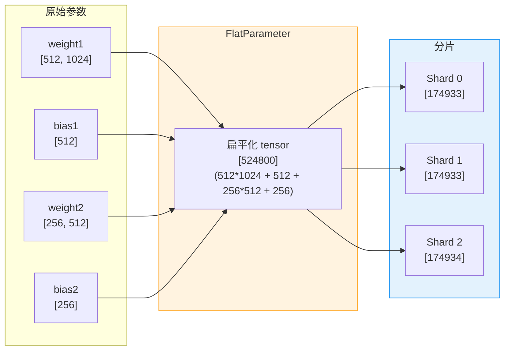
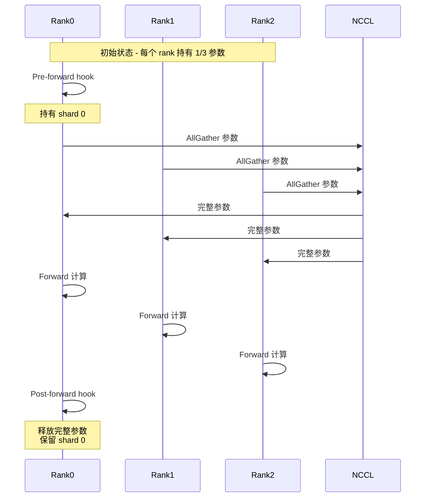
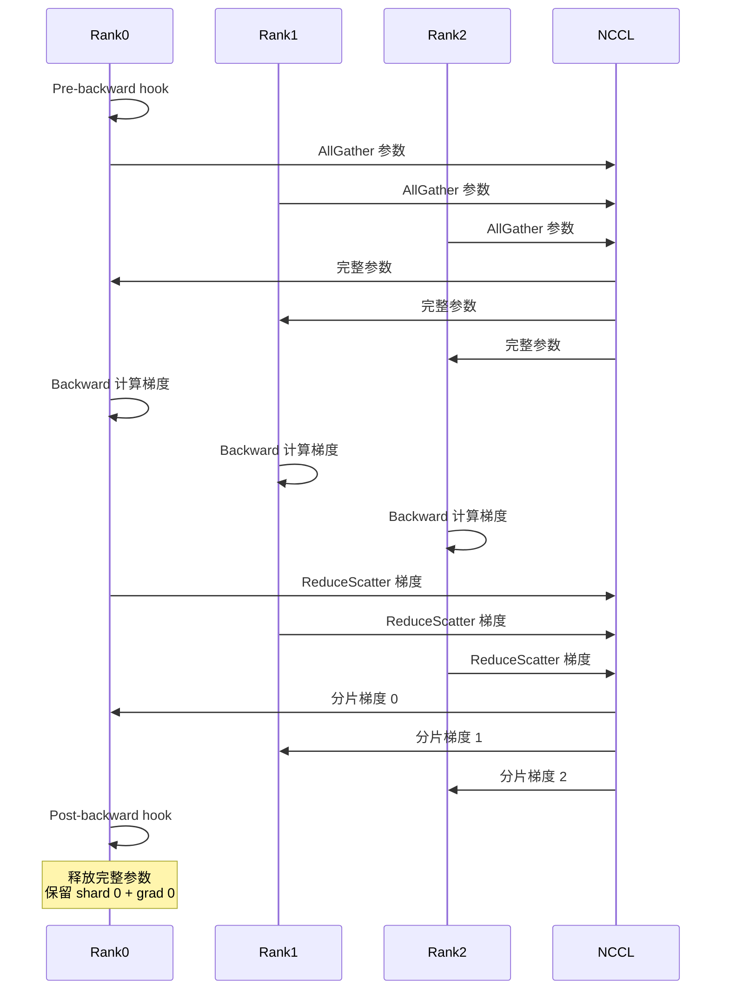
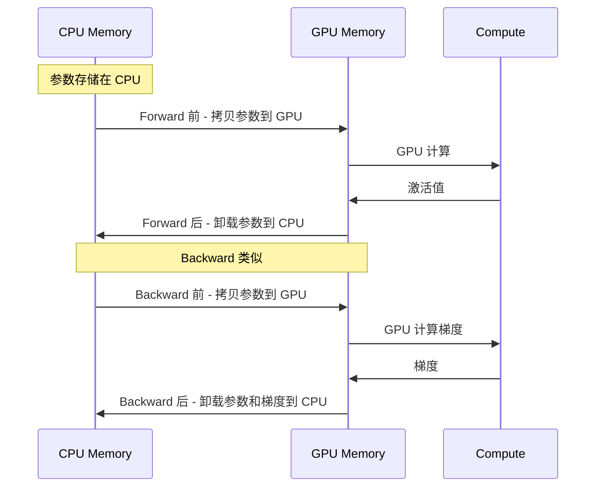

> 深入解析 PyTorch 两大数据并行方案的实现原理与最佳实践

---

## 1. 数据并行概述

### 为什么需要数据并行

**数据并行** (Data Parallelism) 是最常用的分布式训练策略:

- **训练加速**: 将数据分片到多个设备,并行计算梯度
- **扩展性好**: 线性扩展到数百上千个 GPU
- **实现简单**: 代码改动最小,易于迁移

### DDP vs FSDP 对比

| 特性 | DDP | FSDP |
|------|-----|------|
| **模型复制** | 每个设备完整副本 | 参数分片 |
| **内存占用** | N × 模型大小 | 模型大小 / N |
| **通信模式** | AllReduce 梯度 | AllGather 参数 + ReduceScatter 梯度 |
| **最大模型** | 单卡可放下 | 超过单卡显存 |
| **通信开销** | 低 | 中 (更多通信量) |
| **适用场景** | 中小模型 | 大模型 (LLM) |

**架构对比**:



---

## 2. DDP 深度解析

### 2.1 DDP 初始化

```python
# torch/nn/parallel/distributed.py
import torch
import torch.distributed as dist
from torch.nn.parallel import DistributedDataParallel as DDP

# 1. 初始化进程组
dist.init_process_group(backend="nccl")

# 2. 创建模型并移到对应设备
rank = dist.get_rank()
model = MyModel().cuda(rank)

# 3. 用 DDP 包装
ddp_model = DDP(
    model,
    device_ids=[rank],              # 模型所在设备
    output_device=rank,              # 输出设备
    broadcast_buffers=True,          # 是否广播 buffer
    bucket_cap_mb=25,                # Bucket 大小 (MB)
    find_unused_parameters=False,    # 是否查找未使用参数
    gradient_as_bucket_view=False,   # 梯度作为 bucket 视图
)
```

### 2.2 DDP 类结构

```python
# torch/nn/parallel/distributed.py (简化版)
class DistributedDataParallel(Module):
    def __init__(
        self,
        module,
        device_ids=None,
        output_device=None,
        broadcast_buffers=True,
        bucket_cap_mb=25,
        find_unused_parameters=False,
        gradient_as_bucket_view=False,
        mixed_precision=None,
    ):
        super().__init__()

        # 1. 保存原始模块
        self.module = module

        # 2. 广播参数和 buffer (rank 0 -> 所有 rank)
        dist._sync_module_states(
            self.module,
            process_group=self.process_group,
            broadcast_bucket_size=self.broadcast_bucket_size,
            src=0,
        )

        # 3. 创建 Reducer (C++ 实现)
        self.reducer = dist.Reducer(
            replicas=[list(self.module.parameters())],
            process_group=self.process_group,
            bucket_bytes_cap=bucket_cap_mb * 1024 * 1024,
            find_unused_parameters=find_unused_parameters,
            gradient_as_bucket_view=gradient_as_bucket_view,
        )

        # 4. 注册梯度 hook
        self._register_grad_hooks()
```

### 2.3 Reducer 机制

**Reducer** 是 DDP 的核心组件,负责梯度聚合和通信。

**工作流程**:



**关键实现 (C++)**:

```cpp
// torch/csrc/distributed/c10d/reducer.cpp
class Reducer {
  // Bucket 管理
  std::vector<Bucket> buckets_;

  // 处理梯度就绪
  void autograd_hook(size_t index) {
    // 1. 标记梯度就绪
    mark_variable_ready(index);

    // 2. 检查 bucket 是否满了
    auto& bucket = get_bucket_for_variable(index);
    bucket.pending_--;

    // 3. Bucket 满了 -> 启动 AllReduce
    if (bucket.pending_ == 0) {
      mark_bucket_ready(bucket_index);
      finalize_bucket_dense(bucket);
    }
  }

  // AllReduce bucket
  void finalize_bucket_dense(Bucket& bucket) {
    // 1. 拼接 bucket 中的梯度为一个连续 tensor
    auto flattened = flatten_tensors(bucket.variables);

    // 2. AllReduce
    auto work = process_group_->allreduce(
        flattened,
        AllreduceOptions{ReduceOp::SUM}
    );

    // 3. 等待完成后,分散回原来的梯度
    work->wait();
    unflatten_tensors(flattened, bucket.variables);
  }
};
```

### 2.4 Gradient Bucketing

**Bucketing** 将多个小梯度合并为大 bucket,减少通信次数。



**Bucket 构建规则**:

```python
# torch/csrc/distributed/c10d/reducer.cpp (逻辑简化)
def build_buckets(params, bucket_cap_mb):
    """构建 bucket"""
    buckets = []
    current_bucket = []
    current_size = 0

    # 反向遍历参数 (backward 顺序)
    for param in reversed(params):
        param_size = param.numel() * param.element_size()

        if current_size + param_size > bucket_cap_mb * 1024 * 1024:
            # 超过上限 -> 新建 bucket
            buckets.append(current_bucket)
            current_bucket = [param]
            current_size = param_size
        else:
            # 累积到当前 bucket
            current_bucket.append(param)
            current_size += param_size

    if current_bucket:
        buckets.append(current_bucket)

    return buckets
```

### 2.5 通信-计算重叠

DDP 自动实现梯度通信与反向计算的重叠:

```mermaid
gantt
    title DDP Backward with Overlap
    dateFormat X
    axisFormat %L ms

    section Computation
    Grad Layer 5 :0, 100
    Grad Layer 4 :100, 200
    Grad Layer 3 :200, 300
    Grad Layer 2 :300, 400
    Grad Layer 1 :400, 500

    section Communication
    AllReduce Bucket 2 :100, 250
    AllReduce Bucket 1 :300, 450
    AllReduce Bucket 0 :400, 550
```



**关键点**:
- Bucket 在梯度就绪后**立即启动** AllReduce (异步)
- 不等待所有梯度计算完成
- 后续层的梯度计算与前面 bucket 的通信**并行执行**

### 2.6 混合精度支持

```python
# torch/nn/parallel/distributed.py
from torch.nn.parallel.distributed import _MixedPrecision

# 创建混合精度配置
mp_config = _MixedPrecision(
    param_dtype=torch.float16,    # 参数和计算用 FP16
    reduce_dtype=torch.float32,   # 梯度归约用 FP32
    buffer_dtype=torch.float16,   # Buffer 用 FP16
)

# DDP 使用混合精度
ddp_model = DDP(
    model,
    device_ids=[rank],
    mixed_precision=mp_config,
)
```

**工作原理**:



### 2.7 Communication Hooks

**Communication Hooks** 允许自定义梯度通信逻辑。

#### 默认 AllReduce Hook

```python
# torch/distributed/algorithms/ddp_comm_hooks/default_hooks.py
def allreduce_hook(
    process_group: dist.ProcessGroup,
    bucket: dist.GradBucket,
) -> torch.futures.Future:
    """默认 AllReduce hook"""
    # 获取 bucket 中的梯度 tensor
    tensor = bucket.buffer()

    # AllReduce (异步)
    work = dist.all_reduce(
        tensor,
        op=dist.ReduceOp.SUM,
        group=process_group,
        async_op=True,
    )

    # 返回 Future
    return work.get_future().then(lambda _: tensor)
```

#### PowerSGD Compression Hook

**PowerSGD** 通过低秩近似压缩梯度:

```python
# torch/distributed/algorithms/ddp_comm_hooks/powerSGD_hook.py
from torch.distributed.algorithms.ddp_comm_hooks import powerSGD_hook as psgd

# 创建 PowerSGD state
powersgd_state = psgd.PowerSGDState(
    process_group=dist.group.WORLD,
    matrix_approximation_rank=4,    # 低秩 rank
    start_powerSGD_iter=10,          # 从第 10 iter 开始压缩
)

# 注册 hook
ddp_model.register_comm_hook(
    powersgd_state,
    psgd.powerSGD_hook,
)
```

**PowerSGD 原理**:



**压缩比**: 从 `m×n` 降到 `(m+n)×r`,当 `r << min(m,n)` 时压缩显著。

#### Quantization Hook

```python
# torch/distributed/algorithms/ddp_comm_hooks/quantization_hooks.py
def quantization_pertensor_hook(
    process_group: dist.ProcessGroup,
    bucket: dist.GradBucket,
) -> torch.futures.Future:
    """Per-tensor 量化 hook"""
    tensor = bucket.buffer()

    # 1. 量化为 INT8
    quantized, scale, zero_point = quantize_per_tensor(
        tensor,
        dtype=torch.qint8,
    )

    # 2. AllReduce 量化后的 tensor
    work = dist.all_reduce(quantized, group=process_group, async_op=True)

    # 3. 反量化
    def dequantize_and_average(fut):
        dequantized = dequantize_per_tensor(
            quantized,
            scale,
            zero_point,
        )
        return dequantized / process_group.size()

    return work.get_future().then(dequantize_and_average)
```

### 2.8 Join Context Manager

**Join** 处理不均匀输入 (uneven inputs),避免 hang。

**问题场景**:

```python
# rank 0: 10 个 batch
# rank 1: 8 个 batch  ← 提前结束

for batch in dataloader:  # rank 1 提前退出
    loss = model(batch)
    loss.backward()  # rank 0 会在第 9、10 个 batch hang (等待 rank 1)
```

**解决方案**:

```python
# torch/distributed/algorithms/join.py
from torch.distributed.algorithms.join import Join

with Join([ddp_model]):
    for batch in dataloader:
        loss = ddp_model(batch)
        loss.backward()

# Join 确保:
# 1. 提前完成的 rank 发送 "shadow" AllReduce
# 2. 未完成的 rank 正常执行
# 3. 所有 rank 同步完成
```

### 2.9 DDP 完整示例

```python
import torch
import torch.distributed as dist
import torch.nn as nn
from torch.nn.parallel import DistributedDataParallel as DDP
from torch.utils.data import DataLoader, DistributedSampler

def setup(rank, world_size):
    """初始化进程组"""
    dist.init_process_group("nccl", rank=rank, world_size=world_size)
    torch.cuda.set_device(rank)

def cleanup():
    """清理进程组"""
    dist.destroy_process_group()

def train(rank, world_size):
    setup(rank, world_size)

    # 1. 创建模型
    model = nn.Sequential(
        nn.Linear(1000, 500),
        nn.ReLU(),
        nn.Linear(500, 10),
    ).cuda(rank)

    # 2. DDP 包装
    ddp_model = DDP(model, device_ids=[rank])

    # 3. 创建数据集和 sampler
    dataset = MyDataset()
    sampler = DistributedSampler(
        dataset,
        num_replicas=world_size,
        rank=rank,
    )
    dataloader = DataLoader(
        dataset,
        batch_size=32,
        sampler=sampler,
    )

    # 4. 创建优化器
    optimizer = torch.optim.Adam(ddp_model.parameters(), lr=0.001)

    # 5. 训练循环
    for epoch in range(10):
        sampler.set_epoch(epoch)  # 重要: 每个 epoch shuffle

        for batch_idx, (data, target) in enumerate(dataloader):
            data, target = data.cuda(rank), target.cuda(rank)

            # 前向
            output = ddp_model(data)
            loss = nn.functional.cross_entropy(output, target)

            # 反向
            optimizer.zero_grad()
            loss.backward()  # DDP 自动处理梯度同步
            optimizer.step()

            if rank == 0 and batch_idx % 10 == 0:
                print(f"Epoch {epoch}, Batch {batch_idx}, Loss: {loss.item():.4f}")

    cleanup()

if __name__ == "__main__":
    world_size = 4
    torch.multiprocessing.spawn(
        train,
        args=(world_size,),
        nprocs=world_size,
        join=True,
    )
```

---

## 3. FSDP 深度解析

### 3.1 FSDP 概述

**FSDP** (Fully Sharded Data Parallel) 将模型参数、梯度、优化器状态**全部分片**。

**核心优势**:
- 突破单卡显存限制
- 训练超大模型 (数百亿参数)
- 内存效率: O(模型大小 / N)

### 3.2 ShardingStrategy

```python
# torch/distributed/fsdp/api.py
class ShardingStrategy(Enum):
    """FSDP 分片策略"""

    # 完全分片 (默认)
    FULL_SHARD = auto()

    # 仅分片梯度和优化器状态 (类似 ZeRO-2)
    SHARD_GRAD_OP = auto()

    # 不分片 (类似 DDP)
    NO_SHARD = auto()

    # 混合分片 (节点内完全分片,节点间复制)
    HYBRID_SHARD = auto()

    # 混合分片 + ZeRO-2
    _HYBRID_SHARD_ZERO2 = auto()
```

**对比**:

| 策略 | 参数分片 | 梯度分片 | 优化器分片 | 通信 |
|------|---------|---------|-----------|------|
| **FULL_SHARD** | ✅ | ✅ | ✅ | AllGather + ReduceScatter |
| **SHARD_GRAD_OP** | ❌ | ✅ | ✅ | AllReduce |
| **NO_SHARD** | ❌ | ❌ | ❌ | AllReduce |
| **HYBRID_SHARD** | ✅ (节点内) | ✅ | ✅ | 节点内 AllGather + 节点间 AllReduce |

### 3.3 FSDP1 vs FSDP2

```python
# FSDP1 - 包装式 API (torch.distributed.fsdp)
from torch.distributed.fsdp import FullyShardedDataParallel as FSDP

model = MyModel()
fsdp_model = FSDP(
    model,
    sharding_strategy=ShardingStrategy.FULL_SHARD,
)

# FSDP2 - 可组合 API (torch.distributed._composable)
from torch.distributed._composable.fsdp import fully_shard

model = MyModel()
fully_shard(model)  # 原地修改,不返回新对象
```

**主要区别**:

| 特性 | FSDP1 | FSDP2 |
|------|-------|-------|
| **API 风格** | 包装式 (wrapper) | 可组合式 (composable) |
| **返回值** | 新对象 | 原地修改 |
| **灵活性** | 中 | 高 (可与其他技术组合) |
| **状态管理** | _FSDPState | FSDPParamGroup |

### 3.4 FlatParameter 机制

**FlatParameter** 将多个小参数扁平化为一个大 tensor,提高通信效率。

```python
# torch/distributed/fsdp/_flat_param.py
class FlatParameter(nn.Parameter):
    """扁平化参数"""

    def __init__(self, params: List[nn.Parameter], ...):
        # 1. 拼接所有参数为一个连续 tensor
        flat_data = torch.cat([p.view(-1) for p in params])
        super().__init__(flat_data)

        # 2. 记录每个原始参数的形状和偏移
        self._param_infos = []
        offset = 0
        for p in params:
            self._param_infos.append({
                "shape": p.shape,
                "offset": offset,
                "numel": p.numel(),
            })
            offset += p.numel()
```

**可视化**:



### 3.5 Forward/Backward 流程

**FSDP Forward 流程**:



**FSDP Backward 流程**:



### 3.6 优化器状态分片

```python
# torch/distributed/fsdp/_optim_utils.py
def _optim_state_dict(
    model: nn.Module,
    optim: torch.optim.Optimizer,
    optim_state_dict: Dict,
) -> Dict:
    """获取 FSDP 优化器 state dict"""

    # 1. 收集所有 FSDP 模块
    fsdp_modules = [m for m in model.modules() if isinstance(m, FSDP)]

    # 2. 对每个 FlatParameter
    for fsdp_module in fsdp_modules:
        flat_param = fsdp_module._flat_param

        # 3. AllGather 优化器状态
        # 每个 rank 持有 1/N 的优化器状态
        # 需要 AllGather 收集完整状态
        for state_name, state_value in optim_state_dict["state"][flat_param].items():
            # AllGather
            gathered_states = [torch.zeros_like(state_value) for _ in range(world_size)]
            dist.all_gather(gathered_states, state_value)

            # 拼接
            full_state = torch.cat(gathered_states)
            optim_state_dict["state"][flat_param][state_name] = full_state

    return optim_state_dict
```

### 3.7 State Dict 类型

```python
# torch/distributed/fsdp/api.py
class StateDictType(Enum):
    """State dict 类型"""

    # 完整 state dict (未分片)
    FULL_STATE_DICT = auto()

    # 分片 state dict (每个 rank 只保存自己的分片)
    SHARDED_STATE_DICT = auto()

    # 本地 state dict (包含本地的所有参数)
    LOCAL_STATE_DICT = auto()
```

**使用示例**:

```python
from torch.distributed.fsdp import (
    FullyShardedDataParallel as FSDP,
    StateDictType,
    FullStateDictConfig,
    ShardedStateDictConfig,
)

# FULL_STATE_DICT - rank 0 保存完整模型
with FSDP.state_dict_type(
    fsdp_model,
    StateDictType.FULL_STATE_DICT,
    FullStateDictConfig(offload_to_cpu=True, rank0_only=True),
):
    state_dict = fsdp_model.state_dict()
    if rank == 0:
        torch.save(state_dict, "model.pt")

# SHARDED_STATE_DICT - 每个 rank 保存自己的分片
with FSDP.state_dict_type(
    fsdp_model,
    StateDictType.SHARDED_STATE_DICT,
    ShardedStateDictConfig(offload_to_cpu=True),
):
    state_dict = fsdp_model.state_dict()
    torch.save(state_dict, f"model_rank_{rank}.pt")
```

### 3.8 CPU Offloading

```python
# torch/distributed/fsdp/api.py
from torch.distributed.fsdp import CPUOffload

# CPU offloading - 参数和梯度卸载到 CPU
fsdp_model = FSDP(
    model,
    cpu_offload=CPUOffload(offload_params=True),
)
```

**工作原理**:



**权衡**:
- ✅ 节省 GPU 显存
- ❌ CPU-GPU 拷贝开销

### 3.9 混合精度

```python
# torch/distributed/fsdp/api.py
from torch.distributed.fsdp import MixedPrecision

# 混合精度配置
mp_policy = MixedPrecision(
    param_dtype=torch.bfloat16,    # 参数用 BF16
    reduce_dtype=torch.float32,    # 梯度归约用 FP32
    buffer_dtype=torch.float32,    # Buffer 用 FP32
)

fsdp_model = FSDP(
    model,
    mixed_precision=mp_policy,
)
```

### 3.10 Auto-wrapping

**Auto-wrapping** 自动为模块添加 FSDP。

```python
from torch.distributed.fsdp import FullyShardedDataParallel as FSDP
from torch.distributed.fsdp.wrap import (
    size_based_auto_wrap_policy,
    transformer_auto_wrap_policy,
)
import functools

# 1. 基于大小的策略
fsdp_model = FSDP(
    model,
    auto_wrap_policy=functools.partial(
        size_based_auto_wrap_policy,
        min_num_params=1e6,  # 超过 100 万参数的模块被包装
    ),
)

# 2. Transformer 策略
from transformers.models.bert.modeling_bert import BertLayer

fsdp_model = FSDP(
    model,
    auto_wrap_policy=functools.partial(
        transformer_auto_wrap_policy,
        transformer_layer_cls={BertLayer},  # 指定 transformer layer
    ),
)
```

### 3.11 FSDP 完整示例

```python
import torch
import torch.nn as nn
import torch.distributed as dist
from torch.distributed.fsdp import (
    FullyShardedDataParallel as FSDP,
    ShardingStrategy,
    MixedPrecision,
    CPUOffload,
)
from torch.distributed.fsdp.wrap import size_based_auto_wrap_policy
import functools

def setup(rank, world_size):
    dist.init_process_group("nccl", rank=rank, world_size=world_size)
    torch.cuda.set_device(rank)

def cleanup():
    dist.destroy_process_group()

def train(rank, world_size):
    setup(rank, world_size)

    # 1. 创建模型
    model = nn.Sequential(
        nn.Linear(10000, 5000),
        nn.ReLU(),
        nn.Linear(5000, 2000),
        nn.ReLU(),
        nn.Linear(2000, 10),
    ).cuda(rank)

    # 2. 混合精度配置
    mp_policy = MixedPrecision(
        param_dtype=torch.bfloat16,
        reduce_dtype=torch.float32,
        buffer_dtype=torch.float32,
    )

    # 3. FSDP 包装
    fsdp_model = FSDP(
        model,
        sharding_strategy=ShardingStrategy.FULL_SHARD,
        mixed_precision=mp_policy,
        cpu_offload=CPUOffload(offload_params=False),
        auto_wrap_policy=functools.partial(
            size_based_auto_wrap_policy,
            min_num_params=1e6,
        ),
    )

    # 4. 优化器
    optimizer = torch.optim.AdamW(fsdp_model.parameters(), lr=1e-3)

    # 5. 训练循环
    for epoch in range(10):
        for batch_idx in range(100):
            # 数据
            data = torch.randn(32, 10000, device=rank)
            target = torch.randint(0, 10, (32,), device=rank)

            # 前向
            output = fsdp_model(data)
            loss = nn.functional.cross_entropy(output, target)

            # 反向
            optimizer.zero_grad()
            loss.backward()
            optimizer.step()

            if rank == 0 and batch_idx % 10 == 0:
                print(f"Epoch {epoch}, Batch {batch_idx}, Loss: {loss.item():.4f}")

    cleanup()

if __name__ == "__main__":
    world_size = 4
    torch.multiprocessing.spawn(
        train,
        args=(world_size,),
        nprocs=world_size,
        join=True,
    )
```

---

## 4. Composable API

### 4.1 replicate() - Composable DDP

```python
# torch/distributed/_composable/replicate.py
from torch.distributed._composable.replicate import replicate

model = MyModel().cuda()

# Composable DDP
replicate(model)  # 原地修改

# 等价于 DDP,但更灵活
```

### 4.2 fully_shard() - Composable FSDP

```python
# torch/distributed/_composable/fsdp import fully_shard

model = MyModel().cuda()

# Composable FSDP
fully_shard(model)  # 原地修改
```

### 4.3 组合使用

```python
from torch.distributed._composable import replicate, fully_shard, checkpoint

model = MyTransformer()

# 对每个 transformer layer 应用 FSDP
for layer in model.layers:
    fully_shard(layer)

# 对整个模型应用 activation checkpointing
checkpoint(model)

# 外层用 DDP (如果需要)
replicate(model)
```

---

## 5. 性能对比

### 5.1 内存占用对比

**模型大小**: 1B 参数 (FP32 = 4 GB)

| 方案 | 参数 | 梯度 | 优化器状态 | 总内存 (4 卡) |
|------|------|------|-----------|--------------|
| **DDP** | 4 GB × 4 | 4 GB × 4 | 8 GB × 4 | 64 GB |
| **FSDP (FULL_SHARD)** | 1 GB × 4 | 1 GB × 4 | 2 GB × 4 | 16 GB |
| **FSDP (SHARD_GRAD_OP)** | 4 GB × 4 | 1 GB × 4 | 2 GB × 4 | 28 GB |

**结论**: FSDP FULL_SHARD 内存占用 = DDP / N

### 5.2 通信开销对比

**假设**: 模型大小 M,梯度大小 M,世界大小 N

| 方案 | 通信量 | 通信次数 |
|------|--------|---------|
| **DDP** | 2M (N-1)/N | 1 × AllReduce |
| **FSDP** | 2M (N-1)/N × 2 | N × (AllGather + ReduceScatter) |

**注意**: FSDP 通信量**理论上相同**,但实际:
- FSDP 通信次数更多 (每层都需要通信)
- 小 tensor 通信效率低
- 实际通信开销 FSDP > DDP

### 5.3 扩展性测试

**测试场景**: GPT-3 模型 (175B 参数)

| GPU 数量 | DDP | FSDP (FULL_SHARD) |
|----------|-----|-------------------|
| 8 | OOM | ✅ 3.2 samples/s |
| 64 | OOM | ✅ 24 samples/s |
| 512 | OOM | ✅ 180 samples/s |

**结论**: FSDP 可训练 DDP 无法训练的超大模型

---

## 6. 最佳实践

### 6.1 何时使用 DDP

✅ **推荐场景**:
- 模型可以放入单卡 (< 24 GB)
- 追求最快训练速度
- 代码改动最小

### 6.2 何时使用 FSDP

✅ **推荐场景**:
- 模型超过单卡显存 (> 24 GB)
- 大模型训练 (LLM)
- 需要节省显存

### 6.3 调优建议

**DDP 调优**:
1. 调整 `bucket_cap_mb` (默认 25 MB)
2. 使用 `gradient_as_bucket_view=True` 减少内存
3. 启用混合精度训练
4. 使用 PowerSGD compression hook

**FSDP 调优**:
1. 选择合适的 `ShardingStrategy`
2. 调整 auto-wrap policy
3. 启用 `forward_prefetch` / `backward_prefetch`
4. 混合精度配置 (BF16 推荐)
5. 合理使用 CPU offloading (权衡)

---

## 7. 下一步

- **[DTensor](./04-dtensor.md)**: 分布式张量抽象与张量并行
- **[RPC 框架](./05-rpc-framework.md)**: 远程过程调用与流水线并行
- **[分布式调试](./06-distributed-debug.md)**: 调试工具与常见问题

---

## 8. 总结

| 特性 | DDP | FSDP |
|------|-----|------|
| **内存效率** | ⭐⭐ | ⭐⭐⭐⭐⭐ |
| **通信效率** | ⭐⭐⭐⭐⭐ | ⭐⭐⭐ |
| **扩展性** | ⭐⭐⭐ | ⭐⭐⭐⭐⭐ |
| **易用性** | ⭐⭐⭐⭐⭐ | ⭐⭐⭐⭐ |
| **适用场景** | 中小模型 | 大模型 |

DDP 和 FSDP 是 PyTorch 分布式训练的两大支柱,DDP 追求性能,FSDP 追求可扩展性。根据模型大小和训练需求选择合适的方案。
