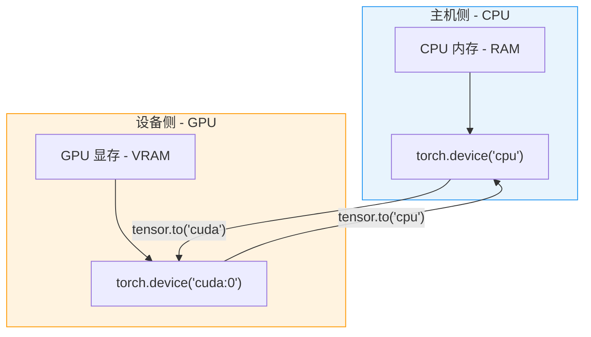
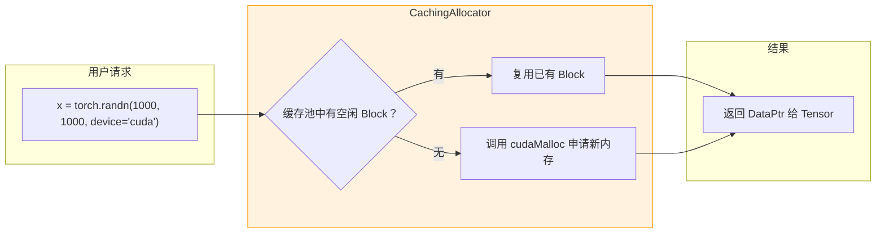

> 难度：入门~中级 | 前置知识：了解 Tensor 基本操作、设备概念

## 1. 为什么需要 CUDA 内存管理

在深度学习训练中，GPU 内存（显存）是最宝贵的资源之一。与 CPU 内存不同，GPU 显存容量有限（通常 8GB-80GB），且分配/释放操作开销较大。PyTorch 的 CUDA 内存管理系统通过**缓存分配器**（CachingAllocator）和**流同步机制**，在性能和内存利用率之间取得平衡。

本文将从用户视角介绍 CUDA 内存的基本概念和常见操作，为后续深入源码解析打下基础。

## 2. 核心概念

### 2.1 设备内存 vs 主机内存

PyTorch 中的 Tensor 可以存在于两类内存中：



**关键特性对比**：

| 特性 | CPU 内存 | GPU 显存 |
|------|----------|----------|
| **容量** | 通常 16GB-256GB | 通常 8GB-80GB（受限） |
| **访问速度** | 较慢（DDR4/DDR5） | 极快（HBM/GDDR6） |
| **分配开销** | 较小（glibc malloc） | 较大（cudaMalloc ~1ms） |
| **并行计算** | 多线程（数十核） | 大规模并行（数千核） |
| **PyTorch 设备标识** | `torch.device('cpu')` | `torch.device('cuda:N')` |

### 2.2 显式设备放置

创建 Tensor 时可以指定设备：

```python
import torch

# 方法 1 - 创建时指定
x_cpu = torch.randn(3, 4, device='cpu')
x_gpu = torch.randn(3, 4, device='cuda:0')  # 放置在第 0 号 GPU

# 方法 2 - 先创建后迁移
x = torch.randn(3, 4)  # 默认在 CPU
x = x.to('cuda')       # 迁移到当前默认 GPU
x = x.cuda(0)          # 迁移到 GPU 0（旧式 API）

# 查询 Tensor 所在设备
print(x.device)       # cuda:0
print(x.is_cuda)      # True
```

**关键规则**：
- 同一运算的所有输入 Tensor 必须在同一设备上
- 跨设备运算会抛出 `RuntimeError: Expected all tensors to be on the same device`

### 2.3 数据传输 - CPU ↔ GPU

```python
# CPU -> GPU（分配显存 + 拷贝数据）
x_cpu = torch.randn(1000, 1000, device='cpu')
x_gpu = x_cpu.to('cuda')  # 同步拷贝，阻塞 CPU

# GPU -> CPU（拷贝回主机内存）
y_cpu = x_gpu.to('cpu')

# GPU 0 -> GPU 1（跨 GPU 拷贝）
x_gpu0 = torch.randn(100, device='cuda:0')
x_gpu1 = x_gpu0.to('cuda:1')
```

**性能提示**：
- `to()` 方法会自动检测目标设备，如果已在目标设备则返回原 Tensor（避免不必要拷贝）
- 数据传输受 PCIe 带宽限制（通常 16GB/s），大 Tensor 传输会成为瓶颈

## 3. 显存分配与释放

### 3.1 延迟分配机制

PyTorch 采用**惰性初始化**：只有在第一次操作 CUDA Tensor 时才会初始化 CUDA 上下文和分配显存。

```python
import torch

# 此时还未分配显存
x = torch.randn(1000, 1000, device='cuda')

# 现在才真正分配显存并执行运算
y = x + 1

# 查看当前显存使用
print(f"已分配：{torch.cuda.memory_allocated() / 1e6:.2f} MB")
print(f"已缓存：{torch.cuda.memory_reserved() / 1e6:.2f} MB")
```

### 3.2 缓存分配器工作原理

为避免频繁调用耗时的 `cudaMalloc`/`cudaFree`，PyTorch 使用 **CachingAllocator** 维护显存池：



**关键特性**：
- **内存池复用**：删除 Tensor 后，显存不立即归还系统，而是放入缓存池供后续分配复用
- **减少系统调用**：避免频繁的 `cudaMalloc`（耗时约 1ms）
- **碎片化管理**：自动分割和合并内存块

### 3.3 手动释放显存

```python
# 方法 1 - 删除 Tensor 引用
x = torch.randn(1000, 1000, device='cuda')
del x  # 显存进入缓存池，但未归还系统

# 方法 2 - 清空缓存池
torch.cuda.empty_cache()  # 归还所有未使用的缓存显存给系统

# 方法 3 - 同步删除（确保释放完成）
torch.cuda.synchronize()
del x
torch.cuda.empty_cache()
```

**注意**：
- `torch.cuda.empty_cache()` 只释放**未被占用**的缓存，不会删除仍有引用的 Tensor
- 频繁调用 `empty_cache()` 会导致性能下降（失去缓存优势）

## 4. 显存使用监控

### 4.1 基础统计 API

```python
import torch

# 已分配显存（实际被 Tensor 占用的）
allocated = torch.cuda.memory_allocated(device=0)
print(f"已分配：{allocated / 1e9:.2f} GB")

# 已缓存显存（包括空闲的缓存）
reserved = torch.cuda.memory_reserved(device=0)
print(f"已缓存：{reserved / 1e9:.2f} GB")

# GPU 总显存容量
total = torch.cuda.get_device_properties(0).total_memory
print(f"总容量：{total / 1e9:.2f} GB")
```

### 4.2 详细内存快照

```python
# 获取详细的内存统计信息
stats = torch.cuda.memory_stats(device=0)

print(f"峰值已分配：{stats['allocated_bytes.all.peak'] / 1e9:.2f} GB")
print(f"峰值已缓存：{stats['reserved_bytes.all.peak'] / 1e9:.2f} GB")
print(f"活跃分配次数：{stats['num_alloc_retries']}")

# 生成人类可读的摘要
print(torch.cuda.memory_summary(device=0))
```

### 4.3 内存分析器（高级）

```python
# PyTorch 2.1+ 提供的内存分析工具
torch.cuda.memory._record_memory_history()

# ... 执行你的代码 ...

# 生成内存快照（可用 Chrome 查看）
torch.cuda.memory._dump_snapshot("memory_snapshot.pickle")

torch.cuda.memory._record_memory_history(enabled=None)  # 停止记录
```

## 5. 多 GPU 管理

### 5.1 设备选择与切换

```python
import torch

# 查询可用 GPU 数量
num_gpus = torch.cuda.device_count()
print(f"可用 GPU 数量：{num_gpus}")

# 获取当前默认设备
current_device = torch.cuda.current_device()
print(f"当前设备：{current_device}")

# 上下文管理器切换设备
with torch.cuda.device(1):
    # 在此上下文中，默认设备是 cuda:1
    x = torch.randn(100, device='cuda')  # 实际在 cuda:1
    print(x.device)  # cuda:1
```

### 5.2 显式设备放置（多 GPU 场景）

```python
# 在不同 GPU 上创建 Tensor
x_gpu0 = torch.randn(1000, device='cuda:0')
x_gpu1 = torch.randn(1000, device='cuda:1')

# 跨 GPU 计算（需先同步到同一设备）
# 错误示例：
# y = x_gpu0 + x_gpu1  # RuntimeError!

# 正确示例：
x_gpu1_on_gpu0 = x_gpu1.to('cuda:0')
y = x_gpu0 + x_gpu1_on_gpu0  # 在 cuda:0 上计算
```

## 6. 常见问题与解决方案

### 6.1 Out of Memory (OOM) 错误

```python
try:
    # 分配超过显存容量的 Tensor
    x = torch.randn(100000, 100000, device='cuda')
except RuntimeError as e:
    if "out of memory" in str(e):
        print("显存不足！")
        torch.cuda.empty_cache()  # 清空缓存重试
```

**解决策略**：
1. 减小 batch size
2. 使用梯度检查点（gradient checkpointing）
3. 使用混合精度训练（AMP）
4. 清空不必要的缓存

### 6.2 显存泄漏排查

```python
import torch

# 在训练循环前记录基线
torch.cuda.reset_peak_memory_stats()
baseline = torch.cuda.memory_allocated()

for epoch in range(10):
    # 你的训练代码
    loss = model(data)
    loss.backward()
    optimizer.step()

    # 检查显存是否持续增长
    current = torch.cuda.memory_allocated()
    if current > baseline * 1.5:
        print(f"警告：显存泄漏！当前 {current/1e9:.2f} GB，基线 {baseline/1e9:.2f} GB")
```

**常见泄漏原因**：
- 在训练循环中累积未释放的 Tensor（如历史 loss 列表）
- 未正确 detach 不需要梯度的中间变量
- 在 Python 列表中持有 CUDA Tensor 引用

### 6.3 同步与异步操作

```python
import time
import torch

x = torch.randn(1000, 1000, device='cuda')

# CUDA 操作默认是异步的
start = time.time()
y = x @ x.T  # 矩阵乘法（异步发起）
print(f"异步耗时：{time.time() - start:.6f}s")  # 几乎为 0

# 强制同步（等待 GPU 完成）
start = time.time()
y = x @ x.T
torch.cuda.synchronize()  # 阻塞直到 GPU 完成
print(f"同步耗时：{time.time() - start:.6f}s")  # 真实耗时
```

**关键点**：
- CUDA 操作默认**异步提交**到 GPU 队列，CPU 立即继续执行
- 数据传输（`to('cpu')`）、打印 Tensor 值等操作会隐式同步
- 性能测试时必须使用 `torch.cuda.synchronize()`

## 7. 实战示例 - 优化数据加载

```python
import torch
import time

# 示例：将数据批次预加载到 GPU
class PrefetchLoader:
    def __init__(self, loader, device):
        self.loader = loader
        self.device = device

    def __iter__(self):
        stream = torch.cuda.Stream()
        first = True

        for batch in self.loader:
            with torch.cuda.stream(stream):
                next_batch = self._to_device(batch)

            if not first:
                yield current_batch
            else:
                first = False

            torch.cuda.current_stream().wait_stream(stream)
            current_batch = next_batch

        yield current_batch

    def _to_device(self, batch):
        if isinstance(batch, tuple):
            return tuple(x.to(self.device, non_blocking=True) for x in batch)
        return batch.to(self.device, non_blocking=True)

# 使用示例
# dataloader = DataLoader(dataset, batch_size=32)
# prefetch_loader = PrefetchLoader(dataloader, device='cuda')
# for data, target in prefetch_loader:
#     output = model(data)
#     loss = criterion(output, target)
```

## 8. 小结

| 概念 | 关键点 |
|------|--------|
| **设备放置** | 通过 `device` 参数或 `.to()` 方法指定 Tensor 位置 |
| **缓存分配器** | 复用显存避免频繁 cudaMalloc，通过 `empty_cache()` 手动释放 |
| **显存监控** | `memory_allocated()`（实际占用）vs `memory_reserved()`（含缓存） |
| **异步执行** | CUDA 操作异步提交，需 `synchronize()` 强制同步 |
| **跨设备操作** | 同一运算的所有 Tensor 必须在同一设备 |
| **OOM 处理** | 减小 batch size、使用 AMP、梯度检查点 |

## 9. 延伸阅读

- [Module 1 - Tensor/Storage](../module-01-tensor-storage/) - 理解 TensorImpl 和内存分配基础
- [下一篇 - 缓存分配器深入解析](01-caching-allocator.md) - CachingAllocator 源码剖析
- [CUDA Stream 与 Event](02-cuda-stream-event.md) - 异步执行与同步机制
- [PyTorch CUDA 官方文档](https://pytorch.org/docs/stable/notes/cuda.html)
