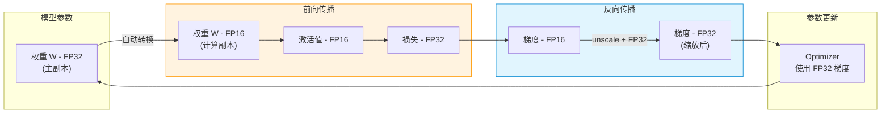
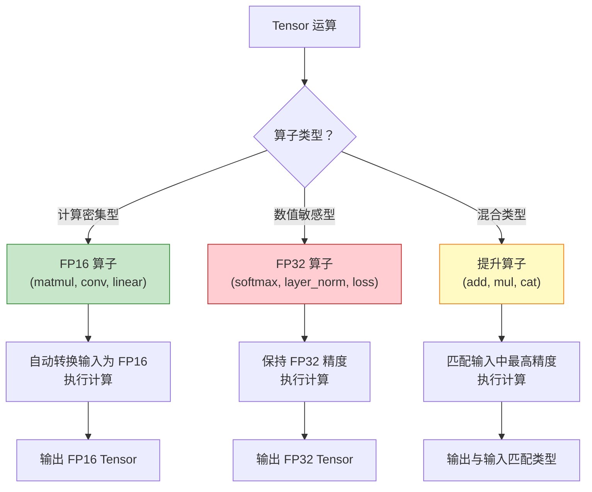
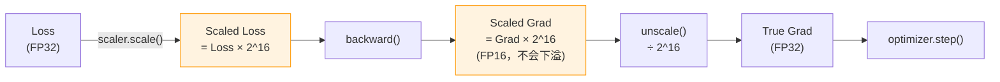
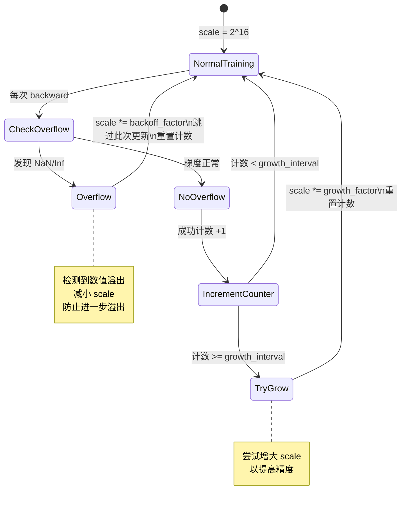

> 难度：中级 | 前置知识：了解浮点数表示（FP32/FP16）、深度学习训练流程

## 1. 为什么需要混合精度

### 1.1 FP32 vs FP16 对比

| 特性 | FP32 (float) | FP16 (half) | BFloat16 |
|------|--------------|-------------|----------|
| **精度** | ~7 位十进制 | ~3 位十进制 | ~2 位十进制 |
| **数值范围** | ±3.4×10³⁸ | ±65504 | ±3.4×10³⁸ |
| **内存占用** | 4 字节 | 2 字节 | 2 字节 |
| **计算速度（V100）** | 14 TFLOPS | 112 TFLOPS | ~56 TFLOPS |
| **典型用途** | 传统训练 | 推理、部分训练 | Google TPU、新一代 GPU 训练 |

**混合精度的动机**：
- FP16 显存占用减半 → 可使用更大 batch size
- FP16 计算速度提升 **8倍**（Tensor Core 加速）
- 但纯 FP16 训练会导致数值下溢/上溢 → 需要混合使用

### 1.2 混合精度训练架构



## 2. Autocast 机制

### 2.1 核心 API

```python
import torch
from torch.cuda.amp import autocast, GradScaler

model = MyModel().cuda()
optimizer = torch.optim.Adam(model.parameters())
scaler = GradScaler()

for data, target in dataloader:
    optimizer.zero_grad()

    # 前向传播在 autocast 上下文中
    with autocast():
        output = model(data)
        loss = criterion(output, target)

    # 反向传播使用梯度缩放
    scaler.scale(loss).backward()
    scaler.step(optimizer)
    scaler.update()
```

### 2.2 Autocast 类型提升规则

Autocast 根据算子类型自动选择精度：



**典型算子分类**：

| 类别 | 算子示例 | 精度选择 | Rationale |
|------|----------|----------|-----------|
| **FP16 算子** | `matmul`、`conv2d`、`linear` | FP16 | 计算密集，FP16 加速明显 |
| **FP32 算子** | `softmax`、`log_softmax`、`cross_entropy`、`layer_norm` | FP32 | 数值敏感，需要高精度 |
| **提升算子** | `add`、`mul`、`cat`、`stack` | 取最高精度 | 不做类型转换，保持输入类型 |

源码位置：`torch/amp/autocast_mode.py:52-150`（autocast 类文档字符串）

### 2.3 Autocast 工作原理

```python
import torch

x_fp32 = torch.randn(1000, 1000, device='cuda')  # FP32

with torch.autocast(device_type='cuda'):
    # torch.mm 在 autocast 列表中 -> 自动转 FP16
    y = x_fp32 @ x_fp32  # 输入 FP32，自动转为 FP16 计算
    print(y.dtype)  # torch.float16

    # softmax 需要 FP32 精度 -> 保持 FP32
    z = torch.softmax(y, dim=-1)  # 自动转回 FP32 计算
    print(z.dtype)  # torch.float32
```

**实现机制**：
- Autocast 通过**线程局部状态**（TLS）控制是否启用
- 进入 `with autocast():` 时设置 TLS 标志
- 每个算子在分发前检查 TLS，决定是否转换类型
- 退出上下文后恢复原始状态

源码位置：`torch/_C/_autocast.cpp`（C++ 实现）

## 3. GradScaler - 梯度缩放器

### 3.1 为什么需要梯度缩放

FP16 的数值范围很小（±65504），容易出现**梯度下溢**（gradient underflow）：

```python
# 小梯度在 FP16 中会变成 0
grad_fp32 = 1e-5  # FP32 可以表示
grad_fp16 = torch.tensor(1e-5, dtype=torch.float16)
print(grad_fp16)  # 0.0（下溢！）
```

**解决方案**：在 `loss.backward()` 前将 loss 乘以缩放因子（scale），梯度也会被同比例放大：



### 3.2 GradScaler API

```python
from torch.cuda.amp import GradScaler

scaler = GradScaler(
    init_scale=2.**16,  # 初始缩放因子
    growth_factor=2.0,  # 增长因子
    backoff_factor=0.5, # 回退因子
    growth_interval=2000,  # 每 N 次迭代尝试增大 scale
)

for data, target in dataloader:
    optimizer.zero_grad()

    with autocast():
        output = model(data)
        loss = criterion(output, target)

    # 1. 缩放 loss
    scaler.scale(loss).backward()

    # 2. unscale 梯度（检查 NaN/Inf）
    scaler.unscale_(optimizer)

    # 3. 梯度裁剪（可选，必须在 unscale 后）
    torch.nn.utils.clip_grad_norm_(model.parameters(), max_norm=1.0)

    # 4. 更新参数（如果梯度有效）
    scaler.step(optimizer)

    # 5. 更新 scaler 的缩放因子
    scaler.update()
```

### 3.3 动态缩放因子调整



**关键逻辑**：
- 每次遇到 overflow → `scale *= 0.5`（减小缩放因子）
- 连续 2000 次无 overflow → `scale *= 2`（增大缩放因子）
- 自动平衡数值稳定性与精度

源码位置：`torch/amp/grad_scaler.py`

## 4. 代码路径调试

### 4.1 Autocast 启用流程

```python
# 用户代码
with torch.autocast(device_type='cuda'):
    y = x @ x.T
```

**执行链路**：
1. `torch.autocast.__enter__()` → 设置 C++ 侧 TLS 状态
2. `torch._C._set_autocast_enabled(True, 'cuda')`
3. 执行 `x @ x.T`：
   - 分发到 `at::mm` 算子
   - 检查 `at::autocast::is_autocast_enabled()` → True
   - 查询算子白名单 → `mm` 在 FP16 列表中
   - 自动转换：`x.to(torch.float16)` 和 `x.T.to(torch.float16)`
   - 调用 FP16 版本的 `at::mm`
4. 返回 FP16 Tensor
5. `torch.autocast.__exit__()` → 恢复 TLS 状态

源码位置：
- Python: `torch/amp/autocast_mode.py`
- C++: `aten/src/ATen/autocast_mode.cpp`

### 4.2 GradScaler 梯度检查

```python
scaler.step(optimizer)
```

**内部逻辑**：
```python
# 简化伪代码
def step(self, optimizer):
    # 1. 检查梯度是否有 NaN/Inf
    if self._has_inf_or_nan():
        # 跳过此次更新
        self._scale *= self._backoff_factor
        return

    # 2. 梯度正常 -> 执行优化器更新
    optimizer.step()

    # 3. 增加成功计数
    self._growth_tracker += 1

    # 4. 定期增大 scale
    if self._growth_tracker >= self._growth_interval:
        self._scale *= self._growth_factor
        self._growth_tracker = 0
```

## 5. BFloat16 vs Float16

### 5.1 格式对比

```
Float32:  [符号1位] [指数8位] [尾数23位]
Float16:  [符号1位] [指数5位] [尾数10位]  <- 数值范围小
BFloat16: [符号1位] [指数8位] [尾数7位]   <- 范围与 FP32 相同
```

**优势对比**：
- **Float16**：精度更高（10位尾数），但易溢出（5位指数）
- **BFloat16**：范围更大（8位指数），不易溢出，但精度较低（7位尾数）

### 5.2 使用场景

```python
# CUDA（Ampere 架构及更新）- 优先使用 BFloat16
with torch.autocast(device_type='cuda', dtype=torch.bfloat16):
    output = model(input)

# CPU - 仅支持 BFloat16
with torch.autocast(device_type='cpu', dtype=torch.bfloat16):
    output = model(input)

# 旧 GPU（Pascal, Volta）- 只能用 Float16
with torch.autocast(device_type='cuda', dtype=torch.float16):
    output = model(input)
```

## 6. 实战示例

### 6.1 完整训练循环

```python
import torch
from torch.cuda.amp import autocast, GradScaler

model = MyModel().cuda()
optimizer = torch.optim.AdamW(model.parameters(), lr=1e-3)
scaler = GradScaler()

for epoch in range(num_epochs):
    for batch in dataloader:
        data, target = batch
        data, target = data.cuda(), target.cuda()

        optimizer.zero_grad()

        # 前向传播 - 自动混合精度
        with autocast():
            output = model(data)
            loss = criterion(output, target)

        # 反向传播 - 梯度缩放
        scaler.scale(loss).backward()

        # 梯度裁剪（可选）
        scaler.unscale_(optimizer)
        torch.nn.utils.clip_grad_norm_(model.parameters(), max_norm=1.0)

        # 优化器更新
        scaler.step(optimizer)
        scaler.update()
```

### 6.2 性能对比

```python
import time
import torch

model = LargeModel().cuda()
x = torch.randn(128, 3, 224, 224, device='cuda')

# FP32 基线
torch.cuda.synchronize()
start = time.time()
with torch.no_grad():
    for _ in range(100):
        y = model(x)
torch.cuda.synchronize()
fp32_time = time.time() - start

# AMP 加速
torch.cuda.synchronize()
start = time.time()
with torch.no_grad(), autocast():
    for _ in range(100):
        y = model(x)
torch.cuda.synchronize()
amp_time = time.time() - start

print(f"FP32: {fp32_time:.3f}s")
print(f"AMP:  {amp_time:.3f}s")
print(f"加速比: {fp32_time / amp_time:.2f}x")
# 典型输出：加速 1.5-2.5x（取决于模型和 GPU）
```

## 7. 常见问题

### 7.1 Loss 变成 NaN

**原因**：梯度上溢或下溢。

**解决方案**：
1. 检查初始 scale 是否过大/过小
2. 检查 learning rate 是否过大
3. 使用梯度裁剪

### 7.2 Autocast 覆盖范围

**错误示例**：
```python
# 错误：backward 在 autocast 内
with autocast():
    output = model(data)
    loss = criterion(output, target)
    loss.backward()  # 不推荐！
```

**正确示例**：
```python
# 正确：只包裹前向传播
with autocast():
    output = model(data)
    loss = criterion(output, target)

loss.backward()  # 在 autocast 外
```

### 7.3 自定义算子的 Autocast 支持

```python
# 方法 1 - 使用 custom_fwd/custom_bwd
from torch.cuda.amp import custom_fwd, custom_bwd

class MyFunction(torch.autograd.Function):
    @staticmethod
    @custom_fwd
    def forward(ctx, x):
        # Autocast 会自动应用类型转换
        return x * 2

    @staticmethod
    @custom_bwd
    def backward(ctx, grad_output):
        return grad_output * 2

# 方法 2 - 手动控制
class MyOp(torch.autograd.Function):
    @staticmethod
    def forward(ctx, x):
        # 强制使用 FP32
        with torch.autocast(device_type='cuda', enabled=False):
            return x.float() * 2
```

## 8. 小结

| 核心机制 | 关键点 |
|----------|--------|
| **Autocast** | 自动选择算子精度（FP16/FP32），无需手动转换 |
| **GradScaler** | 动态梯度缩放，防止 FP16 下溢/上溢 |
| **FP16 vs BF16** | FP16 精度高但易溢出，BF16 范围大更稳定 |
| **性能提升** | 1.5-3x 加速（取决于模型和硬件） |
| **内存节省** | 约 50%（激活值和梯度减半） |
| **适用场景** | 几乎所有训练任务（需 GPU 支持 Tensor Core） |

## 9. 延伸阅读

- [上一篇 - CUDA Stream 与 Event](02-cuda-stream-event.md)
- [下一篇 - 内存优化实战](04-memory-optimization.md) - 结合 AMP 的显存优化
- [NVIDIA AMP 文档](https://docs.nvidia.com/deeplearning/performance/mixed-precision-training/)
- PyTorch 源码：`torch/amp/autocast_mode.py`、`torch/amp/grad_scaler.py`
