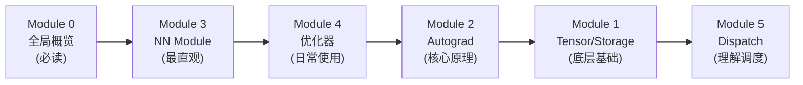
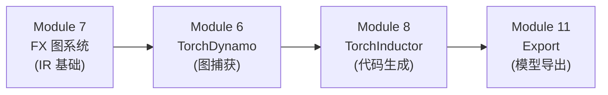
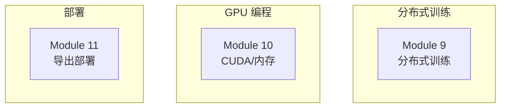

# 阅读路线指南

本文档提供三条阅读路线，适配不同背景和目标的读者。

## 路线一 - 初学者路线（从上层到底层）

适合：有 PyTorch 使用经验，想了解内部机制的开发者。

**推荐阅读顺序：**

1. **[Module 0 - 全局概览](module-00-overview/)** - 建立整体认知，了解三层架构和核心概念
2. **[Module 3 - NN Module](module-03-nn-module/)** - 从最熟悉的 `nn.Module` 入手，理解 Parameter/Buffer 注册、Hook 系统
3. **[Module 4 - 优化器](module-04-optimizer/)** - 理解 `optimizer.step()` 背后的机制，掌握 Adam 算法细节
4. **[Module 2 - Autograd](module-02-autograd/)** - 深入计算图和反向传播引擎，这是 PyTorch 的灵魂
5. **[Module 1 - Tensor/Storage](module-01-tensor-storage/)** - 理解最底层的数据结构 TensorImpl 和内存管理
6. **[Module 5 - Dispatch](module-05-dispatch/)** - 理解算子如何被路由到正确的 kernel

## 路线二 - 编译器路线（torch.compile 全栈）

适合：对 PyTorch 2.0 编译器栈感兴趣，想理解 `torch.compile()` 工作原理的开发者。

**前置要求：** 至少完成路线一的 Module 0 和 Module 2。

**推荐阅读顺序：**

1. **[Module 7 - FX 图系统](module-07-fx/)** - 先理解 FX IR 这个中间表示，它是 Dynamo 和 Inductor 的桥梁
2. **[Module 6 - TorchDynamo](module-06-dynamo/)** - 理解如何从 Python 字节码捕获计算图
3. **[Module 8 - TorchInductor](module-08-inductor/)** - 理解如何从 FX 图生成优化的 Triton/C++ 代码
4. **[Module 11 - Export](module-11-export/)** - 理解 AOT 编译和模型部署

## 路线三 - 专项路线（按需选读）

适合：对特定领域有需求的开发者。各模块相对独立，可按需选读。

- **分布式训练** → [Module 9](module-09-distributed/)：DDP、FSDP、DTensor、DeviceMesh
- **GPU 与内存** → [Module 10](module-10-cuda-memory/)：缓存分配器、CUDA Stream、AMP 混合精度、内存优化实战
- **模型部署** → [Module 11](module-11-export/)：torch.export、AOTInductor

## 每篇文档的结构

每篇文档遵循统一结构，方便定位：

| 章节 | 说明 |
|------|------|
| 概述 | 本篇在整体架构中的位置 |
| 前置知识 | 阅读前建议掌握的内容 |
| 核心概念 | 关键术语和原理（配 Mermaid 图） |
| 源码解析 | 逐段分析关键源码 |
| 代码路径调试 | step-by-step 执行链路跟踪（部分篇目） |
| 实战示例 | 可运行的代码示例 |
| 小结 | 关键要点 |
| 延伸阅读 | 相关文档链接 |
