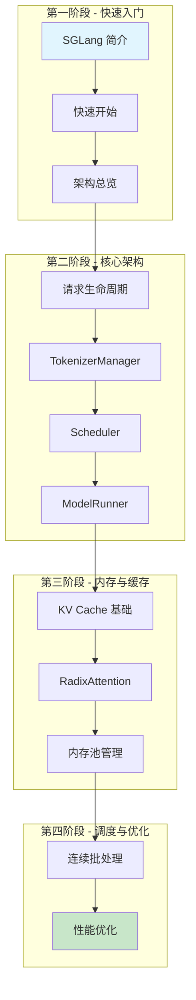
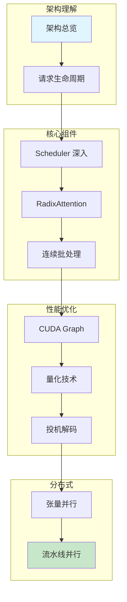

本文档系列旨在帮助深度学习开发者深入理解 SGLang —— 一个由 UC Berkeley LMSYS 团队开发的高性能大语言模型推理框架。我们将从架构设计出发，逐步深入到核心组件和优化技术。

## 你将学到

- SGLang 的三进程架构设计
- 请求生命周期和数据流转
- RadixAttention 前缀缓存机制
- 连续批处理和调度策略
- CUDA Graph 和 Torch Compile 优化
- 分布式推理：张量并行、流水线并行、专家并行

## 学习路线图

### 路径一：基础路径（推荐新手）

适合刚接触 LLM 推理框架的读者，从入门概念学起。

### 路径二：进阶路径（适合有基础的读者）

如果你已经了解 LLM 推理的基本概念，可以直接进入核心内容。

## 文档结构

| 模块 | 内容 |
|------|------|
| 入门篇 | SGLang 简介、快速开始、架构总览 |
| 核心架构篇 | 请求生命周期、TokenizerManager、Scheduler、Detokenizer、ModelRunner |
| 内存与缓存篇 | KV Cache 基础、RadixAttention、内存池、驱逐策略 |
| 批处理与调度篇 | 连续批处理、Chunked Prefill、调度策略、前向模式 |
| 性能优化篇 | CUDA Graph、Torch Compile、量化、投机解码 |
| 分布式与并行篇 | 张量并行、流水线并行、专家并行 |
| 高级特性篇 | 结构化输出、LoRA、多模态 |
| 实战调试篇 | 调试指南、性能分析、问题排查 |

## 文档版本

- **SGLang 版本**：基于 SGLang v0.4.x
- **文档版本**：1.0
- **最后更新**：2025 年 1 月
