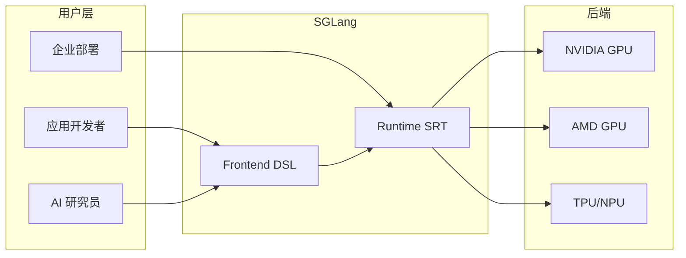
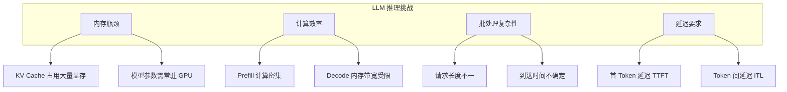
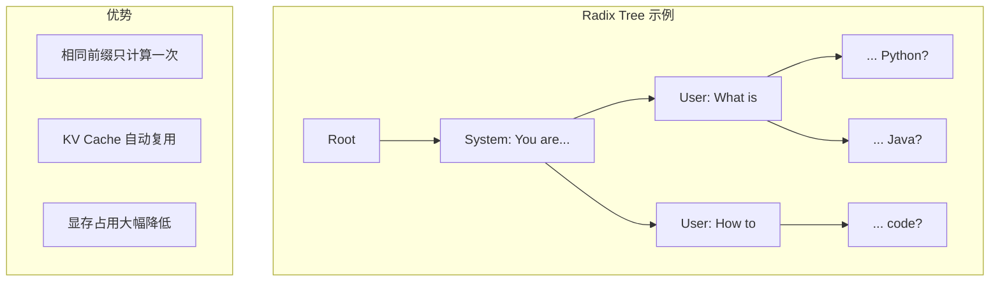
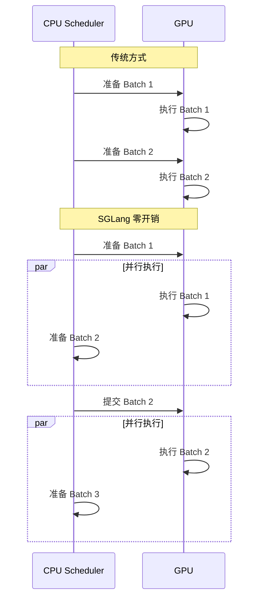
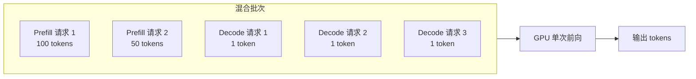
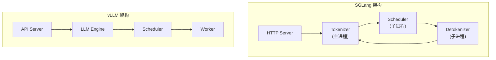
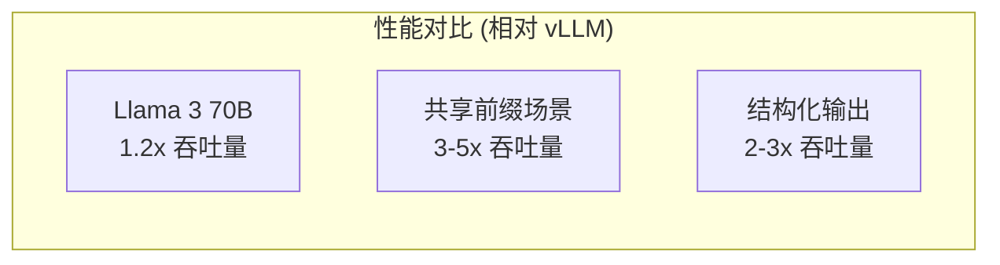

## 概述

### 本章学习目标
- 理解 SGLang 是什么以及它解决的问题
- 了解 SGLang 的核心特性和设计理念
- 对比 SGLang 与 vLLM 等其他框架的差异
- 明确 SGLang 的适用场景

### 前置知识要求
- 了解大语言模型 (LLM) 的基本概念
- 熟悉 Python 编程
- 对 Transformer 架构有基本认识

---

## 什么是 SGLang

SGLang (Structured Generation Language) 是由 UC Berkeley LMSYS 团队开发的高性能大语言模型推理框架。它专注于提供低延迟、高吞吐量的 LLM 服务，已被部署在全球超过 40 万个 GPU 上。

### 核心定位

SGLang 由两个主要部分组成：

1. **Frontend (前端 DSL)**：一种领域特定语言，让开发者可以用简洁的方式编写复杂的 LLM 程序
2. **Runtime (运行时 SRT)**：高性能的推理引擎，负责实际的模型执行

---

## 为什么需要 SGLang

### LLM 推理的挑战

在深入 SGLang 之前，让我们先理解 LLM 推理面临的核心挑战：

**1. 内存瓶颈**
- 每个请求需要存储 KV Cache，7B 模型单请求可能占用 GB 级显存
- 模型参数本身需要常驻 GPU 内存

**2. 计算效率**
- Prefill 阶段是计算密集型（处理整个输入序列）
- Decode 阶段是内存带宽受限（每次只生成一个 token）

**3. 批处理复杂性**
- 不同请求的输入/输出长度差异大
- 请求到达时间不确定

**4. 延迟要求**
- 用户期望快速看到首个 token (TTFT - Time To First Token)
- Token 之间的延迟 (ITL - Inter-Token Latency) 影响用户体验

### SGLang 的解决方案

SGLang 通过一系列创新技术解决这些挑战：

| 挑战 | SGLang 解决方案 |
|------|----------------|
| 内存瓶颈 | RadixAttention 前缀缓存复用 |
| 计算效率 | CUDA Graph 消除 CPU 开销 |
| 批处理复杂性 | 连续批处理 + Chunked Prefill |
| 延迟要求 | 零开销调度器 |

---

## SGLang 核心特性

### 1. RadixAttention：智能前缀缓存

RadixAttention 是 SGLang 的标志性特性，它使用 Radix Tree（基数树）数据结构来管理 KV Cache。

**工作原理**：
- 多个请求如果共享相同的前缀（如系统提示词），它们的 KV Cache 可以复用
- 不需要重复计算相同前缀的注意力
- 可实现 3-5x 的吞吐量提升

### 2. 零开销 CPU 调度器

传统框架中，CPU 调度器是性能瓶颈之一。SGLang 实现了零开销调度：

**关键技术**：
- CPU 和 GPU 流水线重叠
- 批次准备与执行并行化
- 消除等待时间

### 3. 连续批处理与 Chunked Prefill

SGLang 支持将 Prefill 和 Decode 请求混合在同一批次中处理：

**优势**：
- 避免 Decode 请求等待长 Prefill 完成
- 最大化 GPU 利用率
- 降低平均延迟

### 4. 多种优化技术

| 技术 | 说明 |
|------|------|
| CUDA Graph | 预编译 GPU 操作图，消除 kernel launch 开销 |
| Paged Attention | 非连续内存管理，减少碎片化 |
| 量化支持 | FP8/FP4/INT4/AWQ/GPTQ，降低内存占用 |
| 推测解码 | 使用小模型预测，大模型验证，加速生成 |
| Tensor Parallelism | 跨多 GPU 并行，支持大模型 |
| Pipeline Parallelism | 流水线并行，支持超大模型 |

---

## SGLang vs vLLM：深度对比

作为两个主流的 LLM 推理框架，SGLang 和 vLLM 有不同的设计理念：

### 架构对比

### 特性对比

| 特性 | SGLang | vLLM |
|------|--------|------|
| 前缀缓存 | RadixAttention (自动) | Prefix Caching (手动) |
| 调度器 | 零开销，多进程 | 单进程 |
| 前端 DSL | 有 (结构化生成) | 无 |
| Chunked Prefill | 原生支持 | 后续版本支持 |
| CUDA Graph | 全面支持 | 部分支持 |
| 硬件支持 | NVIDIA/AMD/TPU/NPU | NVIDIA/AMD/TPU |
| 模型支持 | 150+ | 100+ |

### 性能对比

根据官方基准测试，SGLang 在多个场景下表现优异：

**选择建议**：
- 如果需要前缀缓存、结构化输出：选 SGLang
- 如果需要稳定性、社区支持：两者都可
- 如果使用 DeepSeek 模型：推荐 SGLang（官方优化）

---

## SGLang 适用场景

### 最佳适用场景

1. **API 服务部署**
   - 高并发在线推理
   - 需要低延迟响应
   - 多租户服务

2. **RAG 应用**
   - 大量共享系统提示词
   - 前缀缓存效果显著

3. **结构化输出**
   - JSON Schema 约束
   - 正则表达式约束
   - 语法约束

4. **批量推理**
   - 离线数据处理
   - 评测任务

5. **强化学习**
   - RL 训练的 rollout 后端
   - 与 verl、AReaL 等框架集成

### 支持的模型

SGLang 支持 150+ 种模型架构：

| 类型 | 模型示例 |
|------|---------|
| 文本 LLM | Llama, Qwen, DeepSeek, Mistral, GPT, Gemma |
| 视觉语言 | LLaVA, Qwen-VL, DeepSeek-VL, GLM-4V |
| 嵌入模型 | E5-Mistral, GTE, MCDSE |
| 奖励模型 | Skywork-Reward |
| 扩散模型 | WAN, Qwen-Image |

---

## 小结

### 要点回顾

1. **SGLang 定位**：高性能 LLM 推理框架，由 Frontend DSL 和 Runtime SRT 组成
2. **核心特性**：RadixAttention、零开销调度、连续批处理、CUDA Graph
3. **vs vLLM**：更强的前缀缓存、更灵活的调度、有前端 DSL
4. **适用场景**：API 服务、RAG、结构化输出、批量推理、RL

### 延伸阅读

- [SGLang 官方文档](https://docs.sglang.ai/)
- [SGLang GitHub](https://github.com/sgl-project/sglang)
- [LMSYS 博客](https://lmsys.org/blog/)
- [RadixAttention 论文](https://arxiv.org/abs/2312.07104)

### 下一章预告

在下一章《快速开始》中，我们将：
- 安装 SGLang
- 启动第一个推理服务
- 发送 API 请求
- 了解基本配置选项
