## 概述

### 本章学习目标
- 理解 SGLang 的三进程架构设计
- 了解各组件的职责和交互方式
- 掌握数据在系统中的流转过程
- 明确关键代码文件的位置

### 前置知识要求
- 了解进程间通信基础
- 理解生产者-消费者模式
- 熟悉异步编程概念

---

## 整体架构

SGLang Runtime (SRT) 采用三进程架构设计，将不同职责分离到独立进程中：

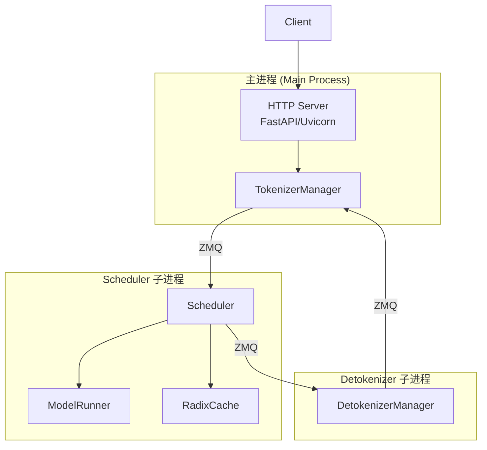

### 为什么采用多进程架构？

| 优势 | 说明 |
|------|------|
| GIL 规避 | Python GIL 限制多线程，多进程可真正并行 |
| 故障隔离 | 单个进程崩溃不影响其他进程 |
| 资源独立 | 各进程有独立内存空间，避免竞争 |
| 扩展性 | 可独立扩展各组件 |

---

## 核心组件详解

### 1. HTTP Server

**职责**：接收客户端请求，返回响应

**关键文件**：`python/sglang/srt/entrypoints/http_server.py`

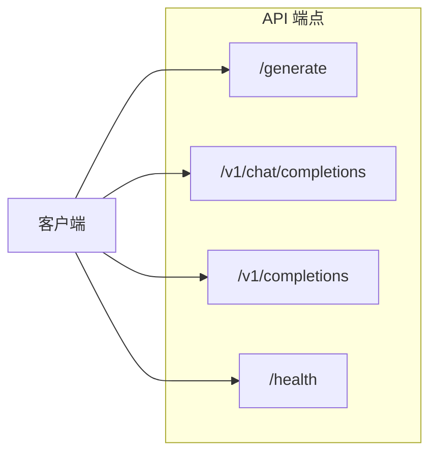

**主要功能**：
- OpenAI 兼容 API
- 原生 generate API
- 健康检查
- 流式响应支持

### 2. TokenizerManager

**职责**：请求的入口管理，负责 Tokenization

**关键文件**：`python/sglang/srt/managers/tokenizer_manager.py`

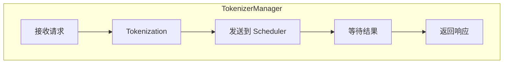

**主要功能**：
- 将文本转换为 Token IDs
- 应用 Chat Template
- 管理请求状态
- 处理流式输出

### 3. Scheduler

**职责**：核心调度器，管理批处理和 GPU 计算

**关键文件**：`python/sglang/srt/managers/scheduler.py`

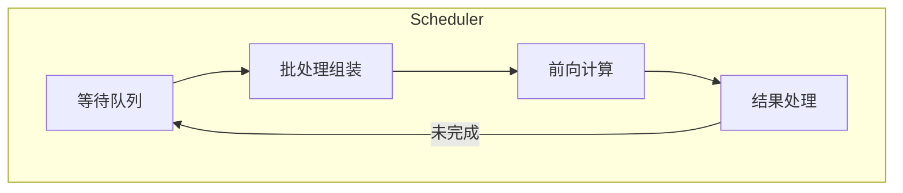

**主要功能**：
- 请求排队和调度
- KV Cache 管理
- 批处理策略
- 与 ModelRunner 交互

### 4. ModelRunner

**职责**：执行模型前向计算

**关键文件**：`python/sglang/srt/model_executor/model_runner.py`

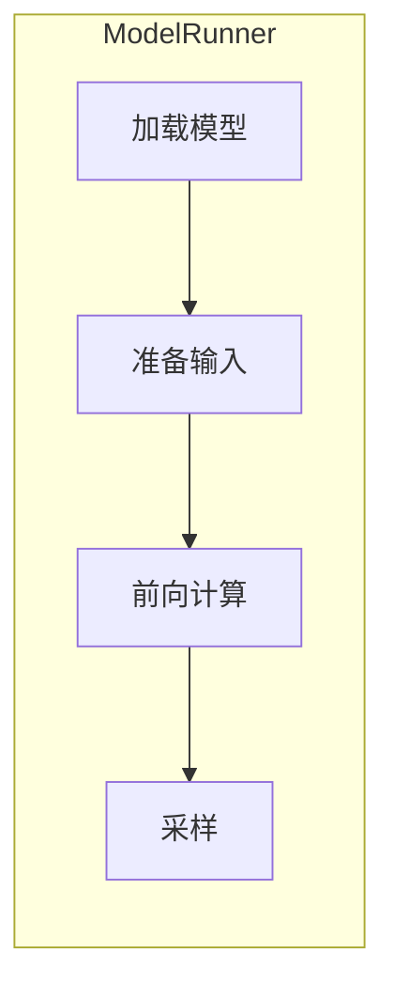

**主要功能**：
- 模型加载和初始化
- 构建 ForwardBatch
- 执行前向传播
- CUDA Graph 管理

### 5. DetokenizerManager

**职责**：将 Token IDs 转换回文本

**关键文件**：`python/sglang/srt/managers/detokenizer_manager.py`

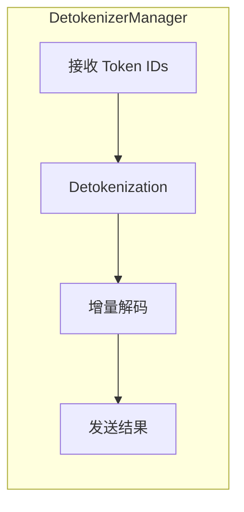

**主要功能**：
- 增量 Detokenization
- 处理特殊 Token
- 流式文本输出

### 6. RadixCache

**职责**：管理 KV Cache 的前缀复用

**关键文件**：`python/sglang/srt/mem_cache/radix_cache.py`

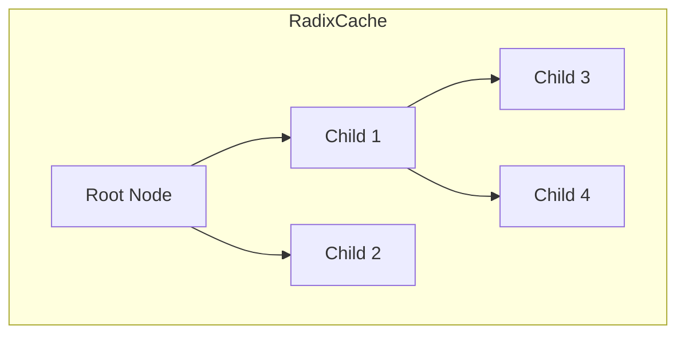

**主要功能**：
- Radix Tree 数据结构
- 前缀匹配
- 缓存淘汰
- 引用计数

---

## 进程间通信

### ZeroMQ 通信

SGLang 使用 ZeroMQ (ZMQ) 进行进程间通信：

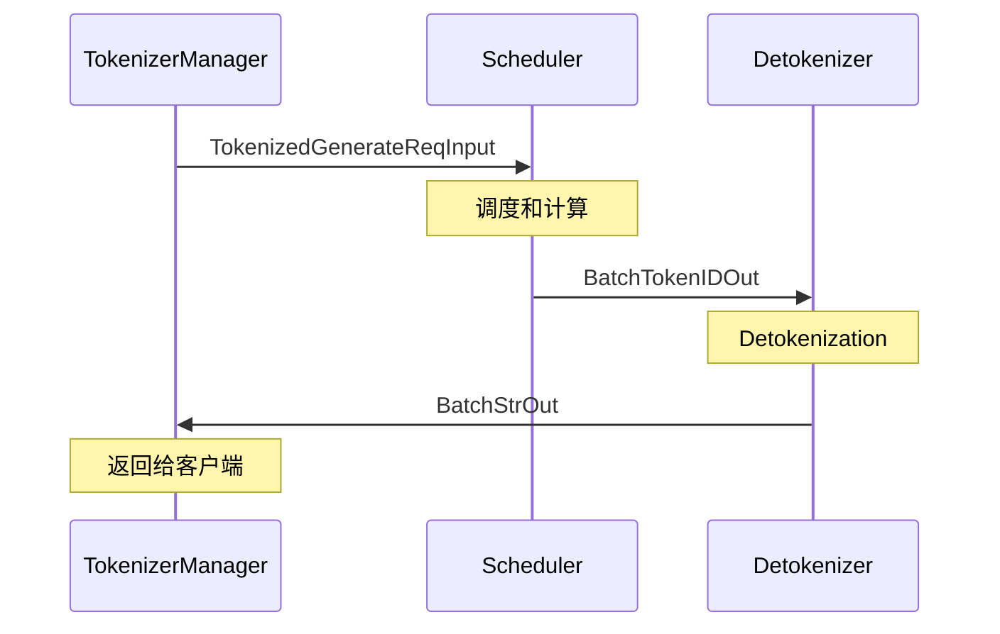

### 消息类型

| 消息 | 方向 | 内容 |
|------|------|------|
| `TokenizedGenerateReqInput` | TM → Scheduler | Token IDs, 采样参数 |
| `BatchTokenIDOut` | Scheduler → DT | 生成的 Token IDs |
| `BatchStrOut` | DT → TM | 解码后的文本 |

---

## 数据流详解

### 完整请求流程

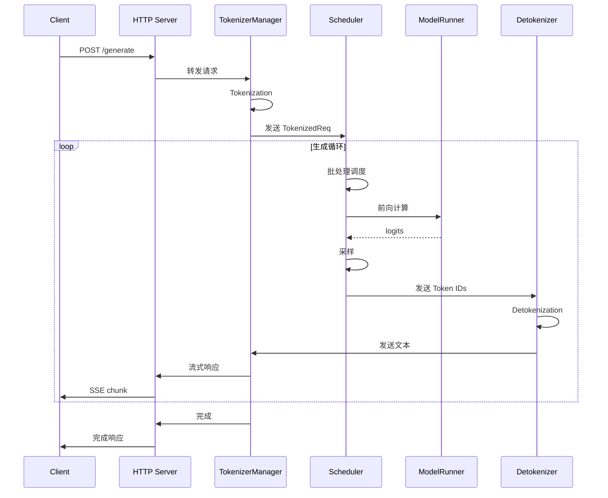

### 数据结构转换

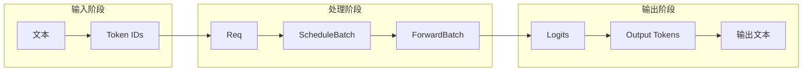

---

## 关键代码文件索引

### 入口点

| 文件 | 说明 |
|------|------|
| `sglang/srt/entrypoints/http_server.py` | HTTP 服务器入口 |
| `sglang/srt/entrypoints/engine.py` | 离线引擎入口 |
| `sglang/launch_server.py` | 服务启动脚本 |

### 管理器

| 文件 | 说明 |
|------|------|
| `sglang/srt/managers/tokenizer_manager.py` | Tokenizer 管理 |
| `sglang/srt/managers/scheduler.py` | 调度器 |
| `sglang/srt/managers/detokenizer_manager.py` | Detokenizer 管理 |
| `sglang/srt/managers/schedule_batch.py` | 批处理数据结构 |
| `sglang/srt/managers/schedule_policy.py` | 调度策略 |

### 模型执行

| 文件 | 说明 |
|------|------|
| `sglang/srt/model_executor/model_runner.py` | 模型运行器 |
| `sglang/srt/model_executor/cuda_graph_runner.py` | CUDA Graph |
| `sglang/srt/model_executor/forward_batch_info.py` | ForwardBatch |

### 缓存管理

| 文件 | 说明 |
|------|------|
| `sglang/srt/mem_cache/radix_cache.py` | Radix Cache |
| `sglang/srt/mem_cache/memory_pool.py` | 内存池 |

---

## 配置与启动流程

### 启动序列

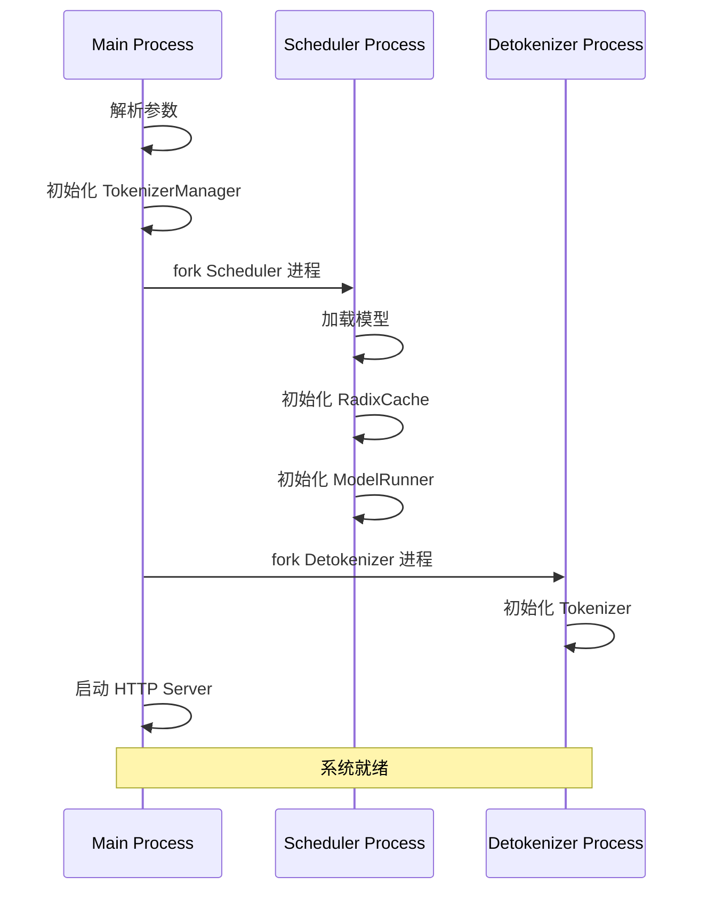

### ServerArgs 关键参数

```python
@dataclass
class ServerArgs:
    # 模型配置
    model_path: str
    tokenizer_path: Optional[str] = None
    context_length: Optional[int] = None

    # 服务配置
    host: str = "127.0.0.1"
    port: int = 30000

    # 并行配置
    tensor_parallel_size: int = 1
    pipeline_parallel_size: int = 1

    # 内存配置
    mem_fraction_static: float = 0.88
    max_running_requests: Optional[int] = None

    # 调度配置
    schedule_policy: str = "lpm"
    chunked_prefill_size: int = 8192
```

---

## 小结

### 要点回顾

1. **三进程架构**：Main (HTTP + Tokenizer)、Scheduler、Detokenizer
2. **核心组件**：TokenizerManager、Scheduler、ModelRunner、DetokenizerManager、RadixCache
3. **通信方式**：ZeroMQ 进程间通信
4. **数据流转**：Text → Tokens → Req → Batch → Forward → Output

### 架构优势

- 充分利用多核 CPU
- 规避 Python GIL
- 组件职责清晰
- 易于扩展和调试

### 下一章预告

在下一章《请求生命周期》中，我们将：
- 跟踪一个请求的完整处理过程
- 深入理解各阶段的数据转换
- 学习关键代码的执行路径
