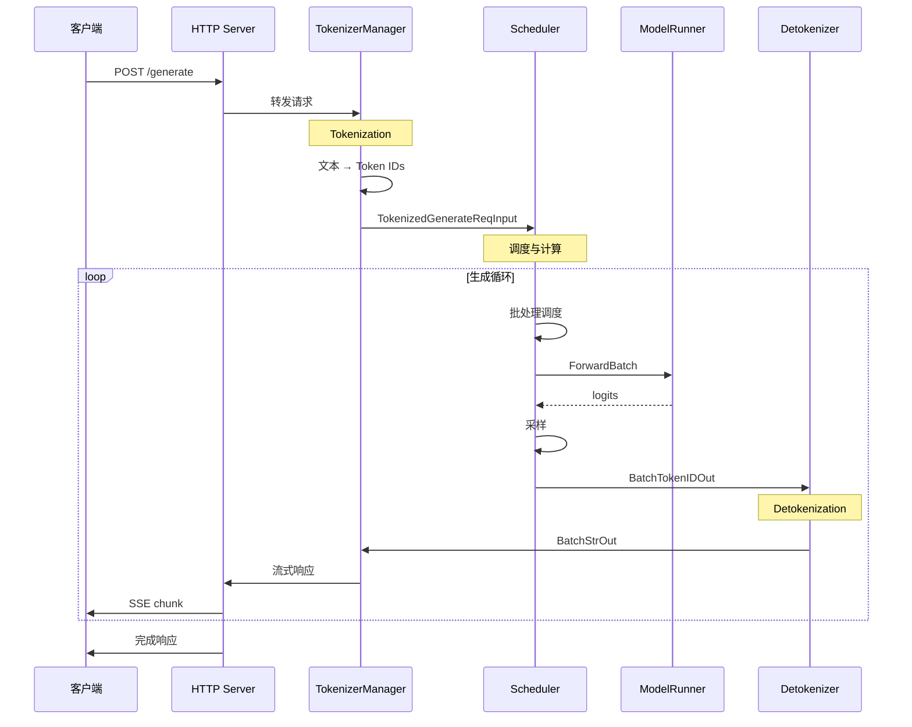
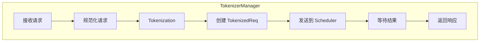
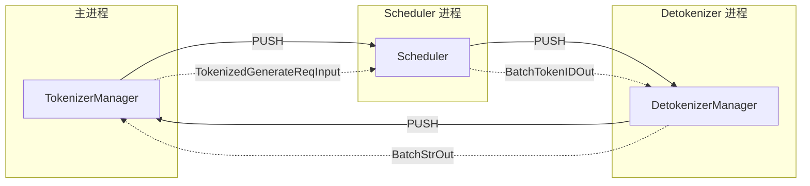
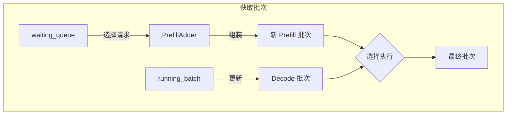
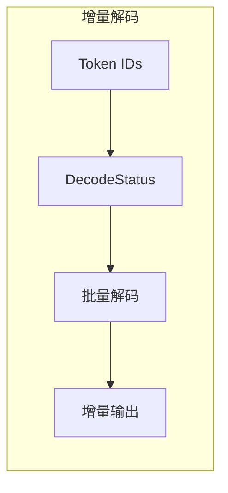
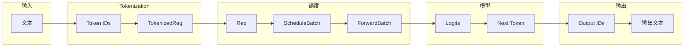
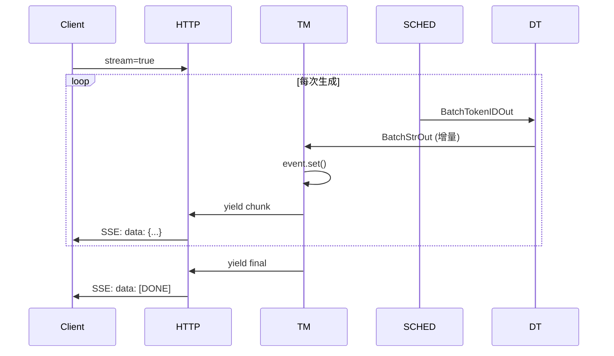

## 概述

### 本章学习目标
- 跟踪一个请求的完整处理过程
- 理解 ZMQ 进程间通信机制
- 掌握各阶段的数据结构转换
- 了解流式输出的实现原理

### 前置知识要求
- 了解 SGLang 三进程架构
- 熟悉 ZeroMQ 基本概念
- 理解异步编程模型

---

## 请求流转总览

一个请求从进入到返回，经历以下阶段：



---

## 阶段一：HTTP 请求接收

### 请求入口

**关键文件**：`python/sglang/srt/entrypoints/http_server.py`

```python
# /generate 端点
@app.api_route("/generate", methods=["POST", "PUT"])
async def generate_request(obj: GenerateReqInput, request: Request):
    if obj.stream:
        # 流式响应
        async def stream_results() -> AsyncIterator[bytes]:
            async for out in _global_state.tokenizer_manager.generate_request(
                obj, request
            ):
                yield b"data: " + orjson.dumps(out) + b"\n\n"
        return StreamingResponse(stream_results(), media_type="text/event-stream")
    else:
        # 非流式响应
        ret = await _global_state.tokenizer_manager.generate_request(
            obj, request
        ).__anext__()
        return ret
```

### 请求数据结构

**关键文件**：`python/sglang/srt/managers/io_struct.py`

```python
@dataclass
class GenerateReqInput:
    # 输入内容（二选一）
    text: Optional[Union[str, List[str]]] = None
    input_ids: Optional[Union[List[int], List[List[int]]]] = None

    # 采样参数
    sampling_params: Optional[Dict] = None

    # 请求标识
    rid: Optional[Union[str, List[str]]] = None

    # 流式选项
    stream: bool = False

    # 其他选项
    return_logprob: bool = False
    logprob_start_len: int = 0
    top_logprobs_num: int = 0
```

---

## 阶段二：TokenizerManager 处理

### 处理流程



### 核心方法

**关键文件**：`python/sglang/srt/managers/tokenizer_manager.py`

```python
async def generate_request(self, obj: GenerateReqInput, request=None):
    # 1. 规范化请求（展开 batch、parallel sampling）
    obj.normalize_batch_and_arguments()

    # 2. 单个请求处理
    if obj.is_single:
        # Tokenization
        tokenized_obj = await self._tokenize_one_request(obj)

        # 发送到 Scheduler
        state = self._send_one_request(obj, tokenized_obj, created_time)

        # 等待响应
        async for response in self._wait_one_response(obj, state, request):
            yield response
    else:
        # 批量请求处理
        async for response in self._handle_batch_request(obj, request, created_time):
            yield response
```

### Tokenization 过程

```python
async def _tokenize_one_request(self, obj):
    # 1. 获取输入文本
    input_text = obj.text

    # 2. 调用 tokenizer
    if self.async_dynamic_batch_tokenizer:
        # 异步批量 tokenizer（低延迟）
        input_ids = await self.async_dynamic_batch_tokenizer.encode(input_text)
    else:
        # 常规 tokenizer
        input_ids = self.tokenizer.encode(input_text)

    # 3. 处理多模态数据（如有）
    if obj.image_data or obj.audio_data:
        mm_inputs = await self.mm_processor.process(obj)

    # 4. 创建内部请求对象
    return TokenizedGenerateReqInput(
        rid=obj.rid,
        input_ids=input_ids,
        sampling_params=obj.sampling_params,
        # ...
    )
```

### ReqState 状态管理

```python
@dataclass
class ReqState:
    out_list: List[Dict]        # 输出列表
    finished: bool              # 是否完成
    event: asyncio.Event        # 异步事件
    obj: GenerateReqInput       # 原始请求

    # 时间戳
    created_time: float
    finished_time: float = 0.0
    first_token_time: float = 0.0

    # 累积状态
    text: str = ""              # 累积输出文本
    output_ids: List[int] = []  # 输出 token IDs
```

---

## 阶段三：ZMQ 进程间通信

### 通信架构



### IPC 通道初始化

**TokenizerManager 端**：

```python
def init_ipc_channels(self, port_args: PortArgs):
    context = zmq.asyncio.Context(2)

    # 从 Detokenizer 接收结果
    self.recv_from_detokenizer = get_zmq_socket(
        context, zmq.PULL, port_args.tokenizer_ipc_name, True
    )

    # 发送请求到 Scheduler
    self.send_to_scheduler = get_zmq_socket(
        context, zmq.PUSH, port_args.scheduler_input_ipc_name, True
    )
```

**Scheduler 端**：

```python
def init_ipc_channels(self, port_args: PortArgs):
    context = zmq.Context(2)

    # 从 TokenizerManager 接收请求
    self.recv_from_tokenizer = get_zmq_socket(
        context, zmq.PULL, port_args.scheduler_input_ipc_name, False
    )

    # 发送结果到 Detokenizer
    self.send_to_detokenizer = get_zmq_socket(
        context, zmq.PUSH, port_args.detokenizer_ipc_name, False
    )
```

### 消息类型

| 消息类型 | 方向 | 内容 |
|---------|------|------|
| `TokenizedGenerateReqInput` | TM → Scheduler | 单个生成请求 |
| `BatchTokenizedGenerateReqInput` | TM → Scheduler | 批量生成请求 |
| `BatchTokenIDOut` | Scheduler → DT | Token IDs 和元数据 |
| `BatchStrOut` | DT → TM | 解码后的文本 |
| `AbortReq` | TM → Scheduler | 取消请求 |

---

## 阶段四：Scheduler 调度与计算

### 事件循环

**关键文件**：`python/sglang/srt/managers/scheduler.py`

```python
def event_loop_normal(self):
    while True:
        # 1. 接收请求
        recv_reqs = self.recv_requests()
        self.process_input_requests(recv_reqs)

        # 2. 获取下一个批次
        batch = self.get_next_batch_to_run()
        self.cur_batch = batch

        # 3. 运行批次
        if batch:
            result = self.run_batch(batch)
            self.process_batch_result(batch, result)
        else:
            self.self_check_during_idle()

        # 4. 更新状态
        self.last_batch = batch
```

### 请求接收

```python
def recv_requests(self):
    recv_reqs = []
    while True:
        try:
            # 非阻塞接收
            recv_req = self.recv_from_tokenizer.recv_pyobj(zmq.NOBLOCK)
            recv_req = unwrap_shm_features(recv_req)
            recv_reqs.append(recv_req)
        except zmq.ZMQError:
            break

    # TP 并行时广播到所有 rank
    if self.tp_size != 1:
        recv_reqs = broadcast_pyobj(recv_reqs, self.tp_group.rank, ...)

    return recv_reqs
```

### 批处理组装



### 前向计算

```python
def run_batch(self, batch: ScheduleBatch):
    # 获取模型工作批次
    worker_batch = batch.get_model_worker_batch()

    # 执行前向传播
    batch_result = self.model_worker.forward_batch_generation(worker_batch)

    # 更新输出
    batch.output_ids = batch_result.next_token_ids

    return batch_result
```

### 结果处理

```python
def process_batch_result(self, batch, result):
    if batch.forward_mode.is_decode():
        self.process_batch_result_decode(batch, result)
    elif batch.forward_mode.is_extend():
        self.process_batch_result_prefill(batch, result)

    # 流式输出
    self.stream_output(batch.reqs)
```

---

## 阶段五：Detokenizer 解码

### 事件循环

**关键文件**：`python/sglang/srt/managers/detokenizer_manager.py`

```python
def event_loop(self):
    while True:
        # 接收来自 Scheduler 的 Token IDs
        recv_obj = self.recv_from_scheduler.recv_pyobj()

        # 分发处理
        output = self._request_dispatcher(recv_obj)

        if output is not None:
            # 发送文本结果到 TokenizerManager
            self.send_to_tokenizer.send_pyobj(output)
```

### 增量 Detokenization



```python
@dataclass
class DecodeStatus:
    decoded_text: str       # 已解码文本
    decode_ids: List[int]   # 所有 token IDs
    surr_offset: int        # 环绕偏移
    read_offset: int        # 读取偏移
```

### 解码逻辑

```python
def _decode_batch_token_id_output(self, recv_obj: BatchTokenIDOut):
    for i in range(len(recv_obj.rids)):
        rid = recv_obj.rids[i]

        # 获取或创建解码状态
        if rid not in self.decode_status:
            self.decode_status[rid] = DecodeStatus(...)

        s = self.decode_status[rid]

        # 增量解码
        new_ids = recv_obj.decode_ids[i][s.read_offset:]
        new_text = self.tokenizer.decode(new_ids)

        # 处理不完整字符
        if not new_text.endswith("�"):
            s.decoded_text += new_text
            s.read_offset = len(s.decode_ids)

        # 完成时清理状态
        if recv_obj.finished_reasons[i] is not None:
            del self.decode_status[rid]
```

---

## 阶段六：响应返回

### TokenizerManager 响应处理

```python
async def handle_loop(self):
    while True:
        # 接收来自 Detokenizer 的文本
        recv_obj = await self.recv_from_detokenizer.recv_pyobj()

        # 分发处理
        self._result_dispatcher(recv_obj)

def _handle_batch_output(self, recv_obj: BatchStrOut):
    for i, rid in enumerate(recv_obj.rids):
        state = self.rid_to_state.get(rid)

        # 更新状态
        state.text += recv_obj.output_strs[i]
        state.finished = recv_obj.finished_reasons[i] is not None

        # 构建输出
        out_dict = {
            "text": state.text,
            "meta_info": {
                "id": rid,
                "finish_reason": recv_obj.finished_reasons[i],
                "prompt_tokens": recv_obj.prompt_tokens[i],
                "completion_tokens": recv_obj.completion_tokens[i],
            }
        }

        state.out_list.append(out_dict)
        state.event.set()  # 唤醒等待者

        if state.finished:
            del self.rid_to_state[rid]
```

### 等待响应

```python
async def _wait_one_response(self, obj, state, request):
    is_stream = getattr(obj, "stream", False)

    while True:
        # 等待事件
        await asyncio.wait_for(state.event.wait(), timeout=TIMEOUT)

        out = state.out_list[-1]
        state.out_list = []

        if state.finished:
            yield out
            break

        state.event.clear()

        if is_stream:
            yield out  # 流式：立即返回每个块
```

---

## 数据结构流转

### 完整转换链



### 关键数据结构

| 阶段 | 数据结构 | 说明 |
|------|----------|------|
| HTTP 层 | `GenerateReqInput` | 用户请求 |
| Tokenizer | `TokenizedGenerateReqInput` | 内部请求 |
| Scheduler | `Req` | 调度请求 |
| Scheduler | `ScheduleBatch` | 调度批次 |
| ModelRunner | `ForwardBatch` | 前向批次 |
| Scheduler | `BatchTokenIDOut` | Token 输出 |
| Detokenizer | `BatchStrOut` | 文本输出 |

---

## 流式输出机制

### 流式数据流



### SSE 格式

```
data: {"text": "Hello", "meta_info": {...}}

data: {"text": "Hello world", "meta_info": {...}}

data: {"text": "Hello world!", "meta_info": {"finish_reason": "stop"}}

data: [DONE]
```

---

## 性能优化点

### 1. 非阻塞接收

```python
# Scheduler 使用非阻塞接收，避免等待
recv_req = self.recv_from_tokenizer.recv_pyobj(zmq.NOBLOCK)
```

### 2. 共享内存

```python
# 大数据通过共享内存传输
tokenized_obj = wrap_shm_features(tokenized_obj)
# ...
recv_req = unwrap_shm_features(recv_req)
```

### 3. 重叠调度

```python
# CPU 和 GPU 并行
def event_loop_overlap(self):
    while True:
        # GPU 执行当前批次
        result = self.run_batch(batch)

        # CPU 同时处理上一批次结果
        self.process_batch_result(last_batch, last_result)
```

### 4. 增量 Detokenization

```python
# 只解码新增的 tokens
new_ids = recv_obj.decode_ids[i][s.read_offset:]
new_text = self.tokenizer.decode(new_ids)
```

---

## 错误处理

### 请求超时

```python
async def _wait_one_response(self, obj, state, request):
    try:
        await asyncio.wait_for(state.event.wait(), timeout=TIMEOUT)
    except asyncio.TimeoutError:
        if await request.is_disconnected():
            self.abort_request(obj.rid)
            raise ValueError(f"Request disconnected: {obj.rid}")
```

### 请求取消

```python
def abort_request(self, rid):
    # 发送取消请求到 Scheduler
    self.send_to_scheduler.send_pyobj(AbortReq(rid=rid))

    # 清理本地状态
    if rid in self.rid_to_state:
        del self.rid_to_state[rid]
```

---

## 小结

### 要点回顾

1. **请求流程**：HTTP → TokenizerManager → Scheduler → Detokenizer → 返回
2. **ZMQ 通信**：PUSH/PULL 模式实现进程间消息传递
3. **数据转换**：Text → TokenIDs → Req → Batch → Logits → OutputText
4. **流式输出**：增量 Detokenization + SSE 实现低延迟流式响应

### 关键代码文件

| 文件 | 职责 |
|------|------|
| `http_server.py` | HTTP 端点定义 |
| `io_struct.py` | 数据结构定义 |
| `tokenizer_manager.py` | Tokenization 和请求管理 |
| `scheduler.py` | 调度和批处理 |
| `detokenizer_manager.py` | 增量解码 |

### 下一章预告

在下一章《TokenizerManager 详解》中，我们将：
- 深入 TokenizerManager 的内部实现
- 了解 ReqState 的完整生命周期
- 学习异步处理机制
