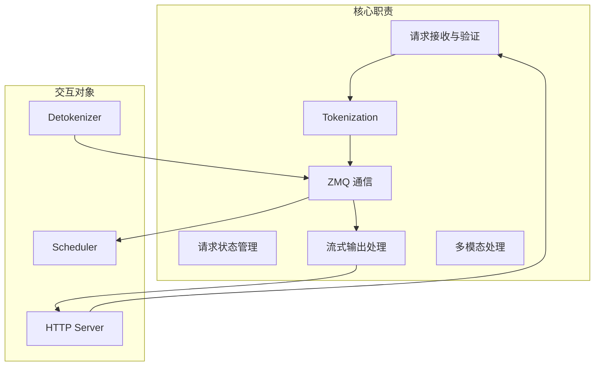
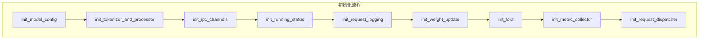
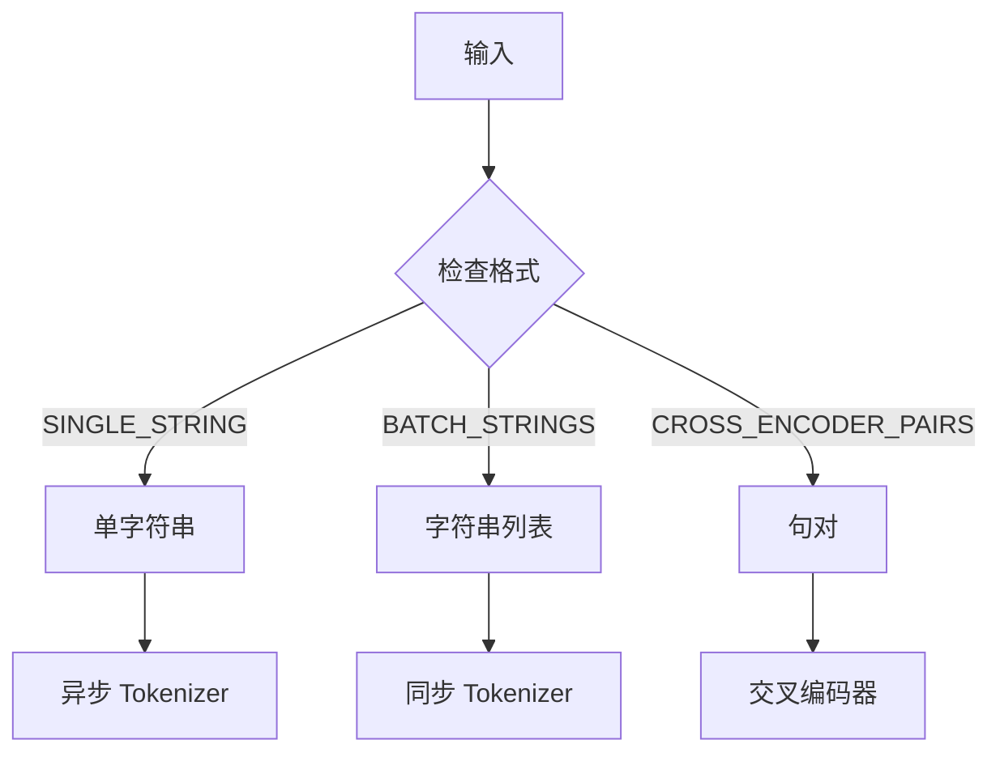
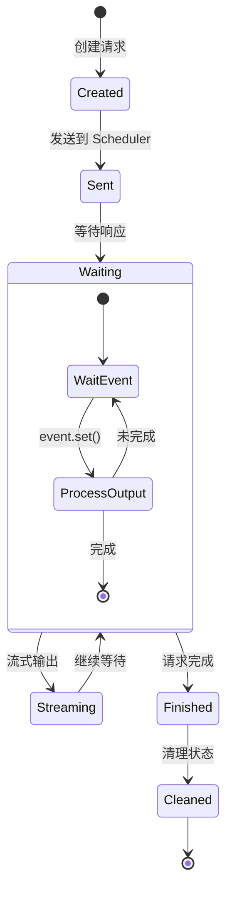
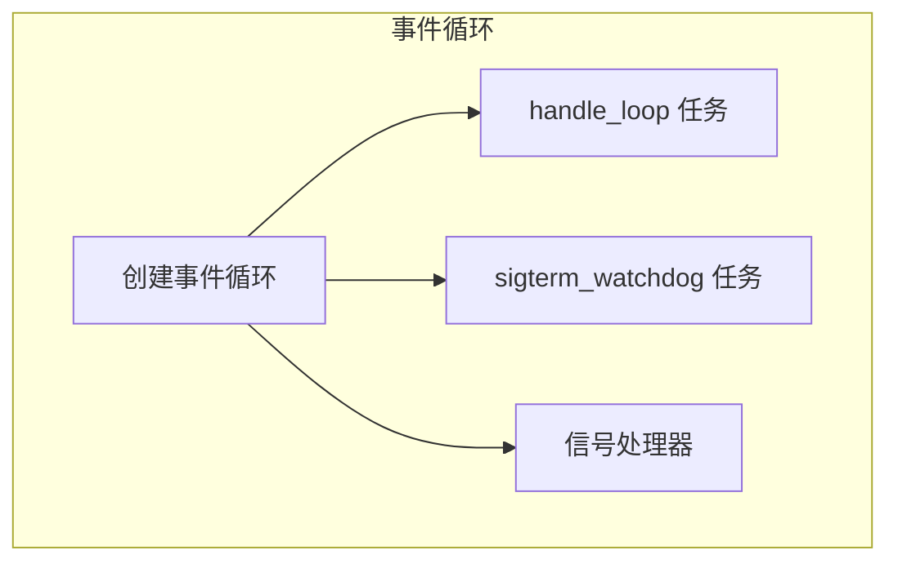
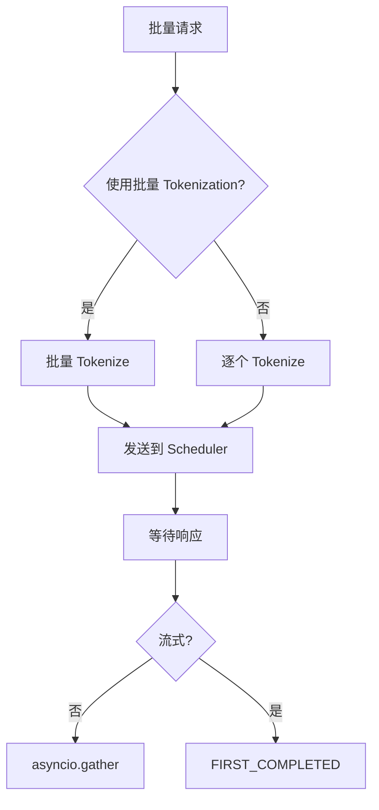
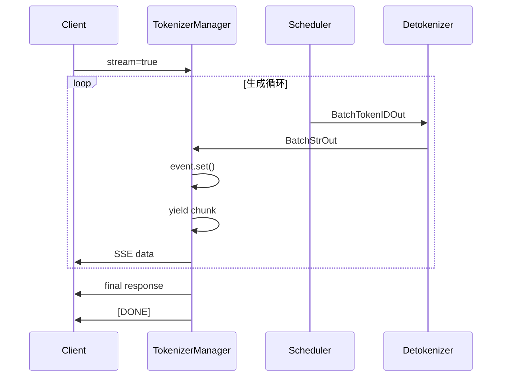
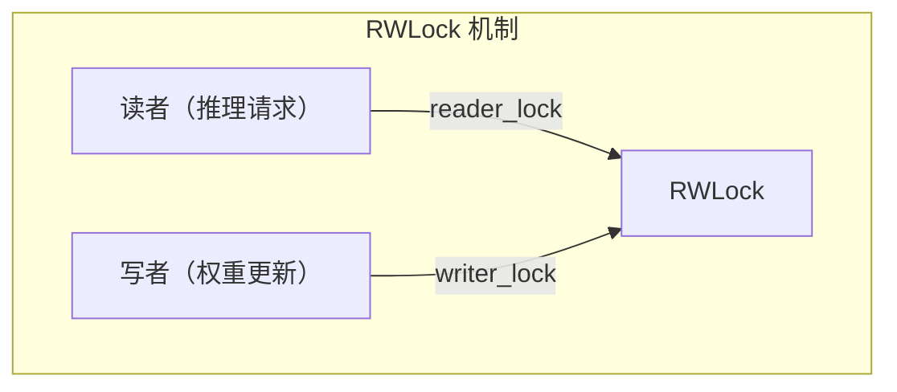
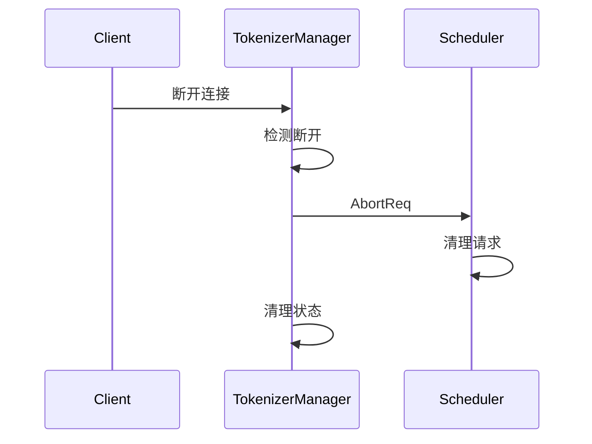

## 概述

### 本章学习目标
- 理解 TokenizerManager 的完整职责
- 掌握 ReqState 的生命周期管理
- 了解异步处理和并发机制
- 学习流式输出的实现细节

### 前置知识要求
- 了解请求生命周期
- 熟悉 Python asyncio
- 理解 ZMQ 通信机制

---

## TokenizerManager 职责

TokenizerManager 是 SGLang 的请求入口，负责：



---

## 初始化流程

### 初始化链

**关键文件**：`python/sglang/srt/managers/tokenizer_manager.py`



### 核心属性

```python
class TokenizerManager:
    def __init__(self, server_args, port_args, model_overide_args=None):
        # 请求状态管理
        self.rid_to_state: Dict[str, ReqState] = {}

        # IPC 通信
        self.recv_from_detokenizer: zmq.Socket  # PULL
        self.send_to_scheduler: zmq.Socket      # PUSH

        # Tokenizer
        self.tokenizer: PreTrainedTokenizer
        self.processor: Optional[BaseProcessor]  # 多模态处理器

        # 异步事件
        self.event_loop: asyncio.AbstractEventLoop
        self.asyncio_tasks: set

        # 状态同步
        self.model_update_lock: RWLock          # 权重更新锁
        self.is_pause: bool                      # 暂停标志
        self.is_pause_cond: asyncio.Condition   # 暂停条件
```

---

## Tokenization 流程

### 输入格式检测

```python
class InputFormat(Enum):
    SINGLE_STRING = 1       # "Hello world"
    BATCH_STRINGS = 2       # ["Hello", "World"]
    CROSS_ENCODER_PAIRS = 3 # [["query", "doc"]]
```

### 智能 Tokenizer 选择



### Tokenization 实现

```python
def _tokenize_texts(self, texts, is_embedding=False):
    # 检测输入格式
    input_format = self._detect_input_format(texts)

    if input_format == InputFormat.SINGLE_STRING:
        # 单个字符串：使用异步 tokenizer（如果可用）
        if self.async_dynamic_batch_tokenizer:
            return await self.async_dynamic_batch_tokenizer.encode(texts)
        else:
            return self.tokenizer.encode(texts)

    elif input_format == InputFormat.BATCH_STRINGS:
        # 批量字符串：使用常规 tokenizer
        return self.tokenizer(texts, return_tensors=None)["input_ids"]

    elif input_format == InputFormat.CROSS_ENCODER_PAIRS:
        # 句对：返回 token_type_ids
        return self.tokenizer(
            texts[0], texts[1],
            return_token_type_ids=True
        )
```

### 完整请求处理

```python
async def _tokenize_one_request(self, obj: GenerateReqInput):
    # 1. 获取输入
    if obj.text is not None:
        input_ids = self._tokenize_texts(obj.text)
    elif obj.input_ids is not None:
        input_ids = obj.input_ids
    else:
        raise ValueError("text or input_ids required")

    # 2. 多模态处理
    if obj.image_data or obj.audio_data or obj.video_data:
        # 验证多模态限制
        self._validate_mm_limits(obj)

        # 异步处理多模态数据
        mm_inputs = await self.mm_processor.process(
            obj.image_data, obj.audio_data, obj.video_data
        )
    else:
        mm_inputs = None

    # 3. 验证请求
    self._validate_one_request(obj, input_ids)

    # 4. 创建内部请求对象
    return TokenizedGenerateReqInput(
        rid=obj.rid,
        input_ids=input_ids,
        sampling_params=obj.sampling_params,
        mm_inputs=mm_inputs,
        # ...
    )
```

---

## ReqState 生命周期

### 数据结构

```python
@dataclass
class ReqState:
    # 基本状态
    out_list: List[Dict]        # 输出列表
    finished: bool              # 是否完成
    event: asyncio.Event        # 异步事件
    obj: GenerateReqInput       # 原始请求

    # 时间戳
    created_time: float         # 创建时间
    finished_time: float = 0.0  # 完成时间
    first_token_time: float = 0.0  # 首 token 时间 (TTFT)
    last_time: float = 0.0      # 最后更新时间

    # 性能计数
    request_sent_to_scheduler_ts: float = 0.0
    response_sent_to_client_ts: float = 0.0

    # 累积输出
    text: str = ""              # 输出文本
    output_ids: List[int] = []  # 输出 token IDs
    last_output_offset: int = 0 # 流式输出偏移

    # Logprob 数据
    input_token_logprobs_val: List[float] = field(default_factory=list)
    output_token_logprobs_val: List[float] = field(default_factory=list)
```

### 生命周期状态图



### 生命周期代码

**创建阶段**：

```python
def _send_one_request(self, obj, tokenized_obj, created_time=None):
    # 发送到 Scheduler
    self.send_to_scheduler.send_pyobj(tokenized_obj)

    # 创建状态对象
    state = ReqState(
        out_list=[],
        finished=False,
        event=asyncio.Event(),
        obj=obj,
        created_time=created_time or time.time(),
    )
    state.request_sent_to_scheduler_ts = time.time()

    # 注册到状态字典
    self.rid_to_state[obj.rid] = state

    return state
```

**等待阶段**：

```python
async def _wait_one_response(self, obj, state, request=None):
    is_stream = getattr(obj, "stream", False)

    while True:
        try:
            # 等待事件（带超时）
            await asyncio.wait_for(
                state.event.wait(),
                timeout=_REQUEST_STATE_WAIT_TIMEOUT
            )
        except asyncio.TimeoutError:
            # 检查客户端是否断开
            if request and await request.is_disconnected():
                self.abort_request(obj.rid)
                raise ValueError(f"Request disconnected: {obj.rid}")
            continue

        # 获取输出
        out = state.out_list[-1]
        state.out_list = []

        if state.finished:
            # 记录完成时间
            state.response_sent_to_client_ts = time.time()
            out["meta_info"]["response_sent_to_client_ts"] = (
                state.response_sent_to_client_ts
            )
            yield out
            break

        state.event.clear()

        if is_stream:
            # 流式：立即返回
            yield out
```

**更新阶段**：

```python
def _handle_batch_output(self, recv_obj: BatchStrOut):
    for i, rid in enumerate(recv_obj.rids):
        state = self.rid_to_state.get(rid)
        if state is None:
            continue

        # 更新累积文本
        state.text += recv_obj.output_strs[i]

        # 更新 token IDs
        state.output_ids.extend(recv_obj.output_ids[i])

        # 构建输出
        meta_info = {
            "id": rid,
            "finish_reason": recv_obj.finished_reasons[i],
            "prompt_tokens": recv_obj.prompt_tokens[i],
            "completion_tokens": recv_obj.completion_tokens[i],
        }

        out_dict = {
            "text": state.text,
            "output_ids": state.output_ids.copy(),
            "meta_info": meta_info,
        }

        # 设置完成标志
        state.finished = recv_obj.finished_reasons[i] is not None

        # 添加输出并唤醒等待者
        state.out_list.append(out_dict)
        state.event.set()

        # 清理已完成的请求
        if state.finished:
            del self.rid_to_state[rid]
```

---

## 异步处理机制

### 事件循环管理



```python
def auto_create_handle_loop(self):
    if self.event_loop is not None:
        return

    loop = get_or_create_event_loop()

    # 创建主处理任务
    self.asyncio_tasks.add(
        loop.create_task(self.handle_loop())
    )

    # 创建看门狗任务
    self.asyncio_tasks.add(
        loop.create_task(self.sigterm_watchdog())
    )

    # 注册信号处理器
    if threading.current_thread() is threading.main_thread():
        loop.add_signal_handler(signal.SIGTERM, self.sigterm_handler)
```

### 主处理循环

```python
async def handle_loop(self):
    """接收并分发来自 Detokenizer 的结果"""
    while True:
        # 禁用看门狗（等待可能较长）
        with self.soft_watchdog.disable():
            recv_obj = await self.recv_from_detokenizer.recv_pyobj()

        # 根据类型分发处理
        self._result_dispatcher(recv_obj)

        # 更新时间戳
        self.last_receive_tstamp = time.time()
        self.soft_watchdog.feed()
```

### 类型分发器

```python
def init_request_dispatcher(self):
    self._result_dispatcher = TypeBasedDispatcher([
        # 输出消息
        ((BatchStrOut, BatchEmbeddingOut, BatchTokenIDOut),
         self._handle_batch_output),

        # 控制消息
        (AbortReq, self._handle_abort_req),
        (OpenSessionReqOutput, self._handle_open_session_req_output),
        (UpdateWeightFromDiskReqOutput,
         self._handle_update_weights_from_disk_req_output),

        # 健康检查
        (HealthCheckOutput, lambda x: None),
    ])
```

---

## 批量请求处理

### 批量处理流程



### 批量处理实现

```python
async def _handle_batch_request(self, obj, request, created_time):
    # 检查是否使用批量 tokenization
    if self._should_use_batch_tokenization(obj):
        tokenized_objs = await self._batch_tokenize_and_process(obj)
        states = self._send_batch_request(obj, tokenized_objs, created_time)
    else:
        # 逐个处理
        states = []
        for i, single_obj in enumerate(obj):
            tokenized_obj = await self._tokenize_one_request(single_obj)
            state = self._send_one_request(single_obj, tokenized_obj, created_time)
            states.append(state)

    # 创建响应生成器
    generators = [
        self._wait_one_response(obj[i], states[i], request)
        for i in range(len(states))
    ]

    is_stream = getattr(obj, "stream", False)

    if not is_stream:
        # 非流式：等待所有完成
        outputs = await asyncio.gather(
            *(gen.__anext__() for gen in generators)
        )
        yield outputs
    else:
        # 流式：尽快返回可用结果
        task_map = {
            asyncio.create_task(gen.__anext__()): gen
            for gen in generators
        }

        while task_map:
            done, _ = await asyncio.wait(
                task_map.keys(),
                return_when=asyncio.FIRST_COMPLETED
            )

            for task in done:
                gen = task_map.pop(task)
                try:
                    result = task.result()
                    yield result
                    # 继续等待下一个结果
                    new_task = asyncio.create_task(gen.__anext__())
                    task_map[new_task] = gen
                except StopAsyncIteration:
                    pass
```

---

## 流式输出处理

### 流式输出流程



### 增量输出处理

```python
def _handle_batch_output(self, recv_obj: BatchStrOut):
    for i, rid in enumerate(recv_obj.rids):
        state = self.rid_to_state.get(rid)

        # 累积文本
        state.text += recv_obj.output_strs[i]

        is_stream = getattr(state.obj, "stream", False)

        if self.server_args.stream_output and is_stream:
            # 流式模式：只返回新 tokens
            state.output_ids.extend(recv_obj.output_ids[i])
            output_token_ids = state.output_ids[state.last_output_offset:]
            state.last_output_offset = len(state.output_ids)
        else:
            # 非流式：返回所有 tokens
            state.output_ids.extend(recv_obj.output_ids[i])
            output_token_ids = state.output_ids.copy()

        out_dict = {
            "text": state.text,
            "output_ids": output_token_ids,
            "meta_info": {...},
        }

        state.out_list.append(out_dict)
        state.event.set()
```

---

## 暂停与恢复

### 暂停机制

```python
async def pause_generation(self, obj):
    async with self.is_pause_cond:
        self.is_pause = True

        # 发送暂停信号到 Scheduler
        self.send_to_scheduler.send_pyobj(PauseReq())

async def continue_generation(self, obj):
    async with self.is_pause_cond:
        self.is_pause = False
        self.is_pause_cond.notify_all()

        # 发送继续信号到 Scheduler
        self.send_to_scheduler.send_pyobj(ContinueReq())
```

### 请求等待暂停

```python
async def generate_request(self, obj, request=None):
    # 等待暂停解除
    async with self.is_pause_cond:
        await self.is_pause_cond.wait_for(lambda: not self.is_pause)

    # 继续处理请求
    # ...
```

---

## 权重更新同步

### 读写锁机制



```python
class TokenizerManager:
    def __init__(self):
        self.model_update_lock = RWLock()

async def generate_request(self, obj, request=None):
    # 获取读锁（允许并发推理）
    async with self.model_update_lock.reader_lock:
        # 处理请求
        # ...

async def update_weights(self, obj):
    # 获取写锁（独占，等待所有推理完成）
    async with self.model_update_lock.writer_lock:
        # 更新权重
        # ...
```

---

## 请求取消

### 取消流程



```python
def abort_request(self, rid):
    # 发送取消请求到 Scheduler
    self.send_to_scheduler.send_pyobj(AbortReq(rid=rid))

    # 清理本地状态
    if rid in self.rid_to_state:
        state = self.rid_to_state[rid]
        state.finished = True
        state.event.set()
        del self.rid_to_state[rid]
```

### 断开检测

```python
async def _wait_one_response(self, obj, state, request):
    while True:
        try:
            await asyncio.wait_for(state.event.wait(), timeout=TIMEOUT)
        except asyncio.TimeoutError:
            # 检查客户端是否断开
            if request is not None and await request.is_disconnected():
                self.abort_request(obj.rid)
                raise ValueError(f"Request disconnected: {obj.rid}")
            continue
```

---

## 监控与指标

### 指标收集

```python
class TokenizerMetricsCollector:
    def collect_metrics(self, state, recv_obj, i):
        # Time To First Token (TTFT)
        ttft = state.first_token_time - state.created_time

        # Inter-Token Latency (ITL)
        itl = (state.last_time - state.first_token_time) / (
            recv_obj.completion_tokens[i] - 1
        )

        # End-to-End Latency
        e2e = state.finished_time - state.created_time

        # Decode Throughput
        throughput = recv_obj.completion_tokens[i] / e2e

        return {
            "ttft": ttft,
            "itl": itl,
            "e2e_latency": e2e,
            "throughput": throughput,
        }
```

### 看门狗

```python
# 软看门狗：仅记录警告
self.soft_watchdog = Watchdog.create(
    debug_name="TokenizerManager",
    watchdog_timeout=300,
    soft=True
)

async def handle_loop(self):
    while True:
        with self.soft_watchdog.disable():
            # 长时间等待操作
            recv_obj = await self.recv_from_detokenizer.recv_pyobj()

        # 更新心跳
        self.soft_watchdog.feed()
```

---

## 核心方法速查

| 方法 | 功能 | 行号 |
|------|------|------|
| `generate_request()` | 主入口 | 486 |
| `_tokenize_texts()` | 智能 Tokenization | 583 |
| `_tokenize_one_request()` | 单请求处理 | 663 |
| `_handle_batch_request()` | 批量处理 | 1210 |
| `_send_one_request()` | 发送到 Scheduler | 1053 |
| `_wait_one_response()` | 等待响应 | 1096 |
| `_handle_batch_output()` | 处理输出 | 1478 |
| `handle_loop()` | 异步主循环 | 1469 |
| `abort_request()` | 取消请求 | 1311 |

---

## 小结

### 要点回顾

1. **Tokenization**：支持单个、批量、交叉编码器三种输入格式
2. **ReqState**：完整生命周期管理（创建→等待→更新→清理）
3. **异步处理**：asyncio Event 实现非阻塞等待
4. **流式输出**：增量处理 + FIRST_COMPLETED 策略
5. **同步机制**：RWLock 保护权重更新，Condition 实现暂停

### 设计模式

- **TypeBasedDispatcher**：根据消息类型自动路由
- **Communicator**：封装请求-响应通信
- **RWLock**：读写锁实现并发控制
- **AsyncGenerator**：流式响应生成器

### 下一章预告

在下一章《Scheduler 深入解析》中，我们将：
- 了解调度器事件循环
- 学习批处理组装逻辑
- 掌握调度策略选择
