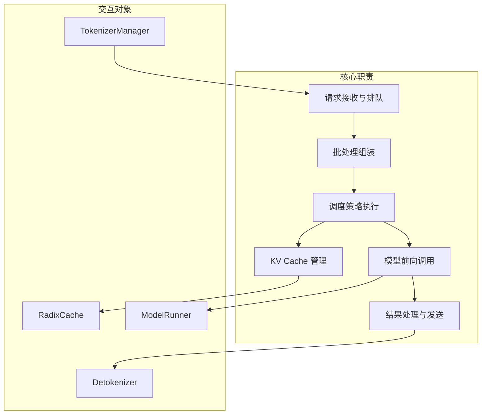
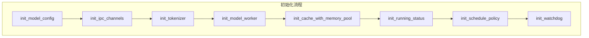
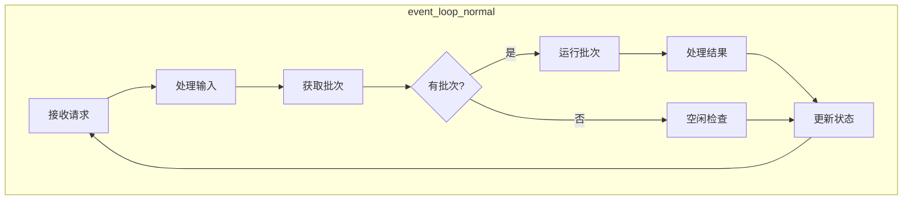
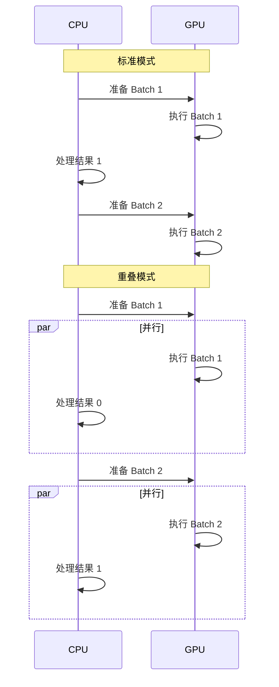
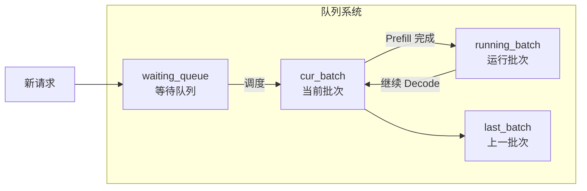
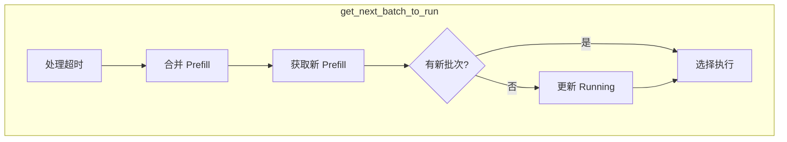
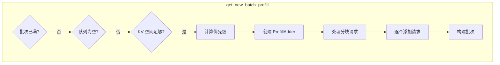
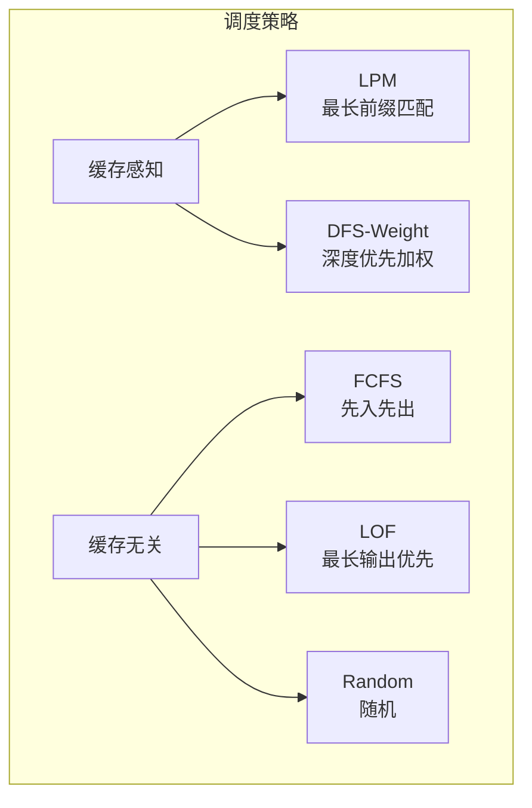
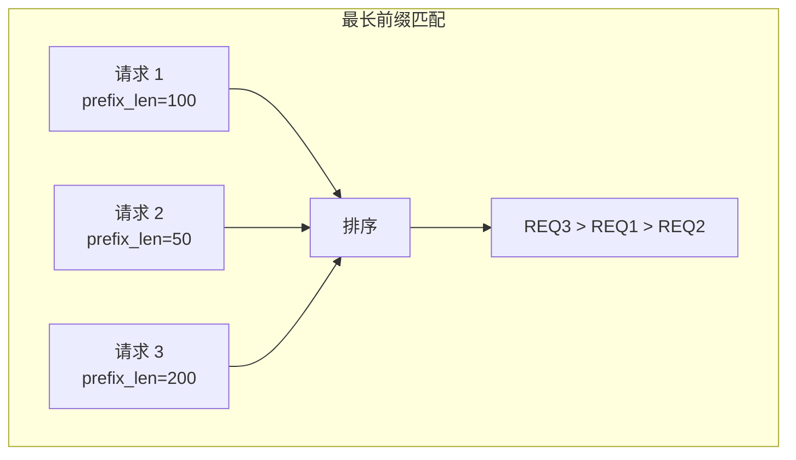
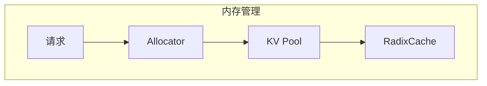

## 概述

### 本章学习目标
- 理解 Scheduler 的核心职责和事件循环
- 掌握请求队列管理机制
- 了解批处理组装逻辑
- 学习调度策略的选择与实现

### 前置知识要求
- 了解 LLM 推理的 Prefill/Decode 阶段
- 熟悉 Python 多进程编程
- 理解批处理概念

---

## Scheduler 职责

Scheduler 是 SGLang 的核心组件，负责：



---

## 初始化流程

### 初始化链

**关键文件**：`python/sglang/srt/managers/scheduler.py`



### 核心属性

```python
class Scheduler:
    def __init__(self, server_args, port_args, gpu_id, tp_rank, dp_rank=None):
        # 分布式参数
        self.tp_rank = tp_rank
        self.pp_rank = pp_rank
        self.dp_rank = dp_rank

        # 队列管理
        self.waiting_queue: List[Req] = []
        self.running_batch: ScheduleBatch

        # 缓存管理
        self.tree_cache: RadixCache
        self.token_to_kv_pool_allocator: KVPoolAllocator
        self.req_to_token_pool: ReqToTokenPool

        # 模型执行
        self.model_worker: ModelWorker

        # IPC 通信
        self.recv_from_tokenizer: zmq.Socket
        self.send_to_detokenizer: zmq.Socket

        # 调度策略
        self.schedule_policy: SchedulePolicy
```

---

## 事件循环

### 标准事件循环



```python
def event_loop_normal(self):
    """标准调度循环"""
    while True:
        # 1. 接收请求
        recv_reqs = self.recv_requests()
        self.process_input_requests(recv_reqs)

        if self._engine_paused:
            continue

        # 2. 获取下一个批次
        batch = self.get_next_batch_to_run()
        self.cur_batch = batch

        # 3. 运行批次
        if batch:
            result = self.run_batch(batch)
            self.process_batch_result(batch, result)
        else:
            self.self_check_during_idle()

        # 4. 更新状态
        self.last_batch = batch
```

### 重叠事件循环



```python
def event_loop_overlap(self):
    """重叠调度循环：CPU 和 GPU 并行"""
    result_queue = []

    while True:
        # 接收和处理请求
        recv_reqs = self.recv_requests()
        self.process_input_requests(recv_reqs)

        # 获取批次
        batch = self.get_next_batch_to_run()

        # 判断是否禁用重叠
        disable_overlap = self._should_disable_overlap(batch, self.last_batch)

        if disable_overlap:
            # 同步处理上一批结果
            if result_queue:
                self.process_batch_result(*result_queue.pop(0))

        # 运行当前批次
        if batch:
            result = self.run_batch(batch)
            result_queue.append((batch, result))
        else:
            self.self_check_during_idle()

        # 异步处理结果（与下一批 GPU 执行并行）
        if not disable_overlap and result_queue:
            self.process_batch_result(*result_queue.pop(0))

        self.last_batch = batch
```

---

## 请求队列管理

### 队列结构



### 请求接收

```python
def recv_requests(self):
    """从 TokenizerManager 接收请求"""
    recv_reqs = []

    while True:
        try:
            # 非阻塞接收
            recv_req = self.recv_from_tokenizer.recv_pyobj(zmq.NOBLOCK)
            recv_req = unwrap_shm_features(recv_req)
            recv_reqs.append(recv_req)
        except zmq.ZMQError:
            break

        # 限制单次接收数量
        if self.recv_limit_reached(len(recv_reqs)):
            break

    # TP 并行时广播
    if self.tp_size != 1:
        recv_reqs = broadcast_pyobj(
            recv_reqs, self.tp_group.rank,
            self.tp_cpu_group, src=self.tp_group.ranks[0]
        )

    return recv_reqs
```

### 请求处理

```python
def process_input_requests(self, recv_reqs: List):
    """处理接收到的请求"""
    for recv_req in recv_reqs:
        # 健康检查请求特殊处理
        if is_health_check_generate_req(recv_req):
            if self.running_batch.non_empty() or len(self.waiting_queue) > 0:
                continue

        # 分发处理
        self._request_dispatcher(recv_req)

def _add_request_to_queue(self, req: Req):
    """添加请求到等待队列"""
    self.waiting_queue.append(req)
    req.time_stats.wait_queue_entry_time = time.perf_counter()

    # 队列满时驱逐低优先级请求
    if self.enable_priority_scheduling:
        self._abort_on_queued_limit()
```

---

## 批处理组装

### 组装流程



```python
def get_next_batch_to_run(self) -> Optional[ScheduleBatch]:
    # 1. 处理超时请求
    self._abort_on_queued_timeout()

    # 2. 合并上一个 Prefill 批次到 running_batch
    if self.last_batch and self.last_batch.forward_mode.is_extend():
        if not self.last_batch.is_empty():
            self.running_batch.merge_batch(self.last_batch)

    # 3. 尝试获取新的 Prefill 批次
    new_batch = self.get_new_batch_prefill()

    # 4. 选择执行
    if new_batch is not None:
        return new_batch
    else:
        # 没有新 Prefill，执行 Decode
        if not self.running_batch.is_empty():
            self.running_batch = self.update_running_batch(self.running_batch)
            if not self.running_batch.is_empty():
                return self.running_batch

    return None
```

### Prefill 批次组装



```python
def _get_new_batch_prefill_raw(self):
    # 检查条件
    if self.running_batch.batch_is_full:
        return None
    if len(self.waiting_queue) == 0:
        return None

    running_bs = self.running_batch.batch_size()
    if self.get_num_allocatable_reqs(running_bs) <= 0:
        return None

    # 计算优先级并排序
    self.schedule_policy.calc_priority(self.waiting_queue, ...)

    # 创建 PrefillAdder
    adder = PrefillAdder(
        page_size=self.page_size,
        tree_cache=self.tree_cache,
        token_to_kv_pool_allocator=self.token_to_kv_pool_allocator,
        running_batch=self.running_batch,
        new_token_ratio=self.new_token_ratio,
        max_prefill_tokens=self.max_prefill_tokens,
        chunked_prefill_size=self.chunked_prefill_size,
        # ...
    )

    # 处理分块请求
    if self.chunked_req is not None:
        self.chunked_req.init_next_round_input()
        self.chunked_req = adder.add_chunked_req(self.chunked_req)

    # 从等待队列添加请求
    can_run_list = []
    for req in self.waiting_queue:
        req.init_next_round_input(self.tree_cache)
        res = adder.add_one_req(req)

        if res == AddReqResult.CONTINUE:
            can_run_list.append(req)
        elif res == AddReqResult.NO_TOKEN:
            break
        else:
            break

    # 更新等待队列
    self.waiting_queue = [
        x for x in self.waiting_queue if x not in set(can_run_list)
    ]

    if not can_run_list:
        return None

    # 构建新批次
    new_batch = ScheduleBatch.init_new(
        can_run_list,
        self.req_to_token_pool,
        self.token_to_kv_pool_allocator,
        self.tree_cache,
        self.model_config,
        # ...
    )
    new_batch.prepare_for_extend()

    return new_batch
```

### PrefillAdder 类

**关键文件**：`python/sglang/srt/managers/schedule_policy.py`

```python
class PrefillAdder:
    """管理 Prefill 批次的 Token 预算"""

    def __init__(self, ...):
        # Token 预算
        self.rem_total_tokens = available_tokens + evictable_tokens
        self.rem_input_tokens = max_prefill_tokens
        self.rem_chunk_tokens = chunked_prefill_size

        # 请求列表
        self.can_run_list = []
        self.preempt_list = []

    def budget_state(self):
        """检查预算状态"""
        if self.rem_total_tokens <= 0:
            return AddReqResult.NO_TOKEN
        if self.rem_input_tokens <= 0:
            return AddReqResult.NO_TOKEN
        return AddReqResult.CONTINUE

    def add_one_req(self, req) -> AddReqResult:
        """添加一个请求到批次"""
        # 检查预算
        state = self.budget_state()
        if state != AddReqResult.CONTINUE:
            return state

        # 计算所需 tokens
        num_tokens = req.extend_input_len

        # 检查是否需要分块
        if num_tokens > self.rem_chunk_tokens and self.rem_chunk_tokens > 0:
            # 需要分块 Prefill
            req.is_chunked = num_tokens - self.rem_chunk_tokens
            num_tokens = self.rem_chunk_tokens

        # 扣减预算
        self.rem_total_tokens -= num_tokens
        self.rem_input_tokens -= num_tokens
        self.rem_chunk_tokens -= num_tokens

        self.can_run_list.append(req)
        return AddReqResult.CONTINUE

    def add_chunked_req(self, req):
        """添加分块请求"""
        num_tokens = min(req.is_chunked, self.rem_chunk_tokens)
        req.is_chunked -= num_tokens

        self.rem_total_tokens -= num_tokens
        self.rem_input_tokens -= num_tokens
        self.rem_chunk_tokens -= num_tokens

        self.can_run_list.append(req)

        if req.is_chunked > 0:
            return req  # 继续分块
        else:
            return None  # 分块完成
```

---

## 调度策略

### 支持的策略



### 策略选择

```python
class SchedulePolicy:
    def __init__(self, policy: str, tree_cache: RadixCache):
        self.policy = policy
        self.tree_cache = tree_cache

    def calc_priority(self, waiting_queue: List[Req], ...):
        """计算请求优先级"""
        if self.policy == "lpm":
            # 最长前缀匹配
            for req in waiting_queue:
                req.prefix_len = self.tree_cache.match_prefix(req.input_ids)
            waiting_queue.sort(key=lambda x: -x.prefix_len)

        elif self.policy == "fcfs":
            # 先入先出（按到达时间排序）
            waiting_queue.sort(key=lambda x: x.arrival_time)

        elif self.policy == "lof":
            # 最长输出优先
            waiting_queue.sort(key=lambda x: -x.sampling_params.max_new_tokens)

        elif self.policy == "random":
            # 随机
            random.shuffle(waiting_queue)

        elif self.policy == "dfs-weight":
            # DFS 加权
            self._calc_dfs_weight_priority(waiting_queue)
```

### LPM 策略详解



**优势**：
- 最大化 KV Cache 复用
- 减少重复计算
- 提高吞吐量

### 优先级调度

```python
def _sort_by_priority_and_fcfs(waiting_queue, priority_sign):
    """按优先级和到达时间排序"""
    waiting_queue.sort(
        key=lambda x: (
            priority_sign * x.sampling_params.priority,  # 优先级
            x.arrival_time  # 到达时间
        )
    )

# 使用
if self.enable_priority_scheduling:
    self._sort_by_priority_and_fcfs(
        self.waiting_queue,
        self.priority_sign
    )
```

---

## 运行批次

### 前向计算

```python
def run_batch(self, batch: ScheduleBatch):
    """执行批次前向计算"""
    # 性能分析
    self._profile_batch_predicate(batch)

    # 获取模型工作批次
    if self.spec_algorithm.is_none() or self.enable_overlap:
        worker_batch = batch.get_model_worker_batch()
    else:
        worker_batch = batch

    # 执行前向传播
    if self.enable_overlap:
        with self.forward_stream_ctx:
            batch_result = self.model_worker.forward_batch_generation(
                worker_batch
            )
    else:
        batch_result = self.model_worker.forward_batch_generation(
            worker_batch
        )

    # 更新输出
    batch.output_ids = batch_result.next_token_ids

    return batch_result
```

### ForwardMode

```python
class ForwardMode(IntEnum):
    EXTEND = 0    # Prefill 阶段
    DECODE = 1    # Decode 阶段
    MIXED = 2     # 混合模式（Chunked Prefill + Decode）
    IDLE = 3      # 空闲（健康检查）
```

---

## 结果处理

### 处理分发

```python
def process_batch_result(self, batch, result):
    """处理批次结果"""
    if batch.forward_mode.is_decode():
        self.process_batch_result_decode(batch, result)
    elif batch.forward_mode.is_extend():
        self.process_batch_result_prefill(batch, result)
    elif batch.forward_mode.is_idle():
        self.process_batch_result_idle(batch, result)

    # 日志和清理
    self.log_batch_result_stats(batch, result)
    self.maybe_send_health_check_signal()
```

### Prefill 结果处理

```python
def process_batch_result_prefill(self, batch, result):
    # 同步 GPU 结果
    if result.copy_done is not None:
        result.copy_done.synchronize()

    next_token_ids = result.next_token_ids.tolist()

    for i, (req, next_token_id) in enumerate(zip(batch.reqs, next_token_ids)):
        if req.is_chunked <= 0:
            # 非分块请求：添加 token 并检查完成
            req.output_ids.append(next_token_id)
            req.check_finished()

            if req.finished():
                # 释放 KV Cache
                release_kv_cache(req, self.tree_cache)
                req.time_stats.completion_time = time.perf_counter()
            else:
                # 缓存未完成请求
                self.tree_cache.cache_unfinished_req(req)
        else:
            # 分块请求：继续下一轮
            req.is_chunked -= 1

    # 流式输出
    self.stream_output(batch.reqs)
```

### Decode 结果处理

```python
def process_batch_result_decode(self, batch, result):
    # 同步 GPU
    if result.copy_done is not None:
        result.copy_done.synchronize()

    next_token_ids = result.next_token_ids.tolist()

    # 更新生成计数
    self.num_generated_tokens += len(batch.reqs)

    for req, next_token_id in zip(batch.reqs, next_token_ids):
        # 添加 token
        req.output_ids.append(next_token_id)

        # 检查完成条件
        req.check_finished()

        if req.finished():
            # 释放 KV Cache
            release_kv_cache(req, self.tree_cache)
            req.time_stats.completion_time = time.perf_counter()

    # 流式输出
    self.stream_output(batch.reqs)
```

---

## 流式输出

### 输出发送

```python
def stream_output(self, reqs, skip_req=None):
    """发送流式输出到 Detokenizer"""
    output = BatchTokenIDOut(
        rids=[],
        output_ids=[],
        finished_reasons=[],
        # ...
    )

    for req in reqs:
        if req == skip_req:
            continue

        # 收集输出数据
        output.rids.append(req.rid)
        output.output_ids.append(req.output_ids)
        output.finished_reasons.append(
            req.finished_reason if req.finished() else None
        )
        # ...

    # 发送到 Detokenizer
    if output.rids:
        self.send_to_detokenizer.send_pyobj(output)
```

---

## 内存管理

### KV Cache 分配



```python
def get_num_allocatable_reqs(self, running_bs: int):
    """计算可分配的请求数"""
    # 获取可用 token 数
    available = self.token_to_kv_pool_allocator.available_size()

    # 减去当前运行批次占用
    available -= running_bs * self.new_token_ratio

    # 计算可容纳的请求数
    return available // self.avg_tokens_per_req
```

### 缓存释放

```python
def release_kv_cache(req, tree_cache):
    """释放请求的 KV Cache"""
    # 从缓存树中移除
    tree_cache.dec_ref(req.last_node)

    # 释放 token pool
    req.req_to_token_pool.free(req.req_pool_idx)
```

---

## 分布式支持

### TP 并行

```python
def recv_requests(self):
    recv_reqs = []

    # 只有 rank 0 接收请求
    if self.tp_rank == 0:
        while True:
            try:
                recv_req = self.recv_from_tokenizer.recv_pyobj(zmq.NOBLOCK)
                recv_reqs.append(recv_req)
            except zmq.ZMQError:
                break

    # 广播到所有 rank
    if self.tp_size != 1:
        recv_reqs = broadcast_pyobj(
            recv_reqs,
            self.tp_group.rank,
            self.tp_cpu_group,
            src=self.tp_group.ranks[0]
        )

    return recv_reqs
```

---

## 配置参数

| 参数 | 说明 | 默认值 |
|------|------|--------|
| `schedule_policy` | 调度策略 | "lpm" |
| `max_running_requests` | 最大并发请求 | 动态 |
| `max_prefill_tokens` | 最大 Prefill Tokens | 动态 |
| `chunked_prefill_size` | 分块大小 | -1 (禁用) |
| `disable_overlap_schedule` | 禁用重叠调度 | False |
| `enable_priority_scheduling` | 启用优先级 | False |

---

## 小结

### 要点回顾

1. **事件循环**：标准/重叠两种模式，重叠模式 CPU-GPU 并行
2. **队列管理**：waiting_queue + running_batch 双队列设计
3. **批处理组装**：PrefillAdder 管理 Token 预算
4. **调度策略**：LPM/FCFS/LOF/Random/DFS-Weight
5. **结果处理**：Prefill/Decode 分别处理，支持流式输出

### 关键代码文件

| 文件 | 职责 |
|------|------|
| `scheduler.py` | 主调度逻辑 |
| `schedule_policy.py` | 调度策略 |
| `schedule_batch.py` | 批次数据结构 |
| `scheduler_output_processor_mixin.py` | 输出处理 |

### 下一章预告

在下一章《Detokenizer 详解》中，我们将：
- 了解增量 Detokenization 机制
- 学习流式文本输出实现
- 掌握特殊 Token 处理
