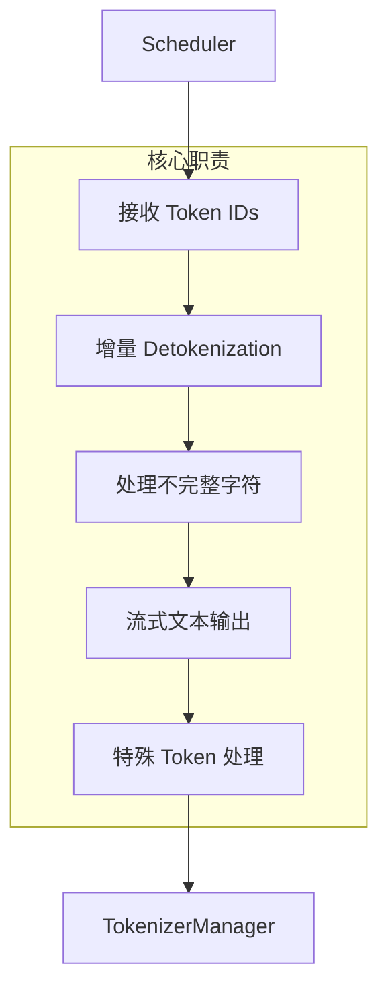
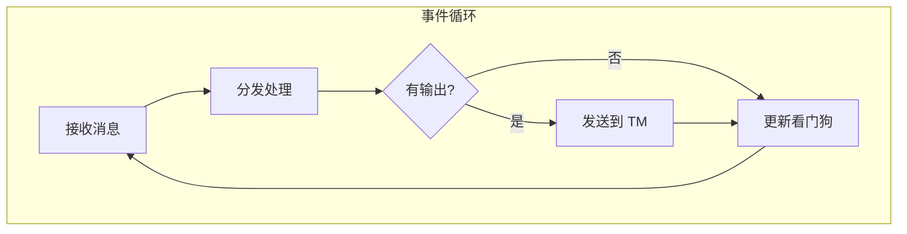
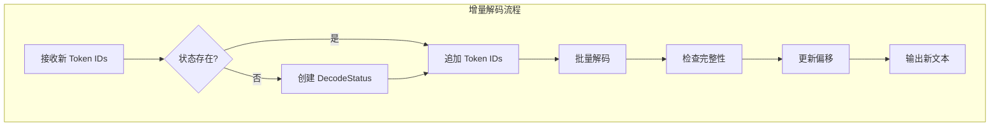
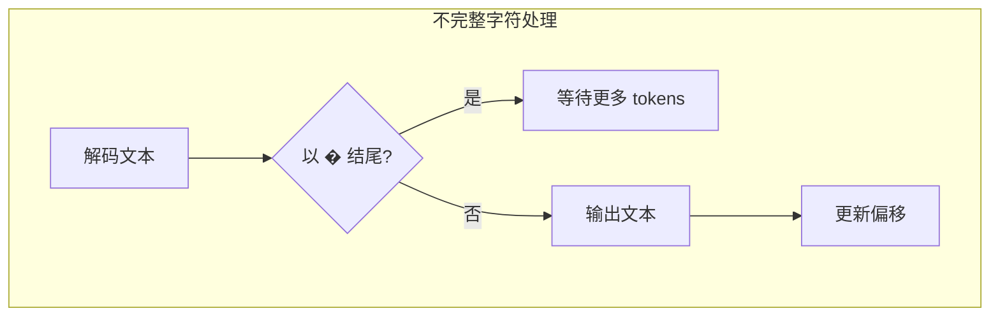
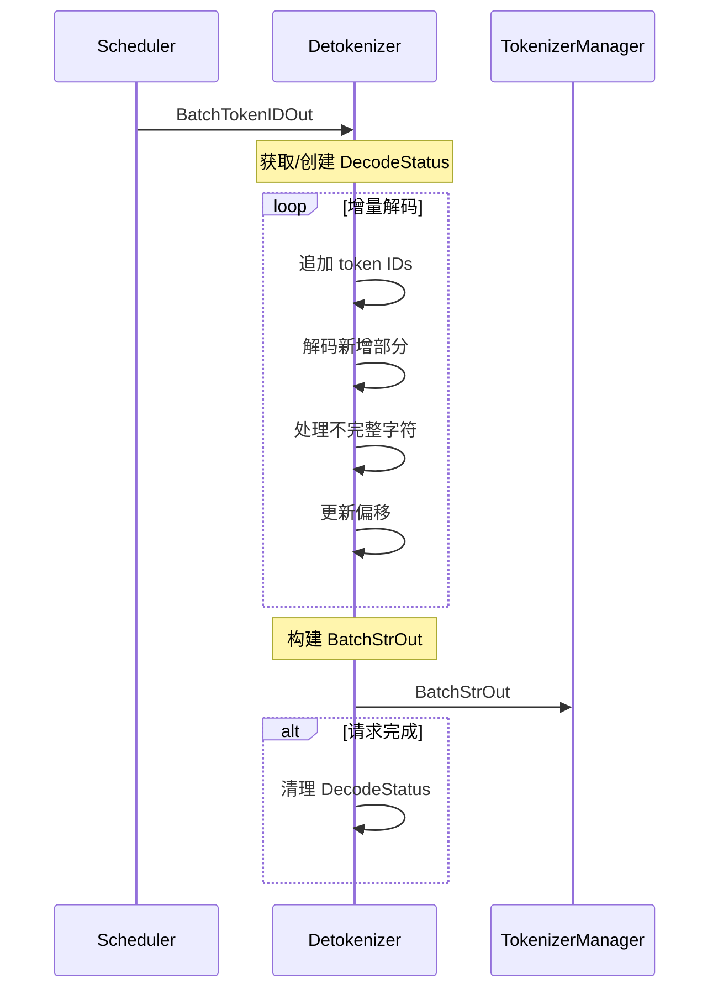

## 概述

### 本章学习目标
- 理解 DetokenizerManager 的职责
- 掌握增量 Detokenization 机制
- 了解流式文本输出实现
- 学习特殊 Token 处理

### 前置知识要求
- 了解 Tokenization 基础
- 熟悉 BPE/SentencePiece 等算法
- 理解流式输出概念

---

## DetokenizerManager 职责

DetokenizerManager 是 SGLang 的解码组件，负责：



---

## 初始化流程

**关键文件**：`python/sglang/srt/managers/detokenizer_manager.py`

```python
class DetokenizerManager:
    def __init__(self, server_args, port_args):
        # 初始化 tokenizer
        self.tokenizer = get_tokenizer(
            server_args.tokenizer_path,
            trust_remote_code=True
        )

        # IPC 通道
        self.init_ipc_channels(port_args)

        # 解码状态
        self.decode_status: Dict[str, DecodeStatus] = {}

        # 请求分发器
        self.init_request_dispatcher()
```

### IPC 通道

```python
def init_ipc_channels(self, port_args: PortArgs):
    context = zmq.Context(2)

    # 从 Scheduler 接收 Token IDs
    self.recv_from_scheduler = get_zmq_socket(
        context, zmq.PULL, port_args.detokenizer_ipc_name, True
    )

    # 发送文本到 TokenizerManager
    self.send_to_tokenizer = get_zmq_socket(
        context, zmq.PUSH, port_args.tokenizer_ipc_name, False
    )
```

---

## 事件循环



```python
def event_loop(self):
    """主事件循环"""
    while True:
        # 禁用看门狗（等待可能较长）
        with self.soft_watchdog.disable():
            recv_obj = self.recv_from_scheduler.recv_pyobj()

        # 分发处理
        output = self._request_dispatcher(recv_obj)

        # 发送输出
        if output is not None:
            self.send_to_tokenizer.send_pyobj(output)

        # 更新看门狗
        self.soft_watchdog.feed()
```

### 请求分发

```python
def init_request_dispatcher(self):
    self._request_dispatcher = TypeBasedDispatcher([
        # 生成输出
        (BatchTokenIDOut, self.handle_batch_token_id_out),

        # Embedding 输出
        (BatchEmbeddingOut, self.handle_batch_embedding_out),

        # 控制消息
        (UpdateWeightFromDiskReqInput, self._handle_update_weights),
        (HealthCheckInput, self._handle_health_check),
    ])
```

---

## 增量 Detokenization

### 为什么需要增量解码

传统 Detokenization 每次解码全部 tokens：
- 重复计算：每次生成新 token 都重新解码所有
- 延迟高：长序列解码时间长
- 资源浪费：CPU 负载高

增量 Detokenization 只解码新增 tokens：
- 效率高：只处理新生成的部分
- 延迟低：每次只解码少量 tokens
- 资源省：减少 CPU 开销

### DecodeStatus 数据结构

```python
@dataclass
class DecodeStatus:
    decoded_text: str       # 已解码的完整文本
    decode_ids: List[int]   # 所有 token IDs
    surr_offset: int        # 环绕偏移（处理不完整字符）
    read_offset: int        # 读取偏移（已处理位置）
```

### 增量解码流程



### 实现代码

```python
def _decode_batch_token_id_output(self, recv_obj: BatchTokenIDOut):
    bs = len(recv_obj.rids)
    output_strs = []

    for i in range(bs):
        rid = recv_obj.rids[i]
        new_token_ids = recv_obj.decode_ids[i]

        # 获取或创建解码状态
        if rid not in self.decode_status:
            self.decode_status[rid] = DecodeStatus(
                decoded_text=recv_obj.decoded_texts[i],
                decode_ids=new_token_ids.copy(),
                surr_offset=0,
                read_offset=recv_obj.read_offsets[i],
            )
        else:
            # 追加新 token IDs
            s = self.decode_status[rid]
            s.decode_ids.extend(new_token_ids)

        s = self.decode_status[rid]

        # 增量解码
        # surr_text: 从 surr_offset 到 read_offset 的文本
        # read_text: 从 surr_offset 到当前的文本
        surr_ids = s.decode_ids[s.surr_offset:s.read_offset]
        read_ids = s.decode_ids[s.surr_offset:]

        surr_text = self.tokenizer.decode(
            surr_ids,
            skip_special_tokens=recv_obj.skip_special_tokens[i],
        )
        read_text = self.tokenizer.decode(
            read_ids,
            skip_special_tokens=recv_obj.skip_special_tokens[i],
        )

        # 计算新增文本
        new_text = read_text[len(surr_text):]

        # 处理不完整字符（UTF-8 解码问题）
        if recv_obj.finished_reasons[i] is None:
            # 未完成：检查是否有不完整字符
            if len(new_text) > 0 and not new_text.endswith("�"):
                s.decoded_text += new_text
                s.surr_offset = s.read_offset
                s.read_offset = len(s.decode_ids)
                output_strs.append(new_text)
            else:
                output_strs.append("")
        else:
            # 已完成：输出所有剩余文本
            s.decoded_text += new_text
            output_strs.append(new_text)
            # 清理状态
            del self.decode_status[rid]

    return output_strs
```

---

## 不完整字符处理

### UTF-8 编码问题

某些 token 可能只包含 UTF-8 字符的部分字节：

```
Token 1: [0xe4, 0xb8]  -> "�" (不完整)
Token 2: [0xad]        -> 与 Token 1 合并 -> "中"
```

### 处理策略



```python
# 检查不完整字符
if len(new_text) > 0 and not new_text.endswith("�"):
    # 文本完整，可以输出
    s.decoded_text += new_text
    s.surr_offset = s.read_offset
    s.read_offset = len(s.decode_ids)
    output_strs.append(new_text)
else:
    # 文本不完整，等待更多 tokens
    output_strs.append("")
```

### 环绕缓冲区

```
decode_ids: [t1, t2, t3, t4, t5, t6, t7, t8]
                        ↑           ↑
                   surr_offset  read_offset

surr_text = decode(t1...t4)  # "Hello "
read_text = decode(t1...t8)  # "Hello World"
new_text  = "World"          # 新增文本
```

---

## 批量解码优化

### 分组批量解码

```python
def _grouped_batch_decode(self, token_ids_list, skip_special_tokens, spaces_between):
    """分组批量解码优化"""
    # 按配置分组
    groups = {}
    for i, (ids, skip, spaces) in enumerate(zip(
        token_ids_list, skip_special_tokens, spaces_between
    )):
        key = (skip, spaces)
        if key not in groups:
            groups[key] = []
        groups[key].append((i, ids))

    # 每组批量解码
    results = [None] * len(token_ids_list)
    for (skip, spaces), items in groups.items():
        indices, ids_list = zip(*items)
        texts = self.tokenizer.batch_decode(
            ids_list,
            skip_special_tokens=skip,
            spaces_between_special_tokens=spaces,
        )
        for idx, text in zip(indices, texts):
            results[idx] = text

    return results
```

---

## 特殊 Token 处理

### 跳过特殊 Token

```python
# skip_special_tokens=True 时跳过
special_tokens = [
    "<|endoftext|>",
    "<|im_start|>",
    "<|im_end|>",
    "<pad>",
    # ...
]
```

### 特殊 Token 间空格

```python
# spaces_between_special_tokens 控制
# True:  "<|start|> text <|end|>"
# False: "<|start|>text<|end|>"
```

---

## 输出消息

### BatchStrOut 结构

```python
@dataclass
class BatchStrOut:
    rids: List[str]                    # 请求 IDs
    http_worker_ipcs: List[str]        # HTTP worker IPC
    finished_reasons: List[Optional[str]]  # 完成原因
    output_strs: List[str]             # 输出文本
    output_ids: List[List[int]]        # 输出 token IDs
    prompt_tokens: List[int]           # prompt token 数
    completion_tokens: List[int]       # completion token 数
    # ... 更多元数据
```

### 输出处理

```python
def handle_batch_token_id_out(self, recv_obj: BatchTokenIDOut):
    # 解码 token IDs 到文本
    output_strs = self._decode_batch_token_id_output(recv_obj)

    # 构建输出消息
    return BatchStrOut(
        rids=recv_obj.rids,
        http_worker_ipcs=recv_obj.http_worker_ipcs,
        finished_reasons=recv_obj.finished_reasons,
        output_strs=output_strs,
        output_ids=recv_obj.output_ids,
        prompt_tokens=recv_obj.prompt_tokens,
        completion_tokens=recv_obj.completion_tokens,
        # ...
    )
```

---

## Embedding 输出处理

```python
def handle_batch_embedding_out(self, recv_obj: BatchEmbeddingOut):
    """处理 Embedding 输出（无需解码）"""
    return BatchEmbeddingOut(
        rids=recv_obj.rids,
        embeddings=recv_obj.embeddings,
        prompt_tokens=recv_obj.prompt_tokens,
        # ...
    )
```

---

## 性能优化

### 1. 缓存 Tokenizer

```python
# 复用 tokenizer 实例
self.tokenizer = get_tokenizer(...)

# 避免每次创建新实例
```

### 2. 批量解码

```python
# 批量比逐个解码快
texts = self.tokenizer.batch_decode(all_ids)

# 而非
texts = [self.tokenizer.decode(ids) for ids in all_ids]
```

### 3. 增量解码

```python
# 只解码新增部分
new_ids = s.decode_ids[s.surr_offset:]
new_text = self.tokenizer.decode(new_ids)

# 而非每次解码全部
# text = self.tokenizer.decode(s.decode_ids)
```

### 4. 状态清理

```python
# 及时清理已完成请求
if recv_obj.finished_reasons[i] is not None:
    del self.decode_status[rid]
```

---

## 错误处理

### 解码错误

```python
try:
    text = self.tokenizer.decode(token_ids)
except Exception as e:
    logger.error(f"Decode error: {e}")
    text = ""  # 返回空字符串
```

### 状态不一致

```python
# 检查状态是否存在
if rid not in self.decode_status:
    # 创建新状态
    self.decode_status[rid] = DecodeStatus(...)

# 检查状态是否应清理
if recv_obj.finished_reasons[i] is not None:
    if rid in self.decode_status:
        del self.decode_status[rid]
```

---

## 数据流总结



---

## 小结

### 要点回顾

1. **增量解码**：只解码新增 tokens，提高效率
2. **不完整字符**：使用环绕缓冲区处理 UTF-8 边界问题
3. **批量优化**：分组批量解码提升性能
4. **状态管理**：DecodeStatus 跟踪每个请求的解码进度

### 关键数据结构

| 结构 | 用途 |
|------|------|
| `DecodeStatus` | 增量解码状态 |
| `BatchTokenIDOut` | Scheduler 输出 |
| `BatchStrOut` | Detokenizer 输出 |

### 下一章预告

在下一章《ModelRunner 详解》中，我们将：
- 了解模型加载和初始化
- 学习 ForwardBatch 构建
- 掌握前向计算流程
