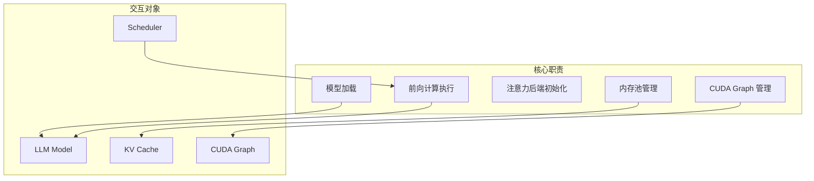
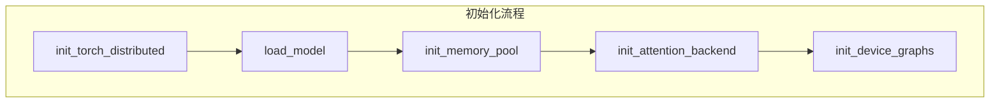
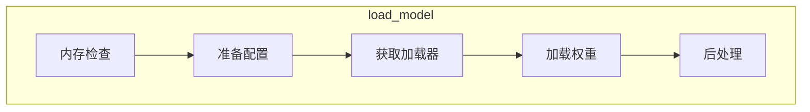
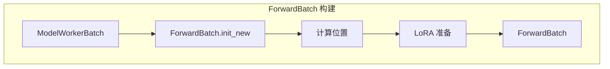
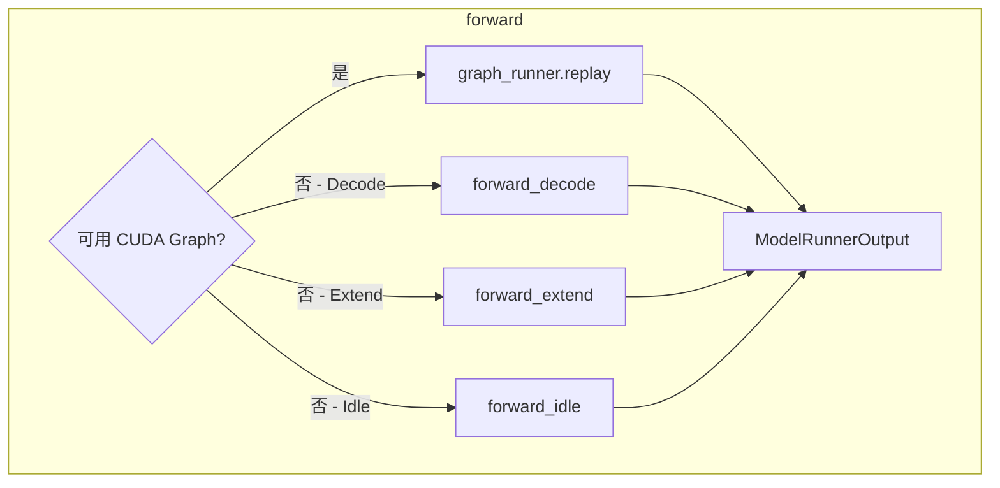
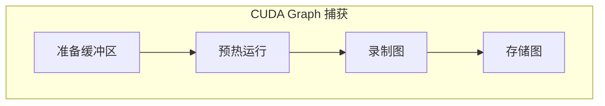
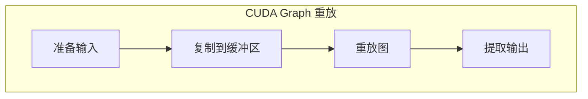
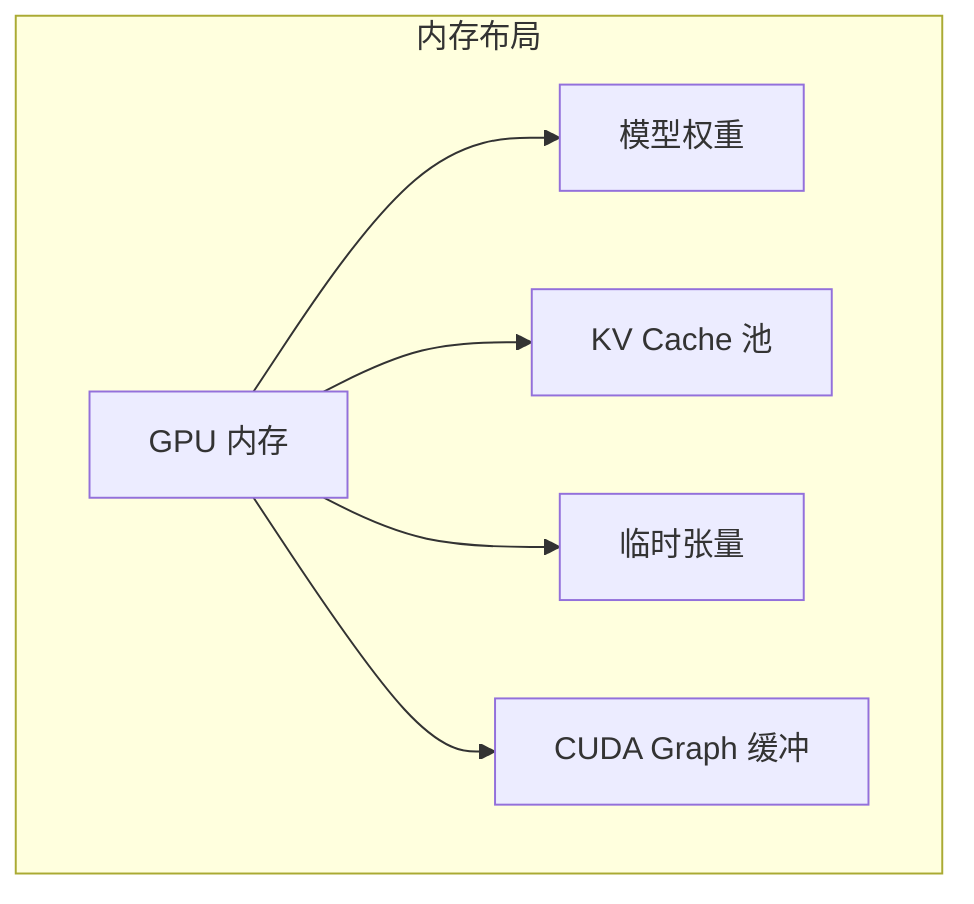
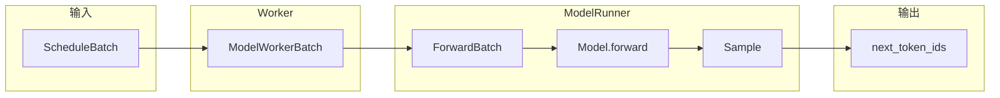

## 概述

### 本章学习目标
- 理解 ModelRunner 的职责和初始化流程
- 掌握 ForwardBatch 数据结构
- 了解前向计算的执行流程
- 学习 CUDA Graph 优化机制

### 前置知识要求
- 了解 PyTorch 模型执行
- 熟悉 CUDA 编程基础
- 理解 KV Cache 概念

---

## ModelRunner 职责

ModelRunner 是 SGLang 的模型执行核心，负责：



---

## 初始化流程

### 初始化链

**关键文件**：`python/sglang/srt/model_executor/model_runner.py`



### 核心属性

```python
class ModelRunner:
    def __init__(self, model_config, server_args, gpu_id, tp_rank, ...):
        # 分布式参数
        self.tp_rank = tp_rank
        self.tp_size = tp_size
        self.pp_rank = pp_rank
        self.pp_size = pp_size
        self.dp_size = dp_size

        # 模型和设备
        self.model: nn.Module
        self.device: str
        self.gpu_id: int

        # 内存池
        self.req_to_token_pool: ReqToTokenPool
        self.token_to_kv_pool: KVCache

        # 注意力后端
        self.attn_backend: AttentionBackend

        # CUDA Graph
        self.graph_runner: CudaGraphRunner
```

---

## 模型加载

### 加载流程



### 加载实现

```python
def load_model(self):
    # 1. 内存检查和准备
    available_memory = get_available_gpu_memory(self.gpu_id)

    # 2. 准备配置
    self.load_config = LoadConfig(
        load_format=self.server_args.load_format,
        download_dir=self.server_args.download_dir,
    )

    # 3. 获取模型加载器
    self.loader = get_model_loader(
        load_config=self.load_config,
        model_config=self.model_config,
    )

    # 4. 加载模型
    with self.memory_saver_adapter.region(GPU_MEMORY_TYPE_WEIGHTS):
        self.model = self.loader.load_model(
            model_config=self.model_config,
            device_config=DeviceConfig(self.device, self.gpu_id),
        )

    # 5. 后处理
    # - 加载 KV 缓存缩放因子（FP8）
    # - 提取滑动窗口大小
    # - 预展开 RoPE 缓存
    self._post_load_model()
```

---

## ForwardBatch 数据结构

### 结构定义

**关键文件**：`python/sglang/srt/model_executor/forward_batch_info.py`

```python
@dataclass
class ForwardBatch:
    # 基础信息
    forward_mode: ForwardMode       # 前向模式
    batch_size: int                 # 批次大小
    input_ids: torch.Tensor         # 输入 token IDs [num_tokens]
    req_pool_indices: torch.Tensor  # 请求池索引 [batch_size]
    seq_lens: torch.Tensor          # 序列长度 [batch_size]
    out_cache_loc: torch.Tensor     # KV 缓存位置 [num_tokens]
    seq_lens_sum: int               # 总 token 数

    # 位置信息
    positions: torch.Tensor         # token 位置 [num_tokens]
    extend_seq_lens: Optional[torch.Tensor]    # 扩展长度
    extend_prefix_lens: Optional[torch.Tensor] # 前缀长度
    extend_num_tokens: Optional[int]           # 扩展 token 数

    # 内存池引用
    req_to_token_pool: ReqToTokenPool
    token_to_kv_pool: KVCache
    attn_backend: AttentionBackend

    # 采样信息
    sampling_info: SamplingBatchInfo
```

### ForwardMode 类型

```python
class ForwardMode(IntEnum):
    EXTEND = 1          # Prefill：扩展序列
    DECODE = 2          # Decode：解码单个 token
    MIXED = 3           # 混合模式
    IDLE = 4            # 空闲（数据并行）
    TARGET_VERIFY = 5   # 推测解码验证
    DRAFT_EXTEND = 6    # Draft 模型扩展
```

### 构建流程



```python
@classmethod
def init_new(cls, batch: ModelWorkerBatch, model_runner: ModelRunner):
    ret = cls(
        forward_mode=batch.forward_mode,
        batch_size=len(batch.seq_lens),
        input_ids=batch.input_ids,
        req_pool_indices=batch.req_pool_indices,
        seq_lens=batch.seq_lens,
        out_cache_loc=batch.out_cache_loc,
        # ...
    )

    # 计算位置
    if ret.forward_mode.is_decode():
        ret.positions = clamp_position(batch.seq_lens)
    else:
        # Prefill 模式
        positions, ret.extend_start_loc = compute_position(
            model_runner.server_args.attention_backend,
            ret.extend_prefix_lens,
            ret.extend_seq_lens,
            ret.extend_num_tokens,
        )
        ret.positions = positions

    # LoRA 准备
    if model_runner.server_args.enable_lora:
        model_runner.lora_manager.prepare_lora_batch(ret)

    return ret
```

---

## 前向计算流程

### 主前向方法



### 实现代码

```python
def _forward_raw(self, forward_batch: ForwardBatch, ...):
    # 1. 检查是否可用 CUDA Graph
    can_run_graph = (
        forward_batch.forward_mode.is_cuda_graph()
        and self.graph_runner
        and self.graph_runner.can_run(forward_batch)
    )

    # 2. 如果可用，直接重放 CUDA Graph
    if can_run_graph:
        ret = self.graph_runner.replay(
            forward_batch,
            skip_attn_backend_init=skip_attn_backend_init,
        )
        return ModelRunnerOutput(
            logits_output=ret,
            can_run_graph=can_run_graph
        )

    # 3. 否则执行动态前向
    if forward_batch.forward_mode.is_decode():
        ret = self.forward_decode(forward_batch, ...)
    elif forward_batch.forward_mode.is_extend():
        ret = self.forward_extend(forward_batch, ...)
    elif forward_batch.forward_mode.is_idle():
        ret = self.forward_idle(forward_batch, ...)

    return ModelRunnerOutput(
        logits_output=ret,
        can_run_graph=can_run_graph
    )
```

### Decode 前向

```python
def forward_decode(self, forward_batch: ForwardBatch, ...):
    # 初始化注意力后端元数据
    if not skip_attn_backend_init:
        self.attn_backend.init_forward_metadata(forward_batch)

    # 调用模型前向
    return self.model.forward(
        forward_batch.input_ids,
        forward_batch.positions,
        forward_batch,
    )
```

### Extend 前向（Prefill）

```python
def forward_extend(self, forward_batch: ForwardBatch, ...):
    # 尝试使用分段 CUDA Graph
    if (self.piecewise_cuda_graph_runner is not None
        and self.piecewise_cuda_graph_runner.can_run(forward_batch)):
        return self.piecewise_cuda_graph_runner.replay(forward_batch)

    # 标准 Prefill 前向
    if not skip_attn_backend_init:
        self.attn_backend.init_forward_metadata(forward_batch)

    return self.model.forward(
        forward_batch.input_ids,
        forward_batch.positions,
        forward_batch,
    )
```

---

## CUDA Graph 优化

### 为什么使用 CUDA Graph

| 问题 | CUDA Graph 解决方案 |
|------|---------------------|
| Kernel Launch 开销 | 预先录制，一次提交 |
| CPU-GPU 同步 | 消除中间同步点 |
| 小批次低效 | 批量执行优化 |

### CudaGraphRunner 结构

**关键文件**：`python/sglang/srt/model_executor/cuda_graph_runner.py`

```python
class CudaGraphRunner:
    def __init__(self, model_runner: ModelRunner):
        # 批次大小列表
        self.capture_bs: List[int]

        # 捕获的图
        self.graphs: Dict[int, torch.cuda.CUDAGraph]

        # 输入缓冲区
        self.buffers: GraphInputBuffers

        # 输出缓冲区
        self.output_buffers: Dict[int, LogitsProcessorOutput]
```

### 捕获流程



```python
def capture(self) -> None:
    with freeze_gc(self.model_runner.server_args.enable_cudagraph_gc):
        # 反向遍历批次大小（内存重用）
        for bs in reversed(self.capture_bs):
            with patch_model(self.model_runner.model, bs in self.compile_bs):
                graph, output_buffers = self.capture_one_batch_size(bs, forward)
                self.graphs[bs] = graph
                self.output_buffers[bs] = output_buffers
```

### 单批次捕获

```python
def capture_one_batch_size(self, bs: int, forward: Callable):
    # 1. 准备输入
    num_tokens = bs * self.num_tokens_per_bs
    input_ids = self.buffers.input_ids[:num_tokens]
    seq_lens = self.buffers.seq_lens[:bs]
    positions = self.buffers.positions[:num_tokens]

    # 2. 构建 ForwardBatch
    forward_batch = ForwardBatch(
        forward_mode=self.capture_forward_mode,
        batch_size=bs,
        input_ids=input_ids,
        # ...
    )

    # 3. 初始化注意力后端
    self.attn_backend.init_forward_metadata_capture_cuda_graph(
        bs, num_tokens, req_pool_indices, seq_lens, ...
    )

    # 4. 定义运行函数
    def run_once():
        return forward(input_ids, positions, forward_batch)

    # 5. 预热（两次运行）
    for _ in range(2):
        self.device_module.synchronize()
        run_once()

    # 6. 捕获 CUDA Graph
    graph = torch.cuda.CUDAGraph()
    with torch.cuda.graph(graph, pool=self.pool):
        out = run_once()

    return graph, out
```

### 重放流程



```python
def replay(self, forward_batch: ForwardBatch, ...):
    # 1. 准备重放
    if not skip_attn_backend_init:
        self.replay_prepare(forward_batch)

    # 2. 复制输入到缓冲区
    self.buffers.input_ids[:self.raw_num_token].copy_(forward_batch.input_ids)
    self.buffers.positions[:self.raw_num_token].copy_(forward_batch.positions)

    # 3. 重放 CUDA Graph
    self.graphs[self.bs].replay()
    output = self.output_buffers[self.bs]

    # 4. 提取实际输出
    next_token_logits = output.next_token_logits[:self.raw_num_token]

    return LogitsProcessorOutput(
        next_token_logits=next_token_logits,
        # ...
    )
```

---

## 输入缓冲区

### GraphInputBuffers 结构

```python
@dataclass
class GraphInputBuffers:
    input_ids: torch.Tensor          # [max_num_token]
    req_pool_indices: torch.Tensor   # [max_bs]
    seq_lens: torch.Tensor           # [max_bs]
    seq_lens_cpu: torch.Tensor       # CPU 副本
    out_cache_loc: torch.Tensor      # [max_num_token]
    positions: torch.Tensor          # [max_num_token]

    # 全局 token 数（MLP 同步）
    global_num_tokens_gpu: torch.Tensor

    # Pipeline 并行代理张量
    pp_proxy_tensors: Dict[str, torch.Tensor]
```

### 缓冲区填充

```python
def populate_from_forward_batch(
    self,
    forward_batch: ForwardBatch,
    raw_bs: int,
    raw_num_token: int,
    bs: int,  # 填充后的批次大小
):
    # 1. 复制原始数据
    self.input_ids[:raw_num_token].copy_(forward_batch.input_ids)
    self.req_pool_indices[:raw_bs].copy_(forward_batch.req_pool_indices)
    self.seq_lens[:raw_bs].copy_(forward_batch.seq_lens)

    # 2. 填充到目标大小
    if bs > raw_bs:
        self.seq_lens[raw_bs:bs].fill_(seq_len_fill_value)
        self.req_pool_indices[raw_bs:bs].fill_(0)

    return self.seq_lens[:bs].cpu()
```

---

## 内存池管理

### 内存池初始化

```python
def init_memory_pool(self, total_gpu_memory: int):
    # 计算最大 token 数
    self.max_total_num_tokens = self.profile_max_num_token(total_gpu_memory)

    # 请求到 token 的映射池
    self.req_to_token_pool = ReqToTokenPool(
        size=self.server_args.max_running_requests,
        num_token=self.max_total_num_tokens,
    )

    # KV 缓存池
    self.token_to_kv_pool = BaseTokenToKVPoolAllocator.create(
        allocator_type=self.server_args.kv_cache_allocator,
        num_token=self.max_total_num_tokens,
        dtype=self.kv_cache_dtype,
        head_num=self.model_config.num_kv_heads,
        head_dim=self.model_config.head_dim,
        layer_num=self.model_config.num_hidden_layers,
        device=self.device,
    )
```

### 内存布局



---

## 注意力后端

### 支持的后端

| 后端 | 特点 |
|------|------|
| FlashInfer | 高性能，支持 PagedAttention |
| FlashAttention3 | 新版 FlashAttention |
| Triton | 纯 Python 实现 |
| torch_native | PyTorch 原生 |

### 后端初始化

```python
def init_attention_backend(self):
    backend_name = self.server_args.attention_backend

    if backend_name == "flashinfer":
        self.attn_backend = FlashInferAttnBackend(
            self.model_config,
            self.server_args,
            self.max_total_num_tokens,
        )
    elif backend_name == "fa3":
        self.attn_backend = FlashAttention3Backend(...)
    elif backend_name == "triton":
        self.attn_backend = TritonAttnBackend(...)
```

---

## 数据流总结



---

## 性能优化要点

### 1. CUDA Graph

- 预捕获常见批次大小
- 消除 Kernel Launch 开销
- 内存重用（大批次先捕获）

### 2. 注意力后端

- FlashInfer: PagedAttention 优化
- FlashAttention3: 最新优化
- 自动选择最佳后端

### 3. 内存管理

- 预分配内存池
- 避免动态分配
- KV Cache 复用

### 4. 并行优化

- TP/PP/DP 支持
- MLP 同步优化
- 通信与计算重叠

---

## 小结

### 要点回顾

1. **初始化**：分布式环境 → 模型加载 → 内存池 → 注意力后端 → CUDA Graph
2. **ForwardBatch**：封装前向计算所需的所有信息
3. **前向计算**：优先使用 CUDA Graph，否则动态执行
4. **CUDA Graph**：捕获 → 缓冲区填充 → 重放

### 关键代码文件

| 文件 | 职责 |
|------|------|
| `model_runner.py` | 核心执行器 |
| `forward_batch_info.py` | ForwardBatch 定义 |
| `cuda_graph_runner.py` | CUDA Graph 管理 |
| `input_buffers.py` | 缓冲区管理 |

### 下一章预告

在模块三《内存与缓存篇》中，我们将：
- 深入理解 KV Cache 原理
- 学习 RadixAttention 机制
- 掌握内存池设计
