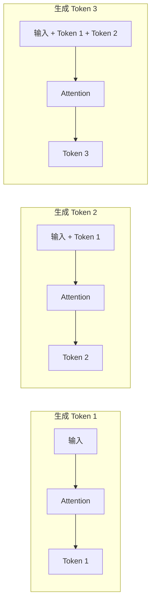
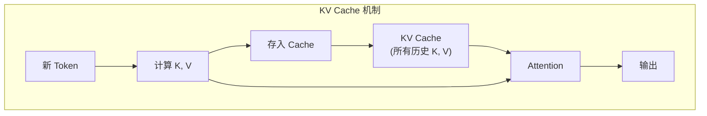
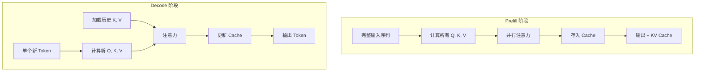
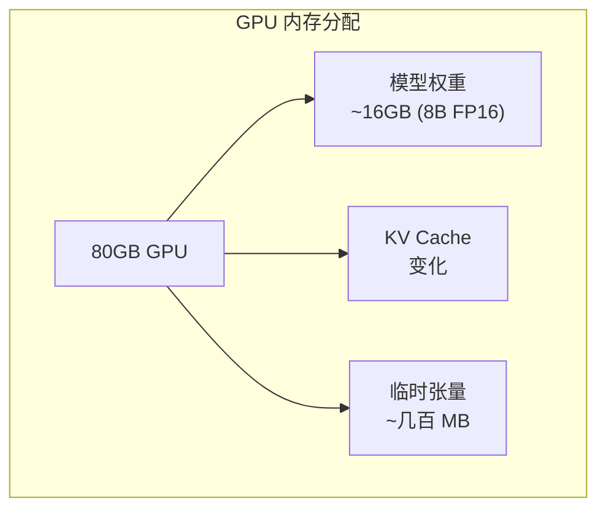
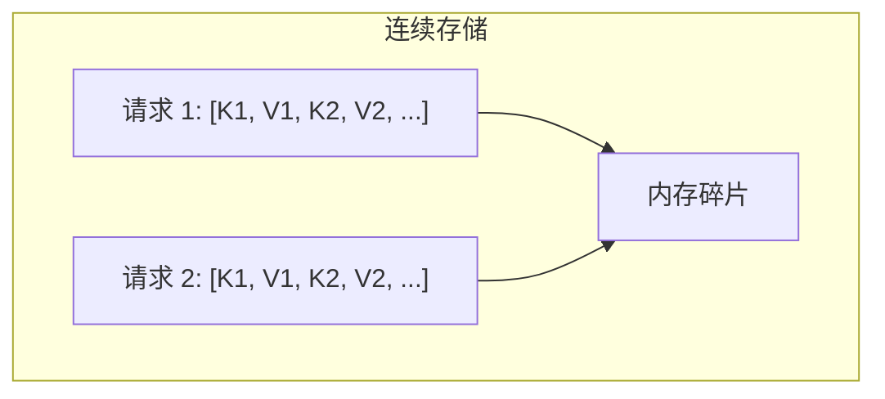
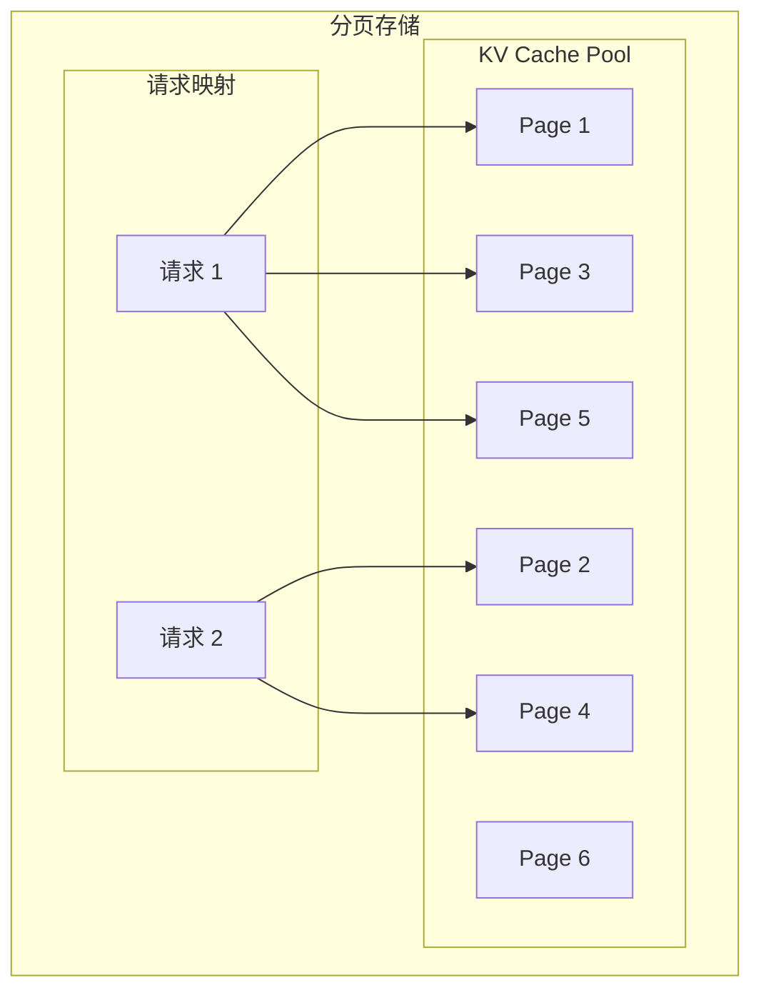
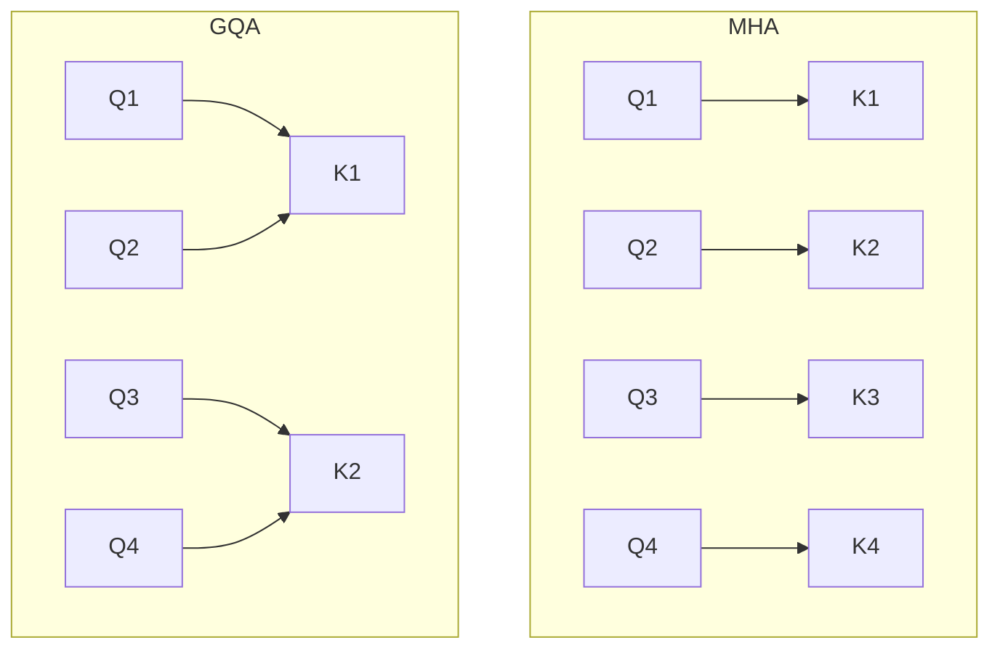
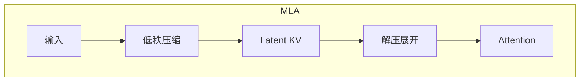

## 概述

### 本章学习目标
- 理解 KV Cache 的原理和必要性
- 掌握 KV Cache 的内存占用计算
- 了解 KV Cache 对推理性能的影响
- 学习 SGLang 中 KV Cache 的实现方式

### 前置知识要求
- 了解 Transformer 架构
- 熟悉注意力机制
- 理解自回归生成过程

---

## 为什么需要 KV Cache

### 自回归生成的问题

在 LLM 自回归生成中，每个新 token 的生成都需要对所有之前的 tokens 做注意力计算：



**问题**：每次生成都重新计算所有 token 的 Key 和 Value，计算量为 O(n²)。

### KV Cache 的解决方案

缓存已计算的 Key 和 Value，避免重复计算：



**优势**：
- 每次只计算新 token 的 K, V
- 复用历史 K, V
- 计算量降为 O(n)

---

## 注意力机制回顾

### 标准注意力计算

```python
# Q, K, V 的计算
Q = X @ W_q  # [batch, seq_len, hidden] @ [hidden, head_dim] -> [batch, seq_len, head_dim]
K = X @ W_k
V = X @ W_v

# 注意力计算
attn_scores = Q @ K.T / sqrt(d_k)  # [batch, seq_len, seq_len]
attn_weights = softmax(attn_scores)
output = attn_weights @ V           # [batch, seq_len, head_dim]
```

### Prefill vs Decode



| 阶段 | 特点 | 计算类型 |
|------|------|----------|
| Prefill | 处理整个输入序列 | 计算密集型 |
| Decode | 每次处理一个 token | 内存带宽密集型 |

---

## KV Cache 内存占用

### 单请求内存计算

```
KV Cache 大小 = 2 × num_layers × seq_len × num_kv_heads × head_dim × dtype_size
```

**示例：Llama-3-8B**
- num_layers = 32
- num_kv_heads = 8 (GQA)
- head_dim = 128
- dtype = fp16 (2 bytes)

```
每 token KV Cache = 2 × 32 × 8 × 128 × 2 = 131,072 bytes = 128 KB
```

**4K 上下文**：
```
单请求 KV Cache = 4096 × 128 KB = 512 MB
```

### 批量推理内存



**计算最大批次大小**：
```python
available_memory = total_gpu_memory - model_weights - temp_memory
max_tokens = available_memory / kv_cache_per_token
max_batch_size = max_tokens / avg_sequence_length
```

### 不同模型的 KV Cache 大小

| 模型 | 每 Token KV Cache | 4K 上下文 |
|------|-------------------|-----------|
| Llama-3-8B | 128 KB | 512 MB |
| Llama-3-70B | 160 KB | 640 MB |
| Qwen2-72B | 160 KB | 640 MB |
| DeepSeek-V3 (MLA) | ~32 KB | ~128 MB |

---

## SGLang 中的 KV Cache 实现

### 内存池设计

**关键文件**：`python/sglang/srt/mem_cache/memory_pool.py`

```python
class KVCache:
    """KV Cache 存储"""
    def __init__(
        self,
        num_token: int,      # 最大 token 数
        num_layer: int,      # 层数
        num_head: int,       # KV 头数
        head_dim: int,       # 头维度
        dtype: torch.dtype,  # 数据类型
        device: str,         # 设备
    ):
        # 分配 KV 张量
        # Shape: [num_layer, num_token, num_head, head_dim]
        self.k_cache = torch.zeros(
            (num_layer, num_token, num_head, head_dim),
            dtype=dtype, device=device
        )
        self.v_cache = torch.zeros(
            (num_layer, num_token, num_head, head_dim),
            dtype=dtype, device=device
        )
```

### Token Pool 分配器

```python
class ReqToTokenPool:
    """请求到 Token 的映射"""
    def __init__(self, size: int, num_token: int):
        self.req_to_token = torch.zeros(
            (size, num_token), dtype=torch.int32, device="cuda"
        )
        self.free_slots = list(range(size))

    def alloc(self, need_size: int) -> int:
        """分配请求槽位"""
        if not self.free_slots:
            return -1
        slot = self.free_slots.pop()
        return slot

    def free(self, slot: int):
        """释放请求槽位"""
        self.free_slots.append(slot)
```

### KV Pool 分配器

```python
class TokenToKVPoolAllocator:
    """Token 到 KV Cache 的分配器"""
    def __init__(self, num_token: int, page_size: int = 1):
        self.num_token = num_token
        self.page_size = page_size
        self.free_pages = list(range(num_token // page_size))

    def alloc(self, num_pages: int) -> Optional[torch.Tensor]:
        """分配 KV Cache 页"""
        if len(self.free_pages) < num_pages:
            return None

        allocated = []
        for _ in range(num_pages):
            allocated.append(self.free_pages.pop())

        return torch.tensor(allocated, dtype=torch.int32, device="cuda")

    def free(self, pages: torch.Tensor):
        """释放 KV Cache 页"""
        for page in pages.tolist():
            self.free_pages.append(page)
```

---

## Paged Attention

### 传统连续存储的问题



**问题**：
- 预分配最大长度，浪费内存
- 序列长度变化导致碎片
- 难以动态扩展

### 分页存储



**优势**：
- 按需分配页
- 无内存碎片
- 高内存利用率

### SGLang 实现

```python
class PagedTokenToKVPoolAllocator(BaseTokenToKVPoolAllocator):
    """分页 KV Cache 分配器"""
    def __init__(self, num_token: int, page_size: int):
        self.page_size = page_size
        self.num_pages = num_token // page_size
        self.free_pages = list(range(self.num_pages))

    def alloc_extend(self, prefix_len: int, extend_len: int):
        """为扩展分配页"""
        # 计算需要的新页数
        old_pages = (prefix_len + self.page_size - 1) // self.page_size
        total_pages = (prefix_len + extend_len + self.page_size - 1) // self.page_size
        new_pages = total_pages - old_pages

        if new_pages > len(self.free_pages):
            return None

        return self._alloc_pages(new_pages)

    def free_pages(self, pages: List[int]):
        """释放页"""
        self.free_pages.extend(pages)
```

---

## KV Cache 优化技术

### 1. KV Cache 量化

```python
# FP16 -> FP8
# 内存减少 50%
self.k_cache = torch.zeros(
    (num_layer, num_token, num_head, head_dim),
    dtype=torch.float8_e5m2,  # FP8
    device=device
)
```

### 2. Group Query Attention (GQA)



**GQA 内存优势**：
- Llama-3-8B: 8 KV heads vs 32 Q heads
- KV Cache 减少 4x

### 3. Multi-head Latent Attention (MLA)

DeepSeek-V3 使用的高效注意力：



**MLA 内存优势**：
- 压缩 KV 到低维潜在空间
- 内存减少 8-16x
- 计算时解压

---

## 内存占用分析工具

### 计算 KV Cache 大小

```python
def calculate_kv_cache_size(
    num_layers: int,
    num_kv_heads: int,
    head_dim: int,
    seq_len: int,
    dtype_bytes: int = 2,  # FP16
) -> int:
    """计算单请求 KV Cache 大小（字节）"""
    return 2 * num_layers * seq_len * num_kv_heads * head_dim * dtype_bytes

# 示例
kv_size = calculate_kv_cache_size(
    num_layers=32,
    num_kv_heads=8,
    head_dim=128,
    seq_len=4096,
)
print(f"KV Cache: {kv_size / 1024 / 1024:.2f} MB")
# 输出: KV Cache: 512.00 MB
```

### 估算最大并发

```python
def estimate_max_batch(
    gpu_memory_gb: float,
    model_memory_gb: float,
    kv_cache_per_token_kb: float,
    avg_seq_len: int,
    reserve_ratio: float = 0.1,
) -> int:
    """估算最大并发请求数"""
    available_gb = gpu_memory_gb - model_memory_gb
    available_gb *= (1 - reserve_ratio)  # 预留空间

    available_kb = available_gb * 1024 * 1024
    kv_per_seq = kv_cache_per_token_kb * avg_seq_len

    return int(available_kb / kv_per_seq)

# 示例: 80GB GPU, Llama-3-8B
max_batch = estimate_max_batch(
    gpu_memory_gb=80,
    model_memory_gb=16,
    kv_cache_per_token_kb=128,
    avg_seq_len=2048,
)
print(f"最大并发: {max_batch}")
```

---

## 小结

### 要点回顾

1. **KV Cache 原理**：缓存历史 K, V，避免重复计算
2. **内存占用**：2 × layers × seq_len × kv_heads × head_dim × dtype
3. **Paged Attention**：分页存储，提高内存利用率
4. **优化技术**：量化、GQA、MLA

### 关键公式

```
单 Token KV Cache = 2 × num_layers × num_kv_heads × head_dim × dtype_bytes
总 KV Cache = 单 Token × seq_len × batch_size
```

### 下一章预告

在下一章《RadixAttention 原理》中，我们将：
- 了解 Radix Tree 数据结构
- 学习前缀缓存复用机制
- 掌握 SGLang 的核心创新
