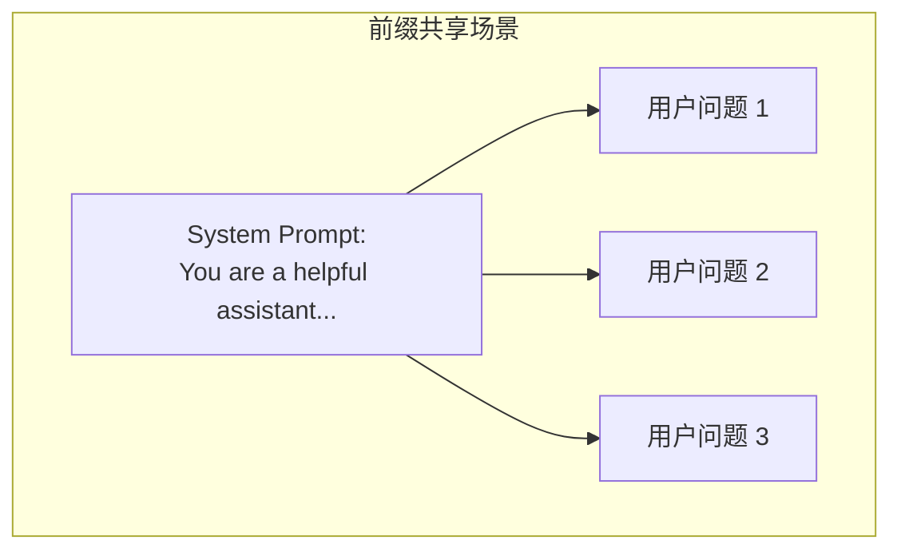
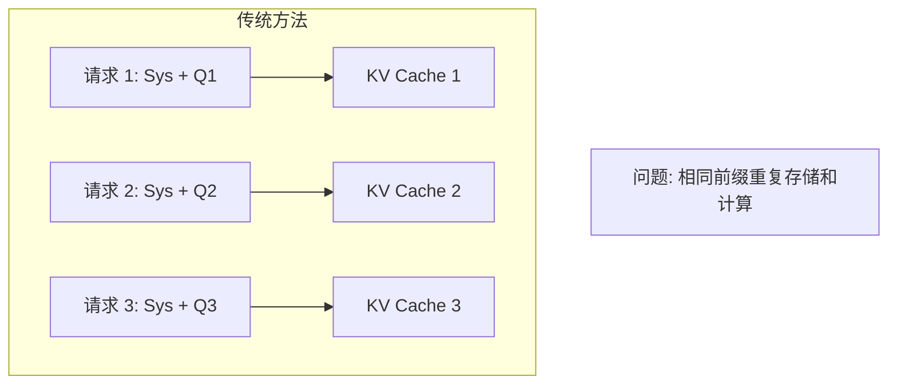
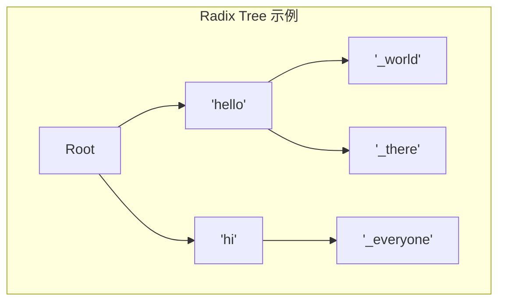
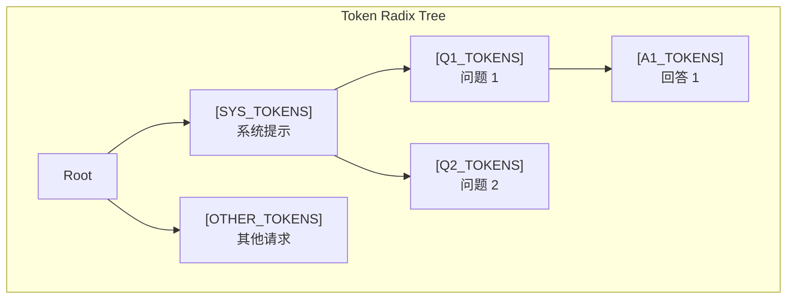
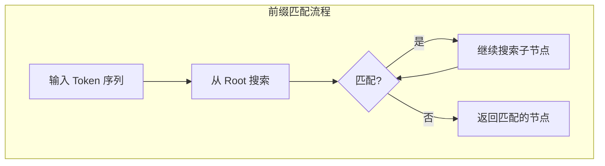
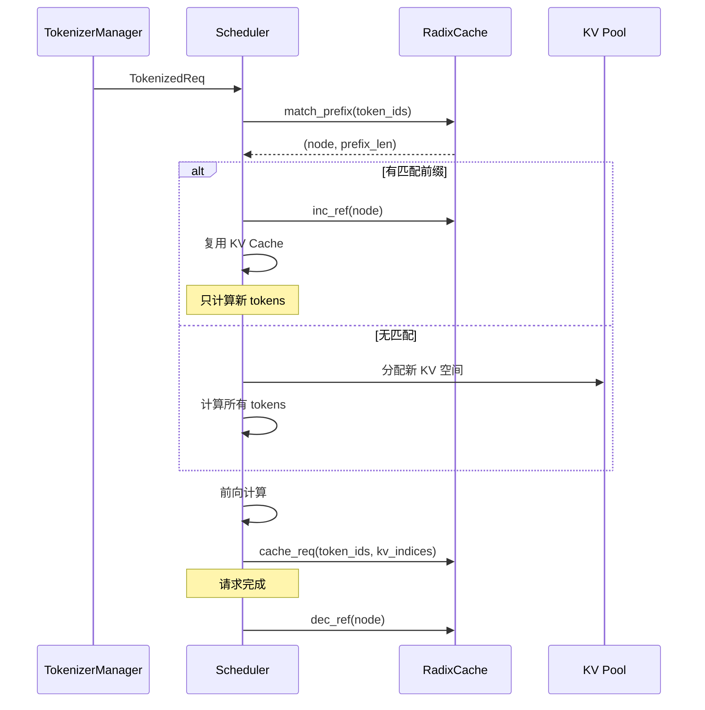
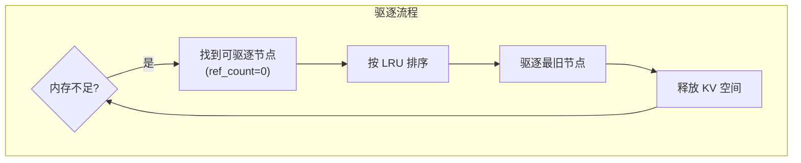
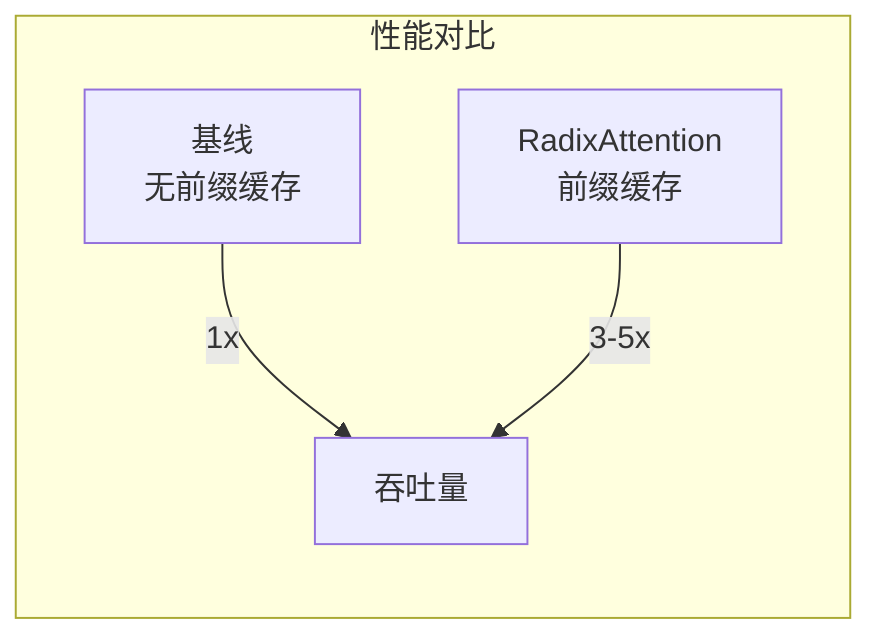

## 概述

### 本章学习目标
- 理解 RadixAttention 的设计动机
- 掌握 Radix Tree 数据结构
- 了解前缀缓存复用机制
- 学习 SGLang 中的实现细节

### 前置知识要求
- 了解 KV Cache 基础
- 熟悉 Trie 树结构
- 理解 LRU 缓存概念

---

## 设计动机

### 前缀共享场景

在实际应用中，很多请求共享相同的前缀：



**典型场景**：
- 相同系统提示词
- RAG 应用中的相似上下文
- Few-shot 示例
- 多轮对话的历史

### 传统方法的问题



**问题**：
- 重复计算相同前缀的 KV
- 重复存储相同的 KV Cache
- 内存浪费
- 吞吐量受限

---

## Radix Tree 数据结构

### 什么是 Radix Tree

Radix Tree（基数树）是一种压缩的 Trie 树，用于高效存储和查找字符串：



**特点**：
- 公共前缀只存储一次
- 边可以存储多个字符
- 查找时间 O(m)，m 为字符串长度

### Token 序列的 Radix Tree

在 SGLang 中，Radix Tree 存储 Token 序列：



### 节点数据结构

```python
class RadixNode:
    def __init__(self):
        self.children: Dict[int, RadixNode] = {}  # token -> child
        self.parent: Optional[RadixNode] = None
        self.edge_tokens: List[int] = []          # 边上的 tokens
        self.kv_indices: Optional[torch.Tensor] = None  # KV Cache 位置
        self.ref_count: int = 0                   # 引用计数
        self.last_access_time: float = 0          # 最后访问时间
```

---

## SGLang RadixCache 实现

### 类结构

**关键文件**：`python/sglang/srt/mem_cache/radix_cache.py`

```python
class RadixCache:
    def __init__(
        self,
        token_to_kv_pool: KVCache,
        page_size: int = 1,
        disable: bool = False,
    ):
        self.root = RadixNode()
        self.token_to_kv_pool = token_to_kv_pool
        self.page_size = page_size
        self.disable = disable

        # 统计
        self.total_tokens = 0
        self.evictable_tokens = 0
```

### 前缀匹配



```python
def match_prefix(self, token_ids: List[int]) -> Tuple[RadixNode, int]:
    """匹配最长前缀，返回节点和匹配长度"""
    if self.disable:
        return self.root, 0

    node = self.root
    matched_len = 0

    while token_ids:
        # 查找匹配的子节点
        first_token = token_ids[0]
        if first_token not in node.children:
            break

        child = node.children[first_token]
        edge_len = len(child.edge_tokens)

        # 检查边上的 tokens 是否匹配
        if len(token_ids) >= edge_len:
            if token_ids[:edge_len] == child.edge_tokens:
                # 完全匹配，继续搜索
                node = child
                token_ids = token_ids[edge_len:]
                matched_len += edge_len
            else:
                # 部分匹配
                partial_len = self._get_partial_match_len(
                    token_ids, child.edge_tokens
                )
                matched_len += partial_len
                break
        else:
            # 输入序列较短，检查部分匹配
            partial_len = self._get_partial_match_len(
                token_ids, child.edge_tokens
            )
            matched_len += partial_len
            break

    return node, matched_len
```

### 插入缓存

```python
def cache_req(
    self,
    token_ids: List[int],
    kv_indices: torch.Tensor,
    last_node: RadixNode,
    prefix_len: int,
) -> RadixNode:
    """缓存请求的 KV Cache"""
    if self.disable:
        return self.root

    # 从上次匹配的位置开始插入
    node = last_node
    remaining_tokens = token_ids[prefix_len:]
    remaining_indices = kv_indices[prefix_len:]

    while remaining_tokens:
        first_token = remaining_tokens[0]

        if first_token not in node.children:
            # 创建新节点
            new_node = RadixNode()
            new_node.parent = node
            new_node.edge_tokens = remaining_tokens.copy()
            new_node.kv_indices = remaining_indices.clone()
            node.children[first_token] = new_node
            node = new_node
            break
        else:
            # 可能需要分裂节点
            child = node.children[first_token]
            # ... 分裂逻辑
            pass

    return node
```

### 引用计数

```python
def inc_ref(self, node: RadixNode):
    """增加引用计数"""
    while node is not None:
        node.ref_count += 1
        node = node.parent

def dec_ref(self, node: RadixNode):
    """减少引用计数"""
    while node is not None:
        node.ref_count -= 1
        if node.ref_count == 0 and node != self.root:
            # 可以被驱逐
            self.evictable_tokens += len(node.edge_tokens)
        node = node.parent
```

---

## 前缀复用流程

### 完整流程图



### 初始化请求

```python
def init_next_round_input(self, tree_cache: RadixCache):
    """初始化请求的下一轮输入"""
    # 匹配前缀
    self.last_node, prefix_len = tree_cache.match_prefix(self.input_ids)

    # 计算需要扩展的 tokens
    self.extend_input_len = len(self.input_ids) - prefix_len
    self.prefix_len = prefix_len

    # 增加引用计数
    tree_cache.inc_ref(self.last_node)

    # 获取前缀的 KV 位置
    if prefix_len > 0:
        self.prefix_kv_indices = self.last_node.kv_indices[:prefix_len]
```

---

## 缓存驱逐

### LRU 驱逐策略



```python
def evict(self, num_tokens: int) -> int:
    """驱逐指定数量的 tokens"""
    if self.disable:
        return 0

    evicted = 0
    candidates = self._get_evictable_nodes()

    # 按 LRU 排序
    candidates.sort(key=lambda n: n.last_access_time)

    for node in candidates:
        if evicted >= num_tokens:
            break

        # 驱逐节点
        tokens_in_node = len(node.edge_tokens)
        self._remove_node(node)
        evicted += tokens_in_node

        # 释放 KV 空间
        self.token_to_kv_pool.free(node.kv_indices)

    return evicted

def _get_evictable_nodes(self) -> List[RadixNode]:
    """获取所有可驱逐的节点"""
    evictable = []

    def dfs(node):
        if node.ref_count == 0 and node != self.root:
            evictable.append(node)
        for child in node.children.values():
            dfs(child)

    dfs(self.root)
    return evictable
```

---

## 性能优势

### 吞吐量提升



**提升原因**：
1. 避免重复计算前缀的 KV
2. 减少内存占用
3. 更多并发请求

### 内存效率

| 场景 | 传统方法 | RadixAttention |
|------|----------|----------------|
| 10 请求，相同系统提示 | 10x 系统提示 KV | 1x 系统提示 KV |
| RAG，相似上下文 | 重复存储 | 共享公共部分 |
| 多轮对话 | 完整历史 | 复用历史 KV |

### 延迟降低

```
传统: TTFT = Prefill(系统提示 + 用户输入)
RadixAttention: TTFT = Prefill(用户输入)  // 系统提示已缓存
```

---

## 高级特性

### 1. 部分匹配

当新请求只匹配前缀的一部分时：

```python
def _split_node(self, node: RadixNode, split_pos: int) -> RadixNode:
    """分裂节点"""
    # 创建新的中间节点
    new_node = RadixNode()
    new_node.parent = node.parent
    new_node.edge_tokens = node.edge_tokens[:split_pos]
    new_node.kv_indices = node.kv_indices[:split_pos]

    # 调整原节点
    node.edge_tokens = node.edge_tokens[split_pos:]
    node.kv_indices = node.kv_indices[split_pos:]
    node.parent = new_node

    # 更新父节点的子节点指针
    new_node.children[node.edge_tokens[0]] = node

    return new_node
```

### 2. 分页支持

结合 Paged Attention：

```python
def cache_req_with_pages(
    self,
    token_ids: List[int],
    page_indices: List[int],
    page_size: int,
):
    """分页模式下的缓存"""
    # 将 token 位置转换为页
    # 支持跨页的前缀匹配
    pass
```

### 3. 多模态支持

处理图像等多模态输入的缓存：

```python
def match_prefix_multimodal(
    self,
    token_ids: List[int],
    image_hash: Optional[str],
) -> Tuple[RadixNode, int]:
    """多模态前缀匹配"""
    # 结合图像哈希进行匹配
    pass
```

---

## 调试和监控

### 缓存统计

```python
def get_stats(self) -> Dict:
    """获取缓存统计"""
    return {
        "total_nodes": self._count_nodes(),
        "total_tokens": self.total_tokens,
        "evictable_tokens": self.evictable_tokens,
        "hit_rate": self.hits / (self.hits + self.misses),
    }
```

### 可视化

```python
def visualize(self) -> str:
    """可视化 Radix Tree"""
    lines = []

    def dfs(node, prefix=""):
        if node != self.root:
            tokens_str = str(node.edge_tokens[:5]) + "..."
            lines.append(f"{prefix}{tokens_str} (ref={node.ref_count})")
        for child in node.children.values():
            dfs(child, prefix + "  ")

    dfs(self.root)
    return "\n".join(lines)
```

---

## 小结

### 要点回顾

1. **Radix Tree**：压缩 Trie，高效存储和查找 Token 序列
2. **前缀匹配**：O(m) 时间复杂度查找最长公共前缀
3. **引用计数**：追踪节点使用，支持安全驱逐
4. **LRU 驱逐**：按访问时间驱逐不再使用的节点

### 关键优势

| 优势 | 说明 |
|------|------|
| 自动复用 | 无需手动管理前缀缓存 |
| 细粒度 | 任意长度前缀都可复用 |
| 动态调整 | 根据访问模式自动优化 |

### 下一章预告

在下一章《内存池设计》中，我们将：
- 了解 Token Pool 和 KV Pool 的设计
- 学习 Paged Attention 的实现
- 掌握内存分配和回收机制
