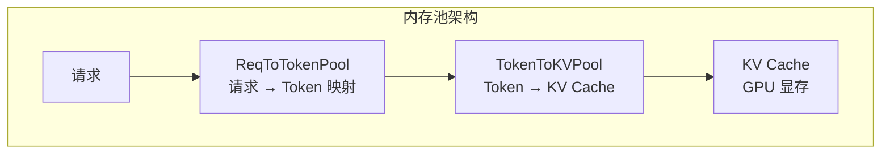
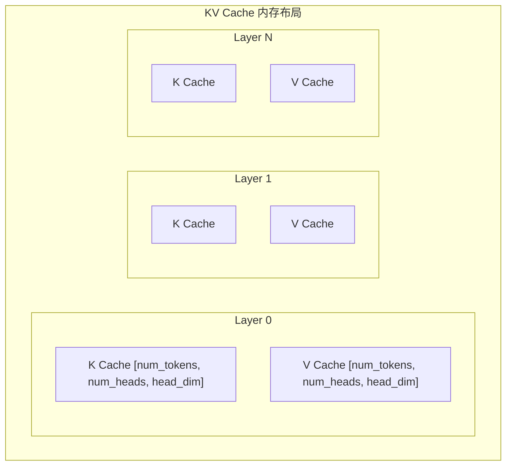
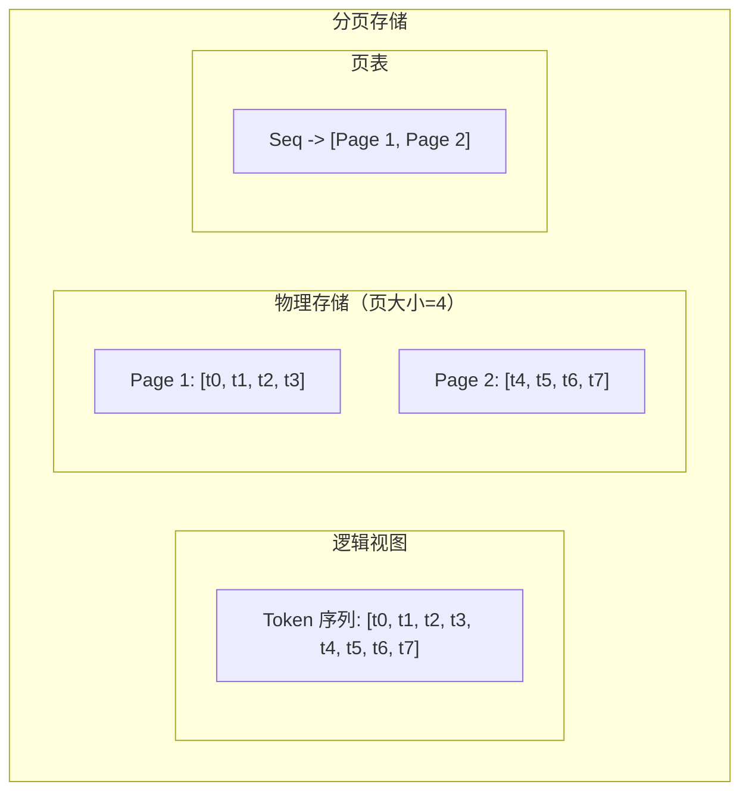
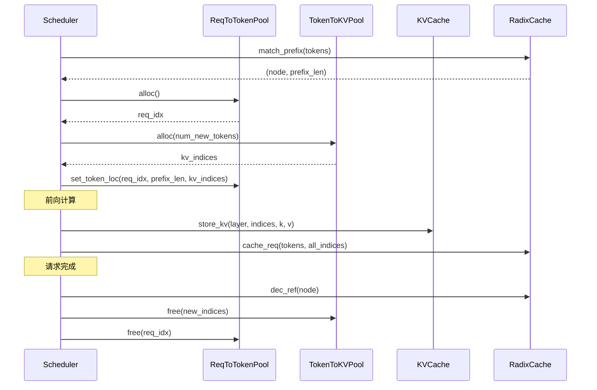

## 概述

### 本章学习目标
- 理解 SGLang 内存池的整体架构
- 掌握 Token Pool 和 KV Pool 的设计
- 了解 Paged Attention 的实现原理
- 学习内存分配和回收机制

### 前置知识要求
- 了解 KV Cache 基础
- 熟悉内存管理概念
- 理解池化技术

---

## 内存池架构

### 整体设计

SGLang 使用两级内存池管理 KV Cache：



### 设计目标

| 目标 | 实现方式 |
|------|----------|
| 高内存利用率 | 分页存储，按需分配 |
| 低碎片化 | 固定大小页，统一管理 |
| 快速分配/回收 | 预分配池，O(1) 操作 |
| 支持前缀复用 | 与 RadixCache 集成 |

---

## ReqToTokenPool

### 数据结构

**关键文件**：`python/sglang/srt/mem_cache/memory_pool.py`

```python
class ReqToTokenPool:
    """请求到 Token 的映射池"""

    def __init__(
        self,
        size: int,           # 最大请求数
        max_context_len: int, # 每请求最大 token 数
        device: str = "cuda",
    ):
        # 映射表: [req_idx, token_pos] -> kv_pool_idx
        self.req_to_token = torch.zeros(
            (size, max_context_len),
            dtype=torch.int32,
            device=device,
        )

        # 空闲请求槽位
        self.free_slots: List[int] = list(range(size))

        # 每个请求的当前长度
        self.req_lens = torch.zeros(size, dtype=torch.int32, device=device)
```

### 分配与释放

```python
class ReqToTokenPool:
    def alloc(self) -> int:
        """分配一个请求槽位"""
        if not self.free_slots:
            return -1
        slot = self.free_slots.pop()
        self.req_lens[slot] = 0
        return slot

    def free(self, slot: int):
        """释放请求槽位"""
        self.req_lens[slot] = 0
        self.req_to_token[slot].fill_(0)
        self.free_slots.append(slot)

    def set_token_loc(self, req_idx: int, start: int, kv_indices: torch.Tensor):
        """设置 token 的 KV Cache 位置"""
        end = start + len(kv_indices)
        self.req_to_token[req_idx, start:end] = kv_indices
        self.req_lens[req_idx] = end
```

### 使用示例

```python
# 分配请求
req_idx = req_to_token_pool.alloc()

# 设置 token 位置
kv_indices = token_to_kv_pool.alloc(num_tokens)
req_to_token_pool.set_token_loc(req_idx, 0, kv_indices)

# 获取 token 的 KV 位置
kv_loc = req_to_token_pool.req_to_token[req_idx, :seq_len]

# 释放请求
req_to_token_pool.free(req_idx)
```

---

## TokenToKVPool

### 基础分配器

```python
class BaseTokenToKVPoolAllocator:
    """Token 到 KV Cache 的基础分配器"""

    def __init__(
        self,
        size: int,          # 总 token 数
        dtype: torch.dtype,
        device: str,
    ):
        self.size = size
        self.dtype = dtype
        self.device = device

    @abstractmethod
    def alloc(self, num_tokens: int) -> Optional[torch.Tensor]:
        """分配 KV 空间"""
        pass

    @abstractmethod
    def free(self, indices: torch.Tensor):
        """释放 KV 空间"""
        pass

    @abstractmethod
    def available_size(self) -> int:
        """可用空间"""
        pass
```

### 简单分配器

```python
class TokenToKVPoolAllocator(BaseTokenToKVPoolAllocator):
    """简单的连续分配器"""

    def __init__(self, size: int, dtype, device):
        super().__init__(size, dtype, device)
        self.free_slots = list(range(size))

    def alloc(self, num_tokens: int) -> Optional[torch.Tensor]:
        if len(self.free_slots) < num_tokens:
            return None

        indices = []
        for _ in range(num_tokens):
            indices.append(self.free_slots.pop())

        return torch.tensor(indices, dtype=torch.int32, device=self.device)

    def free(self, indices: torch.Tensor):
        for idx in indices.tolist():
            self.free_slots.append(idx)

    def available_size(self) -> int:
        return len(self.free_slots)
```

### 分页分配器

```python
class PagedTokenToKVPoolAllocator(BaseTokenToKVPoolAllocator):
    """分页分配器（Paged Attention）"""

    def __init__(
        self,
        size: int,
        page_size: int,
        dtype: torch.dtype,
        device: str,
    ):
        super().__init__(size, dtype, device)
        self.page_size = page_size
        self.num_pages = size // page_size

        # 页表
        self.free_pages = list(range(self.num_pages))

        # 页到 token 的映射
        self.page_to_tokens = torch.arange(
            0, size, dtype=torch.int32, device=device
        ).reshape(self.num_pages, page_size)

    def alloc_pages(self, num_pages: int) -> Optional[torch.Tensor]:
        """分配页"""
        if len(self.free_pages) < num_pages:
            return None

        pages = []
        for _ in range(num_pages):
            pages.append(self.free_pages.pop())

        return torch.tensor(pages, dtype=torch.int32, device=self.device)

    def free_pages(self, pages: torch.Tensor):
        """释放页"""
        for page in pages.tolist():
            self.free_pages.append(page)

    def pages_to_tokens(self, pages: torch.Tensor) -> torch.Tensor:
        """页转换为 token 索引"""
        return self.page_to_tokens[pages].flatten()
```

---

## KV Cache 存储

### KVCache 类

```python
class KVCache:
    """KV Cache 存储"""

    def __init__(
        self,
        num_layers: int,
        num_tokens: int,
        num_heads: int,
        head_dim: int,
        dtype: torch.dtype,
        device: str,
    ):
        self.num_layers = num_layers
        self.num_tokens = num_tokens

        # K Cache: [num_layers, num_tokens, num_heads, head_dim]
        self.k_cache = torch.zeros(
            (num_layers, num_tokens, num_heads, head_dim),
            dtype=dtype,
            device=device,
        )

        # V Cache: [num_layers, num_tokens, num_heads, head_dim]
        self.v_cache = torch.zeros(
            (num_layers, num_tokens, num_heads, head_dim),
            dtype=dtype,
            device=device,
        )

    def get_kv_buffer(self, layer_id: int):
        """获取指定层的 KV 缓冲区"""
        return self.k_cache[layer_id], self.v_cache[layer_id]

    def store_kv(
        self,
        layer_id: int,
        indices: torch.Tensor,
        k: torch.Tensor,
        v: torch.Tensor,
    ):
        """存储 KV 到指定位置"""
        self.k_cache[layer_id, indices] = k
        self.v_cache[layer_id, indices] = v

    def load_kv(
        self,
        layer_id: int,
        indices: torch.Tensor,
    ) -> Tuple[torch.Tensor, torch.Tensor]:
        """加载指定位置的 KV"""
        return (
            self.k_cache[layer_id, indices],
            self.v_cache[layer_id, indices],
        )
```

### 内存布局



---

## Paged Attention 实现

### 分页原理



### 页分配流程

```python
def alloc_for_extend(
    self,
    prefix_len: int,
    extend_len: int,
) -> Tuple[torch.Tensor, torch.Tensor]:
    """为扩展分配页"""
    # 计算当前页数和需要的总页数
    current_pages = (prefix_len + self.page_size - 1) // self.page_size
    total_len = prefix_len + extend_len
    total_pages = (total_len + self.page_size - 1) // self.page_size
    new_pages = total_pages - current_pages

    if new_pages > 0:
        # 分配新页
        new_page_indices = self.alloc_pages(new_pages)
        if new_page_indices is None:
            return None, None

    # 计算新 token 的位置
    # ...

    return new_token_indices, new_page_indices
```

### 与注意力计算的集成

```python
def paged_attention_forward(
    query: torch.Tensor,           # [batch, seq_len, num_heads, head_dim]
    key_cache: torch.Tensor,       # [num_tokens, num_heads, head_dim]
    value_cache: torch.Tensor,     # [num_tokens, num_heads, head_dim]
    block_tables: torch.Tensor,    # [batch, max_blocks]
    context_lens: torch.Tensor,    # [batch]
    page_size: int,
):
    """分页注意力前向计算"""
    # 根据 block_tables 收集 K, V
    # 执行注意力计算
    # ...
```

---

## 内存优化

### 1. 预分配

```python
def init_memory_pool(
    self,
    total_gpu_memory: int,
    model_memory: int,
    reserve_ratio: float = 0.1,
):
    """初始化内存池"""
    # 计算可用内存
    available = total_gpu_memory - model_memory
    available *= (1 - reserve_ratio)

    # 计算最大 token 数
    kv_per_token = self.calculate_kv_per_token()
    max_tokens = int(available / kv_per_token)

    # 预分配 KV Cache
    self.kv_cache = KVCache(
        num_layers=self.num_layers,
        num_tokens=max_tokens,
        num_heads=self.num_kv_heads,
        head_dim=self.head_dim,
        dtype=self.dtype,
        device=self.device,
    )
```

### 2. 延迟分配

```python
class LazyKVCache:
    """延迟分配的 KV Cache"""

    def __init__(self, ...):
        self.allocated_layers = set()

    def get_or_alloc(self, layer_id: int):
        """按需分配"""
        if layer_id not in self.allocated_layers:
            self._alloc_layer(layer_id)
            self.allocated_layers.add(layer_id)
        return self.k_cache[layer_id], self.v_cache[layer_id]
```

### 3. 量化存储

```python
class QuantizedKVCache(KVCache):
    """量化 KV Cache"""

    def __init__(self, ..., kv_dtype: str = "fp8"):
        # 使用 FP8 存储
        if kv_dtype == "fp8":
            dtype = torch.float8_e5m2
        else:
            dtype = torch.float16

        super().__init__(..., dtype=dtype)

        # 缩放因子
        self.k_scale = torch.ones(num_layers, device=device)
        self.v_scale = torch.ones(num_layers, device=device)

    def store_kv_quantized(self, layer_id, indices, k, v):
        """量化存储"""
        k_scale = k.abs().max() / 127
        v_scale = v.abs().max() / 127

        self.k_cache[layer_id, indices] = (k / k_scale).to(self.dtype)
        self.v_cache[layer_id, indices] = (v / v_scale).to(self.dtype)

        self.k_scale[layer_id] = k_scale
        self.v_scale[layer_id] = v_scale
```

---

## 内存监控

### 使用统计

```python
class MemoryPoolStats:
    """内存池统计"""

    def __init__(self, pool):
        self.pool = pool

    def get_stats(self) -> Dict:
        return {
            "total_tokens": self.pool.size,
            "used_tokens": self.pool.size - self.pool.available_size(),
            "utilization": 1 - self.pool.available_size() / self.pool.size,
            "num_pages": getattr(self.pool, "num_pages", None),
            "free_pages": len(getattr(self.pool, "free_pages", [])),
        }
```

### 内存压力检测

```python
def check_memory_pressure(self) -> str:
    """检查内存压力"""
    utilization = 1 - self.available_size() / self.size

    if utilization > 0.95:
        return "critical"
    elif utilization > 0.85:
        return "high"
    elif utilization > 0.7:
        return "medium"
    else:
        return "low"
```

---

## 集成示例

### 完整分配流程



### 代码示例

```python
# 1. 匹配前缀
last_node, prefix_len = radix_cache.match_prefix(token_ids)

# 2. 分配请求槽位
req_idx = req_to_token_pool.alloc()

# 3. 分配新 token 的 KV 空间
new_tokens = len(token_ids) - prefix_len
new_kv_indices = token_to_kv_pool.alloc(new_tokens)

# 4. 设置 token 位置（包括前缀）
if prefix_len > 0:
    prefix_kv_indices = last_node.kv_indices[:prefix_len]
    req_to_token_pool.set_token_loc(req_idx, 0, prefix_kv_indices)
req_to_token_pool.set_token_loc(req_idx, prefix_len, new_kv_indices)

# 5. 前向计算后缓存
all_kv_indices = req_to_token_pool.req_to_token[req_idx, :len(token_ids)]
radix_cache.cache_req(token_ids, all_kv_indices, last_node, prefix_len)

# 6. 请求完成后释放
radix_cache.dec_ref(new_node)
token_to_kv_pool.free(new_kv_indices)  # 如果未被缓存
req_to_token_pool.free(req_idx)
```

---

## 小结

### 要点回顾

1. **两级池**：ReqToTokenPool + TokenToKVPool
2. **分页存储**：固定大小页，高内存利用率
3. **预分配**：避免运行时分配开销
4. **与 RadixCache 集成**：支持前缀复用

### 关键数据结构

| 结构 | 作用 |
|------|------|
| `ReqToTokenPool` | 请求到 Token 的映射 |
| `TokenToKVPoolAllocator` | Token 空间分配 |
| `KVCache` | 实际 KV 存储 |

### 下一章预告

在下一章《缓存淘汰策略》中，我们将：
- 了解 LRU/LFU 淘汰策略
- 学习优先级淘汰机制
- 掌握内存回收流程
