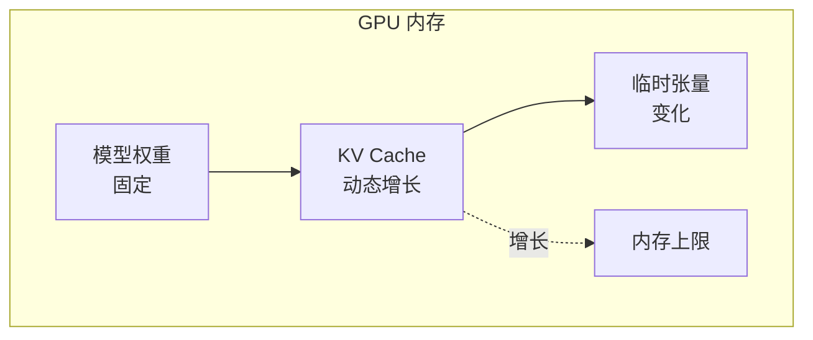
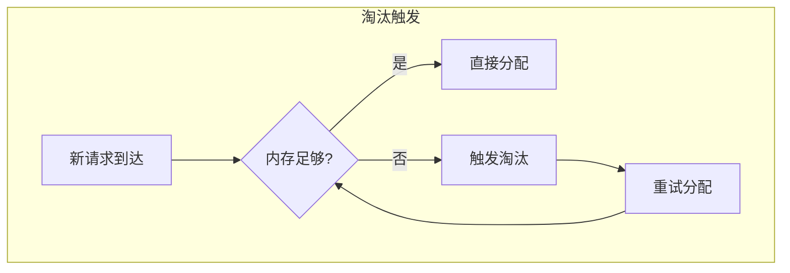
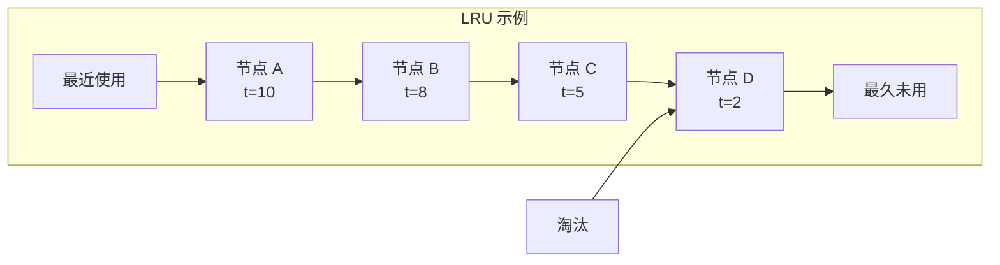
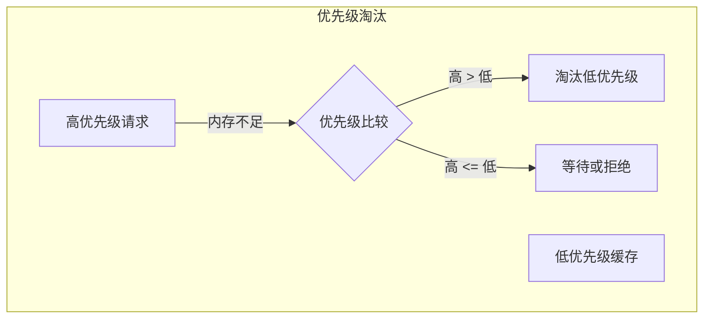
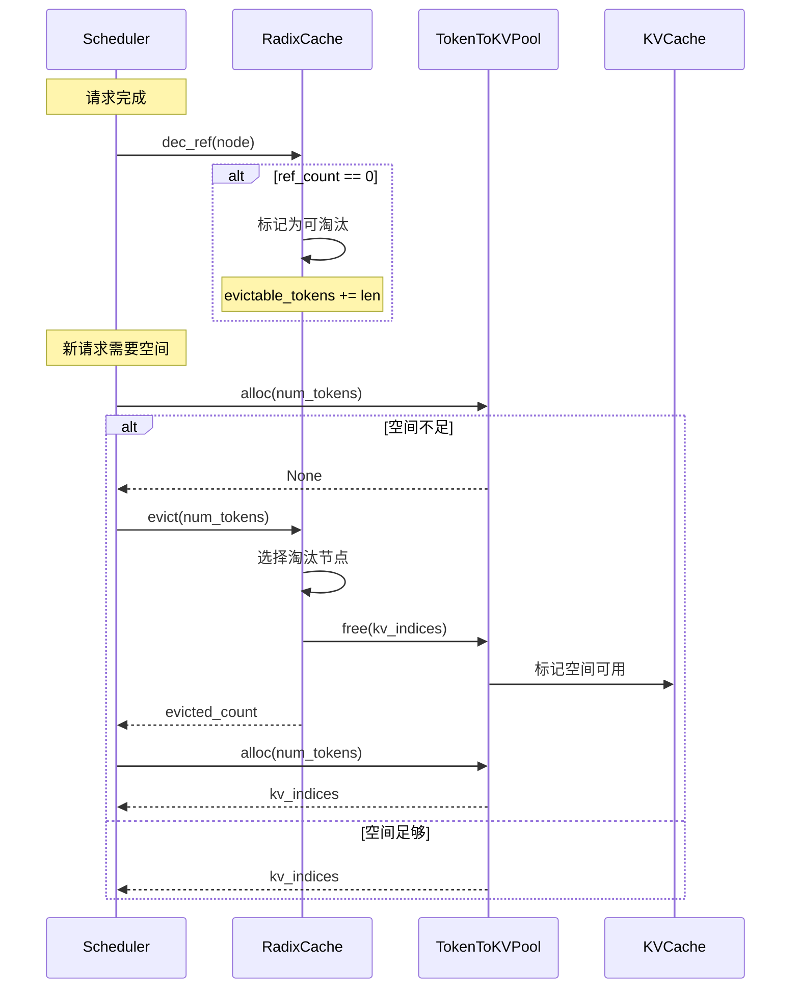

## 概述

### 本章学习目标
- 理解缓存淘汰的必要性
- 掌握 LRU/LFU 等淘汰策略
- 了解 SGLang 中的优先级淘汰
- 学习内存回收机制

### 前置知识要求
- 了解 RadixCache 结构
- 熟悉常见缓存策略
- 理解引用计数

---

## 为什么需要缓存淘汰

### 内存限制

GPU 内存有限，无法无限缓存所有请求的 KV Cache：



### 淘汰触发条件



---

## 基础淘汰策略

### LRU (Least Recently Used)

淘汰最近最少使用的缓存：



```python
class LRUEvictionPolicy:
    """LRU 淘汰策略"""

    def __init__(self):
        self.access_order = []  # 访问顺序列表

    def access(self, node: RadixNode):
        """记录访问"""
        if node in self.access_order:
            self.access_order.remove(node)
        self.access_order.append(node)
        node.last_access_time = time.time()

    def get_eviction_candidates(self, num_needed: int) -> List[RadixNode]:
        """获取淘汰候选"""
        candidates = []
        for node in self.access_order:
            if node.ref_count == 0:
                candidates.append(node)
                if len(candidates) >= num_needed:
                    break
        return candidates
```

### LFU (Least Frequently Used)

淘汰访问频率最低的缓存：

```python
class LFUEvictionPolicy:
    """LFU 淘汰策略"""

    def __init__(self):
        self.access_count = {}  # 访问计数

    def access(self, node: RadixNode):
        """记录访问"""
        if node not in self.access_count:
            self.access_count[node] = 0
        self.access_count[node] += 1

    def get_eviction_candidates(self, num_needed: int) -> List[RadixNode]:
        """获取淘汰候选（按访问次数排序）"""
        evictable = [
            (node, count)
            for node, count in self.access_count.items()
            if node.ref_count == 0
        ]
        evictable.sort(key=lambda x: x[1])
        return [node for node, _ in evictable[:num_needed]]
```

### FIFO (First In First Out)

按进入顺序淘汰：

```python
class FIFOEvictionPolicy:
    """FIFO 淘汰策略"""

    def __init__(self):
        self.creation_order = []

    def add(self, node: RadixNode):
        """添加新节点"""
        self.creation_order.append(node)

    def get_eviction_candidates(self, num_needed: int) -> List[RadixNode]:
        """按创建顺序获取候选"""
        candidates = []
        for node in self.creation_order:
            if node.ref_count == 0:
                candidates.append(node)
                if len(candidates) >= num_needed:
                    break
        return candidates
```

---

## SGLang 淘汰实现

### RadixCache 淘汰

**关键文件**：`python/sglang/srt/mem_cache/radix_cache.py`

```python
class RadixCache:
    def evict(self, num_tokens: int) -> int:
        """淘汰指定数量的 tokens"""
        if self.disable:
            return 0

        evicted = 0
        candidates = self._get_evictable_nodes()

        # 按 LRU 排序
        candidates.sort(key=lambda n: n.last_access_time)

        for node in candidates:
            if evicted >= num_tokens:
                break

            # 检查是否可以淘汰
            if node.ref_count > 0:
                continue

            # 执行淘汰
            tokens_freed = self._evict_node(node)
            evicted += tokens_freed

        return evicted

    def _get_evictable_nodes(self) -> List[RadixNode]:
        """获取所有可淘汰节点"""
        evictable = []

        def dfs(node):
            # 叶子节点且引用计数为 0
            if node.ref_count == 0 and not node.children and node != self.root:
                evictable.append(node)
            for child in node.children.values():
                dfs(child)

        dfs(self.root)
        return evictable

    def _evict_node(self, node: RadixNode) -> int:
        """淘汰单个节点"""
        # 从父节点移除
        parent = node.parent
        if parent:
            del parent.children[node.edge_tokens[0]]

        # 释放 KV 空间
        tokens_freed = len(node.edge_tokens)
        self.token_to_kv_pool.free(node.kv_indices)

        # 更新统计
        self.total_tokens -= tokens_freed
        self.evictable_tokens -= tokens_freed

        return tokens_freed
```

### 递归淘汰

当淘汰叶子节点后，父节点可能也变为可淘汰：

```python
def _evict_node_recursive(self, node: RadixNode) -> int:
    """递归淘汰节点及其可淘汰的祖先"""
    total_freed = 0

    while node and node != self.root:
        # 检查是否可淘汰
        if node.ref_count > 0 or node.children:
            break

        # 淘汰当前节点
        parent = node.parent
        if parent:
            del parent.children[node.edge_tokens[0]]

        # 释放空间
        total_freed += len(node.edge_tokens)
        self.token_to_kv_pool.free(node.kv_indices)

        # 继续检查父节点
        node = parent

    return total_freed
```

---

## 优先级淘汰

### 优先级机制

SGLang 支持请求优先级，高优先级请求可以抢占低优先级的缓存：



### 优先级淘汰实现

```python
class PriorityEvictionPolicy:
    """基于优先级的淘汰策略"""

    def __init__(self, priority_sign: int = -1):
        # priority_sign: -1 表示数值越小优先级越高
        self.priority_sign = priority_sign

    def can_evict_for(
        self,
        new_req_priority: int,
        cached_priority: int,
    ) -> bool:
        """判断是否可以为新请求淘汰缓存"""
        if self.priority_sign < 0:
            # 数值越小优先级越高
            return new_req_priority < cached_priority
        else:
            # 数值越大优先级越高
            return new_req_priority > cached_priority

    def get_eviction_candidates(
        self,
        new_req_priority: int,
        nodes: List[RadixNode],
    ) -> List[RadixNode]:
        """获取可被淘汰的节点"""
        candidates = []
        for node in nodes:
            if node.ref_count > 0:
                continue
            if self.can_evict_for(new_req_priority, node.priority):
                candidates.append(node)
        return candidates
```

### 抢占机制

```python
def preempt_for_request(
    self,
    req: Req,
    num_tokens_needed: int,
) -> bool:
    """为请求抢占缓存"""
    if not self.enable_priority_scheduling:
        return False

    # 获取可抢占的缓存
    candidates = self.eviction_policy.get_eviction_candidates(
        req.priority,
        self._get_evictable_nodes(),
    )

    # 按优先级排序（低优先级先淘汰）
    candidates.sort(
        key=lambda n: self.priority_sign * n.priority,
        reverse=True
    )

    # 淘汰直到有足够空间
    freed = 0
    for node in candidates:
        if freed >= num_tokens_needed:
            break
        freed += self._evict_node(node)

    return freed >= num_tokens_needed
```

---

## 等待队列淘汰

### 队列超时淘汰

```python
def _abort_on_queued_timeout(self):
    """淘汰等待超时的请求"""
    if self.queued_timeout is None:
        return

    current_time = time.time()
    to_abort = []

    for req in self.waiting_queue:
        wait_time = current_time - req.arrival_time
        if wait_time > self.queued_timeout:
            to_abort.append(req)

    for req in to_abort:
        self.waiting_queue.remove(req)
        self._abort_request(req, "queued_timeout")
```

### 队列长度限制

```python
def _abort_on_queued_limit(self):
    """当队列满时淘汰低优先级请求"""
    if not self.enable_priority_scheduling:
        return

    max_queue_len = self.server_args.max_queued_requests
    if len(self.waiting_queue) <= max_queue_len:
        return

    # 按优先级排序
    sorted_queue = sorted(
        self.waiting_queue,
        key=lambda r: self.priority_sign * r.priority,
    )

    # 淘汰最低优先级的请求
    to_abort = sorted_queue[max_queue_len:]
    for req in to_abort:
        self.waiting_queue.remove(req)
        self._abort_request(req, "queue_full")
```

---

## 内存回收流程

### 完整回收流程



### 代码实现

```python
def allocate_kv_for_request(self, req: Req, num_tokens: int) -> bool:
    """为请求分配 KV 空间"""
    # 尝试直接分配
    indices = self.token_to_kv_pool.alloc(num_tokens)
    if indices is not None:
        return self._setup_request(req, indices)

    # 空间不足，尝试淘汰
    available = self.token_to_kv_pool.available_size()
    need_evict = num_tokens - available

    # 检查可淘汰的缓存
    if self.radix_cache.evictable_tokens < need_evict:
        # 无法满足，检查优先级抢占
        if not self._try_preempt(req, need_evict):
            return False

    # 执行淘汰
    evicted = self.radix_cache.evict(need_evict)
    if evicted < need_evict:
        return False

    # 重新分配
    indices = self.token_to_kv_pool.alloc(num_tokens)
    if indices is None:
        return False

    return self._setup_request(req, indices)
```

---

## 淘汰策略配置

### 服务器参数

```python
@dataclass
class ServerArgs:
    # 淘汰策略
    eviction_policy: str = "lru"  # lru, lfu, fifo

    # 优先级调度
    enable_priority_scheduling: bool = False
    priority_sign: int = -1  # -1: 小值高优先级

    # 队列限制
    max_queued_requests: int = None
    queued_timeout: float = None

    # 内存压力阈值
    eviction_threshold: float = 0.9  # 90% 时开始淘汰
```

### 策略选择

```python
def get_eviction_policy(policy_name: str) -> EvictionPolicy:
    """获取淘汰策略"""
    policies = {
        "lru": LRUEvictionPolicy,
        "lfu": LFUEvictionPolicy,
        "fifo": FIFOEvictionPolicy,
        "priority": PriorityEvictionPolicy,
    }
    return policies[policy_name]()
```

---

## 监控与调试

### 淘汰统计

```python
class EvictionStats:
    """淘汰统计"""

    def __init__(self):
        self.total_evictions = 0
        self.total_tokens_evicted = 0
        self.eviction_reasons = {}

    def record_eviction(self, tokens: int, reason: str):
        self.total_evictions += 1
        self.total_tokens_evicted += tokens
        self.eviction_reasons[reason] = (
            self.eviction_reasons.get(reason, 0) + 1
        )

    def get_stats(self) -> Dict:
        return {
            "total_evictions": self.total_evictions,
            "total_tokens_evicted": self.total_tokens_evicted,
            "eviction_reasons": self.eviction_reasons,
        }
```

### 日志记录

```python
def evict_with_logging(self, num_tokens: int) -> int:
    """带日志的淘汰"""
    before = self.total_tokens

    evicted = self.evict(num_tokens)

    logger.info(
        f"Eviction: requested={num_tokens}, "
        f"evicted={evicted}, "
        f"before={before}, "
        f"after={self.total_tokens}"
    )

    return evicted
```

---

## 最佳实践

### 1. 选择合适的策略

| 场景 | 推荐策略 |
|------|----------|
| 通用场景 | LRU |
| 热点明显 | LFU |
| 时间敏感 | FIFO |
| 多优先级 | Priority |

### 2. 调整内存比例

```bash
# 较大的静态内存比例 -> 更多缓存
python -m sglang.launch_server \
    --mem-fraction-static 0.9

# 较小的静态内存比例 -> 更多并发
python -m sglang.launch_server \
    --mem-fraction-static 0.8
```

### 3. 监控内存压力

```python
def should_trigger_eviction(self) -> bool:
    """判断是否应触发主动淘汰"""
    utilization = 1 - self.available_size() / self.total_size
    return utilization > self.eviction_threshold
```

---

## 小结

### 要点回顾

1. **淘汰触发**：内存不足时触发淘汰
2. **策略选择**：LRU（时间）、LFU（频率）、Priority（优先级）
3. **引用计数**：ref_count = 0 的节点才可淘汰
4. **递归淘汰**：淘汰后检查父节点是否可淘汰

### 关键参数

| 参数 | 作用 |
|------|------|
| `eviction_policy` | 淘汰策略 |
| `eviction_threshold` | 淘汰阈值 |
| `enable_priority_scheduling` | 优先级调度 |

### 下一章预告

在模块四《批处理与调度篇》中，我们将：
- 深入理解连续批处理
- 学习 Chunked Prefill 机制
- 掌握调度策略选择
