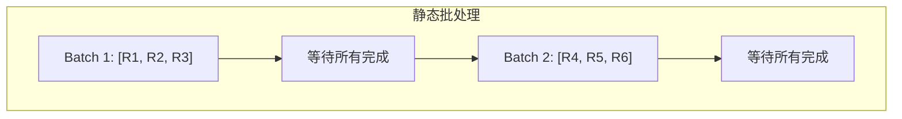
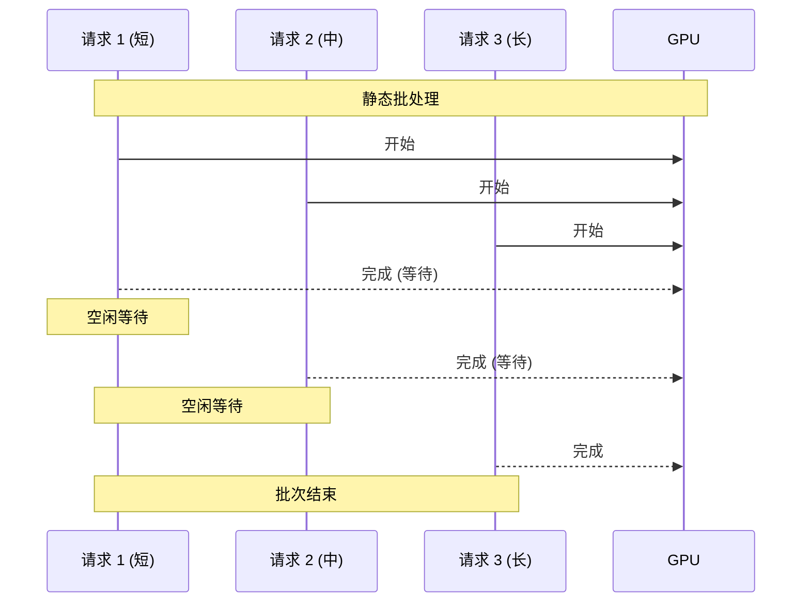
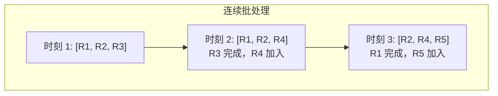
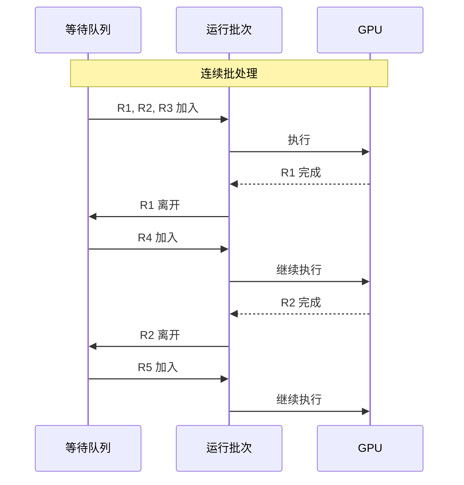
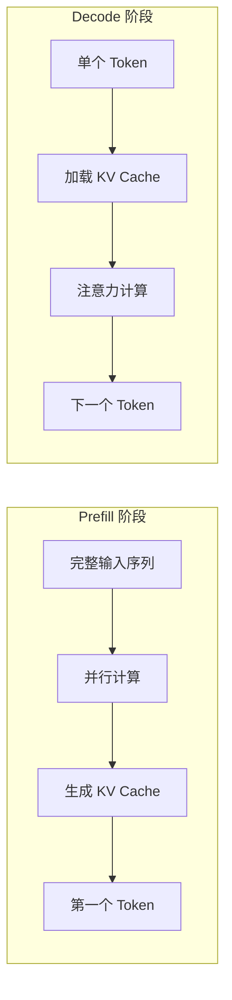
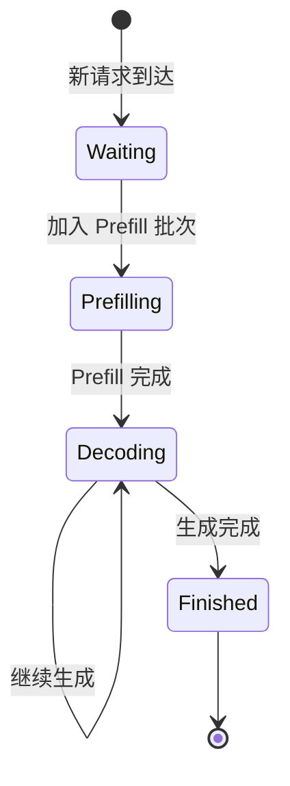
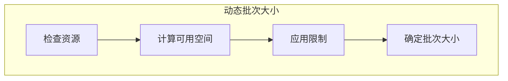
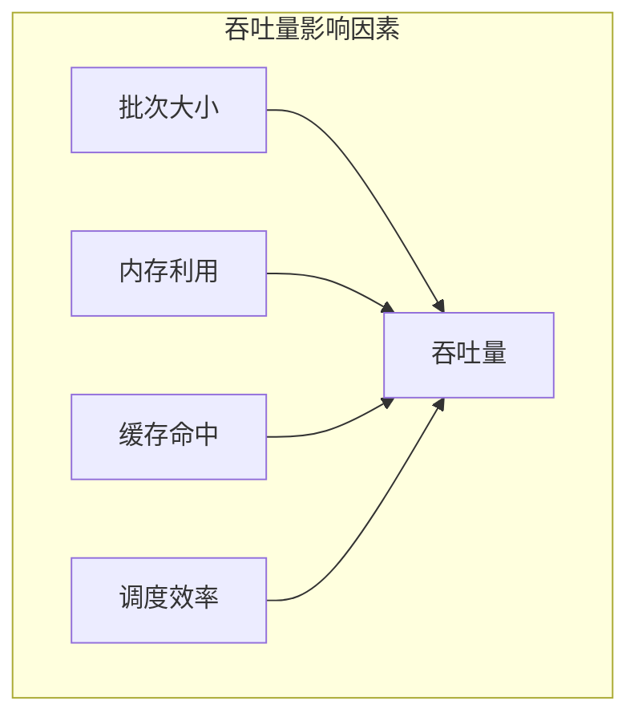

## 概述

### 本章学习目标
- 理解连续批处理的原理和优势
- 对比 Prefill 和 Decode 阶段的特点
- 掌握动态批处理的实现机制
- 了解吞吐量提升的关键因素

### 前置知识要求
- 了解 LLM 推理流程
- 熟悉批处理概念
- 理解 GPU 并行计算

---

## 传统静态批处理

### 工作方式

传统批处理等待所有请求完成后才处理下一批：



### 问题分析



**问题**：
- 短请求等待长请求
- GPU 利用率低
- 延迟不可预测
- 吞吐量受限

---

## 连续批处理原理

### 核心思想

请求完成后立即释放资源，新请求可以加入：



### 动态调整



---

## Prefill vs Decode

### 两个阶段的特点



### 性能特征对比

| 特征 | Prefill | Decode |
|------|---------|--------|
| 计算类型 | 计算密集 | 内存带宽密集 |
| 每 Token 计算 | 高（全序列注意力） | 低（单 Token） |
| GPU 利用率 | 高 | 低（需批量化） |
| 批次大小影响 | 线性增长 | 亚线性增长 |

### 计算量分析

**Prefill**：
```
计算量 ∝ seq_len² × hidden_size
```

**Decode**：
```
计算量 ∝ seq_len × hidden_size
内存访问 ∝ seq_len × kv_cache_size
```

---

## SGLang 连续批处理实现

### 批次管理

**关键文件**：`python/sglang/srt/managers/scheduler.py`

```python
class Scheduler:
    def __init__(self, ...):
        # 等待队列
        self.waiting_queue: List[Req] = []

        # 运行批次
        self.running_batch: ScheduleBatch = ScheduleBatch(
            reqs=[], batch_is_full=False
        )

    def event_loop_normal(self):
        while True:
            # 1. 接收新请求
            recv_reqs = self.recv_requests()
            self.process_input_requests(recv_reqs)

            # 2. 获取下一个批次
            batch = self.get_next_batch_to_run()

            # 3. 执行批次
            if batch:
                result = self.run_batch(batch)
                self.process_batch_result(batch, result)
```

### 批次组装

```python
def get_next_batch_to_run(self) -> Optional[ScheduleBatch]:
    # 1. 合并已完成 Prefill 的请求到 running_batch
    if self.last_batch and self.last_batch.forward_mode.is_extend():
        self.running_batch.merge_batch(self.last_batch)

    # 2. 尝试获取新的 Prefill 批次
    new_batch = self.get_new_batch_prefill()

    # 3. 选择执行
    if new_batch is not None:
        return new_batch  # 优先执行 Prefill
    elif not self.running_batch.is_empty():
        # 更新并执行 Decode
        self.running_batch = self.update_running_batch(self.running_batch)
        return self.running_batch

    return None
```

### 请求状态流转



---

## 动态批次更新

### 请求完成处理

```python
def process_batch_result_decode(self, batch, result):
    next_token_ids = result.next_token_ids.tolist()

    finished_reqs = []
    for req, next_token_id in zip(batch.reqs, next_token_ids):
        # 添加新 token
        req.output_ids.append(next_token_id)

        # 检查完成条件
        req.check_finished()

        if req.finished():
            finished_reqs.append(req)
            # 释放 KV Cache
            release_kv_cache(req, self.tree_cache)

    # 从运行批次中移除已完成的请求
    self.running_batch.remove_reqs(finished_reqs)
```

### 新请求加入

```python
def update_running_batch(self, batch: ScheduleBatch) -> ScheduleBatch:
    """更新运行批次，移除已完成请求"""
    # 移除已完成的请求
    remaining_reqs = [req for req in batch.reqs if not req.finished()]

    if not remaining_reqs:
        return ScheduleBatch(reqs=[], batch_is_full=False)

    # 更新批次
    batch.reqs = remaining_reqs
    batch.batch_is_full = len(remaining_reqs) >= self.max_running_requests

    return batch
```

---

## 批次大小优化

### 动态批次大小



```python
def get_num_allocatable_reqs(self, running_bs: int) -> int:
    """计算可分配的请求数"""
    # 获取可用 token 空间
    available_tokens = self.token_to_kv_pool.available_size()

    # 减去当前运行批次需要的空间
    available_tokens -= running_bs * self.new_token_ratio

    # 计算可容纳的请求数
    max_new_reqs = available_tokens // self.avg_tokens_per_req

    # 应用最大限制
    return min(max_new_reqs, self.max_running_requests - running_bs)
```

### 批次大小限制

```python
# 配置参数
max_running_requests: int  # 最大并发请求
max_prefill_tokens: int    # 最大 Prefill token 数
max_batch_size: int        # 最大批次大小
```

---

## 吞吐量优化

### 影响因素



### 优化策略

**1. 最大化批次大小**
```python
# 尽可能填满批次
while len(can_run_list) < max_batch_size:
    if not waiting_queue:
        break
    req = waiting_queue.pop(0)
    can_run_list.append(req)
```

**2. 平衡 Prefill 和 Decode**
```python
# 限制 Prefill token 数，避免饿死 Decode
if prefill_tokens > max_prefill_tokens:
    break
```

**3. 前缀缓存复用**
```python
# 优先调度有缓存命中的请求
waiting_queue.sort(key=lambda r: -r.prefix_len)
```

---

## 性能对比

### 静态 vs 连续批处理

```
场景: 100 个请求，输出长度 100-1000 tokens

静态批处理:
- 平均延迟: 高（等待最长请求）
- 吞吐量: 低（资源浪费）
- GPU 利用率: ~30-50%

连续批处理:
- 平均延迟: 低（即完即释放）
- 吞吐量: 高（资源复用）
- GPU 利用率: ~70-90%
```

### 吞吐量提升

| 场景 | 静态批处理 | 连续批处理 | 提升 |
|------|-----------|-----------|------|
| 均匀长度 | 100 tok/s | 150 tok/s | 1.5x |
| 混合长度 | 60 tok/s | 180 tok/s | 3x |
| 高并发 | 80 tok/s | 200 tok/s | 2.5x |

---

## 实现细节

### ScheduleBatch 数据结构

```python
@dataclass
class ScheduleBatch:
    reqs: List[Req]           # 请求列表
    batch_is_full: bool       # 批次是否已满

    def batch_size(self) -> int:
        return len(self.reqs)

    def is_empty(self) -> bool:
        return len(self.reqs) == 0

    def merge_batch(self, other: "ScheduleBatch"):
        """合并另一个批次"""
        self.reqs.extend(other.reqs)
        self.batch_is_full = len(self.reqs) >= self.max_size

    def remove_reqs(self, to_remove: List[Req]):
        """移除请求"""
        remove_set = set(to_remove)
        self.reqs = [r for r in self.reqs if r not in remove_set]
```

### ForwardMode 转换

```python
def get_forward_mode(self) -> ForwardMode:
    """根据批次状态确定前向模式"""
    has_prefill = any(req.is_prefill for req in self.reqs)
    has_decode = any(not req.is_prefill for req in self.reqs)

    if has_prefill and has_decode:
        return ForwardMode.MIXED
    elif has_prefill:
        return ForwardMode.EXTEND
    else:
        return ForwardMode.DECODE
```

---

## 小结

### 要点回顾

1. **连续批处理**：请求完成立即释放，新请求动态加入
2. **两阶段特点**：Prefill 计算密集，Decode 内存带宽密集
3. **动态批次**：根据资源情况自动调整批次大小
4. **吞吐量优化**：最大化批次、平衡 Prefill/Decode、缓存复用

### 关键优势

| 优势 | 说明 |
|------|------|
| 高 GPU 利用率 | 避免空闲等待 |
| 低平均延迟 | 短请求不等长请求 |
| 高吞吐量 | 资源持续利用 |

### 下一章预告

在下一章《Chunked Prefill 机制》中，我们将：
- 了解长上下文处理挑战
- 学习分块 Prefill 原理
- 掌握混合模式调度
