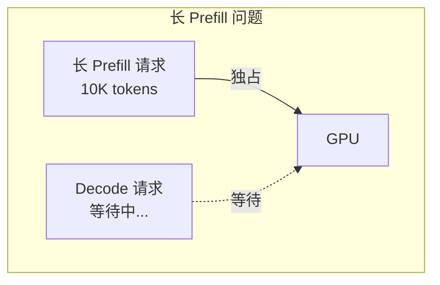
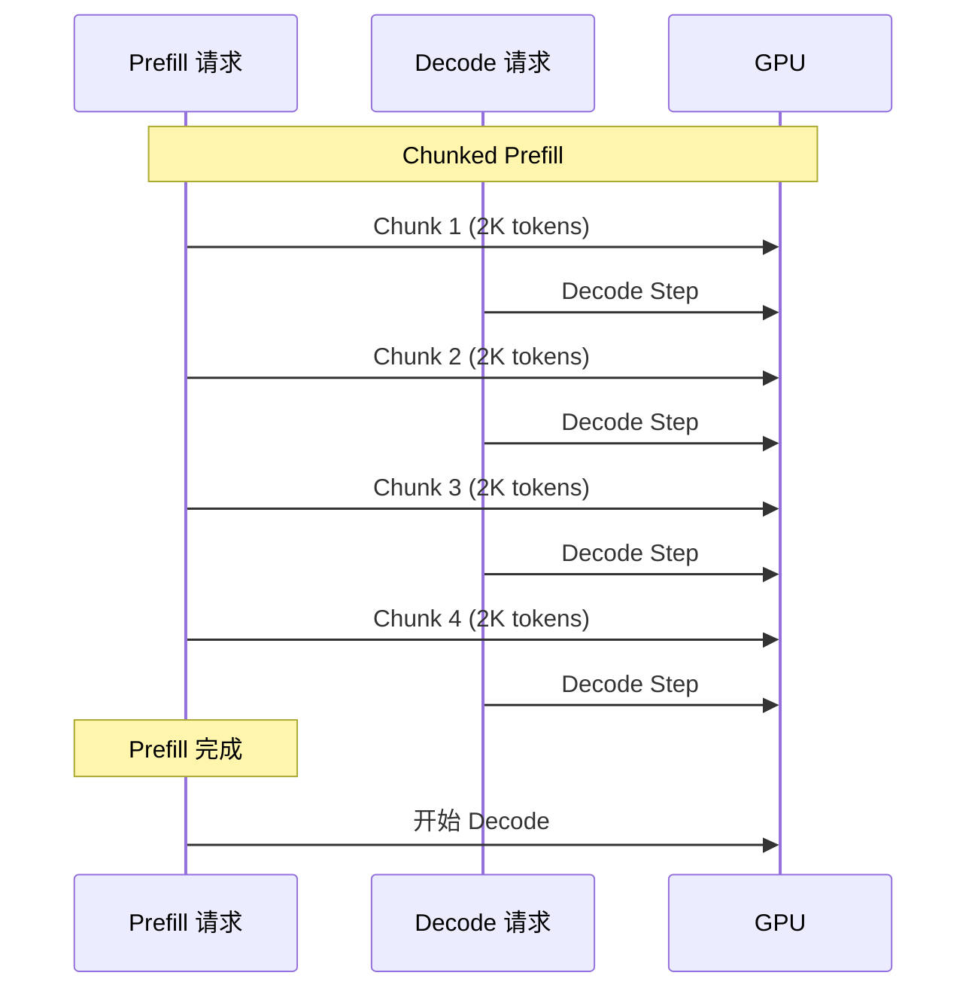
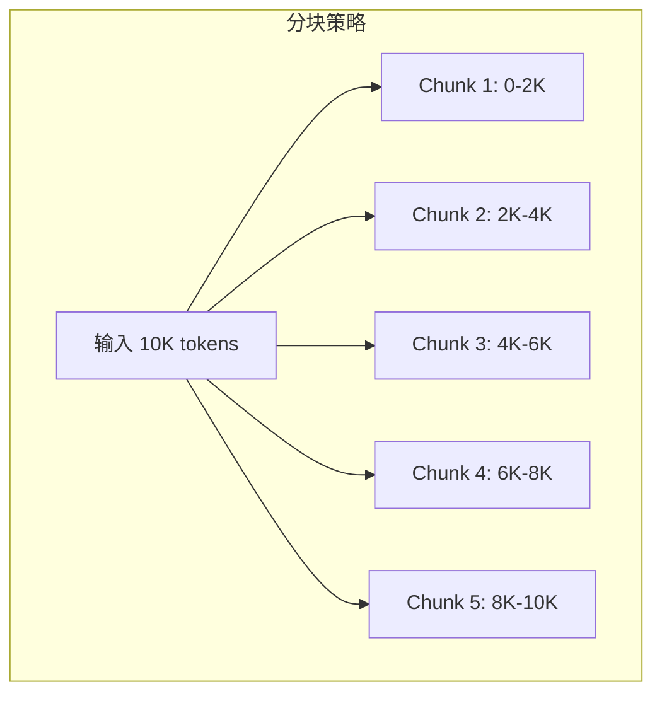
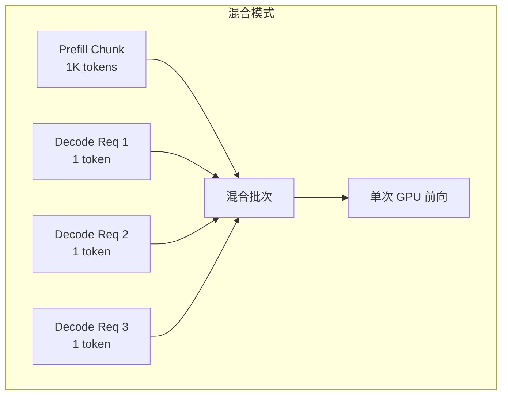
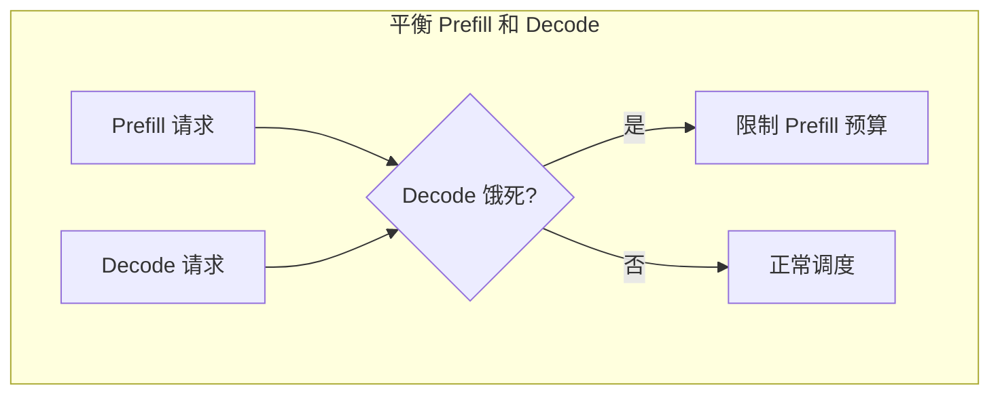
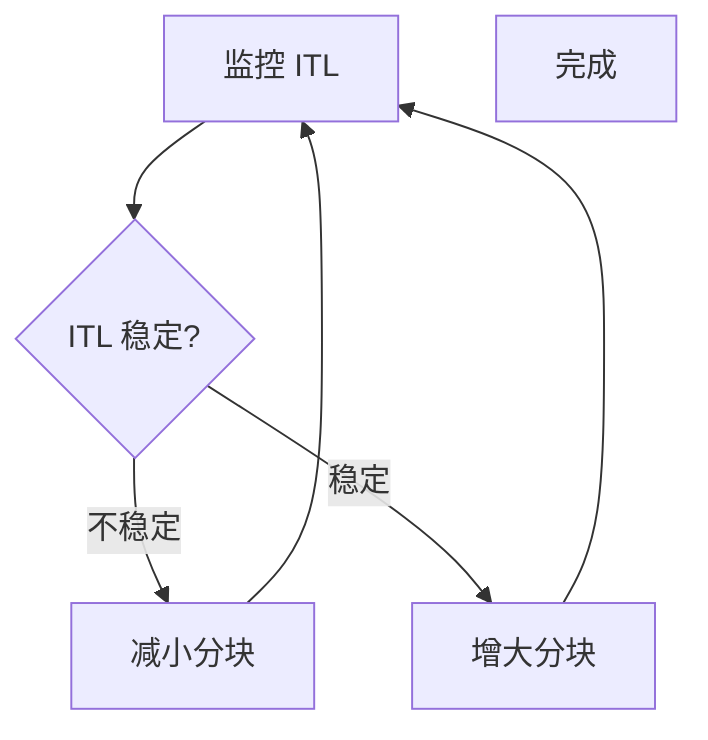

## 概述

### 本章学习目标
- 理解长上下文 Prefill 的挑战
- 掌握 Chunked Prefill 的工作原理
- 了解混合模式调度
- 学习调度优化策略

### 前置知识要求
- 了解连续批处理
- 熟悉 Prefill/Decode 阶段
- 理解 KV Cache 机制

---

## 长上下文挑战

### 问题场景

当 Prefill 请求包含大量 tokens 时：



**问题**：
- 长 Prefill 独占 GPU
- Decode 请求被饿死
- TTFT 延迟高
- ITL 不稳定

### 延迟分析

```
传统方式:
- 长 Prefill: 1000ms
- 等待的 Decode: +1000ms 延迟

用户体验:
- 正在生成的回答突然卡顿
- 新请求等待时间长
```

---

## Chunked Prefill 原理

### 核心思想

将长 Prefill 分成多个小块，与 Decode 交替执行：



### 分块策略



---

## SGLang 实现

### 请求分块

**关键文件**：`python/sglang/srt/managers/scheduler.py`

```python
class PrefillAdder:
    def add_one_req(self, req: Req) -> AddReqResult:
        # 检查是否需要分块
        if req.extend_input_len > self.chunked_prefill_size:
            # 只处理 chunk_size 个 tokens
            req.is_chunked = req.extend_input_len - self.chunked_prefill_size
            req.extend_input_len = self.chunked_prefill_size

        # 扣减预算
        self.rem_chunk_tokens -= req.extend_input_len

        return AddReqResult.CONTINUE

    def add_chunked_req(self, req: Req) -> Optional[Req]:
        """处理分块请求的后续部分"""
        # 计算这一轮可以处理的 tokens
        num_tokens = min(req.is_chunked, self.rem_chunk_tokens)

        req.extend_input_len = num_tokens
        req.is_chunked -= num_tokens

        if req.is_chunked > 0:
            return req  # 还有剩余，下一轮继续
        else:
            return None  # 分块完成
```

### 分块状态管理

```python
class Req:
    def __init__(self, ...):
        # 分块状态
        self.is_chunked: int = 0        # 剩余待处理的 tokens
        self.chunk_offset: int = 0       # 当前处理的偏移

    def init_next_round_input(self, tree_cache):
        """初始化下一轮的输入"""
        if self.is_chunked > 0:
            # 分块模式：从上次结束位置继续
            start = self.chunk_offset
            end = start + self.extend_input_len
            self.input_ids = self.origin_input_ids[start:end]
            self.chunk_offset = end
        else:
            # 正常模式
            self.input_ids = self.origin_input_ids[self.prefix_len:]
```

### 调度器处理

```python
def _get_new_batch_prefill_raw(self):
    adder = PrefillAdder(
        chunked_prefill_size=self.chunked_prefill_size,
        # ...
    )

    # 1. 优先处理正在进行的分块请求
    if self.chunked_req is not None:
        self.chunked_req.init_next_round_input()
        self.chunked_req = adder.add_chunked_req(self.chunked_req)

    # 2. 添加新请求
    for req in self.waiting_queue:
        res = adder.add_one_req(req)
        if res != AddReqResult.CONTINUE:
            break

    # 3. 记录新的分块请求
    for req in adder.can_run_list:
        if req.is_chunked > 0:
            self.chunked_req = req
            break
```

---

## 混合模式调度

### Mixed ForwardMode

当批次同时包含 Prefill 和 Decode 请求时：



### 实现细节

```python
class ForwardMode(IntEnum):
    EXTEND = 1    # 纯 Prefill
    DECODE = 2    # 纯 Decode
    MIXED = 3     # 混合模式

def get_forward_mode(batch: ScheduleBatch) -> ForwardMode:
    has_extend = any(req.extend_input_len > 1 for req in batch.reqs)
    has_decode = any(req.extend_input_len == 1 for req in batch.reqs)

    if has_extend and has_decode:
        return ForwardMode.MIXED
    elif has_extend:
        return ForwardMode.EXTEND
    else:
        return ForwardMode.DECODE
```

### 注意力计算调整

```python
def mixed_attention_forward(
    query: torch.Tensor,
    key_cache: torch.Tensor,
    value_cache: torch.Tensor,
    seq_lens: List[int],
    extend_lens: List[int],
):
    """混合模式注意力计算"""
    # 区分 Prefill 和 Decode tokens
    prefill_mask = extend_lens > 1
    decode_mask = extend_lens == 1

    # Prefill tokens: 自注意力
    # Decode tokens: 与所有历史 KV 做注意力

    # 使用 FlashInfer 等优化后端处理
    # ...
```

---

## 调度优化

### Token 预算管理

```python
class PrefillAdder:
    def __init__(self, ...):
        # 总 token 预算
        self.rem_total_tokens = available_tokens

        # Prefill token 预算（限制单批次 Prefill）
        self.rem_input_tokens = max_prefill_tokens

        # 分块预算（单个分块大小）
        self.rem_chunk_tokens = chunked_prefill_size

    def budget_state(self) -> AddReqResult:
        if self.rem_total_tokens <= 0:
            return AddReqResult.NO_TOKEN
        if self.rem_input_tokens <= 0:
            return AddReqResult.NO_TOKEN
        if self.rem_chunk_tokens <= 0:
            return AddReqResult.NO_TOKEN
        return AddReqResult.CONTINUE
```

### 平衡策略



```python
def get_prefill_budget(self) -> int:
    """动态计算 Prefill 预算"""
    # 基础预算
    budget = self.max_prefill_tokens

    # 如果有 Decode 请求等待，减少预算
    if self.running_batch.batch_size() > 0:
        decode_wait_time = self._get_decode_wait_time()
        if decode_wait_time > self.decode_max_wait:
            budget = min(budget, self.chunked_prefill_size)

    return budget
```

---

## 配置参数

### 服务器参数

```python
@dataclass
class ServerArgs:
    # 分块 Prefill
    chunked_prefill_size: int = 8192  # 单个分块大小
    max_prefill_tokens: int = 16384   # 单批次最大 Prefill tokens

    # -1 表示禁用分块
    # chunked_prefill_size: int = -1
```

### 启动命令

```bash
# 启用 Chunked Prefill（默认）
python -m sglang.launch_server \
    --model meta-llama/Llama-3.1-8B-Instruct \
    --chunked-prefill-size 8192

# 禁用 Chunked Prefill
python -m sglang.launch_server \
    --model meta-llama/Llama-3.1-8B-Instruct \
    --chunked-prefill-size -1
```

---

## 性能影响

### 延迟对比

```
场景: 10K token Prefill + 并发 Decode

无 Chunked Prefill:
- Prefill TTFT: 500ms
- Decode ITL: 50ms (正常) -> 500ms (被阻塞)

有 Chunked Prefill (2K chunks):
- Prefill TTFT: 600ms (略增)
- Decode ITL: 50ms -> 60ms (轻微增加)
```

### 吞吐量对比

| 场景 | 无 Chunked | 有 Chunked | 差异 |
|------|-----------|-----------|------|
| 短请求为主 | 100% | 98% | -2% |
| 长请求为主 | 100% | 95% | -5% |
| 混合负载 | 100% | 110% | +10% |

**结论**：
- 单纯 Prefill 略有开销
- 混合负载时吞吐量提升
- ITL 稳定性大幅改善

---

## 实践建议

### 1. 分块大小选择

```python
# 短上下文服务
chunked_prefill_size = 4096

# 长上下文服务
chunked_prefill_size = 8192

# 延迟敏感服务
chunked_prefill_size = 2048
```

### 2. 监控指标

```python
# 监控分块状态
metrics = {
    "chunked_reqs_count": len([r for r in reqs if r.is_chunked > 0]),
    "avg_chunk_rounds": avg_chunk_rounds,
    "decode_wait_time_p99": decode_wait_p99,
}
```

### 3. 调优流程



---

## 小结

### 要点回顾

1. **问题**：长 Prefill 阻塞 Decode，导致延迟抖动
2. **方案**：将 Prefill 分块，与 Decode 交替执行
3. **混合模式**：同一批次包含 Prefill 和 Decode
4. **权衡**：轻微增加 Prefill 延迟，换取 ITL 稳定性

### 关键参数

| 参数 | 作用 | 建议值 |
|------|------|--------|
| `chunked_prefill_size` | 单个分块大小 | 4096-8192 |
| `max_prefill_tokens` | 批次 Prefill 上限 | 16384 |

### 下一章预告

在下一章《调度策略详解》中，我们将：
- 了解 LPM/FCFS/DFS-Weight 等策略
- 学习优先级调度机制
- 掌握策略选择原则
