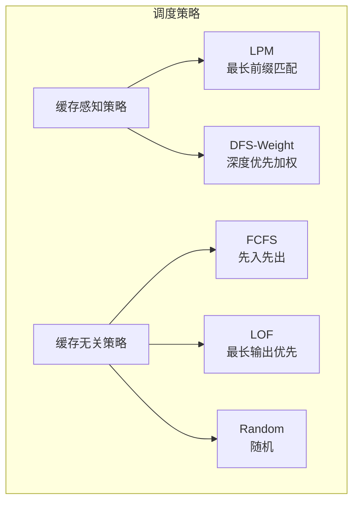
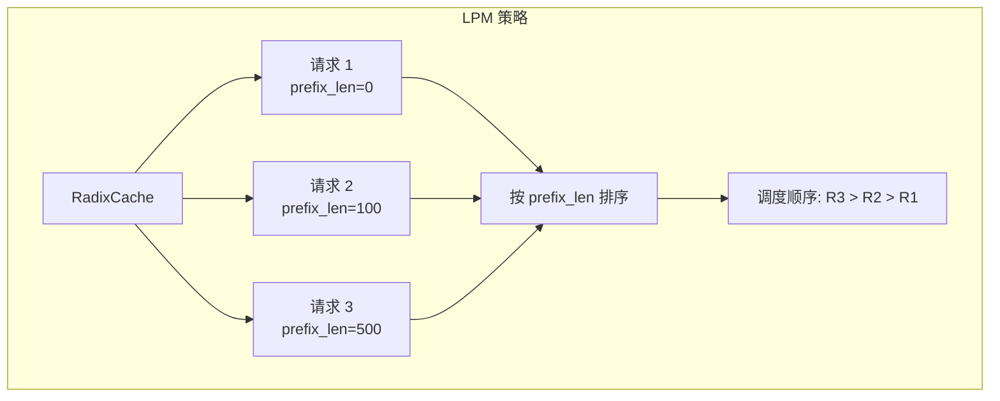
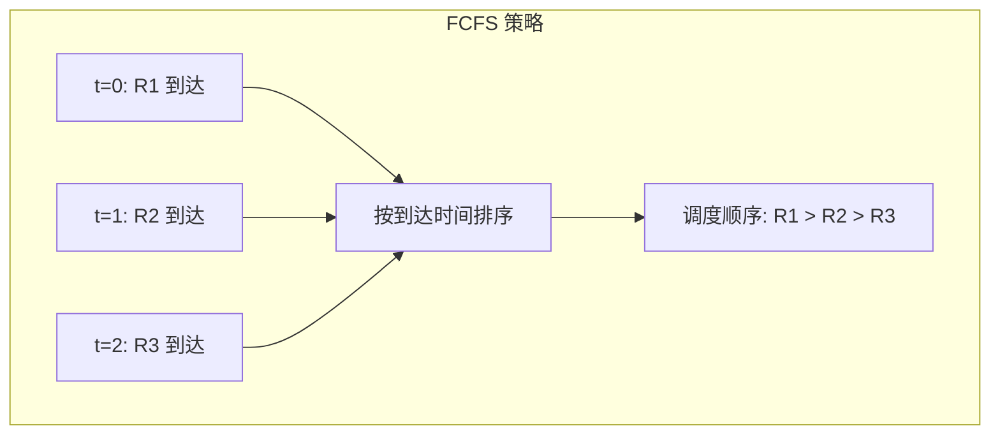
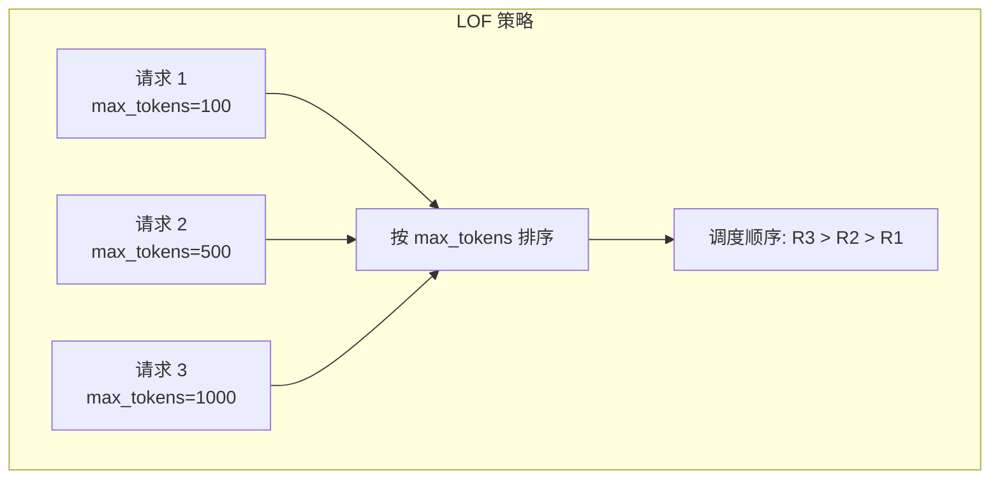
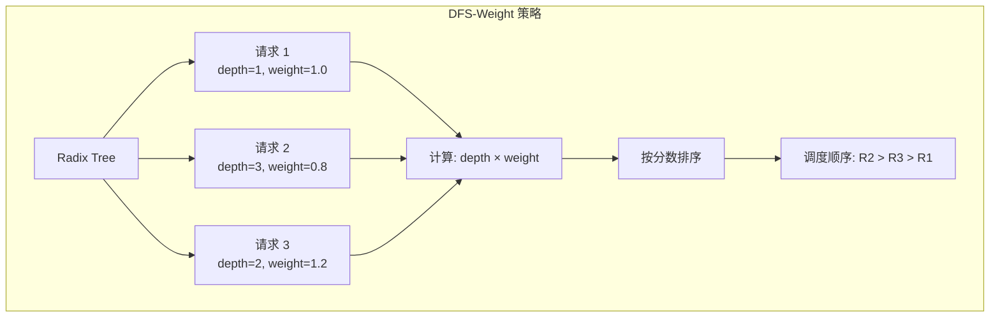
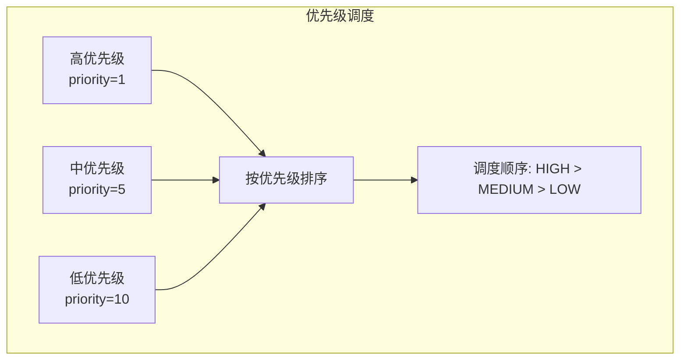
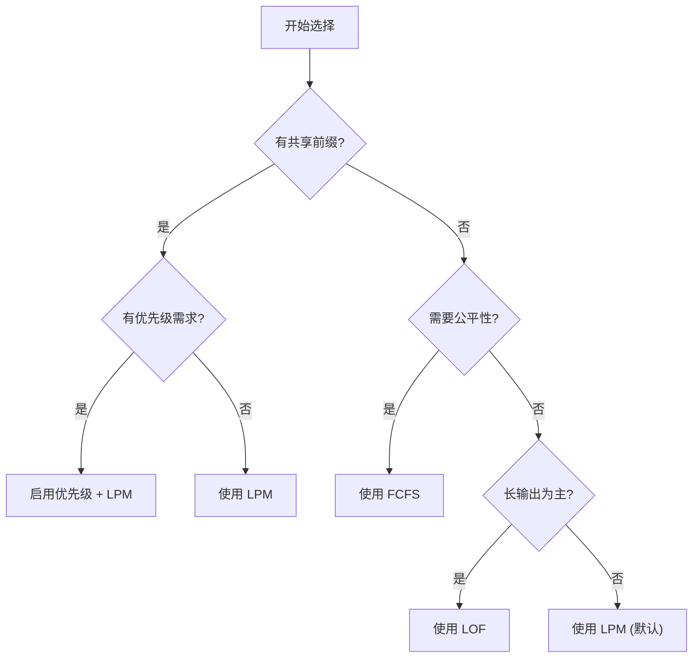

## 概述

### 本章学习目标
- 理解不同调度策略的设计目标
- 掌握 LPM/FCFS/DFS-Weight 等策略
- 了解优先级调度机制
- 学习策略选择原则

### 前置知识要求
- 了解连续批处理
- 熟悉 RadixCache
- 理解调度基本概念

---

## 调度策略概览

### 策略分类



### 策略选择

| 场景 | 推荐策略 | 原因 |
|------|----------|------|
| 共享前缀多 | LPM | 最大化缓存复用 |
| 公平性要求 | FCFS | 按到达顺序处理 |
| 长输出优先 | LOF | 减少长请求等待 |
| 负载均衡 | Random | 避免热点 |

---

## LPM (Longest Prefix Match)

### 设计目标

优先调度与缓存匹配最长的请求，最大化 KV Cache 复用：



### 实现

**关键文件**：`python/sglang/srt/managers/schedule_policy.py`

```python
class SchedulePolicy:
    def calc_priority(self, waiting_queue: List[Req]):
        if self.policy == "lpm":
            # 计算每个请求的前缀匹配长度
            for req in waiting_queue:
                _, prefix_len = self.tree_cache.match_prefix(req.input_ids)
                req.prefix_len = prefix_len

            # 按前缀长度降序排序
            waiting_queue.sort(key=lambda x: -x.prefix_len)
```

### 优势与局限

**优势**：
- 最大化缓存命中率
- 减少重复计算
- 提高吞吐量 3-5x

**局限**：
- 可能导致饥饿（新请求总是低优先级）
- 缓存冷启动时效果有限

---

## FCFS (First Come First Serve)

### 设计目标

按请求到达顺序处理，保证公平性：



### 实现

```python
class SchedulePolicy:
    def calc_priority(self, waiting_queue: List[Req]):
        if self.policy == "fcfs":
            # 按到达时间升序排序
            waiting_queue.sort(key=lambda x: x.arrival_time)
```

### 优势与局限

**优势**：
- 公平性强
- 实现简单
- 延迟可预测

**局限**：
- 不利用缓存
- 可能不是最优吞吐量

---

## LOF (Longest Output First)

### 设计目标

优先处理预期输出最长的请求：



### 实现

```python
class SchedulePolicy:
    def calc_priority(self, waiting_queue: List[Req]):
        if self.policy == "lof":
            # 按 max_new_tokens 降序排序
            waiting_queue.sort(
                key=lambda x: -x.sampling_params.max_new_tokens
            )
```

### 使用场景

- 长文本生成任务
- 减少长请求的等待时间
- 平衡整体延迟

---

## DFS-Weight

### 设计目标

结合缓存深度和请求权重的策略：



### 实现

```python
class SchedulePolicy:
    def calc_priority(self, waiting_queue: List[Req]):
        if self.policy == "dfs-weight":
            for req in waiting_queue:
                # 计算缓存深度
                node, prefix_len = self.tree_cache.match_prefix(req.input_ids)
                depth = self._get_node_depth(node)

                # 计算权重分数
                weight = req.sampling_params.get("weight", 1.0)
                req.priority_score = depth * weight

            # 按分数降序排序
            waiting_queue.sort(key=lambda x: -x.priority_score)

    def _get_node_depth(self, node: RadixNode) -> int:
        """计算节点在树中的深度"""
        depth = 0
        while node.parent is not None:
            depth += 1
            node = node.parent
        return depth
```

---

## Random

### 设计目标

随机调度，用于负载均衡或测试：

```python
class SchedulePolicy:
    def calc_priority(self, waiting_queue: List[Req]):
        if self.policy == "random":
            random.shuffle(waiting_queue)
```

### 使用场景

- 避免热点
- 基准测试
- 简单场景

---

## 优先级调度

### 请求优先级



### 配置

```python
@dataclass
class ServerArgs:
    # 启用优先级调度
    enable_priority_scheduling: bool = False

    # 优先级符号
    # -1: 数值越小优先级越高
    #  1: 数值越大优先级越高
    priority_sign: int = -1
```

### 实现

```python
def calc_priority_with_priority(self, waiting_queue: List[Req]):
    """结合请求优先级的调度"""
    if self.enable_priority_scheduling:
        # 首先按请求优先级排序
        waiting_queue.sort(
            key=lambda x: (
                self.priority_sign * x.sampling_params.priority,
                x.arrival_time  # 同优先级按 FCFS
            )
        )

        # 然后应用缓存感知策略
        self._sort_by_cache_policy(waiting_queue)
```

### 优先级抢占

```python
def preempt_for_high_priority(self, req: Req) -> bool:
    """为高优先级请求抢占资源"""
    if not self.enable_priority_scheduling:
        return False

    # 找到可抢占的低优先级缓存
    evictable = self._get_lower_priority_cache(req.priority)

    if not evictable:
        return False

    # 执行抢占
    for node in evictable:
        if self._has_enough_space(req):
            break
        self._evict_node(node)

    return self._has_enough_space(req)
```

---

## 策略组合

### 多级策略

```python
class MultiLevelSchedulePolicy:
    """多级调度策略"""

    def __init__(self, levels: List[str]):
        self.levels = levels  # 如 ["priority", "lpm", "fcfs"]

    def calc_priority(self, waiting_queue: List[Req]):
        # 计算每个级别的排序键
        for req in waiting_queue:
            keys = []
            for level in self.levels:
                if level == "priority":
                    keys.append(self.priority_sign * req.priority)
                elif level == "lpm":
                    keys.append(-req.prefix_len)
                elif level == "fcfs":
                    keys.append(req.arrival_time)
            req.sort_key = tuple(keys)

        # 多级排序
        waiting_queue.sort(key=lambda x: x.sort_key)
```

### 配置示例

```python
# 优先级 + LPM + FCFS
policy = MultiLevelSchedulePolicy(["priority", "lpm", "fcfs"])

# 等效于：
# 1. 高优先级请求优先
# 2. 同优先级中，缓存命中多的优先
# 3. 缓存相同时，先到的优先
```

---

## 策略选择指南

### 决策树



### 场景推荐

| 应用场景 | 推荐策略 | 配置 |
|---------|---------|------|
| RAG 应用 | LPM | `--schedule-policy lpm` |
| 聊天服务 | FCFS | `--schedule-policy fcfs` |
| 多租户 API | Priority + LPM | `--enable-priority-scheduling` |
| 长文生成 | LOF | `--schedule-policy lof` |
| 批量推理 | LPM | `--schedule-policy lpm` |

---

## 性能对比

### 吞吐量对比

```
场景: RAG 应用，100 并发请求，共享 2K 系统提示

LPM:    180 tok/s  (缓存命中率 85%)
FCFS:   100 tok/s  (缓存命中率 30%)
Random:  90 tok/s  (缓存命中率 25%)

LPM 提升: 80-100%
```

### 延迟对比

```
场景: 混合优先级请求

无优先级调度:
- 高优先级 P99: 500ms
- 低优先级 P99: 600ms

有优先级调度:
- 高优先级 P99: 200ms
- 低优先级 P99: 800ms
```

---

## 配置命令

### 启动参数

```bash
# LPM 策略（默认）
python -m sglang.launch_server \
    --model meta-llama/Llama-3.1-8B-Instruct \
    --schedule-policy lpm

# FCFS 策略
python -m sglang.launch_server \
    --model meta-llama/Llama-3.1-8B-Instruct \
    --schedule-policy fcfs

# 启用优先级调度
python -m sglang.launch_server \
    --model meta-llama/Llama-3.1-8B-Instruct \
    --enable-priority-scheduling
```

---

## 小结

### 要点回顾

1. **LPM**：最大化缓存复用，适合共享前缀场景
2. **FCFS**：公平调度，按到达顺序处理
3. **LOF**：长输出优先，减少长请求等待
4. **优先级**：支持多级优先级和抢占

### 策略特点

| 策略 | 缓存利用 | 公平性 | 实现复杂度 |
|------|----------|--------|-----------|
| LPM | 高 | 低 | 中 |
| FCFS | 低 | 高 | 低 |
| LOF | 低 | 中 | 低 |
| DFS-Weight | 高 | 中 | 高 |
| Priority | 可配 | 可配 | 中 |

### 下一章预告

在下一章《ForwardMode 详解》中，我们将：
- 了解 EXTEND/DECODE/MIXED/IDLE 模式
- 学习模式切换逻辑
- 掌握不同模式的优化
