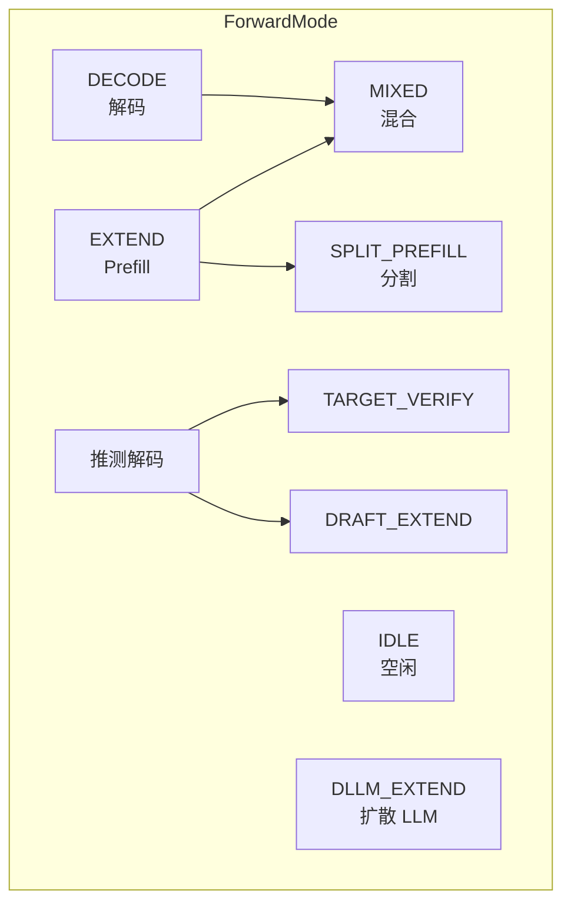
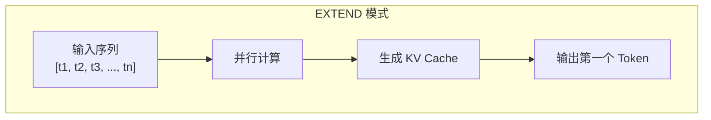
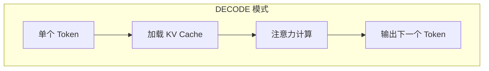
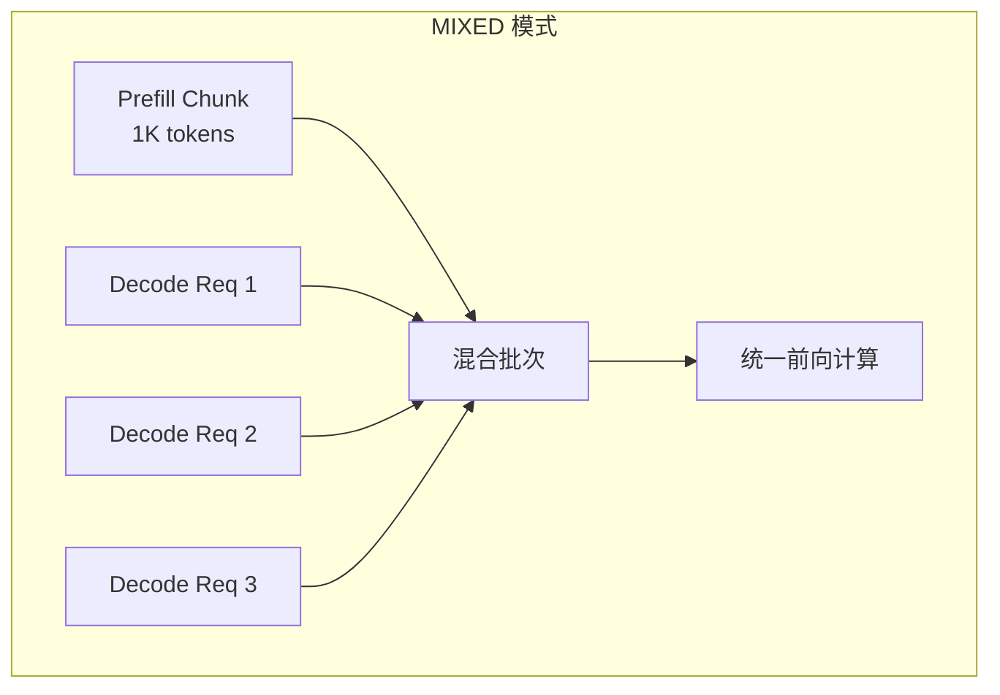
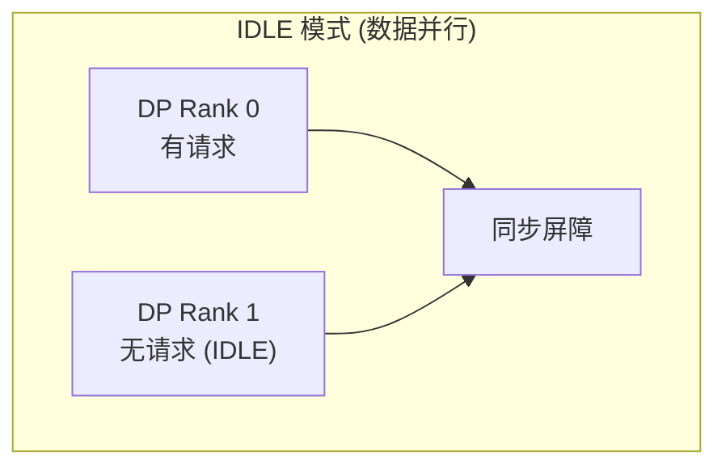
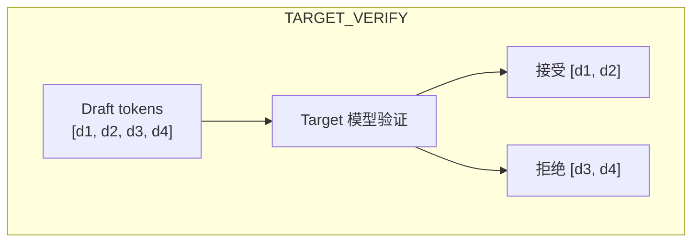
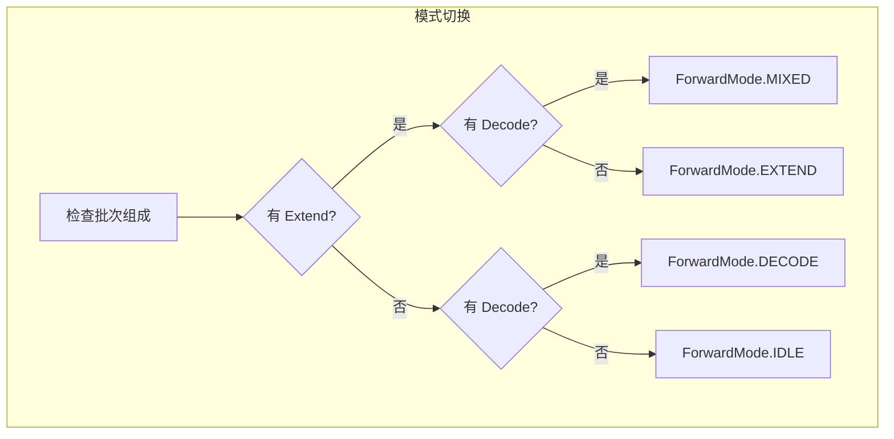

## 概述

### 本章学习目标
- 理解 SGLang 中的各种 ForwardMode
- 掌握不同模式的特点和适用场景
- 了解模式切换逻辑
- 学习各模式的优化策略

### 前置知识要求
- 了解 Prefill/Decode 阶段
- 熟悉批处理概念
- 理解 CUDA Graph

---

## ForwardMode 定义

### 枚举类型

**关键文件**：`python/sglang/srt/model_executor/forward_batch_info.py`

```python
class ForwardMode(IntEnum):
    EXTEND = 1          # Prefill：扩展序列
    DECODE = 2          # Decode：解码单个 token
    MIXED = 3           # 混合：Prefill + Decode
    IDLE = 4            # 空闲：数据并行占位
    TARGET_VERIFY = 5   # 推测解码：验证
    DRAFT_EXTEND = 6    # 推测解码：Draft 扩展
    DLLM_EXTEND = 7     # 扩散 LLM：扩展
    SPLIT_PREFILL = 8   # 分割 Prefill
```

### 模式关系图



---

## EXTEND 模式

### 特点

- 处理完整输入序列（Prefill）
- 生成所有位置的 KV Cache
- 计算密集型



### 实现

```python
def forward_extend(self, forward_batch: ForwardBatch):
    # 初始化注意力元数据
    self.attn_backend.init_forward_metadata(forward_batch)

    # 执行模型前向
    return self.model.forward(
        forward_batch.input_ids,      # [num_tokens]
        forward_batch.positions,       # [num_tokens]
        forward_batch,
    )
```

### 优化

- **分段 CUDA Graph**：长序列分段捕获
- **FlashAttention**：优化注意力计算
- **Chunked Prefill**：分块处理

---

## DECODE 模式

### 特点

- 每次处理单个 token
- 加载历史 KV Cache
- 内存带宽密集型



### 实现

```python
def forward_decode(self, forward_batch: ForwardBatch):
    # Decode 模式下 seq_lens 即为位置
    # 每个请求只有一个 token

    self.attn_backend.init_forward_metadata(forward_batch)

    return self.model.forward(
        forward_batch.input_ids,      # [batch_size]
        forward_batch.positions,       # [batch_size]
        forward_batch,
    )
```

### 优化

- **CUDA Graph**：预捕获常见批次大小
- **批量化**：提高 GPU 利用率
- **Paged Attention**：高效 KV 加载

---

## MIXED 模式

### 特点

- 同时包含 Prefill 和 Decode 请求
- 实现 Chunked Prefill 的关键
- 平衡延迟和吞吐量



### 实现

```python
def forward_mixed(self, forward_batch: ForwardBatch):
    # 区分 Prefill 和 Decode tokens
    # 使用专门的注意力内核处理混合输入

    self.attn_backend.init_forward_metadata(forward_batch)

    # 注意力后端需要知道哪些是 extend，哪些是 decode
    return self.model.forward(
        forward_batch.input_ids,
        forward_batch.positions,
        forward_batch,
    )
```

### 注意力计算

```python
def mixed_attention(
    query: torch.Tensor,
    key_cache: torch.Tensor,
    value_cache: torch.Tensor,
    seq_lens: List[int],
    extend_lens: List[int],
):
    """混合模式注意力"""
    # Extend tokens: 自注意力 + 与已缓存 KV 的注意力
    # Decode tokens: 只与已缓存 KV 的注意力

    # 使用 FlashInfer 等后端高效处理
    pass
```

---

## IDLE 模式

### 特点

- 数据并行中的空闲 rank
- 保持同步但不执行实际计算
- 健康检查



### 实现

```python
def forward_idle(self, forward_batch: ForwardBatch):
    # DP 注意力需要初始化元数据
    if forward_batch.batch_size > 0:
        self.attn_backend.init_forward_metadata(forward_batch)

    # 空批次前向（用于同步）
    return self.model.forward(
        forward_batch.input_ids,
        forward_batch.positions,
        forward_batch,
    )
```

---

## 推测解码模式

### TARGET_VERIFY

验证 Draft 模型预测的 tokens：



```python
def forward_target_verify(self, forward_batch: ForwardBatch):
    # 验证 draft tokens
    # 返回每个位置的 logits 用于比较
    pass
```

### DRAFT_EXTEND

使用 Draft 模型生成候选 tokens：

```python
def forward_draft_extend(self, forward_batch: ForwardBatch):
    # Draft 模型快速生成多个候选
    # 通常使用较小的模型
    pass
```

---

## 模式判断方法

### ForwardMode 方法

```python
class ForwardMode(IntEnum):
    # 判断是否为 Decode 模式
    def is_decode(self) -> bool:
        return self == ForwardMode.DECODE

    # 判断是否为 Extend 模式
    def is_extend(self, include_draft_extend_v2: bool = False) -> bool:
        if include_draft_extend_v2:
            return self in (ForwardMode.EXTEND, ForwardMode.DRAFT_EXTEND)
        return self == ForwardMode.EXTEND

    # 判断是否可以使用 CUDA Graph
    def is_cuda_graph(self) -> bool:
        return self in (
            ForwardMode.DECODE,
            ForwardMode.TARGET_VERIFY,
        )

    # 判断是否为空闲模式
    def is_idle(self) -> bool:
        return self == ForwardMode.IDLE

    # 判断是否为混合模式
    def is_mixed(self) -> bool:
        return self == ForwardMode.MIXED
```

---

## 模式切换逻辑

### 调度器决策



### 实现代码

```python
def determine_forward_mode(batch: ScheduleBatch) -> ForwardMode:
    """确定批次的前向模式"""
    has_extend = any(req.extend_input_len > 1 for req in batch.reqs)
    has_decode = any(req.extend_input_len == 1 for req in batch.reqs)

    if has_extend and has_decode:
        return ForwardMode.MIXED
    elif has_extend:
        return ForwardMode.EXTEND
    elif has_decode:
        return ForwardMode.DECODE
    else:
        return ForwardMode.IDLE
```

---

## 性能特征

### 各模式对比

| 模式 | 计算类型 | GPU 利用率 | CUDA Graph |
|------|----------|-----------|------------|
| EXTEND | 计算密集 | 高 | 分段支持 |
| DECODE | 内存密集 | 中 | 完全支持 |
| MIXED | 混合 | 中高 | 不支持 |
| IDLE | 无 | 无 | 不适用 |

### CUDA Graph 支持

```python
def can_use_cuda_graph(forward_mode: ForwardMode, batch_size: int) -> bool:
    """判断是否可以使用 CUDA Graph"""
    # DECODE 模式支持
    if forward_mode.is_decode():
        return batch_size in captured_batch_sizes

    # TARGET_VERIFY 支持
    if forward_mode == ForwardMode.TARGET_VERIFY:
        return batch_size in captured_batch_sizes

    # 其他模式不支持标准 CUDA Graph
    return False
```

---

## 优化策略

### EXTEND 优化

```python
# 1. 分段 CUDA Graph
if self.piecewise_cuda_graph_runner.can_run(forward_batch):
    return self.piecewise_cuda_graph_runner.replay(forward_batch)

# 2. FlashAttention
self.attn_backend = FlashInferAttnBackend()

# 3. torch.compile
self.model = torch.compile(self.model, mode="reduce-overhead")
```

### DECODE 优化

```python
# 1. CUDA Graph 重放
if self.graph_runner.can_run(forward_batch):
    return self.graph_runner.replay(forward_batch)

# 2. 批量化
min_batch_size = 8  # 确保足够的批次大小

# 3. Paged Attention
self.attn_backend.use_paged_attention = True
```

### MIXED 优化

```python
# 1. 限制 Prefill 比例
max_prefill_ratio = 0.3  # Prefill tokens 不超过 30%

# 2. 使用高效的混合注意力内核
self.attn_backend.mixed_attention_kernel = "flashinfer_mixed"
```

---

## 调试与监控

### 模式统计

```python
class ForwardModeStats:
    def __init__(self):
        self.mode_counts = defaultdict(int)
        self.mode_tokens = defaultdict(int)

    def record(self, mode: ForwardMode, num_tokens: int):
        self.mode_counts[mode.name] += 1
        self.mode_tokens[mode.name] += num_tokens

    def get_stats(self) -> Dict:
        return {
            "mode_distribution": dict(self.mode_counts),
            "tokens_by_mode": dict(self.mode_tokens),
        }
```

### 日志输出

```python
logger.info(
    f"Batch forward: mode={forward_batch.forward_mode.name}, "
    f"batch_size={forward_batch.batch_size}, "
    f"num_tokens={forward_batch.seq_lens_sum}"
)
```

---

## 小结

### 要点回顾

1. **EXTEND**：Prefill 阶段，计算密集型
2. **DECODE**：解码阶段，内存带宽密集型
3. **MIXED**：混合模式，平衡延迟和吞吐
4. **IDLE**：数据并行空闲占位

### 模式选择

| 场景 | 主要模式 | 优化重点 |
|------|----------|----------|
| 短 prompt | DECODE 为主 | CUDA Graph |
| 长 prompt | EXTEND 为主 | Chunked Prefill |
| 高并发 | MIXED | 批量化 |
| 数据并行 | 可能 IDLE | 负载均衡 |

### 下一章预告

在模块五《性能优化篇》中，我们将：
- 深入 CUDA Graph 原理
- 学习 torch.compile 优化
- 掌握量化和推测解码
