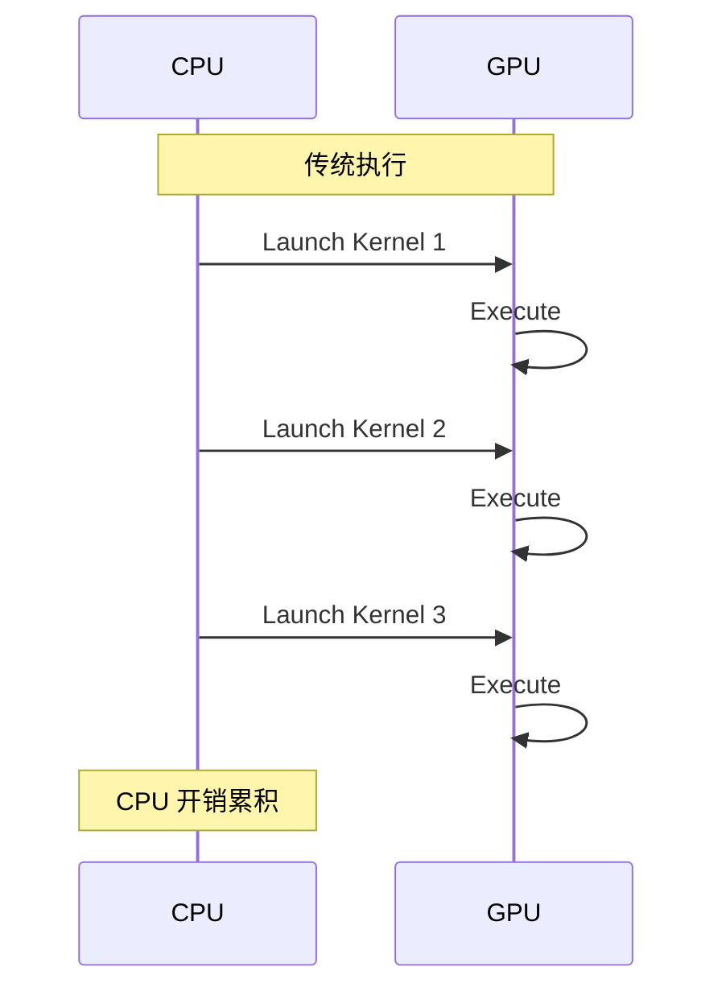
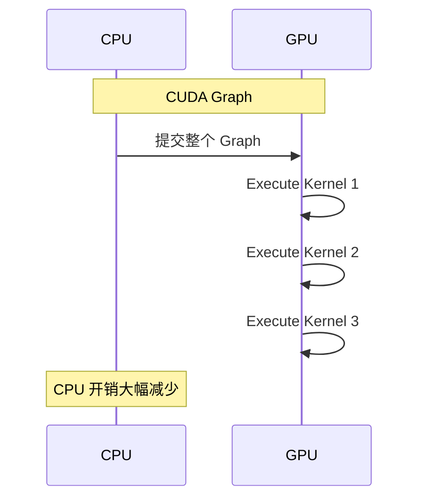
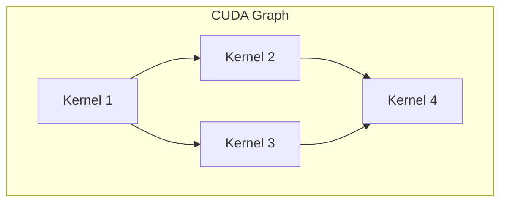
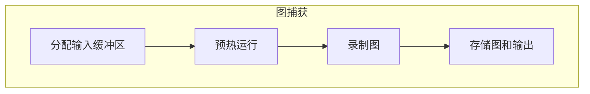
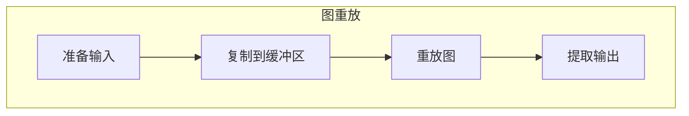

## 概述

### 本章学习目标
- 理解 CUDA Graph 的原理和优势
- 掌握 SGLang 中的 CUDA Graph 实现
- 了解图捕获和重放机制
- 学习性能优化技巧

### 前置知识要求
- 了解 CUDA 编程基础
- 熟悉 PyTorch 模型执行
- 理解 GPU 内核调度

---

## 为什么需要 CUDA Graph

### CPU 开销问题

传统 PyTorch 执行中，每个操作都需要 CPU 参与：



**问题**：
- 每个内核启动需要 ~10μs
- 小批次时 CPU 成为瓶颈
- GPU 利用率低

### CUDA Graph 解决方案

预先录制操作图，一次提交：



---

## CUDA Graph 基础

### 基本概念



**组成**：
- **节点 (Node)**：CUDA 操作（内核、内存拷贝等）
- **边 (Edge)**：依赖关系
- **图 (Graph)**：完整的操作序列

### PyTorch API

```python
# 捕获
g = torch.cuda.CUDAGraph()
with torch.cuda.graph(g):
    output = model(input)

# 重放
g.replay()
```

---

## SGLang 实现

### CudaGraphRunner 类

**关键文件**：`python/sglang/srt/model_executor/cuda_graph_runner.py`

```python
class CudaGraphRunner:
    def __init__(self, model_runner: ModelRunner):
        # 要捕获的批次大小
        self.capture_bs: List[int]

        # 捕获的图
        self.graphs: Dict[int, torch.cuda.CUDAGraph]

        # 输入缓冲区
        self.buffers: GraphInputBuffers

        # 输出缓冲区
        self.output_buffers: Dict[int, LogitsProcessorOutput]

    def capture(self):
        """捕获所有批次大小的图"""
        pass

    def can_run(self, forward_batch) -> bool:
        """判断是否可以使用图"""
        pass

    def replay(self, forward_batch) -> LogitsProcessorOutput:
        """重放图"""
        pass
```

### 批次大小选择

```python
def get_batch_sizes_to_capture(
    max_batch_size: int,
    max_num_tokens: int,
) -> List[int]:
    """获取要捕获的批次大小"""
    batch_sizes = []

    # 小批次：逐一捕获
    for bs in range(1, min(33, max_batch_size + 1)):
        batch_sizes.append(bs)

    # 大批次：按步长捕获
    for bs in range(64, max_batch_size + 1, 32):
        batch_sizes.append(bs)

    return batch_sizes
```

---

## 图捕获流程

### 捕获步骤



### 实现代码

```python
def capture(self):
    with freeze_gc(self.enable_gc):
        # 反向遍历（大批次先捕获，内存重用）
        for bs in reversed(self.capture_bs):
            with patch_model(self.model, bs in self.compile_bs):
                graph, output = self.capture_one_batch_size(bs)
                self.graphs[bs] = graph
                self.output_buffers[bs] = output

def capture_one_batch_size(self, bs: int):
    # 1. 准备输入
    num_tokens = bs
    input_ids = self.buffers.input_ids[:num_tokens]
    positions = self.buffers.positions[:num_tokens]
    seq_lens = self.buffers.seq_lens[:bs]

    # 2. 构建 ForwardBatch
    forward_batch = ForwardBatch(
        forward_mode=ForwardMode.DECODE,
        batch_size=bs,
        input_ids=input_ids,
        positions=positions,
        seq_lens=seq_lens,
        # ...
    )

    # 3. 初始化注意力后端
    self.attn_backend.init_forward_metadata_capture_cuda_graph(
        bs, num_tokens, ...
    )

    # 4. 定义运行函数
    def run_once():
        return self.model.forward(input_ids, positions, forward_batch)

    # 5. 预热
    for _ in range(2):
        torch.cuda.synchronize()
        run_once()

    # 6. 捕获
    graph = torch.cuda.CUDAGraph()
    with torch.cuda.graph(graph, pool=self.pool):
        output = run_once()

    return graph, output
```

---

## 图重放流程

### 重放步骤



### 实现代码

```python
def replay(self, forward_batch: ForwardBatch):
    # 1. 准备重放
    self.replay_prepare(forward_batch)

    # 2. 获取对应批次大小的图
    graph = self.graphs[self.bs]

    # 3. 重放
    graph.replay()

    # 4. 提取输出
    output = self.output_buffers[self.bs]
    return LogitsProcessorOutput(
        next_token_logits=output.next_token_logits[:self.raw_num_token],
        # ...
    )

def replay_prepare(self, forward_batch: ForwardBatch):
    # 复制输入到预分配缓冲区
    raw_bs = forward_batch.batch_size
    raw_num_token = forward_batch.seq_lens_sum

    # 找到最接近的捕获批次大小
    self.bs = self._get_padded_batch_size(raw_bs)
    self.raw_num_token = raw_num_token

    # 填充输入
    self.buffers.populate_from_forward_batch(
        forward_batch=forward_batch,
        raw_bs=raw_bs,
        raw_num_token=raw_num_token,
        bs=self.bs,
    )

    # 初始化注意力元数据
    self.attn_backend.init_forward_metadata_replay_cuda_graph(
        self.bs, self.raw_num_token, ...
    )
```

---

## 输入缓冲区

### GraphInputBuffers

```python
@dataclass
class GraphInputBuffers:
    input_ids: torch.Tensor          # [max_num_token]
    req_pool_indices: torch.Tensor   # [max_bs]
    seq_lens: torch.Tensor           # [max_bs]
    out_cache_loc: torch.Tensor      # [max_num_token]
    positions: torch.Tensor          # [max_num_token]

    @staticmethod
    def create(max_bs: int, max_num_token: int, device: str):
        return GraphInputBuffers(
            input_ids=torch.zeros(max_num_token, dtype=torch.int32, device=device),
            req_pool_indices=torch.zeros(max_bs, dtype=torch.int32, device=device),
            seq_lens=torch.zeros(max_bs, dtype=torch.int32, device=device),
            out_cache_loc=torch.zeros(max_num_token, dtype=torch.int32, device=device),
            positions=torch.zeros(max_num_token, dtype=torch.int32, device=device),
        )

    def populate_from_forward_batch(self, forward_batch, raw_bs, bs):
        """从 ForwardBatch 填充缓冲区"""
        # 复制实际数据
        self.input_ids[:raw_bs].copy_(forward_batch.input_ids)
        self.seq_lens[:raw_bs].copy_(forward_batch.seq_lens)

        # 填充到目标大小
        if bs > raw_bs:
            self.seq_lens[raw_bs:bs].fill_(1)  # 填充值
            self.req_pool_indices[raw_bs:bs].fill_(0)
```

---

## 内存管理

### 内存池复用

```python
def capture(self):
    # 使用共享内存池
    self.pool = torch.cuda.graph_pool_handle()

    # 反向遍历：大批次先捕获
    for bs in reversed(self.capture_bs):
        # 大批次的内存可被小批次复用
        graph, output = self.capture_one_batch_size(bs)
```

### 垃圾回收控制

```python
@contextmanager
def freeze_gc(enable_gc: bool):
    """捕获期间禁用 GC"""
    if not enable_gc:
        gc.disable()
    try:
        yield
    finally:
        if not enable_gc:
            gc.enable()
```

---

## 分段 CUDA Graph

### 用于长序列 Prefill

```python
class PiecewiseCudaGraphRunner:
    """分段 CUDA Graph，用于 Prefill"""

    def __init__(self, model_runner, max_seq_len):
        # 分段长度
        self.segment_size = 2048

        # 每个段的图
        self.segment_graphs: Dict[int, torch.cuda.CUDAGraph]

    def capture_segments(self):
        """捕获不同长度段的图"""
        for seg_len in [512, 1024, 2048, 4096]:
            self.segment_graphs[seg_len] = self._capture_segment(seg_len)

    def replay(self, forward_batch):
        """分段重放"""
        total_len = forward_batch.seq_lens_sum

        for start in range(0, total_len, self.segment_size):
            end = min(start + self.segment_size, total_len)
            seg_len = self._get_segment_size(end - start)

            # 重放对应段
            self.segment_graphs[seg_len].replay()
```

---

## 性能对比

### 延迟对比

```
场景: Decode 阶段，批次大小 32

无 CUDA Graph:
- 内核启动: ~50 次 × 10μs = 500μs
- 计算: 2ms
- 总延迟: 2.5ms

有 CUDA Graph:
- 图提交: ~10μs
- 计算: 2ms
- 总延迟: 2.01ms

延迟降低: ~20%
```

### 吞吐量提升

| 批次大小 | 无 Graph | 有 Graph | 提升 |
|---------|----------|----------|------|
| 1 | 100 tok/s | 150 tok/s | 50% |
| 8 | 500 tok/s | 650 tok/s | 30% |
| 32 | 1500 tok/s | 1800 tok/s | 20% |
| 128 | 4000 tok/s | 4400 tok/s | 10% |

---

## 配置参数

### 服务器参数

```python
@dataclass
class ServerArgs:
    # 启用 CUDA Graph
    disable_cuda_graph: bool = False

    # 最大批次大小
    cuda_graph_max_bs: int = 128

    # 捕获时启用 GC
    enable_cudagraph_gc: bool = False
```

### 启动命令

```bash
# 默认启用 CUDA Graph
python -m sglang.launch_server \
    --model meta-llama/Llama-3.1-8B-Instruct

# 禁用 CUDA Graph
python -m sglang.launch_server \
    --model meta-llama/Llama-3.1-8B-Instruct \
    --disable-cuda-graph

# 调整最大批次大小
python -m sglang.launch_server \
    --model meta-llama/Llama-3.1-8B-Instruct \
    --cuda-graph-max-bs 256
```

---

## 限制与注意事项

### 限制

1. **动态形状**：不支持动态形状输入
2. **控制流**：不支持数据依赖的控制流
3. **同步操作**：捕获期间不能有 CPU-GPU 同步
4. **内存分配**：捕获期间不能有动态内存分配

### 解决方案

```python
# 1. 填充到固定大小
padded_bs = get_padded_batch_size(raw_bs)

# 2. 预分配所有缓冲区
buffers = GraphInputBuffers.create(max_bs, max_tokens, device)

# 3. 避免同步
# 使用非阻塞操作
```

---

## 调试技巧

### 验证图正确性

```python
def verify_cuda_graph(model, forward_batch):
    """验证 CUDA Graph 输出正确性"""
    # 不使用图
    output_no_graph = model.forward(forward_batch)

    # 使用图
    output_with_graph = graph_runner.replay(forward_batch)

    # 比较
    torch.testing.assert_close(
        output_no_graph.next_token_logits,
        output_with_graph.next_token_logits,
        rtol=1e-3, atol=1e-3
    )
```

### 性能分析

```python
# 使用 CUDA profiler
with torch.profiler.profile() as prof:
    for _ in range(100):
        graph_runner.replay(forward_batch)

print(prof.key_averages().table())
```

---

## 小结

### 要点回顾

1. **原理**：预录制操作图，消除内核启动开销
2. **捕获**：预热 → 录制 → 存储
3. **重放**：填充缓冲区 → 重放图 → 提取输出
4. **优化**：批次大小选择、内存复用

### 性能收益

| 场景 | 收益 |
|------|------|
| 小批次 | 30-50% |
| 中批次 | 15-30% |
| 大批次 | 10-15% |

### 下一章预告

在下一章《torch.compile 优化》中，我们将：
- 了解 torch.compile 原理
- 学习内核融合优化
- 掌握编译配置
