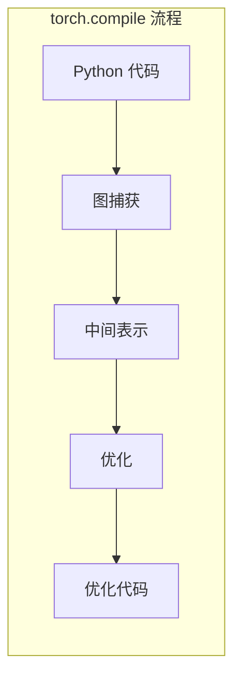
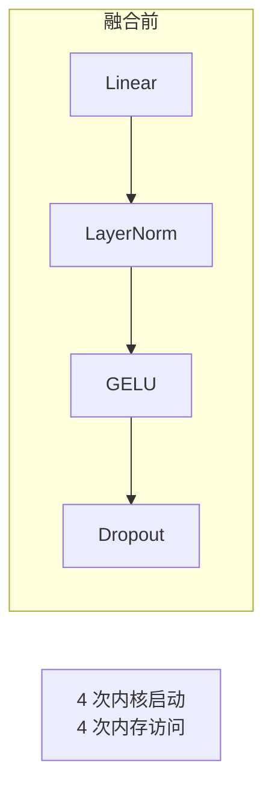
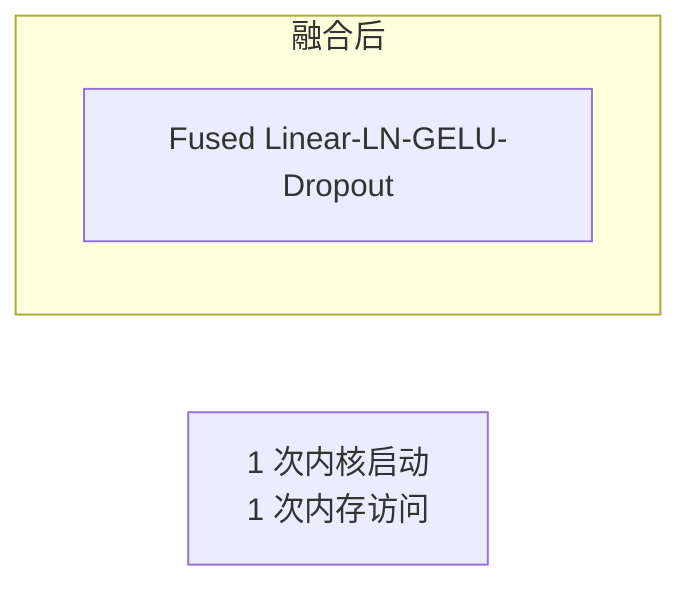
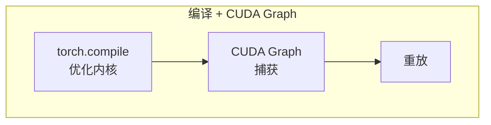

## 概述

### 本章学习目标
- 理解 torch.compile 的工作原理
- 掌握 SGLang 中的编译优化
- 了解内核融合机制
- 学习编译配置和调优

### 前置知识要求
- 了解 PyTorch 基础
- 熟悉 CUDA 内核概念
- 理解模型执行流程

---

## torch.compile 简介

### 什么是 torch.compile

PyTorch 2.0 引入的编译优化，将 Python 代码转换为优化的机器码：



### 主要优化

| 优化类型 | 说明 |
|----------|------|
| 内核融合 | 合并多个小操作 |
| 算子选择 | 选择最优实现 |
| 内存优化 | 减少中间张量 |
| 并行化 | 自动并行执行 |

---

## SGLang 集成

### 编译配置

**关键文件**：`python/sglang/srt/model_executor/model_runner.py`

```python
def _apply_torch_compile(self):
    """应用 torch.compile 优化"""
    if not self.server_args.enable_torch_compile:
        return

    # 编译模式
    compile_mode = self.server_args.torch_compile_mode

    # 编译模型
    self.model = torch.compile(
        self.model,
        mode=compile_mode,
        fullgraph=False,
        dynamic=True,
    )
```

### 编译模式

```python
# 可用模式
compile_modes = {
    "default": "平衡性能和编译时间",
    "reduce-overhead": "最小化运行时开销",
    "max-autotune": "最大优化，编译时间长",
}
```

---

## 内核融合

### 融合前



### 融合后



### 融合示例

```python
# 原始代码
def mlp_forward(x, w1, w2):
    h = F.linear(x, w1)
    h = F.silu(h)
    h = F.linear(h, w2)
    return h

# torch.compile 自动融合
compiled_mlp = torch.compile(mlp_forward)
# 融合为更少的内核调用
```

---

## 与 CUDA Graph 配合

### 组合使用



### 实现

```python
def capture_one_batch_size(self, bs: int):
    # 1. 应用 torch.compile
    if bs in self.compile_bs:
        with patch_model(self.model, compile=True):
            forward = self.model.forward
    else:
        forward = self.model.forward

    # 2. 捕获 CUDA Graph
    graph = torch.cuda.CUDAGraph()
    with torch.cuda.graph(graph):
        output = forward(input_ids, positions, forward_batch)

    return graph, output
```

---

## 编译优化技术

### 1. Triton 后端

```python
# 使用 Triton 生成高效内核
@torch.compile(backend="inductor")
def attention_forward(q, k, v):
    return F.scaled_dot_product_attention(q, k, v)
```

### 2. 动态形状支持

```python
# 启用动态形状
model = torch.compile(
    model,
    dynamic=True,  # 支持动态形状
)
```

### 3. 选择性编译

```python
# 只编译关键部分
class Model(nn.Module):
    def __init__(self):
        self.mlp = torch.compile(MLP())
        self.attention = Attention()  # 不编译

    def forward(self, x):
        h = self.attention(x)
        return self.mlp(h)
```

---

## 性能分析

### 编译时间

```
首次编译:
- 小模型 (1B): ~30s
- 中模型 (7B): ~2min
- 大模型 (70B): ~10min

重新编译 (形状变化):
- 增量编译: ~5s
```

### 运行时性能

| 场景 | 无编译 | 有编译 | 提升 |
|------|--------|--------|------|
| MLP 前向 | 1.0x | 1.3x | 30% |
| 注意力 | 1.0x | 1.1x | 10% |
| 端到端 | 1.0x | 1.2x | 20% |

---

## 配置参数

### 服务器参数

```python
@dataclass
class ServerArgs:
    # 启用 torch.compile
    enable_torch_compile: bool = False

    # 编译模式
    torch_compile_mode: str = "reduce-overhead"

    # 最大自动调优
    torch_compile_max_autotune: bool = False
```

### 启动命令

```bash
# 启用 torch.compile
python -m sglang.launch_server \
    --model meta-llama/Llama-3.1-8B-Instruct \
    --enable-torch-compile

# 指定编译模式
python -m sglang.launch_server \
    --model meta-llama/Llama-3.1-8B-Instruct \
    --enable-torch-compile \
    --torch-compile-mode max-autotune
```

---

## 调试与监控

### 查看编译日志

```python
import torch._dynamo
torch._dynamo.config.verbose = True
torch._dynamo.config.log_level = "DEBUG"
```

### 编译统计

```python
# 获取编译统计
import torch._dynamo as dynamo

# 重置计数器
dynamo.reset()

# 运行模型
output = model(input)

# 查看统计
print(dynamo.utils.counters)
```

### 性能分析

```python
with torch.profiler.profile(
    activities=[
        torch.profiler.ProfilerActivity.CPU,
        torch.profiler.ProfilerActivity.CUDA,
    ],
    with_stack=True,
) as prof:
    output = compiled_model(input)

print(prof.key_averages().table(sort_by="cuda_time_total"))
```

---

## 常见问题

### 1. 编译失败

```python
# 问题：动态控制流
if x.sum() > 0:  # 数据依赖的控制流
    return x
else:
    return -x

# 解决：使用 torch.where
return torch.where(x.sum() > 0, x, -x)
```

### 2. 性能退化

```python
# 问题：频繁重编译
# 原因：输入形状频繁变化

# 解决：设置动态维度
import torch._dynamo as dynamo
dynamo.mark_dynamic(tensor, dim=0)  # 标记动态维度
```

### 3. 内存增加

```python
# 问题：编译增加内存使用
# 解决：调整编译配置
torch._inductor.config.memory_planning = True
torch._inductor.config.reorder_for_locality = True
```

---

## 最佳实践

### 1. 渐进式编译

```python
# 先验证功能正确性
output_eager = model(input)

# 再启用编译
compiled_model = torch.compile(model)
output_compiled = compiled_model(input)

# 验证结果一致
torch.testing.assert_close(output_eager, output_compiled)
```

### 2. 预热

```python
# 预热编译
for _ in range(3):
    _ = compiled_model(warmup_input)

# 实际运行
output = compiled_model(real_input)
```

### 3. 缓存编译结果

```python
import torch._dynamo
torch._dynamo.config.cache_size_limit = 256  # 增加缓存
```

---

## 小结

### 要点回顾

1. **原理**：将 Python 代码编译为优化的机器码
2. **优化**：内核融合、算子选择、内存优化
3. **配合**：与 CUDA Graph 组合使用效果更好
4. **权衡**：编译时间 vs 运行时性能

### 使用建议

| 场景 | 建议 |
|------|------|
| 生产环境 | 启用，使用 reduce-overhead |
| 开发调试 | 禁用，便于调试 |
| 性能调优 | 启用 max-autotune |

### 下一章预告

在下一章《量化支持》中，我们将：
- 了解 FP8/INT4/AWQ 等量化方法
- 学习量化对内存和性能的影响
- 掌握量化配置
