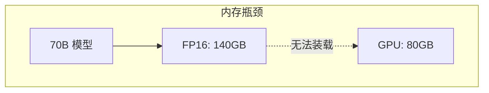
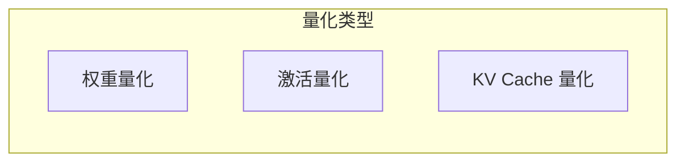
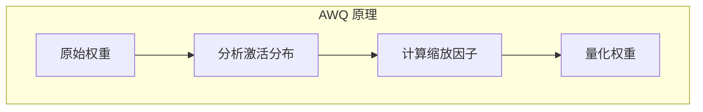
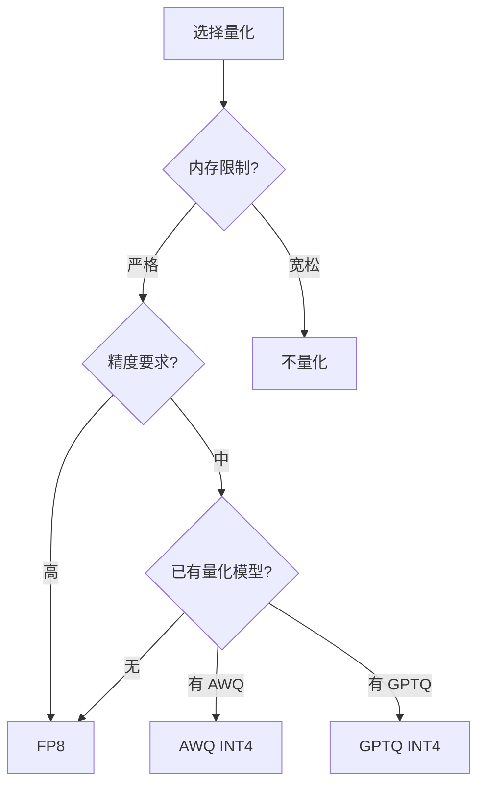

## 概述

### 本章学习目标
- 理解量化的原理和类型
- 掌握 SGLang 支持的量化方法
- 了解量化对内存和性能的影响
- 学习量化配置和使用

### 前置知识要求
- 了解浮点数表示
- 熟悉模型权重结构
- 理解内存与计算的权衡

---

## 量化原理

### 为什么需要量化



**动机**：
- 减少内存占用
- 提高推理速度
- 降低部署成本

### 量化方式



| 类型 | 说明 | 影响 |
|------|------|------|
| 权重量化 | 量化模型参数 | 减少存储 |
| 激活量化 | 量化中间结果 | 减少计算 |
| KV Cache 量化 | 量化 KV 缓存 | 减少内存 |

---

## 支持的量化格式

### FP8

8 位浮点数，精度损失小：

```
FP8 E4M3: 1 符号 + 4 指数 + 3 尾数
FP8 E5M2: 1 符号 + 5 指数 + 2 尾数

内存节省: 50% (vs FP16)
精度损失: ~1%
```

### INT8

8 位整数，需要缩放因子：

```
量化: x_int8 = round(x / scale)
反量化: x = x_int8 * scale

内存节省: 50%
精度损失: 1-3%
```

### INT4/FP4

4 位量化，最大压缩：

```
内存节省: 75%
精度损失: 2-5%
需要特殊内核支持
```

### AWQ (Activation-aware Weight Quantization)



特点：
- 基于激活分布优化
- 保护重要权重
- INT4 精度接近 FP16

### GPTQ

训练后量化方法：

```python
# GPTQ 量化过程
1. 逐层处理
2. 使用校准数据
3. 最小化量化误差
4. 生成量化模型
```

---

## SGLang 配置

### 启动参数

```bash
# FP8 量化
python -m sglang.launch_server \
    --model meta-llama/Llama-3.1-8B-Instruct \
    --quantization fp8

# AWQ 量化
python -m sglang.launch_server \
    --model TheBloke/Llama-2-7B-AWQ \
    --quantization awq

# GPTQ 量化
python -m sglang.launch_server \
    --model TheBloke/Llama-2-7B-GPTQ \
    --quantization gptq
```

### KV Cache 量化

```bash
# FP8 KV Cache
python -m sglang.launch_server \
    --model meta-llama/Llama-3.1-8B-Instruct \
    --kv-cache-dtype fp8_e5m2

# 可用 KV Cache 类型
# fp8_e5m2: FP8 E5M2 格式
# fp8_e4m3: FP8 E4M3 格式
```

---

## 量化实现

### FP8 量化

```python
class FP8QuantizedLinear(nn.Module):
    def __init__(self, weight, scale):
        self.weight_fp8 = weight.to(torch.float8_e4m3fn)
        self.scale = scale

    def forward(self, x):
        # 反量化计算
        weight = self.weight_fp8.to(x.dtype) * self.scale
        return F.linear(x, weight)
```

### AWQ 量化

```python
class AWQLinear(nn.Module):
    def __init__(self, qweight, scales, zeros, group_size):
        self.qweight = qweight      # INT4 打包权重
        self.scales = scales        # 缩放因子
        self.zeros = zeros          # 零点
        self.group_size = group_size

    def forward(self, x):
        # 使用 AWQ 内核
        return awq_gemm(x, self.qweight, self.scales, self.zeros)
```

### KV Cache 量化

```python
class QuantizedKVCache:
    def __init__(self, dtype=torch.float8_e5m2):
        self.dtype = dtype
        self.k_scale = None
        self.v_scale = None

    def store(self, k, v, indices):
        # 量化存储
        k_scale = k.abs().max() / 127
        v_scale = v.abs().max() / 127

        self.k_cache[indices] = (k / k_scale).to(self.dtype)
        self.v_cache[indices] = (v / v_scale).to(self.dtype)
        self.k_scale = k_scale
        self.v_scale = v_scale

    def load(self, indices):
        # 反量化加载
        k = self.k_cache[indices].to(torch.float16) * self.k_scale
        v = self.v_cache[indices].to(torch.float16) * self.v_scale
        return k, v
```

---

## 性能影响

### 内存节省

| 模型 | FP16 | FP8 | INT4 |
|------|------|-----|------|
| 7B | 14GB | 7GB | 3.5GB |
| 13B | 26GB | 13GB | 6.5GB |
| 70B | 140GB | 70GB | 35GB |

### 吞吐量变化

```
FP8 vs FP16:
- 内存带宽提升: ~2x
- 计算吞吐: ~1.5x
- 端到端: ~1.3-1.5x

INT4 vs FP16:
- 内存带宽提升: ~4x
- 计算吞吐: ~2x (需要反量化)
- 端到端: ~1.5-2x
```

### 精度影响

| 量化方法 | 困惑度增加 | 任务精度下降 |
|---------|-----------|-------------|
| FP8 | <1% | <1% |
| INT8 | 1-2% | 1-2% |
| AWQ INT4 | 2-3% | 2-3% |
| GPTQ INT4 | 3-5% | 3-5% |

---

## 最佳实践

### 选择量化方法



### 配置建议

| 场景 | 推荐配置 |
|------|----------|
| 高精度推理 | FP8 权重 + FP16 KV |
| 高吞吐服务 | FP8 权重 + FP8 KV |
| 边缘部署 | AWQ INT4 |
| 研究实验 | 不量化 |

### 量化模型来源

```bash
# HuggingFace 预量化模型
# AWQ 模型
TheBloke/Llama-2-7B-AWQ
TheBloke/Llama-2-13B-AWQ

# GPTQ 模型
TheBloke/Llama-2-7B-GPTQ
TheBloke/Llama-2-13B-GPTQ

# FP8 量化（运行时）
# 使用原始模型 + --quantization fp8
```

---

## 高级配置

### 混合精度

```bash
# 权重 FP8 + KV Cache FP8
python -m sglang.launch_server \
    --model meta-llama/Llama-3.1-8B-Instruct \
    --quantization fp8 \
    --kv-cache-dtype fp8_e5m2
```

### 量化感知微调

```python
# 使用量化感知训练的模型
# 量化精度更高
```

### 校准数据

```python
# 某些量化方法需要校准数据
# AWQ/GPTQ 在量化时使用
```

---

## 常见问题

### 1. 量化模型加载失败

```bash
# 问题：缺少量化库
# 解决：安装对应库
pip install auto-awq
pip install auto-gptq
```

### 2. 精度下降严重

```python
# 问题：某些任务对量化敏感
# 解决：使用更高精度量化或关键层不量化
```

### 3. 性能未提升

```python
# 问题：硬件不支持量化加速
# 解决：确认 GPU 支持 FP8/INT8 Tensor Core
# H100/A100 支持 FP8
# A100 支持 INT8
```

---

## 小结

### 要点回顾

1. **类型**：FP8、INT8、INT4、AWQ、GPTQ
2. **权衡**：内存 vs 精度 vs 速度
3. **配置**：`--quantization` 和 `--kv-cache-dtype`
4. **选择**：根据场景选择合适的量化方法

### 量化对比

| 方法 | 内存节省 | 速度提升 | 精度损失 |
|------|----------|----------|----------|
| FP8 | 50% | 30% | <1% |
| INT8 | 50% | 20% | 1-2% |
| AWQ | 75% | 50% | 2-3% |
| GPTQ | 75% | 50% | 3-5% |

### 下一章预告

在下一章《推测解码》中，我们将：
- 了解推测解码原理
- 学习 EAGLE/NGRAM 等方法
- 掌握加速技术
