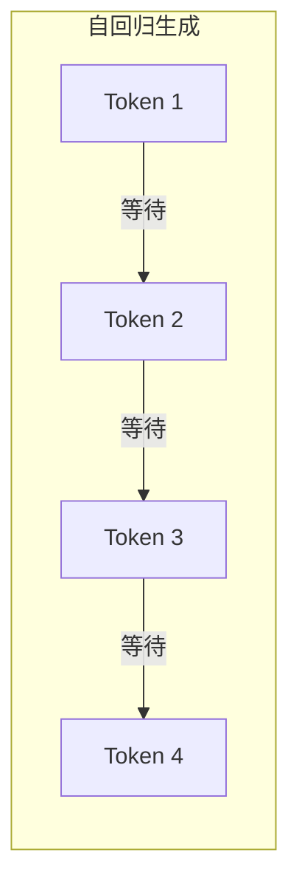
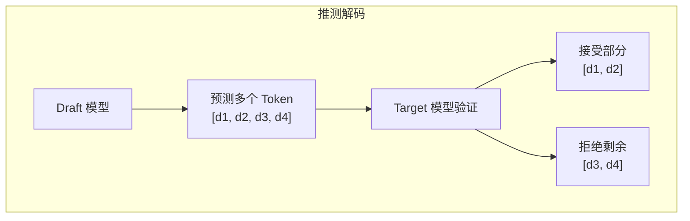
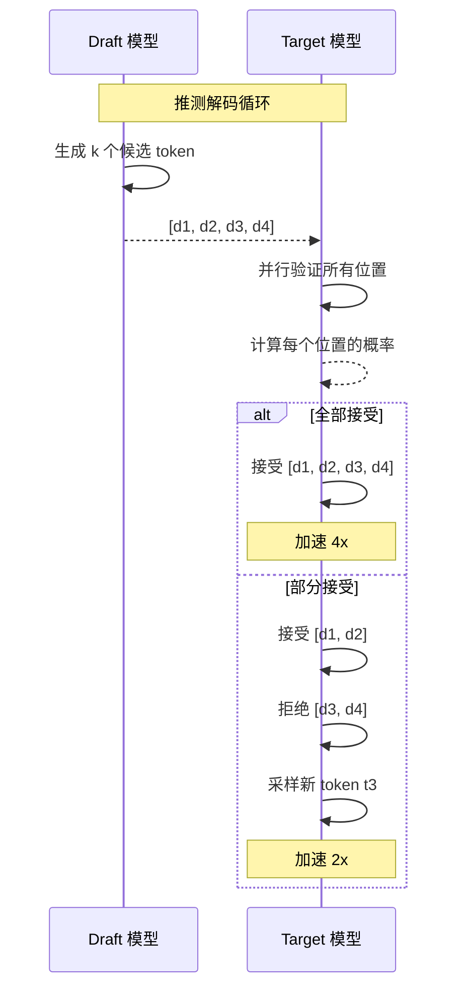
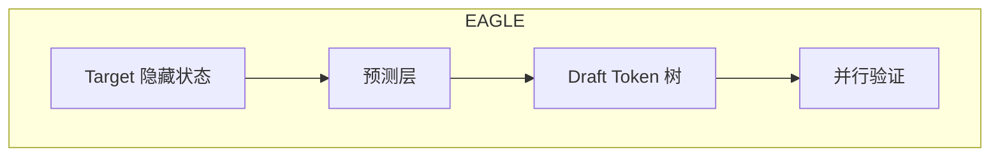
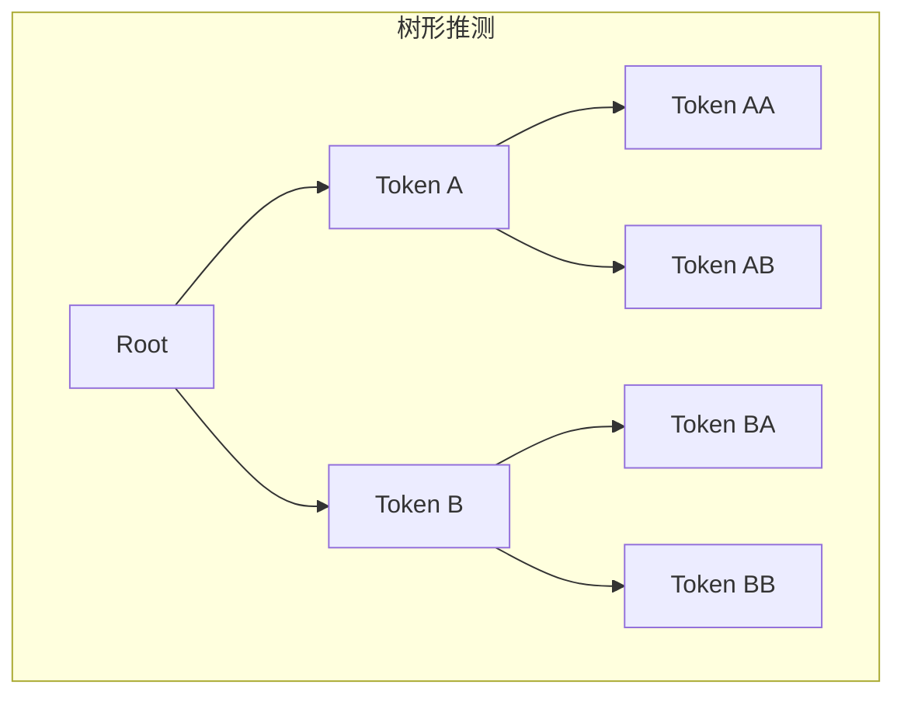
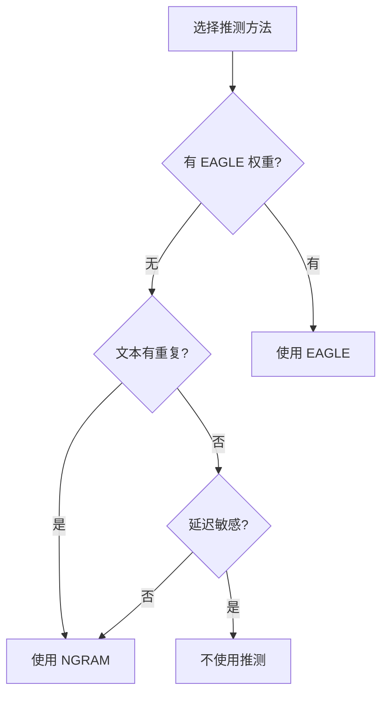

## 概述

### 本章学习目标
- 理解推测解码的原理
- 掌握 SGLang 支持的推测方法
- 了解 EAGLE 和 NGRAM 实现
- 学习配置和调优

### 前置知识要求
- 了解 LLM 自回归生成
- 熟悉 Decode 阶段特点
- 理解并行计算概念

---

## 推测解码原理

### 自回归生成的瓶颈



**问题**：每个 token 必须等待前一个完成，无法并行。

### 推测解码思想



**核心思想**：
1. 使用小模型（Draft）快速预测多个 token
2. 使用大模型（Target）并行验证
3. 接受正确的预测，拒绝错误的

---

## 推测解码流程

### 完整流程



### 验证机制

```python
def verify_speculative(draft_tokens, target_logits):
    """验证推测的 tokens"""
    accepted = []

    for i, draft_token in enumerate(draft_tokens):
        # 计算 Target 模型在该位置的概率
        target_prob = softmax(target_logits[i])

        # 计算 Draft 模型的概率
        draft_prob = draft_probs[i]

        # 接受概率
        accept_prob = min(1, target_prob[draft_token] / draft_prob[draft_token])

        if random.random() < accept_prob:
            accepted.append(draft_token)
        else:
            # 拒绝：从修正分布采样
            new_token = sample_from_correction(target_prob, draft_prob)
            accepted.append(new_token)
            break

    return accepted
```

---

## SGLang 支持的方法

### EAGLE

**EAGLE** (Extrapolation Algorithm for Greater Language-model Efficiency)：



特点：
- 使用 Target 模型的隐藏状态
- 无需独立 Draft 模型
- 高接受率

### NGRAM

基于 N-gram 统计的推测：

```python
def ngram_speculate(context, n=3):
    """使用 N-gram 推测"""
    # 查找历史中的匹配
    suffix = context[-n:]
    for i in range(len(context) - n):
        if context[i:i+n] == suffix:
            # 找到匹配，返回后续 tokens
            return context[i+n:i+n+k]
    return None
```

特点：
- 无额外模型
- 对重复文本有效
- 零计算开销

---

## EAGLE 实现

### 配置

```bash
# 启用 EAGLE
python -m sglang.launch_server \
    --model meta-llama/Llama-3.1-8B-Instruct \
    --speculative-algorithm EAGLE \
    --speculative-eagle-path /path/to/eagle/weights \
    --speculative-num-draft-tokens 5
```

### 核心代码

```python
class EAGLESpeculator:
    def __init__(self, model_runner, eagle_path, num_draft):
        self.num_draft = num_draft
        self.eagle_model = load_eagle_model(eagle_path)

    def speculate(self, hidden_states):
        """生成 Draft tokens"""
        draft_tokens = []
        current_hidden = hidden_states

        for _ in range(self.num_draft):
            # 使用 EAGLE 预测层
            logits = self.eagle_model(current_hidden)
            token = sample(logits)
            draft_tokens.append(token)

            # 更新隐藏状态
            current_hidden = self.update_hidden(current_hidden, token)

        return draft_tokens

    def verify(self, draft_tokens, target_logits):
        """验证 Draft tokens"""
        return verify_speculative(draft_tokens, target_logits)
```

---

## NGRAM 实现

### 配置

```bash
# 启用 NGRAM
python -m sglang.launch_server \
    --model meta-llama/Llama-3.1-8B-Instruct \
    --speculative-algorithm NGRAM \
    --speculative-num-draft-tokens 4
```

### 核心代码

```python
class NGRAMSpeculator:
    def __init__(self, n=3, num_draft=4):
        self.n = n
        self.num_draft = num_draft

    def speculate(self, token_ids):
        """基于 N-gram 匹配推测"""
        suffix = tuple(token_ids[-self.n:])

        # 在历史中查找匹配
        for i in range(len(token_ids) - self.n - self.num_draft):
            if tuple(token_ids[i:i+self.n]) == suffix:
                # 返回匹配后的 tokens
                return token_ids[i+self.n:i+self.n+self.num_draft]

        return None  # 无匹配

    def verify(self, draft_tokens, target_logits):
        """验证"""
        return verify_speculative(draft_tokens, target_logits)
```

---

## 性能分析

### 加速比

```
加速比 = 平均接受长度 / (Draft 开销 + 验证开销)

理想情况 (接受率 100%):
- 推测 5 tokens -> 加速 ~4x

实际情况 (接受率 60-80%):
- 推测 5 tokens -> 加速 ~2-3x
```

### 影响因素

| 因素 | 影响 |
|------|------|
| Draft 质量 | 接受率 |
| 推测长度 | 潜在加速 |
| 验证开销 | 实际加速 |
| 任务类型 | 接受率 |

### 任务适配性

| 任务 | EAGLE 加速 | NGRAM 加速 |
|------|-----------|-----------|
| 代码生成 | 2-3x | 1.5-2x |
| 翻译 | 2x | 1.2x |
| 摘要 | 1.8x | 1.1x |
| 创意写作 | 1.5x | 1.0x |

---

## 高级配置

### 动态推测长度

```python
class AdaptiveSpeculator:
    def __init__(self, min_draft=2, max_draft=8):
        self.min_draft = min_draft
        self.max_draft = max_draft
        self.accept_rate_history = []

    def get_num_draft(self):
        """根据历史接受率调整"""
        if not self.accept_rate_history:
            return 4  # 默认

        avg_rate = sum(self.accept_rate_history[-10:]) / 10

        if avg_rate > 0.8:
            return min(self.max_draft, current + 1)
        elif avg_rate < 0.5:
            return max(self.min_draft, current - 1)
        return current
```

### 树形推测



```python
# 树形推测可以探索多个分支
# 提高接受率但增加验证开销
```

---

## 调试与监控

### 指标收集

```python
class SpeculativeMetrics:
    def __init__(self):
        self.total_drafts = 0
        self.total_accepted = 0
        self.rounds = 0

    def record(self, num_drafted, num_accepted):
        self.total_drafts += num_drafted
        self.total_accepted += num_accepted
        self.rounds += 1

    def get_stats(self):
        return {
            "accept_rate": self.total_accepted / self.total_drafts,
            "avg_accepted": self.total_accepted / self.rounds,
            "speedup_estimate": self.total_accepted / self.rounds + 1,
        }
```

### 日志输出

```python
logger.info(
    f"Speculative decode: drafted={num_drafted}, "
    f"accepted={num_accepted}, "
    f"rate={num_accepted/num_drafted:.2%}"
)
```

---

## 最佳实践

### 选择方法



### 配置建议

| 场景 | 方法 | 推测长度 |
|------|------|----------|
| 代码补全 | EAGLE | 5-8 |
| 聊天对话 | EAGLE | 3-5 |
| 文档处理 | NGRAM | 4-6 |
| 实时翻译 | 不推荐 | - |

---

## 小结

### 要点回顾

1. **原理**：小模型预测，大模型验证
2. **方法**：EAGLE（高质量）、NGRAM（零开销）
3. **加速**：实际 2-3x，取决于接受率
4. **适用**：代码、重复文本效果好

### 对比总结

| 方法 | 需要额外模型 | 接受率 | 开销 |
|------|-------------|--------|------|
| EAGLE | 是 | 高 | 中 |
| NGRAM | 否 | 中 | 低 |

### 下一章预告

在模块六《分布式与并行篇》中，我们将：
- 了解张量并行原理
- 学习流水线并行
- 掌握专家并行
