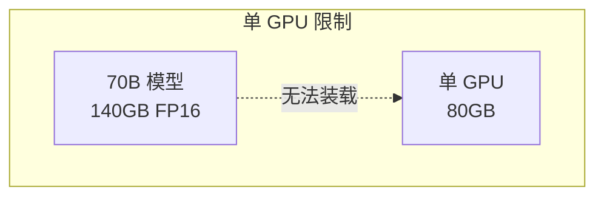
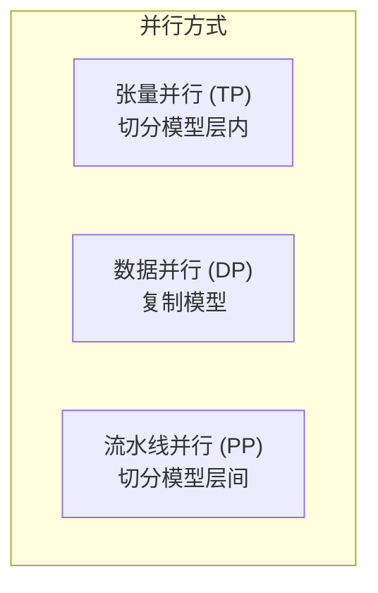
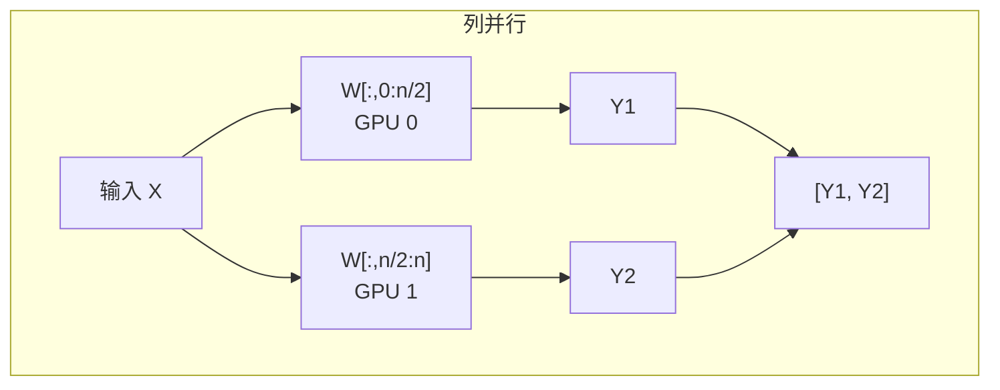
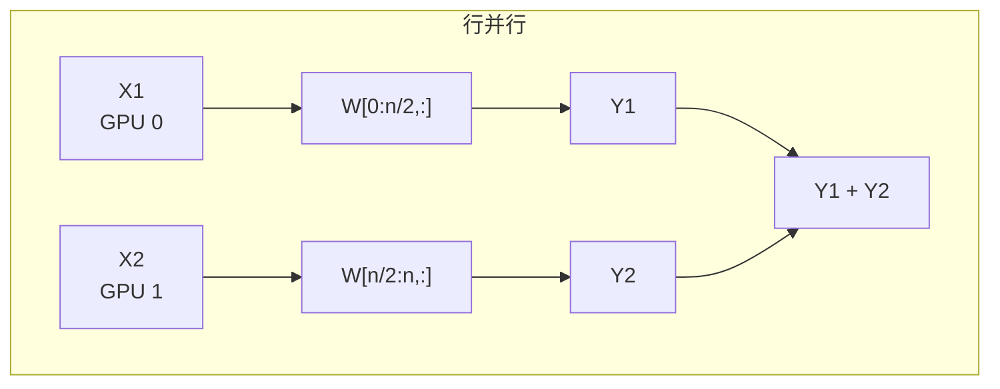
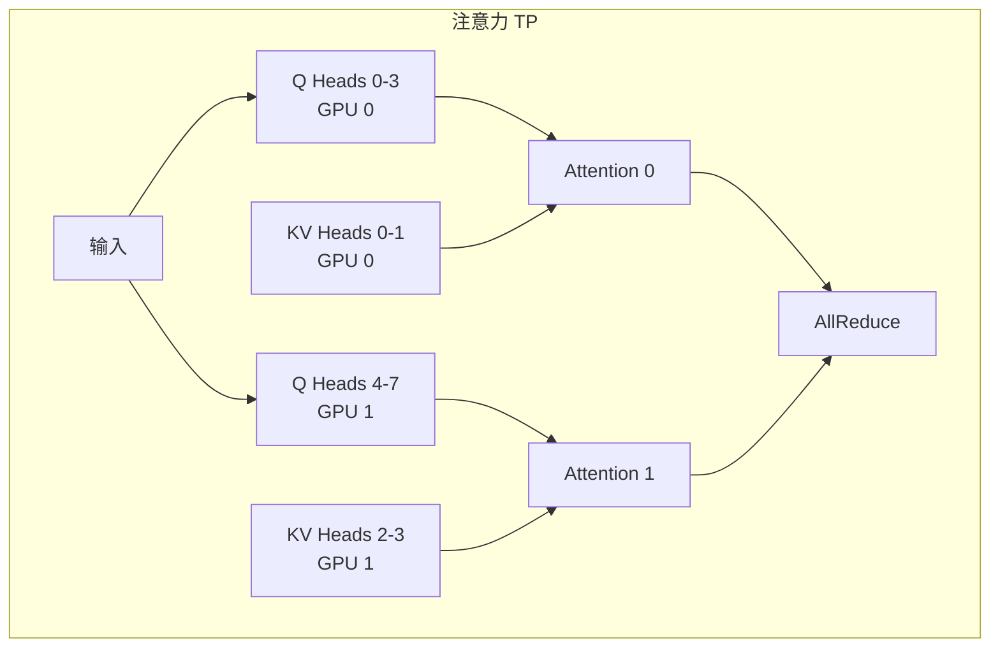
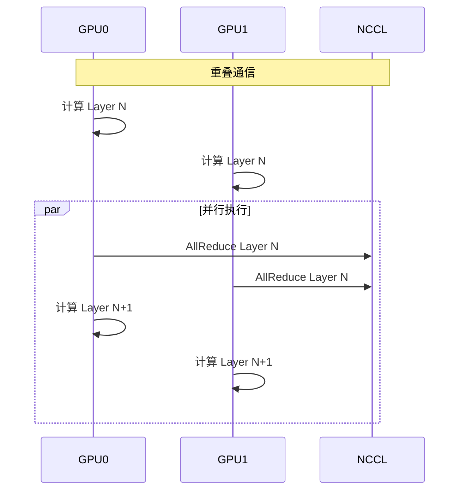
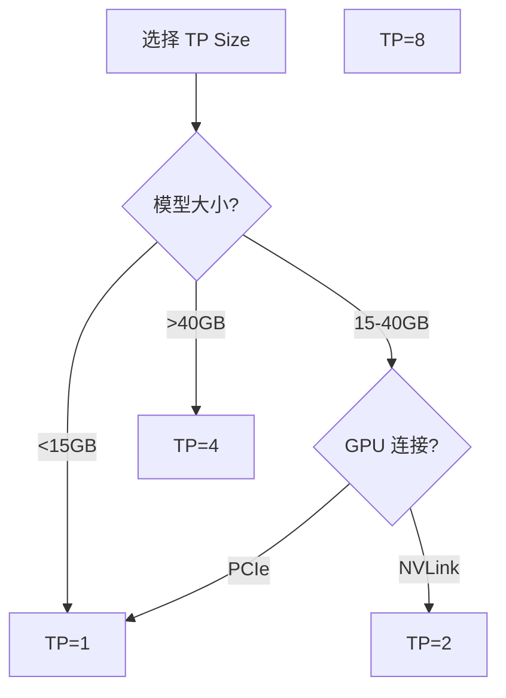

## 概述

### 本章学习目标
- 理解张量并行的原理
- 掌握 SGLang 中的 TP 实现
- 了解通信优化技术
- 学习配置和调优

### 前置知识要求
- 了解分布式计算基础
- 熟悉 NCCL 通信
- 理解 Transformer 结构

---

## 张量并行原理

### 为什么需要张量并行



**解决方案**：将模型分割到多个 GPU 上。

### TP vs DP vs PP



| 类型 | 切分方式 | 通信模式 | 适用场景 |
|------|----------|----------|----------|
| TP | 层内切分 | All-Reduce | 单机多卡 |
| DP | 复制模型 | All-Gather | 大批次 |
| PP | 层间切分 | Point-to-Point | 超大模型 |

---

## TP 实现原理

### 线性层切分

**列并行** (Column Parallel)：



```python
# 列并行：输出维度切分
# GPU 0: Y1 = X @ W[:, :n//2]
# GPU 1: Y2 = X @ W[:, n//2:]
# 结果：Y = [Y1, Y2] (AllGather)
```

**行并行** (Row Parallel)：



```python
# 行并行：输入维度切分
# GPU 0: Y1 = X1 @ W[:n//2, :]
# GPU 1: Y2 = X2 @ W[n//2:, :]
# 结果：Y = Y1 + Y2 (AllReduce)
```

### 注意力层并行



---

## SGLang 实现

### 配置

```bash
# 2 GPU 张量并行
python -m sglang.launch_server \
    --model meta-llama/Llama-3.1-70B-Instruct \
    --tensor-parallel-size 2

# 4 GPU 张量并行
python -m sglang.launch_server \
    --model meta-llama/Llama-3.1-70B-Instruct \
    --tensor-parallel-size 4
```

### 初始化

```python
def init_torch_distributed(self):
    """初始化分布式环境"""
    # 设置设备
    torch.cuda.set_device(self.gpu_id)

    # 初始化进程组
    init_distributed_environment(
        world_size=self.tp_size,
        rank=self.tp_rank,
        backend="nccl",
    )

    # 创建 TP 通信组
    self.tp_group = create_tensor_parallel_group(self.tp_size)
```

### 权重切分

```python
def load_weights_tp(self, weights):
    """加载 TP 切分的权重"""
    for name, param in weights.items():
        if "q_proj" in name or "k_proj" in name or "v_proj" in name:
            # QKV 列并行
            param = split_tensor_along_dim(
                param, dim=0, rank=self.tp_rank, world_size=self.tp_size
            )
        elif "o_proj" in name:
            # Output 行并行
            param = split_tensor_along_dim(
                param, dim=1, rank=self.tp_rank, world_size=self.tp_size
            )
        elif "gate_proj" in name or "up_proj" in name:
            # MLP 列并行
            param = split_tensor_along_dim(
                param, dim=0, rank=self.tp_rank, world_size=self.tp_size
            )
        elif "down_proj" in name:
            # MLP 行并行
            param = split_tensor_along_dim(
                param, dim=1, rank=self.tp_rank, world_size=self.tp_size
            )

        self.model.load_state_dict({name: param}, strict=False)
```

### 前向计算

```python
class TPLinear(nn.Module):
    """张量并行线性层"""

    def __init__(self, in_features, out_features, parallel_mode, tp_group):
        self.parallel_mode = parallel_mode  # "column" or "row"
        self.tp_group = tp_group

    def forward(self, x):
        if self.parallel_mode == "column":
            # 列并行：各自计算，最后 AllGather
            out = F.linear(x, self.weight)
            out = all_gather(out, self.tp_group)
        else:
            # 行并行：各自计算，最后 AllReduce
            out = F.linear(x, self.weight)
            out = all_reduce(out, self.tp_group)
        return out
```

---

## 通信优化

### 通信与计算重叠



```python
# 使用异步通信
handle = torch.distributed.all_reduce(
    tensor, op=ReduceOp.SUM, group=tp_group, async_op=True
)
# 继续计算
result = compute_next_layer(...)
# 等待通信完成
handle.wait()
```

### 减少通信量

```python
# 融合 AllReduce
# 多个小张量合并为一个大张量通信
def fused_all_reduce(tensors, group):
    # 打包
    flat = torch.cat([t.flatten() for t in tensors])
    # 单次 AllReduce
    torch.distributed.all_reduce(flat, group=group)
    # 解包
    offset = 0
    for t in tensors:
        t.copy_(flat[offset:offset + t.numel()].view_as(t))
        offset += t.numel()
```

---

## KV Cache 管理

### TP 下的 KV Cache

```python
class TPKVCache:
    """张量并行 KV Cache"""

    def __init__(self, num_heads, head_dim, tp_rank, tp_size):
        # 每个 GPU 只存储部分 heads
        self.local_num_heads = num_heads // tp_size
        self.head_start = tp_rank * self.local_num_heads

        # 本地 KV Cache
        self.k_cache = torch.zeros(
            (num_layers, max_tokens, self.local_num_heads, head_dim)
        )
        self.v_cache = torch.zeros(
            (num_layers, max_tokens, self.local_num_heads, head_dim)
        )
```

---

## 性能分析

### TP 开销

```
单次 AllReduce 延迟:
- NVLink: ~5-10μs
- PCIe: ~50-100μs

通信量:
- 每层: 2 * hidden_size * batch_size * seq_len * dtype_size
- 例: 2 * 8192 * 32 * 1 * 2 = 1MB
```

### 扩展效率

| TP Size | 理想加速 | 实际加速 | 效率 |
|---------|----------|----------|------|
| 2 | 2x | 1.9x | 95% |
| 4 | 4x | 3.6x | 90% |
| 8 | 8x | 6.4x | 80% |

### 选择 TP Size



---

## 配置建议

### 启动参数

```bash
# 基本 TP
python -m sglang.launch_server \
    --model meta-llama/Llama-3.1-70B-Instruct \
    --tensor-parallel-size 4

# 指定 GPU
CUDA_VISIBLE_DEVICES=0,1,2,3 python -m sglang.launch_server \
    --model meta-llama/Llama-3.1-70B-Instruct \
    --tensor-parallel-size 4

# 多节点（使用 torchrun）
torchrun --nproc_per_node=8 --nnodes=2 \
    -m sglang.launch_server \
    --model meta-llama/Llama-3.1-405B-Instruct \
    --tensor-parallel-size 16
```

### 模型与 TP Size 匹配

| 模型 | 推荐 TP Size | GPU 需求 |
|------|-------------|----------|
| 7-8B | 1 | 1x 24GB |
| 13B | 1-2 | 1-2x 24GB |
| 34B | 2-4 | 2-4x 24GB |
| 70B | 4-8 | 4-8x 40GB |
| 405B | 8-16 | 8-16x 80GB |

---

## 小结

### 要点回顾

1. **原理**：将模型层内切分到多个 GPU
2. **切分**：列并行 + 行并行组合
3. **通信**：AllReduce/AllGather
4. **优化**：通信计算重叠

### 关键参数

| 参数 | 作用 |
|------|------|
| `--tensor-parallel-size` | TP 大小 |
| `CUDA_VISIBLE_DEVICES` | 指定 GPU |

### 下一章预告

在下一章《流水线并行》中，我们将：
- 了解 PP 原理
- 学习气泡优化
- 掌握 TP+PP 组合
