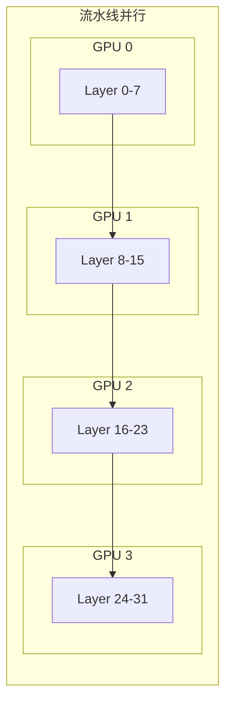
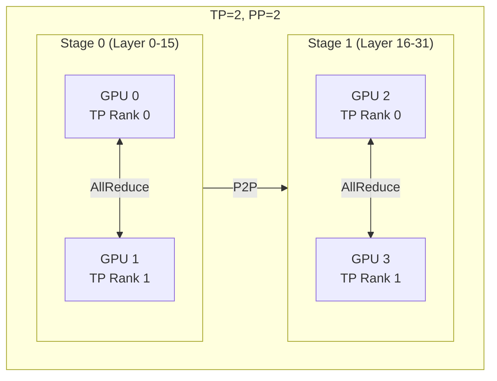

## 概述

### 本章学习目标
- 理解流水线并行的原理
- 掌握微批次调度策略
- 了解气泡优化技术
- 学习 TP+PP 组合使用

### 前置知识要求
- 了解张量并行
- 熟悉流水线概念
- 理解模型层结构

---

## 流水线并行原理

### 层间切分



**特点**：
- 每个 GPU 持有连续的若干层
- 前向传播顺序执行
- 需要传递激活值

### PP vs TP

| 特性 | TP | PP |
|------|----|----|
| 切分方式 | 层内 | 层间 |
| 通信模式 | AllReduce | Point-to-Point |
| 内存效率 | 需同步所有 GPU | 可流水线 |
| 适用规模 | 单机 | 跨机 |

---

## 气泡问题

### 朴素 PP

```mermaid
gantt
    title 朴素流水线（大量气泡）
    dateFormat X
    axisFormat %s

    section GPU 0
    Forward: f0, 0, 1
    Idle: idle0, 1, 4
    Backward: b0, 4, 5

    section GPU 1
    Idle: idle1a, 0, 1
    Forward: f1, 1, 2
    Idle: idle1b, 2, 4
    Backward: b1, 4, 5

    section GPU 2
    Idle: idle2a, 0, 2
    Forward: f2, 2, 3
    Idle: idle2b, 3, 4
    Backward: b2, 4, 5
```



**问题**：GPU 大量空闲等待。

### 微批次流水线

```mermaid
gantt
    title 微批次流水线（减少气泡）
    dateFormat X
    axisFormat %s

    section GPU 0
    F0: f0, 0, 1
    F1: f1, 1, 2
    F2: f2, 2, 3
    F3: f3, 3, 4

    section GPU 1
    Wait: w1, 0, 1
    F0: f0_1, 1, 2
    F1: f1_1, 2, 3
    F2: f2_1, 3, 4
    F3: f3_1, 4, 5

    section GPU 2
    Wait: w2, 0, 2
    F0: f0_2, 2, 3
    F1: f1_2, 3, 4
    F2: f2_2, 4, 5
    F3: f3_2, 5, 6
```



---

## SGLang 实现

### 配置

```bash
# PP=2
python -m sglang.launch_server \
    --model meta-llama/Llama-3.1-70B-Instruct \
    --pipeline-parallel-size 2

# TP=2, PP=2
python -m sglang.launch_server \
    --model meta-llama/Llama-3.1-70B-Instruct \
    --tensor-parallel-size 2 \
    --pipeline-parallel-size 2
```

### 初始化

```python
def init_pipeline_parallel(self):
    """初始化流水线并行"""
    # 创建 PP 通信组
    self.pp_group = create_pipeline_parallel_group(self.pp_size)

    # 计算本 rank 负责的层
    layers_per_rank = self.num_layers // self.pp_size
    self.layer_start = self.pp_rank * layers_per_rank
    self.layer_end = self.layer_start + layers_per_rank

    # 是否为首/尾 rank
    self.is_first_rank = (self.pp_rank == 0)
    self.is_last_rank = (self.pp_rank == self.pp_size - 1)
```

### 前向传播

```python
def forward_pp(self, input_ids, positions, forward_batch):
    """流水线并行前向"""
    if self.is_first_rank:
        # 首 rank：处理输入
        hidden = self.embed_tokens(input_ids)
    else:
        # 非首 rank：接收上一 rank 的激活
        hidden = recv_tensor(src=self.pp_rank - 1, group=self.pp_group)

    # 执行本 rank 的层
    for layer_idx in range(self.layer_start, self.layer_end):
        hidden = self.layers[layer_idx](hidden, positions, forward_batch)

    if self.is_last_rank:
        # 尾 rank：计算输出
        logits = self.lm_head(hidden)
        return logits
    else:
        # 非尾 rank：发送到下一 rank
        send_tensor(hidden, dst=self.pp_rank + 1, group=self.pp_group)
        return None
```

---

## 调度策略

### 1F1B (One Forward One Backward)

推理场景下，主要关注前向调度：

```mermaid
gantt
    title 1F1B 调度
    dateFormat X
    axisFormat %s

    section GPU 0
    B0-F: 0, 1
    B1-F: 1, 2
    B2-F: 2, 3
    B3-F: 3, 4

    section GPU 1
    Wait: 0, 1
    B0-F: 1, 2
    B1-F: 2, 3
    B2-F: 3, 4
    B3-F: 4, 5
```



### 微批次大小选择

```python
def get_optimal_microbatch_size(batch_size, pp_size):
    """计算最优微批次大小"""
    # 微批次数 >= PP size 可减少气泡
    num_microbatches = max(pp_size, batch_size // optimal_size)

    # 平衡通信和计算
    microbatch_size = batch_size // num_microbatches

    return microbatch_size
```

---

## 激活传递

### 通信实现

```python
def send_tensor(tensor, dst, group):
    """发送张量"""
    # 发送形状
    shape = torch.tensor(tensor.shape, device=tensor.device)
    dist.send(shape, dst=dst, group=group)

    # 发送数据
    dist.send(tensor.contiguous(), dst=dst, group=group)

def recv_tensor(src, group, dtype, device):
    """接收张量"""
    # 接收形状
    shape = torch.zeros(4, dtype=torch.long, device=device)
    dist.recv(shape, src=src, group=group)

    # 接收数据
    tensor = torch.zeros(*shape.tolist(), dtype=dtype, device=device)
    dist.recv(tensor, src=src, group=group)

    return tensor
```

### 异步通信

```python
async def forward_pp_async(self, batches):
    """异步流水线前向"""
    pending_recv = None
    pending_send = None

    for batch in batches:
        # 等待上一个接收
        if pending_recv:
            hidden = await pending_recv

        # 异步接收下一个
        if not self.is_first_rank:
            pending_recv = async_recv(src=self.pp_rank - 1)

        # 计算
        hidden = self.forward_layers(hidden)

        # 等待上一个发送
        if pending_send:
            await pending_send

        # 异步发送
        if not self.is_last_rank:
            pending_send = async_send(hidden, dst=self.pp_rank + 1)
```

---

## TP + PP 组合

### 混合并行



### 配置

```bash
# 4 GPU: TP=2, PP=2
# GPU 0,1 -> Stage 0
# GPU 2,3 -> Stage 1
python -m sglang.launch_server \
    --model meta-llama/Llama-3.1-70B-Instruct \
    --tensor-parallel-size 2 \
    --pipeline-parallel-size 2
```

---

## 性能分析

### 气泡比例

```
气泡比例 = (PP_Size - 1) / (PP_Size - 1 + Num_Microbatches)

例: PP=4, 微批次=8
气泡比例 = 3 / 11 ≈ 27%

例: PP=4, 微批次=16
气泡比例 = 3 / 19 ≈ 16%
```

### 内存占用

```
每 Stage 内存 = 模型内存 / PP_Size + 激活内存

激活内存 = 微批次数 × 激活大小
```

### 选择 PP Size

| 场景 | 推荐配置 |
|------|----------|
| 单机多卡 | 优先 TP |
| 跨机部署 | TP 机内, PP 跨机 |
| 超大模型 | TP + PP 组合 |

---

## 配置建议

### 模型配置示例

```bash
# 70B on 8 GPU
# TP=4 (NVLink 连接), PP=2
python -m sglang.launch_server \
    --model meta-llama/Llama-3.1-70B-Instruct \
    --tensor-parallel-size 4 \
    --pipeline-parallel-size 2

# 405B on 16 GPU (2 nodes)
# 每节点 TP=8, 跨节点 PP=2
python -m sglang.launch_server \
    --model meta-llama/Llama-3.1-405B-Instruct \
    --tensor-parallel-size 8 \
    --pipeline-parallel-size 2
```

---

## 小结

### 要点回顾

1. **原理**：层间切分，顺序执行
2. **气泡**：微批次流水线减少空闲
3. **通信**：Point-to-Point 传递激活
4. **组合**：TP 机内，PP 跨机

### 对比

| 特性 | TP | PP |
|------|----|----|
| 通信开销 | 高（AllReduce） | 低（P2P） |
| 气泡 | 无 | 有（可优化） |
| 扩展性 | 受限于 NVLink | 可跨机 |

### 下一章预告

在下一章《专家并行》中，我们将：
- 了解 MoE 模型结构
- 学习专家并行原理
- 掌握负载均衡
