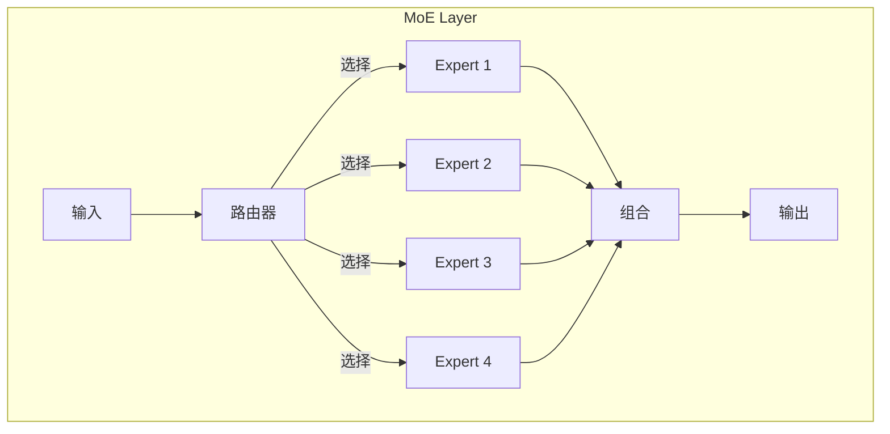
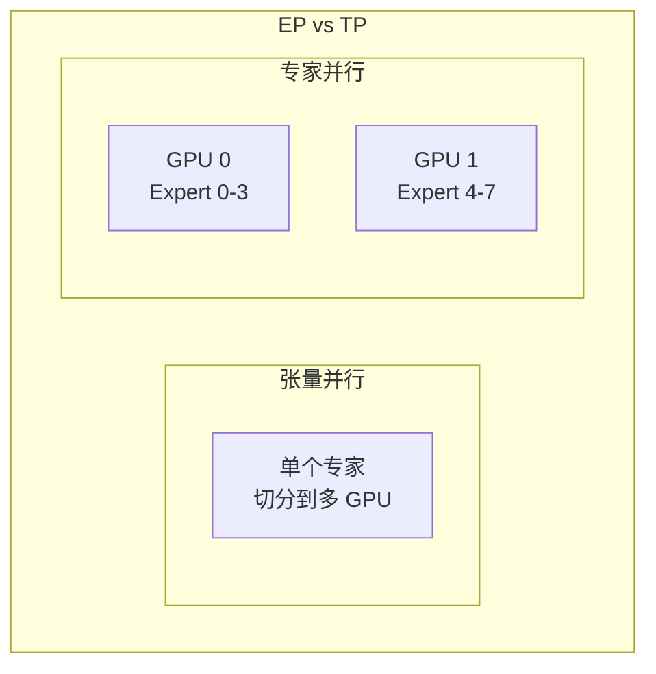
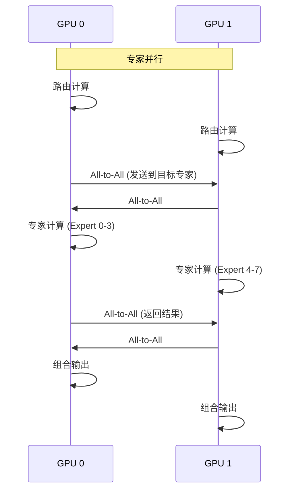
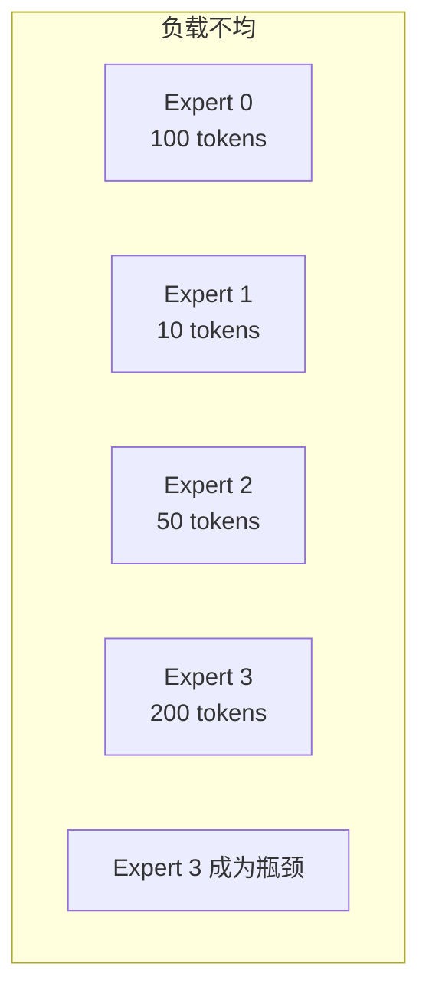
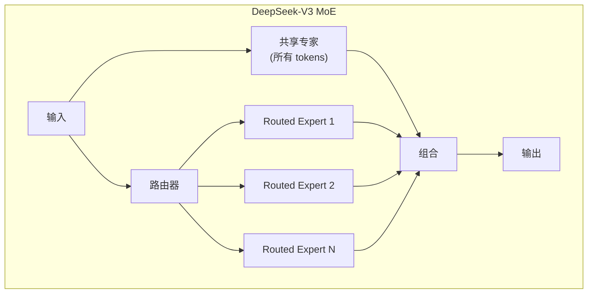

## 概述

### 本章学习目标
- 理解 MoE 模型和专家并行
- 掌握 SGLang 的 EP 实现
- 了解负载均衡策略
- 学习 DeepSeek 优化

### 前置知识要求
- 了解 MoE 架构
- 熟悉张量并行
- 理解路由机制

---

## MoE 基础

### 混合专家模型



### 路由机制

```python
def top_k_routing(hidden, router_weights, k=2):
    """Top-K 路由"""
    # 计算路由得分
    scores = hidden @ router_weights  # [batch, num_experts]

    # 选择 Top-K 专家
    top_k_scores, top_k_indices = scores.topk(k, dim=-1)

    # 归一化权重
    weights = F.softmax(top_k_scores, dim=-1)

    return top_k_indices, weights
```

---

## 专家并行原理

### EP vs TP



| 特性 | TP | EP |
|------|----|----|
| 切分对象 | 专家内部 | 专家之间 |
| 通信模式 | AllReduce | All-to-All |
| 负载均衡 | 自动 | 需要优化 |

### EP 数据流



---

## SGLang 实现

### 配置

```bash
# 启用专家并行
python -m sglang.launch_server \
    --model deepseek-ai/DeepSeek-V3 \
    --tensor-parallel-size 8 \
    --moe-ep-size 8
```

### 初始化

```python
def init_expert_parallel(self):
    """初始化专家并行"""
    # 创建 EP 通信组
    self.ep_group = create_expert_parallel_group(self.ep_size)

    # 计算本 rank 负责的专家
    experts_per_rank = self.num_experts // self.ep_size
    self.expert_start = self.ep_rank * experts_per_rank
    self.expert_end = self.expert_start + experts_per_rank

    # 本地专家
    self.local_experts = nn.ModuleList([
        Expert(hidden_size, intermediate_size)
        for _ in range(experts_per_rank)
    ])
```

### 前向计算

```python
def moe_forward_ep(self, hidden, router_logits):
    """专家并行 MoE 前向"""
    batch_size = hidden.size(0)

    # 1. 路由计算
    top_k_indices, top_k_weights = self.router(router_logits)

    # 2. All-to-All 分发
    # 收集每个专家需要处理的 tokens
    send_counts = compute_send_counts(top_k_indices, self.num_experts)
    recv_counts = all_to_all_counts(send_counts, self.ep_group)

    # 发送 tokens 到对应专家所在的 GPU
    dispatched = all_to_all(hidden, send_counts, recv_counts, self.ep_group)

    # 3. 本地专家计算
    expert_outputs = []
    for i, expert in enumerate(self.local_experts):
        expert_idx = self.expert_start + i
        expert_input = dispatched[expert_idx]
        expert_outputs.append(expert(expert_input))

    # 4. All-to-All 收集
    combined = all_to_all(
        torch.cat(expert_outputs),
        recv_counts, send_counts, self.ep_group
    )

    # 5. 加权组合
    output = combine_outputs(combined, top_k_weights)

    return output
```

---

## 负载均衡

### 负载不均问题



### 均衡策略

**1. 辅助损失**

```python
def load_balancing_loss(router_logits, top_k_indices, num_experts):
    """负载均衡辅助损失"""
    # 计算每个专家的使用频率
    expert_counts = torch.bincount(
        top_k_indices.flatten(),
        minlength=num_experts
    ).float()

    # 目标：均匀分布
    target = expert_counts.sum() / num_experts

    # L2 损失
    loss = ((expert_counts - target) ** 2).mean()

    return loss
```

**2. 专家容量限制**

```python
def capacity_limited_routing(hidden, router_weights, k=2, capacity_factor=1.25):
    """带容量限制的路由"""
    batch_size = hidden.size(0)
    num_experts = router_weights.size(1)

    # 每个专家的容量
    capacity = int(capacity_factor * batch_size * k / num_experts)

    # 路由并限制容量
    top_k_indices, top_k_weights = top_k_routing(hidden, router_weights, k)

    # 超出容量的 tokens 被丢弃或重路由
    expert_counts = torch.zeros(num_experts)
    for token_idx, experts in enumerate(top_k_indices):
        for expert in experts:
            if expert_counts[expert] < capacity:
                # 接受
                expert_counts[expert] += 1
            else:
                # 丢弃或重路由
                pass

    return top_k_indices, top_k_weights
```

---

## DeepSeek 优化

### DeepSeek-V3 架构



### 优化特性

**1. 共享专家**

```python
class DeepSeekMoE(nn.Module):
    def __init__(self, config):
        # 共享专家（所有 tokens 都经过）
        self.shared_experts = nn.ModuleList([
            Expert(config) for _ in range(config.num_shared_experts)
        ])

        # 路由专家
        self.routed_experts = nn.ModuleList([
            Expert(config) for _ in range(config.num_routed_experts)
        ])

    def forward(self, hidden):
        # 共享专家输出
        shared_out = sum(e(hidden) for e in self.shared_experts)

        # 路由专家输出
        routed_out = self.moe_routing(hidden)

        return shared_out + routed_out
```

**2. 细粒度专家**

```python
# DeepSeek 使用更多小专家
# 256 个专家，每次激活 8 个
config = {
    "num_experts": 256,
    "top_k": 8,
    "expert_intermediate_size": 1408,  # 较小
}
```

---

## 配置建议

### EP 配置

```bash
# DeepSeek-V3
python -m sglang.launch_server \
    --model deepseek-ai/DeepSeek-V3 \
    --tensor-parallel-size 8 \
    --moe-ep-size 8 \
    --enable-ep-moe
```

### TP + EP 组合

```bash
# 16 GPU 配置
# TP=8 (机内), EP=2 (跨机)
python -m sglang.launch_server \
    --model deepseek-ai/DeepSeek-V3 \
    --tensor-parallel-size 8 \
    --moe-ep-size 2
```

---

## 性能分析

### 通信开销

```
All-to-All 通信量:
- 每层: 2 * batch_size * seq_len * hidden_size * dtype_size
- 例: 2 * 32 * 2048 * 7168 * 2 ≈ 1.8GB

优化: DeepEP 减少通信
```

### 扩展效率

| EP Size | 专家数 | 通信 | 效率 |
|---------|--------|------|------|
| 1 | 全部本地 | 无 | 100% |
| 2 | 各一半 | 2x A2A | ~90% |
| 8 | 各 1/8 | 8x A2A | ~75% |

---

## 小结

### 要点回顾

1. **MoE**：稀疏激活，扩展参数量
2. **EP**：专家分布到不同 GPU
3. **通信**：All-to-All 分发和收集
4. **均衡**：辅助损失 + 容量限制

### 对比

| 特性 | TP | EP |
|------|----|----|
| 模型类型 | 稠密 | MoE |
| 通信 | AllReduce | All-to-All |
| 均衡 | 自动 | 需优化 |

### 下一章预告

在模块七《高级特性篇》中，我们将：
- 了解结构化输出
- 学习 LoRA 支持
- 掌握多模态推理
