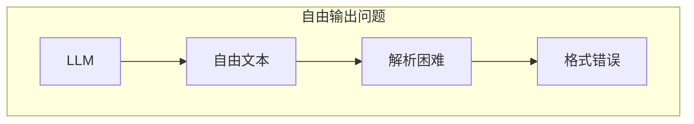
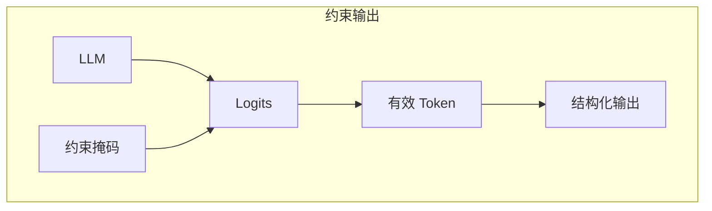
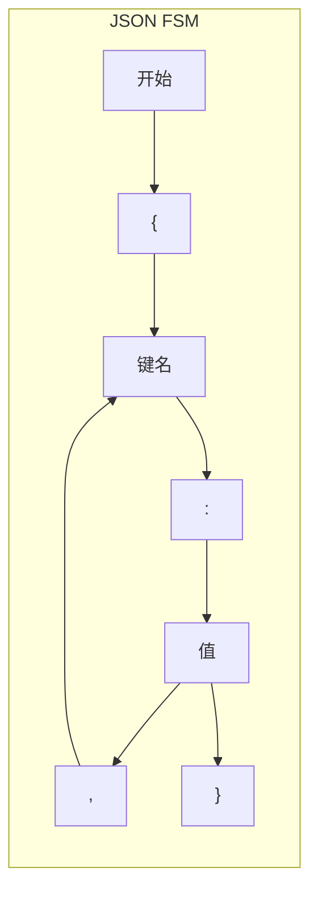

## 概述

### 本章学习目标
- 理解结构化输出的原理
- 掌握 JSON Schema 约束
- 了解正则表达式约束
- 学习语法约束实现

### 前置知识要求
- 了解 JSON Schema
- 熟悉正则表达式
- 理解 LLM 采样

---

## 结构化输出原理

### 为什么需要结构化输出



**问题**：
- 输出格式不可控
- 难以程序化处理
- 解析可能失败

### 约束生成



**原理**：在采样时只允许符合约束的 token。

---

## JSON Schema 约束

### 基本用法

```python
import sglang as sgl

# 定义 JSON Schema
schema = {
    "type": "object",
    "properties": {
        "name": {"type": "string"},
        "age": {"type": "integer"},
        "email": {"type": "string", "format": "email"}
    },
    "required": ["name", "age"]
}

# 使用约束生成
response = client.chat.completions.create(
    model="meta-llama/Llama-3.1-8B-Instruct",
    messages=[
        {"role": "user", "content": "Generate user info for John"}
    ],
    response_format={
        "type": "json_schema",
        "json_schema": {
            "name": "user_info",
            "schema": schema
        }
    }
)

# 输出保证符合 schema
# {"name": "John", "age": 30, "email": "john@example.com"}
```

### 复杂 Schema

```python
schema = {
    "type": "object",
    "properties": {
        "users": {
            "type": "array",
            "items": {
                "type": "object",
                "properties": {
                    "id": {"type": "integer"},
                    "name": {"type": "string"},
                    "roles": {
                        "type": "array",
                        "items": {"type": "string"}
                    }
                }
            }
        },
        "total": {"type": "integer"}
    }
}
```

---

## 正则表达式约束

### 基本用法

```python
# 电话号码格式
response = client.chat.completions.create(
    model="meta-llama/Llama-3.1-8B-Instruct",
    messages=[
        {"role": "user", "content": "Generate a US phone number"}
    ],
    response_format={
        "type": "regex",
        "regex": r"\d{3}-\d{3}-\d{4}"
    }
)

# 输出: "555-123-4567"
```

### 复杂模式

```python
# 日期格式
date_regex = r"\d{4}-\d{2}-\d{2}"

# 邮箱格式
email_regex = r"[a-zA-Z0-9._%+-]+@[a-zA-Z0-9.-]+\.[a-zA-Z]{2,}"

# 代码函数
function_regex = r"def [a-z_]+\([^)]*\):\n    .*"
```

---

## 实现机制

### 有限状态机 (FSM)



### Token 掩码计算

```python
class JSONConstraint:
    def __init__(self, schema, tokenizer):
        self.schema = schema
        self.tokenizer = tokenizer
        self.fsm = build_fsm_from_schema(schema)

    def get_valid_tokens(self, state):
        """获取当前状态下的有效 token"""
        valid_chars = self.fsm.get_valid_chars(state)

        valid_tokens = []
        for token_id in range(self.tokenizer.vocab_size):
            token = self.tokenizer.decode([token_id])
            if self._can_produce(token, valid_chars):
                valid_tokens.append(token_id)

        return valid_tokens

    def apply_mask(self, logits, state):
        """应用约束掩码"""
        valid_tokens = self.get_valid_tokens(state)
        mask = torch.full_like(logits, float('-inf'))
        mask[valid_tokens] = 0
        return logits + mask
```

### SGLang 实现

```python
# sglang/srt/sampling/grammar.py

class GrammarSampler:
    def __init__(self, grammar, tokenizer):
        self.grammar = grammar
        self.tokenizer = tokenizer
        self.state = grammar.initial_state()

    def sample(self, logits):
        """约束采样"""
        # 获取有效 token
        valid_mask = self.grammar.get_valid_mask(self.state)

        # 应用掩码
        masked_logits = logits.masked_fill(~valid_mask, float('-inf'))

        # 采样
        token = sample_from_logits(masked_logits)

        # 更新状态
        self.state = self.grammar.advance(self.state, token)

        return token
```

---

## 性能优化

### 预编译约束

```python
# 预编译 JSON Schema 到 FSM
compiled_schema = compile_json_schema(schema, tokenizer)

# 复用编译结果
for request in requests:
    constraint = compiled_schema.create_instance()
    # ...
```

### 批量掩码计算

```python
def batch_get_valid_masks(constraints, states):
    """批量计算约束掩码"""
    batch_size = len(constraints)
    vocab_size = constraints[0].tokenizer.vocab_size

    masks = torch.zeros(batch_size, vocab_size, dtype=torch.bool)

    for i, (constraint, state) in enumerate(zip(constraints, states)):
        valid_tokens = constraint.get_valid_tokens(state)
        masks[i, valid_tokens] = True

    return masks
```

### 增量解析

```python
class IncrementalJSONParser:
    """增量 JSON 解析器"""

    def __init__(self, schema):
        self.schema = schema
        self.partial_json = ""
        self.stack = []

    def feed(self, token):
        """增量处理 token"""
        self.partial_json += token

        # 更新解析状态
        self._update_state()

    def get_valid_continuations(self):
        """获取有效的后续字符"""
        # 基于当前状态计算
        pass
```

---

## 配置与使用

### 启动参数

```bash
# 启用语法约束
python -m sglang.launch_server \
    --model meta-llama/Llama-3.1-8B-Instruct \
    --enable-grammar
```

### API 调用

```python
# OpenAI 兼容 API
response = client.chat.completions.create(
    model="meta-llama/Llama-3.1-8B-Instruct",
    messages=[...],
    response_format={
        "type": "json_schema",
        "json_schema": {
            "name": "output",
            "schema": schema
        }
    }
)

# 原生 API
response = requests.post(
    "http://localhost:30000/generate",
    json={
        "text": "Generate user info",
        "sampling_params": {
            "json_schema": schema
        }
    }
)
```

---

## 高级特性

### 嵌套约束

```python
# 数组中的对象
schema = {
    "type": "array",
    "items": {
        "type": "object",
        "properties": {
            "step": {"type": "integer"},
            "action": {"type": "string"}
        }
    },
    "minItems": 3,
    "maxItems": 10
}
```

### 条件约束

```python
# 条件 Schema
schema = {
    "type": "object",
    "properties": {
        "type": {"enum": ["person", "company"]},
        "name": {"type": "string"}
    },
    "if": {
        "properties": {"type": {"const": "person"}}
    },
    "then": {
        "properties": {"age": {"type": "integer"}}
    },
    "else": {
        "properties": {"employees": {"type": "integer"}}
    }
}
```

### 选择约束

```python
# 枚举类型
schema = {
    "type": "object",
    "properties": {
        "status": {
            "enum": ["pending", "approved", "rejected"]
        },
        "priority": {
            "enum": [1, 2, 3, 4, 5]
        }
    }
}
```

---

## 常见问题

### 1. 生成很慢

```python
# 问题：每步都计算掩码
# 解决：预编译 + 缓存
compiled = precompile_schema(schema)
cached_masks = compile_token_masks(compiled, tokenizer)
```

### 2. 格式不正确

```python
# 问题：Schema 定义有误
# 解决：验证 Schema
from jsonschema import validate, Draft7Validator
Draft7Validator.check_schema(schema)
```

### 3. 无法生成

```python
# 问题：约束太严格，无有效 token
# 解决：放宽约束或调整 Schema
```

---

## 小结

### 要点回顾

1. **原理**：FSM + Token 掩码
2. **类型**：JSON Schema、正则表达式
3. **优化**：预编译、批量计算、增量解析
4. **使用**：response_format 参数

### 支持的约束

| 类型 | 说明 |
|------|------|
| json_schema | JSON 结构约束 |
| regex | 正则表达式约束 |
| choice | 选择约束 |

### 下一章预告

在下一章《LoRA 支持》中，我们将：
- 了解 LoRA 原理
- 学习多适配器加载
- 掌握动态切换
