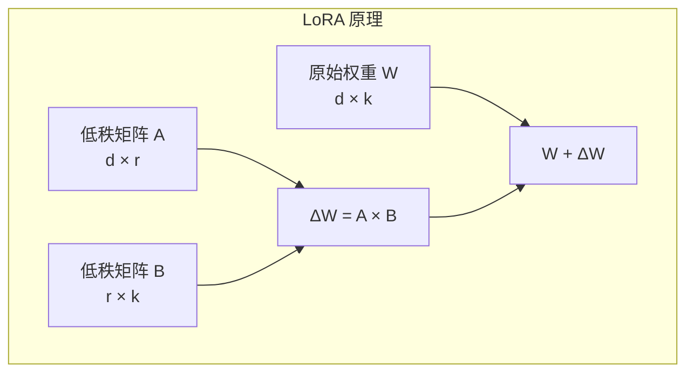
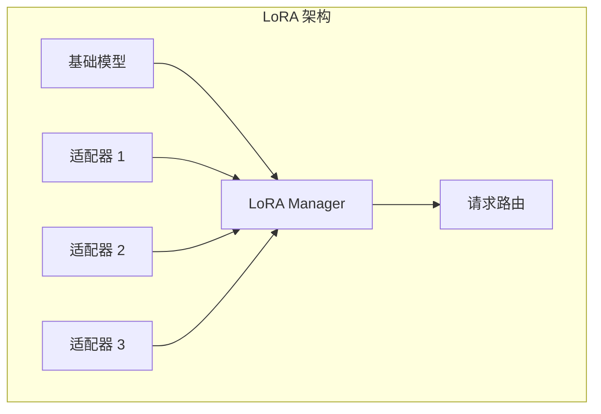
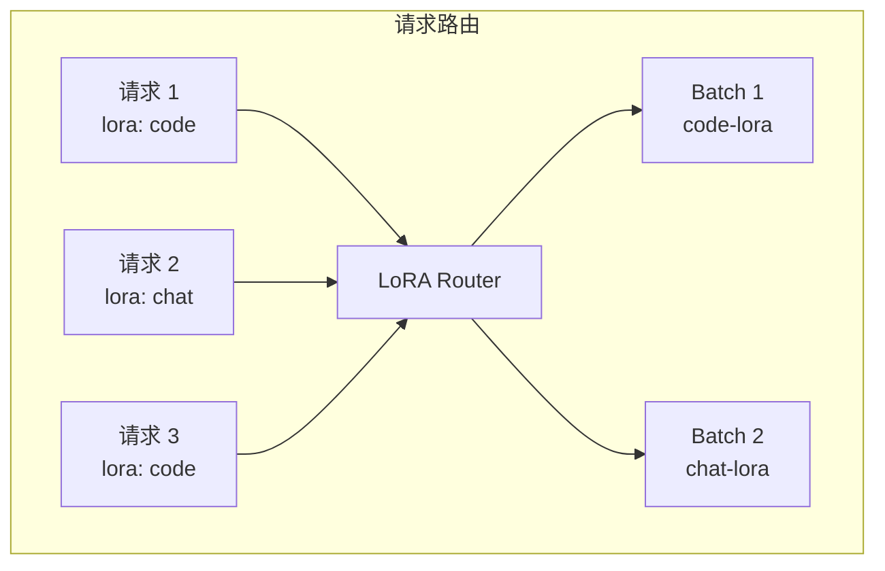
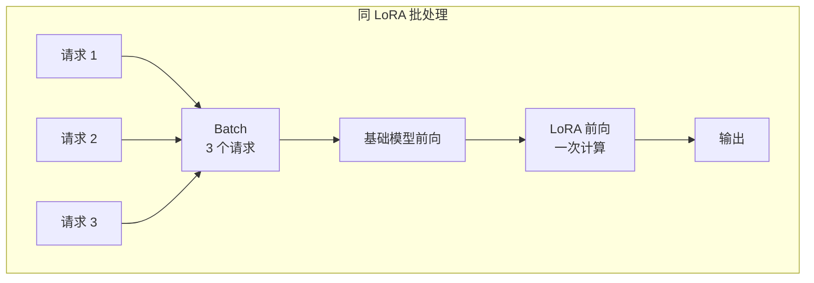
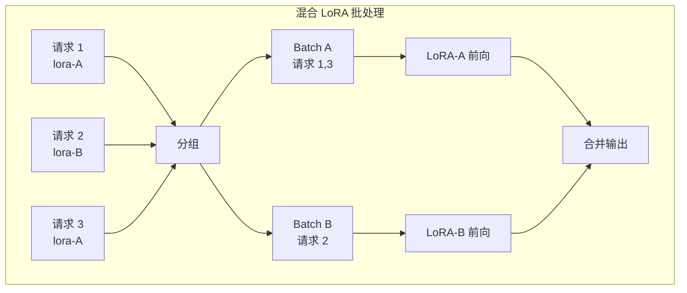
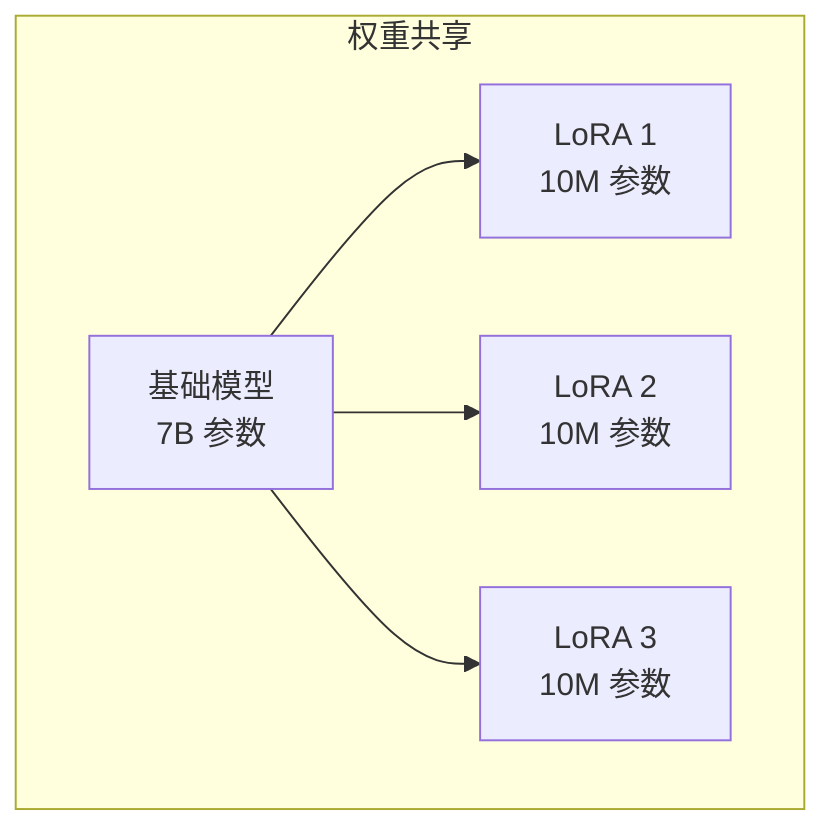

## 概述

### 本章学习目标
- 理解 LoRA 原理和优势
- 掌握多适配器加载机制
- 了解动态切换实现
- 学习批量推理优化

### 前置知识要求
- 了解 Transformer 架构
- 熟悉模型微调概念
- 理解矩阵分解

---

## LoRA 原理

### 什么是 LoRA

LoRA (Low-Rank Adaptation) 是一种高效的模型微调方法：



**核心思想**：
- 冻结原始权重 W
- 训练低秩矩阵 A、B (r << min(d, k))
- 推理时：output = Wx + BAx

### 参数效率

```
原始模型: 7B 参数
LoRA (r=16): ~10M 参数 (0.14%)
LoRA (r=64): ~40M 参数 (0.57%)
```

---

## SGLang LoRA 支持

### 架构设计



### 配置启动

```bash
# 单个 LoRA 适配器
python -m sglang.launch_server \
    --model meta-llama/Llama-3.1-8B-Instruct \
    --lora-paths my-lora=/path/to/lora

# 多个 LoRA 适配器
python -m sglang.launch_server \
    --model meta-llama/Llama-3.1-8B-Instruct \
    --lora-paths \
        code-lora=/path/to/code-lora \
        chat-lora=/path/to/chat-lora \
        math-lora=/path/to/math-lora \
    --max-loras-per-batch 4
```

---

## 多适配器管理

### LoRA Manager

```python
class LoRAManager:
    def __init__(self, base_model, max_loras):
        self.base_model = base_model
        self.max_loras = max_loras

        # 已加载的适配器
        self.loaded_loras: Dict[str, LoRAAdapter] = {}

        # LRU 缓存管理
        self.lru_cache = LRUCache(max_loras)

    def load_lora(self, name: str, path: str):
        """加载 LoRA 适配器"""
        if name in self.loaded_loras:
            return self.loaded_loras[name]

        # 检查容量
        if len(self.loaded_loras) >= self.max_loras:
            self._evict_lora()

        # 加载权重
        adapter = LoRAAdapter.from_path(path)
        self.loaded_loras[name] = adapter
        self.lru_cache.put(name)

        return adapter

    def _evict_lora(self):
        """淘汰最久未使用的适配器"""
        lru_name = self.lru_cache.pop_lru()
        del self.loaded_loras[lru_name]
```

### LoRA 适配器结构

```python
@dataclass
class LoRAAdapter:
    name: str
    rank: int
    alpha: float

    # 各层的 A、B 矩阵
    lora_A: Dict[str, torch.Tensor]  # layer_name -> (d, r)
    lora_B: Dict[str, torch.Tensor]  # layer_name -> (r, k)

    @classmethod
    def from_path(cls, path: str):
        """从路径加载"""
        config = load_json(f"{path}/adapter_config.json")
        weights = load_safetensors(f"{path}/adapter_model.safetensors")

        lora_A = {}
        lora_B = {}
        for key, value in weights.items():
            if "lora_A" in key:
                layer_name = key.replace(".lora_A.weight", "")
                lora_A[layer_name] = value
            elif "lora_B" in key:
                layer_name = key.replace(".lora_B.weight", "")
                lora_B[layer_name] = value

        return cls(
            name=config["name"],
            rank=config["r"],
            alpha=config["lora_alpha"],
            lora_A=lora_A,
            lora_B=lora_B,
        )
```

---

## 动态切换机制

### 请求级别路由



### API 调用

```python
# 指定 LoRA 适配器
response = client.chat.completions.create(
    model="code-lora",  # 使用 LoRA 名称
    messages=[
        {"role": "user", "content": "Write a Python function"}
    ]
)

# 或使用原生 API
response = requests.post(
    "http://localhost:30000/generate",
    json={
        "text": "Write a Python function",
        "sampling_params": {
            "lora_path": "code-lora"
        }
    }
)
```

---

## 批量推理优化

### 同 LoRA 批处理



```python
def forward_with_lora(self, x, lora_adapter):
    """带 LoRA 的前向计算"""
    # 基础模型计算
    base_output = self.base_layer(x)

    # LoRA 计算
    scaling = lora_adapter.alpha / lora_adapter.rank
    lora_output = (x @ lora_adapter.lora_A.T @ lora_adapter.lora_B.T) * scaling

    return base_output + lora_output
```

### 混合 LoRA 批处理



### SGMV 内核优化

```python
# Segmented Gather Matrix-Vector multiplication
# 高效处理多 LoRA 批量计算

def sgmv_forward(
    x: torch.Tensor,           # (total_tokens, hidden_size)
    lora_A_weights: List[torch.Tensor],  # 多个 LoRA A 矩阵
    lora_B_weights: List[torch.Tensor],  # 多个 LoRA B 矩阵
    seg_indices: torch.Tensor,  # 分段索引
):
    """SGMV 内核：高效多 LoRA 计算"""
    # 使用 Triton 实现的高效内核
    # 避免多次内核启动开销
    return triton_sgmv_kernel(
        x, lora_A_weights, lora_B_weights, seg_indices
    )
```

---

## 内存优化

### 权重共享



**内存占用**：
```
基础模型: 14 GB (FP16)
每个 LoRA: ~20 MB
10 个 LoRA: 14 GB + 200 MB = 14.2 GB
```

### 动态加载策略

```python
class DynamicLoRALoader:
    def __init__(self, max_loaded=4, max_cached=16):
        self.max_loaded = max_loaded  # GPU 上最多加载数
        self.max_cached = max_cached  # CPU 缓存数

        self.gpu_loras = {}  # GPU 上的适配器
        self.cpu_cache = {}  # CPU 缓存

    def get_lora(self, name: str):
        """获取 LoRA，必要时加载"""
        if name in self.gpu_loras:
            return self.gpu_loras[name]

        if name in self.cpu_cache:
            # 从 CPU 移动到 GPU
            return self._move_to_gpu(name)

        # 从磁盘加载
        return self._load_from_disk(name)

    def _move_to_gpu(self, name):
        """CPU -> GPU"""
        if len(self.gpu_loras) >= self.max_loaded:
            self._evict_from_gpu()

        lora = self.cpu_cache[name].to("cuda")
        self.gpu_loras[name] = lora
        return lora
```

---

## 配置参数

### 启动参数

| 参数 | 说明 | 默认值 |
|------|------|--------|
| `--lora-paths` | LoRA 路径映射 | 无 |
| `--max-loras-per-batch` | 批次内最大 LoRA 数 | 4 |
| `--max-num-batched-tokens` | 最大批处理 tokens | 8192 |

### 推理参数

```python
# 采样参数中指定 LoRA
sampling_params = {
    "temperature": 0.7,
    "max_tokens": 512,
    "lora_path": "my-lora-name"  # 指定使用的 LoRA
}
```

---

## 使用示例

### 代码生成场景

```python
import openai

client = openai.Client(base_url="http://localhost:30000/v1")

# 使用代码 LoRA
code_response = client.chat.completions.create(
    model="code-lora",
    messages=[
        {"role": "user", "content": "实现快速排序算法"}
    ]
)

# 使用数学 LoRA
math_response = client.chat.completions.create(
    model="math-lora",
    messages=[
        {"role": "user", "content": "证明勾股定理"}
    ]
)
```

### 多任务推理

```python
import asyncio

async def multi_lora_inference(requests):
    """多 LoRA 并发推理"""
    tasks = []
    for req in requests:
        task = client.chat.completions.create(
            model=req["lora"],
            messages=req["messages"]
        )
        tasks.append(task)

    results = await asyncio.gather(*tasks)
    return results

# 请求列表
requests = [
    {"lora": "code-lora", "messages": [...]},
    {"lora": "chat-lora", "messages": [...]},
    {"lora": "code-lora", "messages": [...]},
]

results = asyncio.run(multi_lora_inference(requests))
```

---

## 性能考虑

### 吞吐量影响

| 场景 | 相对吞吐量 |
|------|-----------|
| 无 LoRA | 100% |
| 单 LoRA | 95-98% |
| 多 LoRA (同批次) | 85-95% |
| 频繁切换 | 70-85% |

### 优化建议

1. **批量分组**：相同 LoRA 的请求尽量一起处理
2. **预加载**：提前加载常用的 LoRA
3. **限制数量**：控制同时加载的 LoRA 数量
4. **使用 SGMV**：启用高效的多 LoRA 内核

---

## 常见问题

### 1. LoRA 不生效

```python
# 检查 LoRA 是否加载
curl http://localhost:30000/v1/models

# 确认使用正确的模型名
# 模型名应为 --lora-paths 中指定的名称
```

### 2. 内存不足

```bash
# 减少同时加载的 LoRA 数
python -m sglang.launch_server \
    --model meta-llama/Llama-3.1-8B-Instruct \
    --lora-paths my-lora=/path/to/lora \
    --max-loras-per-batch 2  # 减少数量
```

### 3. 性能下降

```python
# 检查是否频繁切换
# 优化请求分组
# 考虑使用 LoRA 合并
```

---

## 小结

### 要点回顾

1. **原理**：低秩分解，高效微调
2. **多适配器**：LRU 管理，动态加载
3. **批处理**：SGMV 内核优化
4. **内存**：权重共享，按需加载

### 支持特性

| 特性 | 支持情况 |
|------|---------|
| 多适配器 | 支持 |
| 动态切换 | 支持 |
| 批量推理 | 支持 |
| SGMV 优化 | 支持 |

### 下一章预告

在下一章《多模态支持》中，我们将：
- 了解 VLM 推理架构
- 学习图像处理流程
- 掌握视频理解实现

