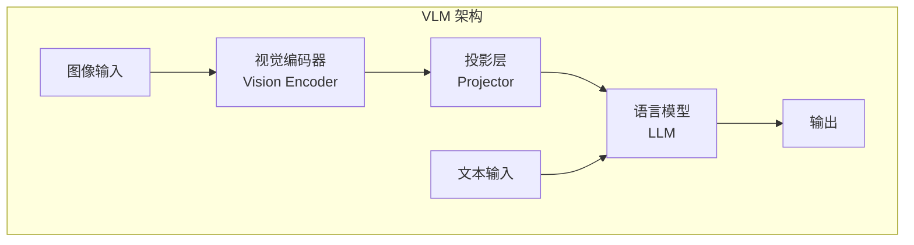
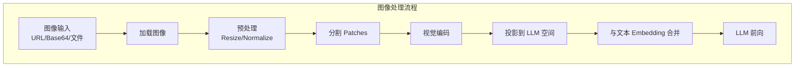
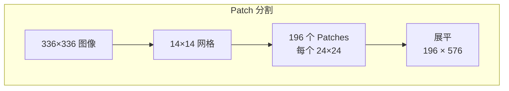
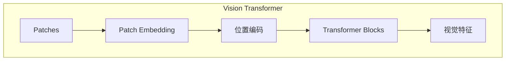
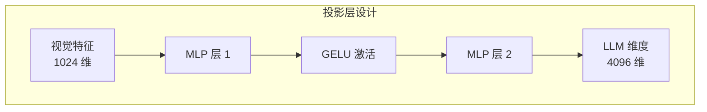
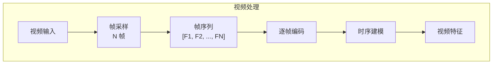
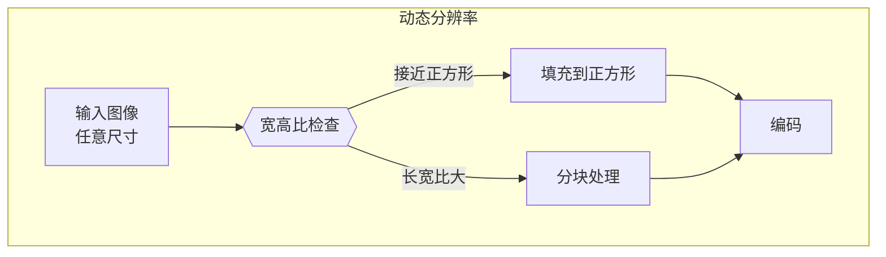

## 概述

### 本章学习目标
- 理解 VLM 推理架构
- 掌握图像处理流程
- 了解视频理解实现
- 学习多模态优化

### 前置知识要求
- 了解 Vision Transformer
- 熟悉图像编码概念
- 理解多模态融合

---

## 多模态架构

### VLM 基本结构



### 支持的模型

| 模型 | 视觉编码器 | 支持格式 |
|------|-----------|---------|
| LLaVA | CLIP ViT | 图像 |
| Qwen2-VL | ViT | 图像/视频 |
| InternVL | InternViT | 图像/视频 |
| Pixtral | 自定义 ViT | 图像 |
| MiniCPM-V | SigLip | 图像/视频 |

---

## 图像处理流程

### 完整流程



### 图像加载

```python
class ImageProcessor:
    def __init__(self, config):
        self.image_size = config.image_size
        self.patch_size = config.patch_size
        self.mean = config.image_mean
        self.std = config.image_std

    def load_image(self, image_input):
        """加载图像"""
        if isinstance(image_input, str):
            if image_input.startswith("http"):
                # URL 加载
                response = requests.get(image_input)
                image = Image.open(BytesIO(response.content))
            elif image_input.startswith("data:image"):
                # Base64 解码
                data = image_input.split(",")[1]
                image = Image.open(BytesIO(base64.b64decode(data)))
            else:
                # 文件路径
                image = Image.open(image_input)
        else:
            image = image_input

        return image.convert("RGB")

    def preprocess(self, image):
        """预处理"""
        # Resize
        image = image.resize((self.image_size, self.image_size))

        # 转换为 tensor
        tensor = torch.from_numpy(np.array(image)).float()
        tensor = tensor.permute(2, 0, 1)  # HWC -> CHW

        # 归一化
        tensor = (tensor / 255.0 - self.mean) / self.std

        return tensor
```

### Patch 分割



```python
def create_patches(self, image_tensor):
    """创建图像 patches"""
    # image_tensor: (C, H, W)
    C, H, W = image_tensor.shape
    P = self.patch_size

    # 分割成 patches
    patches = image_tensor.unfold(1, P, P).unfold(2, P, P)
    # (C, H/P, W/P, P, P)

    # 重排
    patches = patches.permute(1, 2, 0, 3, 4).contiguous()
    # (H/P, W/P, C, P, P)

    num_patches = (H // P) * (W // P)
    patch_dim = C * P * P

    patches = patches.view(num_patches, patch_dim)
    return patches
```

---

## 视觉编码

### Vision Transformer



### 编码实现

```python
class VisionEncoder(nn.Module):
    def __init__(self, config):
        super().__init__()
        self.patch_embed = nn.Linear(
            config.patch_dim,
            config.hidden_size
        )
        self.pos_embed = nn.Parameter(
            torch.zeros(1, config.num_patches + 1, config.hidden_size)
        )
        self.cls_token = nn.Parameter(
            torch.zeros(1, 1, config.hidden_size)
        )
        self.blocks = nn.ModuleList([
            TransformerBlock(config)
            for _ in range(config.num_layers)
        ])

    def forward(self, patches):
        # patches: (B, N, patch_dim)
        B = patches.shape[0]

        # Patch embedding
        x = self.patch_embed(patches)  # (B, N, hidden_size)

        # 添加 CLS token
        cls_tokens = self.cls_token.expand(B, -1, -1)
        x = torch.cat([cls_tokens, x], dim=1)

        # 添加位置编码
        x = x + self.pos_embed

        # Transformer blocks
        for block in self.blocks:
            x = block(x)

        return x  # (B, N+1, hidden_size)
```

---

## 多模态融合

### 投影层



```python
class MultiModalProjector(nn.Module):
    def __init__(self, vision_dim, llm_dim):
        super().__init__()
        self.projector = nn.Sequential(
            nn.Linear(vision_dim, llm_dim),
            nn.GELU(),
            nn.Linear(llm_dim, llm_dim)
        )

    def forward(self, vision_features):
        return self.projector(vision_features)
```

### Embedding 合并

```python
def merge_embeddings(
    self,
    input_ids,
    image_features,
    image_positions
):
    """合并文本和图像 embedding"""
    # 获取文本 embedding
    text_embeds = self.embed_tokens(input_ids)

    # 在指定位置插入图像特征
    for batch_idx, (img_feat, positions) in enumerate(
        zip(image_features, image_positions)
    ):
        for pos, feat in zip(positions, img_feat):
            # 替换 <image> token 位置
            text_embeds[batch_idx, pos:pos+len(feat)] = feat

    return text_embeds
```

---

## 视频处理

### 帧采样



### 视频处理实现

```python
class VideoProcessor:
    def __init__(self, config):
        self.num_frames = config.num_frames
        self.image_processor = ImageProcessor(config)

    def sample_frames(self, video_path):
        """均匀采样帧"""
        import cv2

        cap = cv2.VideoCapture(video_path)
        total_frames = int(cap.get(cv2.CAP_PROP_FRAME_COUNT))

        # 均匀采样
        indices = np.linspace(0, total_frames - 1, self.num_frames, dtype=int)

        frames = []
        for idx in indices:
            cap.set(cv2.CAP_PROP_POS_FRAMES, idx)
            ret, frame = cap.read()
            if ret:
                frame = cv2.cvtColor(frame, cv2.COLOR_BGR2RGB)
                frames.append(Image.fromarray(frame))

        cap.release()
        return frames

    def process_video(self, video_path):
        """处理视频"""
        frames = self.sample_frames(video_path)

        # 处理每一帧
        processed = []
        for frame in frames:
            tensor = self.image_processor.preprocess(frame)
            processed.append(tensor)

        return torch.stack(processed)  # (num_frames, C, H, W)
```

---

## API 使用

### 图像理解

```python
import openai

client = openai.Client(base_url="http://localhost:30000/v1")

# 使用 URL
response = client.chat.completions.create(
    model="Qwen/Qwen2-VL-7B-Instruct",
    messages=[
        {
            "role": "user",
            "content": [
                {
                    "type": "image_url",
                    "image_url": {"url": "https://example.com/image.jpg"}
                },
                {
                    "type": "text",
                    "text": "描述这张图片的内容"
                }
            ]
        }
    ]
)

# 使用 Base64
import base64

with open("image.jpg", "rb") as f:
    image_data = base64.b64encode(f.read()).decode()

response = client.chat.completions.create(
    model="Qwen/Qwen2-VL-7B-Instruct",
    messages=[
        {
            "role": "user",
            "content": [
                {
                    "type": "image_url",
                    "image_url": {
                        "url": f"data:image/jpeg;base64,{image_data}"
                    }
                },
                {"type": "text", "text": "这是什么?"}
            ]
        }
    ]
)
```

### 视频理解

```python
# 视频输入
response = client.chat.completions.create(
    model="Qwen/Qwen2-VL-7B-Instruct",
    messages=[
        {
            "role": "user",
            "content": [
                {
                    "type": "video_url",
                    "video_url": {"url": "https://example.com/video.mp4"}
                },
                {"type": "text", "text": "总结这个视频的内容"}
            ]
        }
    ]
)
```

### 多图输入

```python
response = client.chat.completions.create(
    model="Qwen/Qwen2-VL-7B-Instruct",
    messages=[
        {
            "role": "user",
            "content": [
                {
                    "type": "image_url",
                    "image_url": {"url": "image1.jpg"}
                },
                {
                    "type": "image_url",
                    "image_url": {"url": "image2.jpg"}
                },
                {
                    "type": "text",
                    "text": "比较这两张图片的区别"
                }
            ]
        }
    ]
)
```

---

## 性能优化

### 图像缓存

```python
class ImageCache:
    def __init__(self, max_size=1000):
        self.cache = {}
        self.max_size = max_size
        self.lru = []

    def get_or_process(self, image_input, processor):
        """获取缓存或处理图像"""
        cache_key = self._get_key(image_input)

        if cache_key in self.cache:
            self._update_lru(cache_key)
            return self.cache[cache_key]

        # 处理图像
        features = processor(image_input)

        # 缓存
        self._add_to_cache(cache_key, features)

        return features
```

### 批量处理

```python
def batch_process_images(self, images):
    """批量处理图像"""
    # 预处理
    tensors = [self.preprocess(img) for img in images]
    batch = torch.stack(tensors)

    # 批量编码
    with torch.no_grad():
        features = self.vision_encoder(batch)
        projected = self.projector(features)

    return projected
```

### 动态分辨率



```python
def dynamic_preprocess(self, image):
    """动态分辨率预处理"""
    W, H = image.size
    aspect_ratio = W / H

    if 0.8 <= aspect_ratio <= 1.2:
        # 接近正方形，直接 resize
        return self.preprocess(image)
    else:
        # 分块处理
        tiles = self.create_tiles(image)
        return [self.preprocess(tile) for tile in tiles]
```

---

## 内存优化

### 图像特征压缩

```python
class FeatureCompressor:
    def __init__(self, compression_ratio=4):
        self.ratio = compression_ratio

    def compress(self, features):
        """压缩特征"""
        B, N, D = features.shape
        new_N = N // self.ratio

        # 平均池化压缩
        features = features.view(B, new_N, self.ratio, D)
        compressed = features.mean(dim=2)

        return compressed
```

### KV Cache 优化

```python
# 视觉 token 通常在序列开头，可以优先缓存
# 使用 RadixAttention 时，图像前缀可以被复用

# 示例：多个请求使用相同图像
image_prefix_hash = hash(image_data)
cached_kv = radix_cache.get(image_prefix_hash)

if cached_kv is not None:
    # 复用图像的 KV Cache
    pass
```

---

## 配置参数

### 启动参数

```bash
python -m sglang.launch_server \
    --model Qwen/Qwen2-VL-7B-Instruct \
    --chat-template qwen2-vl \
    --mem-fraction-static 0.8 \
    --max-num-reqs 32
```

### 模型特定配置

| 模型 | 推荐配置 |
|------|---------|
| LLaVA-1.5 | `--chat-template llava-v1` |
| Qwen2-VL | `--chat-template qwen2-vl` |
| InternVL2 | `--chat-template internvl2` |

---

## 常见问题

### 1. 图像加载失败

```python
# 检查图像格式
# 支持: JPEG, PNG, WebP, GIF (静态)

# 检查 URL 可访问性
import requests
response = requests.get(image_url)
print(response.status_code)
```

### 2. OOM 错误

```bash
# 减少批次大小
--max-num-reqs 16

# 降低图像分辨率
# 使用更小的模型
```

### 3. 推理速度慢

```python
# 启用图像缓存
# 使用批量处理
# 考虑使用 FP16/INT8 量化
```

---

## 小结

### 要点回顾

1. **架构**：视觉编码器 + 投影层 + LLM
2. **流程**：加载 -> 预处理 -> 编码 -> 融合 -> 生成
3. **视频**：帧采样 + 逐帧编码 + 时序建模
4. **优化**：缓存、批处理、动态分辨率

### 支持能力

| 能力 | 支持情况 |
|------|---------|
| 单图理解 | 支持 |
| 多图对比 | 支持 |
| 视频理解 | 支持 |
| 动态分辨率 | 部分模型支持 |

### 下一章预告

在下一模块《实战调试篇》中，我们将：
- 学习调试技巧和关键断点
- 掌握性能分析方法
- 了解常见问题排查

