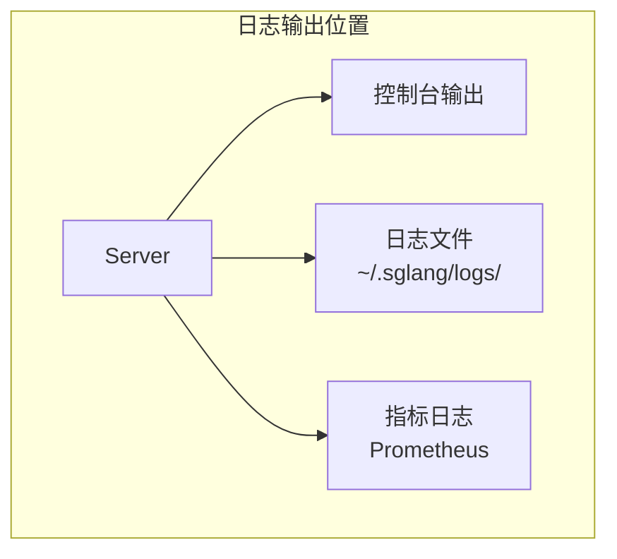
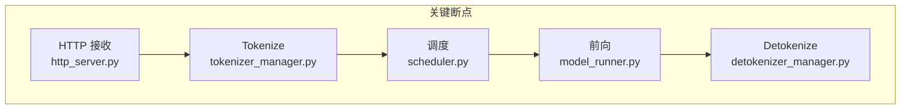
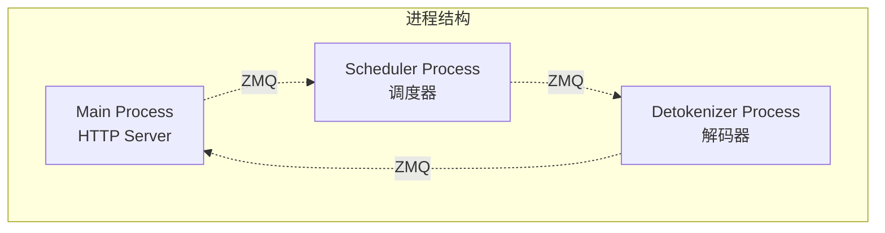
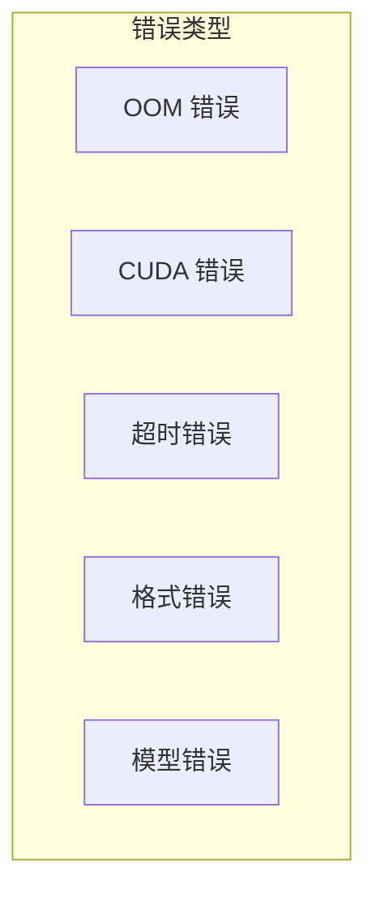
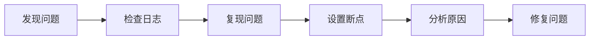

## 概述

### 本章学习目标
- 掌握 SGLang 调试技巧
- 了解关键断点位置
- 学习日志分析方法
- 熟悉常用调试工具

### 前置知识要求
- 熟悉 Python 调试
- 了解多进程调试
- 掌握日志分析基础

---

## 日志系统

### 日志级别

SGLang 使用 Python logging 模块：

```python
import logging

# 设置日志级别
logging.basicConfig(level=logging.DEBUG)

# 或通过环境变量
# export SGLANG_LOG_LEVEL=DEBUG
```

### 启用详细日志

```bash
# 启动时启用调试日志
python -m sglang.launch_server \
    --model meta-llama/Llama-3.1-8B-Instruct \
    --log-level debug
```

### 日志位置



---

## 关键断点位置

### 请求处理流程



### 1. HTTP 服务入口

**文件**: `python/sglang/srt/entrypoints/http_server.py`

```python
# 断点：接收请求
@app.post("/v1/chat/completions")
async def v1_chat_completions(request: ChatCompletionRequest):
    # 在这里设置断点
    # 可以检查：request 内容、headers、参数
    pass
```

### 2. TokenizerManager

**文件**: `python/sglang/srt/managers/tokenizer_manager.py`

```python
# 断点：Tokenization
async def _handle_chat_completions(self, obj):
    # 检查：messages 解析、模板应用
    prompt = self.tokenizer.apply_chat_template(...)

    # 检查：token IDs
    input_ids = self.tokenizer.encode(prompt)

    # 断点位置
    breakpoint()  # 或 import pdb; pdb.set_trace()
```

### 3. Scheduler

**文件**: `python/sglang/srt/managers/scheduler.py`

```python
# 断点：调度决策
def event_loop_normal(self):
    # 检查：waiting_queue 状态
    print(f"Waiting: {len(self.waiting_queue)}")

    # 检查：running_batch 状态
    print(f"Running: {len(self.running_batch)}")

    # 断点：批处理组装
    new_batch = self.get_next_batch_to_run()
```

### 4. ModelRunner

**文件**: `python/sglang/srt/model_executor/model_runner.py`

```python
# 断点：前向计算
def forward(self, forward_batch):
    # 检查：batch 信息
    print(f"Batch size: {forward_batch.batch_size}")
    print(f"Forward mode: {forward_batch.forward_mode}")

    # 检查：输入形状
    print(f"Input shape: {forward_batch.input_ids.shape}")
```

---

## 多进程调试

### 进程结构



### 调试特定进程

```python
# 方法 1：在进程启动时添加断点
def start_scheduler_process():
    import debugpy
    debugpy.listen(5678)
    debugpy.wait_for_client()
    # ... 正常启动

# 方法 2：使用环境变量
# export SGLANG_DEBUG_SCHEDULER=1
```

### VSCode 配置

```json
// .vscode/launch.json
{
    "version": "0.2.0",
    "configurations": [
        {
            "name": "Attach to Scheduler",
            "type": "python",
            "request": "attach",
            "connect": {
                "host": "localhost",
                "port": 5678
            }
        }
    ]
}
```

---

## 常用调试命令

### 检查服务状态

```bash
# 健康检查
curl http://localhost:30000/health

# 获取模型信息
curl http://localhost:30000/v1/models

# 获取运行指标
curl http://localhost:30000/metrics
```

### 检查 GPU 状态

```bash
# GPU 使用情况
nvidia-smi

# 持续监控
watch -n 1 nvidia-smi

# 详细内存信息
nvidia-smi --query-gpu=memory.used,memory.free --format=csv
```

### 检查进程状态

```bash
# 查看 SGLang 进程
ps aux | grep sglang

# 查看进程树
pstree -p <pid>

# 查看进程打开的文件
lsof -p <pid>
```

---

## 请求追踪

### 添加请求 ID

```python
import uuid

# 生成请求 ID
request_id = str(uuid.uuid4())

# 在日志中使用
logger.info(f"[{request_id}] Processing request")
logger.info(f"[{request_id}] Tokenization complete")
logger.info(f"[{request_id}] Scheduled for execution")
```

### 追踪请求流程

```python
class RequestTracer:
    def __init__(self, request_id):
        self.request_id = request_id
        self.timestamps = {}

    def mark(self, stage):
        self.timestamps[stage] = time.time()
        logger.info(f"[{self.request_id}] {stage}")

    def report(self):
        stages = list(self.timestamps.keys())
        for i, stage in enumerate(stages[1:], 1):
            prev_stage = stages[i-1]
            duration = self.timestamps[stage] - self.timestamps[prev_stage]
            logger.info(f"{prev_stage} -> {stage}: {duration:.3f}s")
```

### 使用追踪器

```python
tracer = RequestTracer(request_id)

tracer.mark("received")
# ... tokenization
tracer.mark("tokenized")
# ... scheduling
tracer.mark("scheduled")
# ... forward
tracer.mark("completed")

tracer.report()
```

---

## 内存调试

### 检查内存使用

```python
import torch

def print_memory_stats():
    """打印 GPU 内存统计"""
    for i in range(torch.cuda.device_count()):
        print(f"GPU {i}:")
        print(f"  Allocated: {torch.cuda.memory_allocated(i) / 1e9:.2f} GB")
        print(f"  Reserved:  {torch.cuda.memory_reserved(i) / 1e9:.2f} GB")
        print(f"  Max Allocated: {torch.cuda.max_memory_allocated(i) / 1e9:.2f} GB")
```

### 内存泄漏检测

```python
import gc
import tracemalloc

# 开始追踪
tracemalloc.start()

# ... 运行代码 ...

# 获取快照
snapshot = tracemalloc.take_snapshot()
top_stats = snapshot.statistics('lineno')

print("Top 10 memory allocations:")
for stat in top_stats[:10]:
    print(stat)
```

### KV Cache 调试

```python
def debug_kv_cache(scheduler):
    """调试 KV Cache 状态"""
    cache = scheduler.tree_cache

    print(f"Total nodes: {cache.total_size()}")
    print(f"Evictable nodes: {cache.evictable_size()}")
    print(f"Memory usage: {cache.memory_usage() / 1e9:.2f} GB")

    # 打印缓存树结构
    cache.print_tree()
```

---

## 性能调试

### 添加计时器

```python
import time
from contextlib import contextmanager

@contextmanager
def timer(name):
    start = time.perf_counter()
    yield
    elapsed = time.perf_counter() - start
    logger.info(f"{name}: {elapsed*1000:.2f}ms")

# 使用
with timer("forward"):
    output = model.forward(batch)
```

### 批次统计

```python
def log_batch_stats(batch):
    """记录批次统计信息"""
    logger.info(f"Batch Stats:")
    logger.info(f"  Size: {batch.batch_size}")
    logger.info(f"  Mode: {batch.forward_mode}")
    logger.info(f"  Prefill tokens: {batch.extend_num_tokens}")
    logger.info(f"  Decode tokens: {batch.decode_num_tokens}")
    logger.info(f"  Total tokens: {batch.input_ids.shape[0]}")
```

---

## 错误诊断

### 常见错误类型



### OOM 错误诊断

```python
try:
    output = model.forward(batch)
except torch.cuda.OutOfMemoryError as e:
    logger.error("OOM Error!")
    print_memory_stats()

    # 尝试恢复
    torch.cuda.empty_cache()
    gc.collect()

    # 减少批次大小重试
    smaller_batch = reduce_batch_size(batch)
    output = model.forward(smaller_batch)
```

### CUDA 错误诊断

```bash
# 启用同步执行以获取准确错误位置
export CUDA_LAUNCH_BLOCKING=1

# 启用 CUDA 调试
export CUDA_DEVICE_DEBUG=1

# 运行
python -m sglang.launch_server ...
```

### 超时错误诊断

```python
import asyncio

async def with_timeout(coro, timeout=30):
    """带超时的协程执行"""
    try:
        return await asyncio.wait_for(coro, timeout=timeout)
    except asyncio.TimeoutError:
        logger.error(f"Operation timed out after {timeout}s")
        # 打印当前状态
        print_scheduler_state()
        raise
```

---

## 调试工具

### pdb 使用

```python
# 设置断点
import pdb; pdb.set_trace()

# 常用命令
# n - 下一行
# s - 进入函数
# c - 继续执行
# p var - 打印变量
# l - 显示代码
# w - 显示调用栈
```

### ipdb 增强调试

```python
# 安装
# pip install ipdb

import ipdb; ipdb.set_trace()

# 更好的自动补全和语法高亮
```

### 远程调试 (debugpy)

```python
# 服务端
import debugpy
debugpy.listen(("0.0.0.0", 5678))
print("Waiting for debugger...")
debugpy.wait_for_client()

# 客户端使用 VSCode 连接
```

---

## 日志分析

### 日志格式

```python
# 标准日志格式
logging.basicConfig(
    format='%(asctime)s - %(name)s - %(levelname)s - %(message)s',
    level=logging.INFO
)
```

### 关键日志模式

```bash
# 查找错误
grep -i "error" server.log

# 查找 OOM
grep -i "out of memory" server.log

# 查找特定请求
grep "request_id=abc123" server.log

# 查找慢请求
grep "latency" server.log | awk '$NF > 1000'
```

### 日志聚合

```python
import re
from collections import Counter

def analyze_logs(log_file):
    """分析日志统计"""
    errors = Counter()
    latencies = []

    with open(log_file) as f:
        for line in f:
            # 统计错误
            if "ERROR" in line:
                error_type = re.search(r"ERROR.*?:(.*)", line)
                if error_type:
                    errors[error_type.group(1).strip()] += 1

            # 收集延迟
            latency_match = re.search(r"latency=(\d+\.?\d*)ms", line)
            if latency_match:
                latencies.append(float(latency_match.group(1)))

    print("Top Errors:")
    for error, count in errors.most_common(10):
        print(f"  {count}: {error}")

    print(f"\nLatency Stats:")
    print(f"  Mean: {sum(latencies)/len(latencies):.2f}ms")
    print(f"  Max: {max(latencies):.2f}ms")
```

---

## 调试检查清单

### 启动问题

```
□ 模型路径是否正确?
□ GPU 是否可用 (nvidia-smi)?
□ CUDA 版本是否匹配?
□ 是否有足够的 GPU 内存?
□ 端口是否被占用?
```

### 运行问题

```
□ 请求格式是否正确?
□ Token 限制是否合理?
□ 是否有 OOM 错误?
□ 是否有 CUDA 错误?
□ 日志中是否有异常?
```

### 性能问题

```
□ GPU 利用率如何?
□ 批次大小是否合适?
□ 是否启用了优化?
□ 是否有内存泄漏?
□ 网络延迟是否正常?
```

---

## 小结

### 要点回顾

1. **日志系统**：使用日志级别，分析关键模式
2. **断点调试**：在关键位置设置断点
3. **多进程**：使用 debugpy 远程调试
4. **工具使用**：pdb、ipdb、VSCode

### 调试流程



### 下一章预告

在下一章《性能分析》中，我们将：
- 使用 py-spy 分析 CPU 性能
- 使用 torch profiler 分析 GPU
- 定位性能瓶颈

