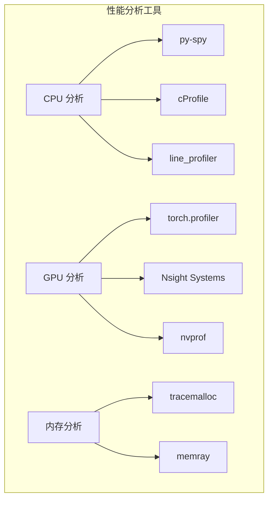
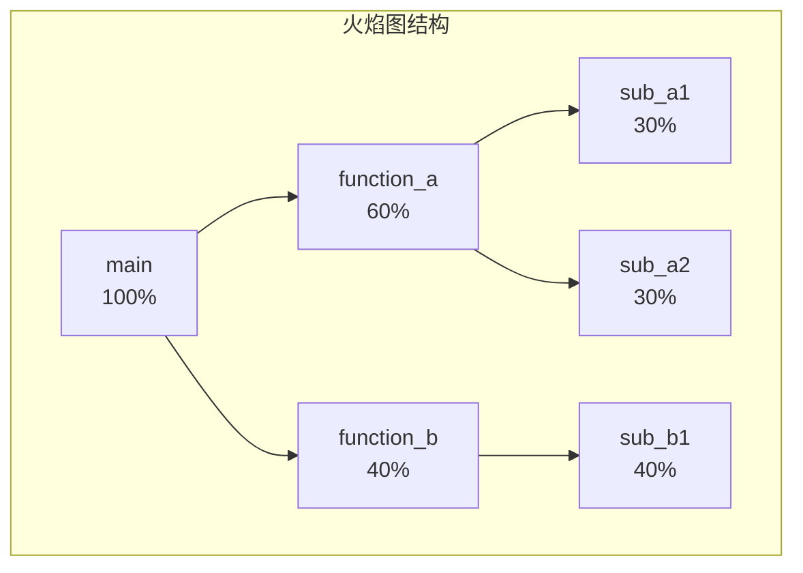
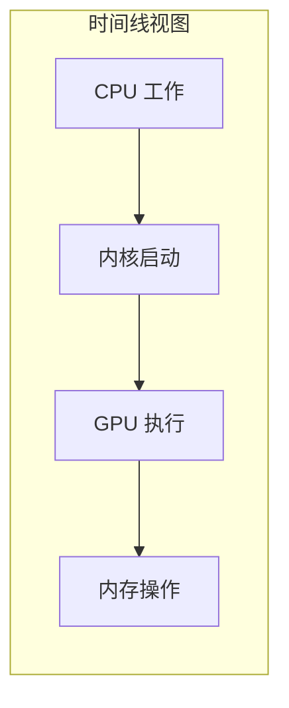
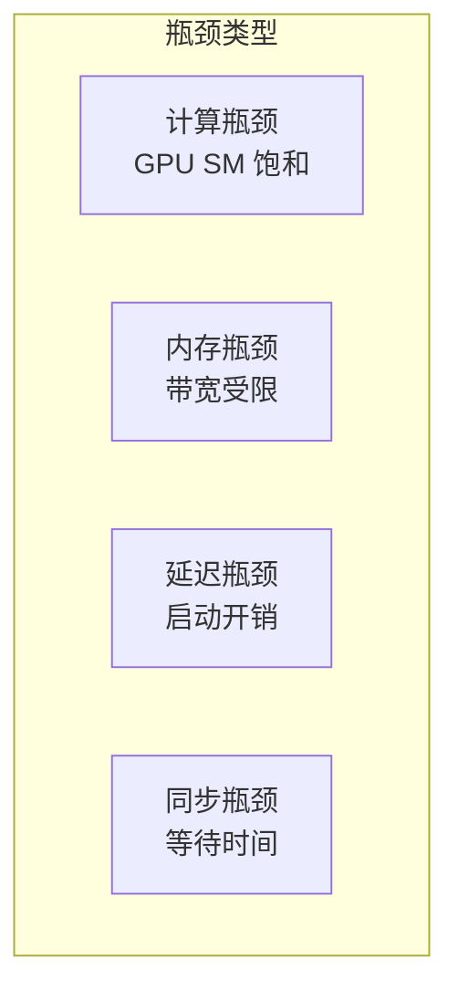
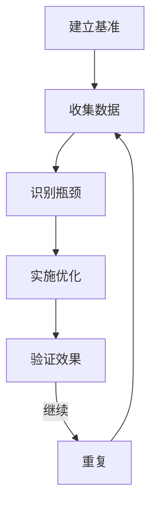

## 概述

### 本章学习目标
- 掌握 CPU 性能分析方法
- 学习 GPU 性能分析工具
- 了解瓶颈定位技巧
- 熟悉优化验证流程

### 前置知识要求
- 了解性能分析概念
- 熟悉 Python profiling
- 理解 CUDA 执行模型

---

## 性能分析工具

### 工具概览



---

## CPU 性能分析

### py-spy 使用

py-spy 是一个采样型 profiler，对性能影响极小：

```bash
# 安装
pip install py-spy

# 对运行中的进程进行分析
py-spy record -o profile.svg --pid <PID>

# 启动并分析
py-spy record -o profile.svg -- python -m sglang.launch_server ...

# 实时 top 视图
py-spy top --pid <PID>
```

### 火焰图分析



**解读火焰图**：
- 宽度表示时间占比
- 高度表示调用深度
- 查找宽而高的块（热点）

### cProfile 使用

```python
import cProfile
import pstats

# 基本使用
cProfile.run('main()', 'output.prof')

# 分析结果
stats = pstats.Stats('output.prof')
stats.sort_stats('cumulative')
stats.print_stats(20)  # 打印前 20 条
```

### 代码级分析

```python
# 使用 line_profiler
# pip install line_profiler

from line_profiler import profile

@profile
def forward_batch(self, batch):
    # 每行都会被分析
    input_ids = batch.input_ids
    attention_mask = batch.attention_mask
    output = self.model(input_ids, attention_mask)
    return output

# 运行
# kernprof -l -v script.py
```

---

## GPU 性能分析

### torch.profiler

```python
import torch
from torch.profiler import profile, ProfilerActivity

# 基本使用
with profile(
    activities=[ProfilerActivity.CPU, ProfilerActivity.CUDA],
    record_shapes=True,
    profile_memory=True,
    with_stack=True
) as prof:
    # 运行推理
    output = model.forward(batch)

# 打印结果
print(prof.key_averages().table(sort_by="cuda_time_total", row_limit=20))
```

### 完整分析流程

```python
from torch.profiler import profile, ProfilerActivity, schedule, tensorboard_trace_handler

# 配置 profiler
with profile(
    activities=[ProfilerActivity.CPU, ProfilerActivity.CUDA],
    schedule=schedule(
        wait=1,      # 等待 1 步
        warmup=1,    # 预热 1 步
        active=3,    # 分析 3 步
        repeat=2     # 重复 2 次
    ),
    on_trace_ready=tensorboard_trace_handler('./log'),
    record_shapes=True,
    profile_memory=True,
    with_stack=True
) as prof:
    for step, batch in enumerate(dataloader):
        output = model.forward(batch)
        prof.step()

# 使用 TensorBoard 查看
# tensorboard --logdir=./log
```

### 分析输出解读

```
---------------------------------  ------------  ------------  ------------
                             Name    Self CPU %    Self CUDA %    CUDA total
---------------------------------  ------------  ------------  ------------
                         aten::mm        5.23%       45.67%        45.67%
              aten::flash_attn_func        2.15%       25.34%        25.34%
                    aten::embedding        1.02%        8.45%         8.45%
                       aten::layer_norm        0.89%        6.78%         6.78%
---------------------------------  ------------  ------------  ------------
```

### CUDA 内核分析

```python
# 获取 CUDA 内核详情
with profile(activities=[ProfilerActivity.CUDA]) as prof:
    output = model.forward(batch)

# 打印 CUDA 内核
for event in prof.key_averages():
    if event.device_type == "cuda":
        print(f"{event.key}: {event.cuda_time_total / 1000:.2f}ms")
```

---

## Nsight Systems

### 安装和使用

```bash
# 安装 (通常随 CUDA Toolkit)
# https://developer.nvidia.com/nsight-systems

# 收集数据
nsys profile -o report python -m sglang.launch_server ...

# 分析报告
nsys-ui report.nsys-rep
```

### 时间线分析



### 关键指标

| 指标 | 说明 | 理想值 |
|------|------|--------|
| GPU 利用率 | GPU 执行时间占比 | > 90% |
| 内存带宽利用率 | 带宽使用率 | > 70% |
| Compute 利用率 | 计算单元使用率 | > 80% |
| 内核占用率 | SM 占用率 | > 60% |

---

## 瓶颈定位

### 常见瓶颈类型



### 识别计算瓶颈

```python
def check_compute_bound():
    """检查是否为计算瓶颈"""
    # 增加 batch size
    # 如果吞吐量线性增长 -> 非计算瓶颈
    # 如果吞吐量不变 -> 计算瓶颈

    results = []
    for batch_size in [1, 2, 4, 8, 16]:
        throughput = benchmark(batch_size)
        results.append((batch_size, throughput))

    # 分析结果
    for bs, tp in results:
        print(f"Batch {bs}: {tp:.2f} tokens/s")
```

### 识别内存瓶颈

```python
def check_memory_bound():
    """检查是否为内存瓶颈"""
    import torch

    # 测量内存带宽
    size = 1024 * 1024 * 256  # 256 MB
    a = torch.randn(size, device='cuda')
    b = torch.randn(size, device='cuda')

    # 预热
    for _ in range(10):
        c = a + b

    # 计时
    torch.cuda.synchronize()
    start = time.time()
    for _ in range(100):
        c = a + b
    torch.cuda.synchronize()
    elapsed = time.time() - start

    # 计算带宽
    bytes_transferred = size * 4 * 3 * 100  # float32, a+b+c
    bandwidth_gb = bytes_transferred / elapsed / 1e9
    print(f"Achieved bandwidth: {bandwidth_gb:.2f} GB/s")
```

### 识别延迟瓶颈

```python
def check_latency_bound():
    """检查内核启动延迟"""
    # 小批次可能受内核启动延迟影响

    # 方法 1：使用 CUDA Graph
    # 方法 2：合并小操作

    with profile(activities=[ProfilerActivity.CUDA]) as prof:
        for _ in range(100):
            output = model.forward(small_batch)

    # 分析内核数量
    kernel_count = len([e for e in prof.events() if e.device_type == "cuda"])
    print(f"Kernels per forward: {kernel_count / 100}")
```

---

## 优化验证

### A/B 测试

```python
def ab_test(baseline_fn, optimized_fn, inputs, n_runs=100):
    """A/B 性能测试"""
    # 预热
    for _ in range(10):
        baseline_fn(inputs)
        optimized_fn(inputs)

    # 基准测试
    torch.cuda.synchronize()
    start = time.time()
    for _ in range(n_runs):
        baseline_fn(inputs)
    torch.cuda.synchronize()
    baseline_time = time.time() - start

    # 优化版本测试
    torch.cuda.synchronize()
    start = time.time()
    for _ in range(n_runs):
        optimized_fn(inputs)
    torch.cuda.synchronize()
    optimized_time = time.time() - start

    speedup = baseline_time / optimized_time
    print(f"Baseline: {baseline_time/n_runs*1000:.2f}ms")
    print(f"Optimized: {optimized_time/n_runs*1000:.2f}ms")
    print(f"Speedup: {speedup:.2f}x")
```

### 回归测试

```python
import json

def benchmark_and_record(version, metrics_file="metrics.json"):
    """记录性能指标"""
    metrics = {
        "version": version,
        "timestamp": time.time(),
        "throughput": measure_throughput(),
        "latency_p50": measure_latency(0.5),
        "latency_p99": measure_latency(0.99),
        "memory_peak": torch.cuda.max_memory_allocated() / 1e9
    }

    # 加载历史
    try:
        with open(metrics_file) as f:
            history = json.load(f)
    except FileNotFoundError:
        history = []

    history.append(metrics)

    # 保存
    with open(metrics_file, "w") as f:
        json.dump(history, f, indent=2)

    # 对比上一版本
    if len(history) >= 2:
        prev = history[-2]
        print(f"Throughput: {metrics['throughput']:.2f} vs {prev['throughput']:.2f}")
        print(f"Latency P99: {metrics['latency_p99']:.2f} vs {prev['latency_p99']:.2f}")
```

---

## 分析脚本

### 完整分析脚本

```python
#!/usr/bin/env python
"""SGLang 性能分析脚本"""

import argparse
import time
import torch
from torch.profiler import profile, ProfilerActivity

def profile_model(model, batch, output_dir="./profile"):
    """完整性能分析"""
    import os
    os.makedirs(output_dir, exist_ok=True)

    # 1. 内存分析
    print("=== Memory Analysis ===")
    torch.cuda.reset_peak_memory_stats()
    output = model.forward(batch)
    peak_memory = torch.cuda.max_memory_allocated() / 1e9
    print(f"Peak memory: {peak_memory:.2f} GB")

    # 2. 时间分析
    print("\n=== Timing Analysis ===")
    torch.cuda.synchronize()
    start = time.time()
    n_runs = 100
    for _ in range(n_runs):
        output = model.forward(batch)
    torch.cuda.synchronize()
    avg_time = (time.time() - start) / n_runs * 1000
    print(f"Average forward time: {avg_time:.2f}ms")

    # 3. Profiler 分析
    print("\n=== Detailed Profile ===")
    with profile(
        activities=[ProfilerActivity.CPU, ProfilerActivity.CUDA],
        record_shapes=True,
        profile_memory=True
    ) as prof:
        for _ in range(10):
            output = model.forward(batch)

    # 保存结果
    prof.export_chrome_trace(f"{output_dir}/trace.json")
    print(f"Trace saved to {output_dir}/trace.json")

    # 打印摘要
    print("\nTop CUDA operations:")
    print(prof.key_averages().table(sort_by="cuda_time_total", row_limit=10))

    return {
        "peak_memory_gb": peak_memory,
        "avg_forward_ms": avg_time
    }


def main():
    parser = argparse.ArgumentParser()
    parser.add_argument("--model", required=True)
    parser.add_argument("--batch-size", type=int, default=1)
    parser.add_argument("--seq-len", type=int, default=512)
    args = parser.parse_args()

    # 加载模型
    model = load_model(args.model)

    # 创建测试批次
    batch = create_test_batch(args.batch_size, args.seq_len)

    # 分析
    results = profile_model(model, batch)

    print("\n=== Summary ===")
    print(f"Peak Memory: {results['peak_memory_gb']:.2f} GB")
    print(f"Avg Forward: {results['avg_forward_ms']:.2f} ms")


if __name__ == "__main__":
    main()
```

---

## 可视化工具

### TensorBoard

```python
from torch.profiler import tensorboard_trace_handler

with profile(
    on_trace_ready=tensorboard_trace_handler('./log/profiler')
) as prof:
    # 运行
    pass

# 启动 TensorBoard
# tensorboard --logdir=./log
```

### Chrome Trace

```python
# 导出为 Chrome Trace 格式
prof.export_chrome_trace("trace.json")

# 在 Chrome 中打开
# chrome://tracing
# 加载 trace.json
```

### 自定义可视化

```python
import matplotlib.pyplot as plt

def plot_latency_distribution(latencies):
    """绘制延迟分布"""
    plt.figure(figsize=(10, 6))

    plt.hist(latencies, bins=50, edgecolor='black')
    plt.axvline(x=np.percentile(latencies, 50), color='r', label='P50')
    plt.axvline(x=np.percentile(latencies, 99), color='g', label='P99')

    plt.xlabel('Latency (ms)')
    plt.ylabel('Count')
    plt.title('Latency Distribution')
    plt.legend()
    plt.savefig('latency_dist.png')
```

---

## 最佳实践

### 分析流程



### 注意事项

1. **预热**：总是先运行几次预热
2. **同步**：测量前后调用 `torch.cuda.synchronize()`
3. **多次运行**：取平均值减少噪声
4. **隔离变量**：一次只改变一个因素
5. **记录环境**：记录 GPU 型号、驱动版本等

---

## 小结

### 要点回顾

1. **CPU 分析**：py-spy 火焰图，line_profiler 逐行
2. **GPU 分析**：torch.profiler，Nsight Systems
3. **瓶颈类型**：计算、内存、延迟、同步
4. **验证优化**：A/B 测试，回归测试

### 工具选择

| 场景 | 推荐工具 |
|------|---------|
| 快速定位热点 | py-spy |
| 详细 GPU 分析 | torch.profiler |
| 系统级分析 | Nsight Systems |
| 内存泄漏 | tracemalloc |

### 下一章预告

在下一章《常见问题排查》中，我们将：
- 了解 OOM 问题解决
- 学习性能问题诊断
- 掌握调优 checklist

