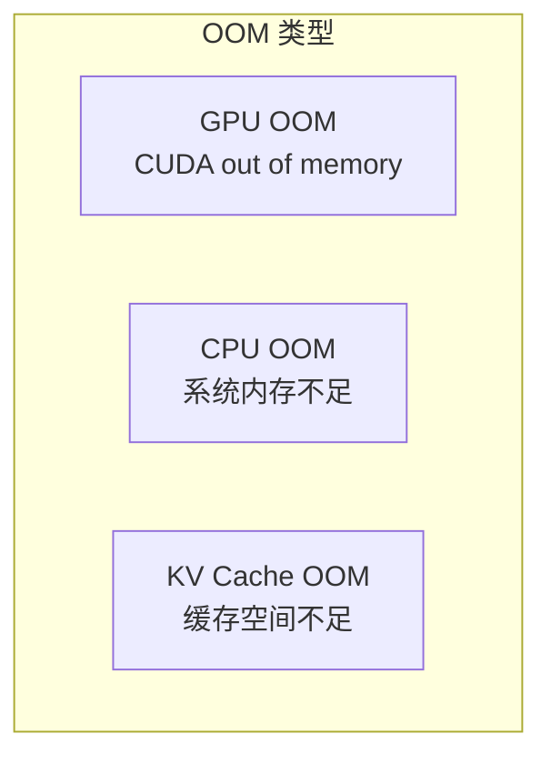
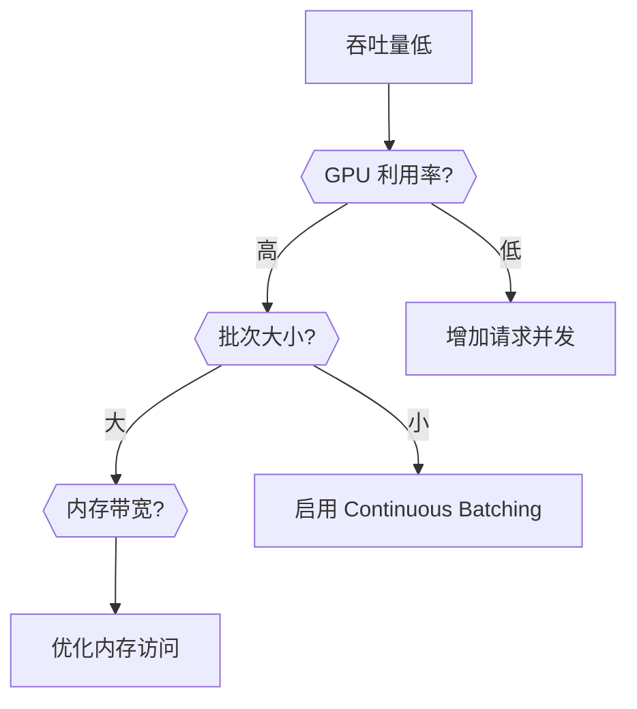
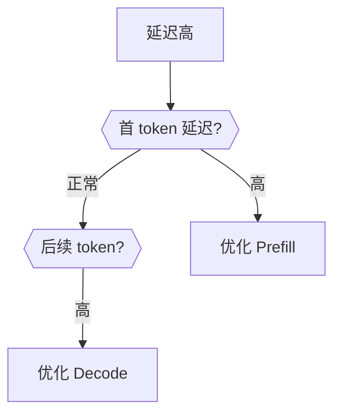
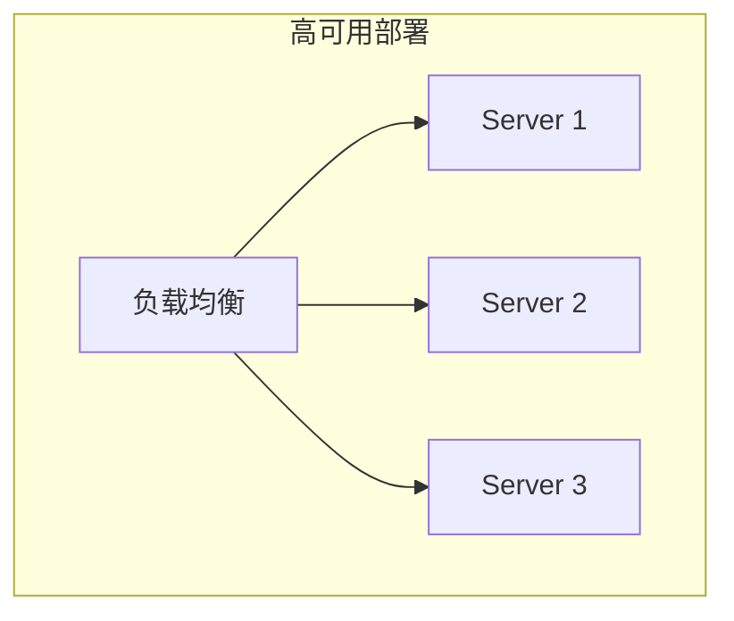

## 概述

### 本章学习目标
- 掌握 OOM 问题排查
- 学习性能问题诊断
- 了解启动问题解决
- 熟悉调优 checklist

### 前置知识要求
- 了解 GPU 内存管理
- 熟悉 Python 调试
- 掌握 Linux 基础命令

---

## OOM 问题排查

### OOM 类型



### GPU OOM 诊断

```bash
# 检查 GPU 内存使用
nvidia-smi

# 详细内存信息
nvidia-smi --query-gpu=memory.used,memory.free,memory.total --format=csv
```

**常见原因**：
1. 模型太大
2. 批次太大
3. 序列太长
4. KV Cache 过大

### GPU OOM 解决方案

```bash
# 方案 1: 减少内存分配比例
python -m sglang.launch_server \
    --model meta-llama/Llama-3.1-8B-Instruct \
    --mem-fraction-static 0.7  # 默认 0.88

# 方案 2: 使用量化
python -m sglang.launch_server \
    --model meta-llama/Llama-3.1-8B-Instruct \
    --quantization fp8

# 方案 3: 限制批次大小
python -m sglang.launch_server \
    --model meta-llama/Llama-3.1-8B-Instruct \
    --max-running-requests 16

# 方案 4: 限制序列长度
python -m sglang.launch_server \
    --model meta-llama/Llama-3.1-8B-Instruct \
    --context-length 4096
```

### KV Cache OOM

```python
# 症状：请求被拒绝或等待
# 日志："No available KV cache slots"

# 解决方案
# 1. 减少最大请求数
--max-running-requests 8

# 2. 减少最大序列长度
--context-length 2048

# 3. 增加内存分配
--mem-fraction-static 0.9
```

### CPU OOM

```bash
# 检查系统内存
free -h

# 检查进程内存
ps aux --sort=-%mem | head -20

# 解决方案
# 1. 增加系统内存
# 2. 减少 tokenizer 缓存
# 3. 限制并发请求
```

---

## 性能问题诊断

### 吞吐量低



**诊断步骤**：

```bash
# 1. 检查 GPU 利用率
watch -n 1 nvidia-smi

# 2. 检查请求排队
curl http://localhost:30000/metrics | grep queue

# 3. 检查批次统计
# 查看日志中的 batch_size
```

**解决方案**：

```bash
# 增加并发
--max-running-requests 64

# 启用 Chunked Prefill
--chunked-prefill-size 8192

# 优化调度
--schedule-policy lpm
```

### 延迟高



**Prefill 延迟高**：

```bash
# 启用 Chunked Prefill
--chunked-prefill-size 4096

# 启用 FlashInfer
--attention-backend flashinfer
```

**Decode 延迟高**：

```bash
# 启用 CUDA Graph
--cuda-graph-max-bs 32

# 启用推测解码
--speculative-algorithm EAGLE
```

### GPU 利用率低

```python
# 诊断脚本
import torch
import time

def check_gpu_utilization():
    """检查 GPU 利用率"""
    while True:
        stats = torch.cuda.memory_stats()
        print(f"Active: {stats['active_bytes.all.current'] / 1e9:.2f} GB")
        print(f"Reserved: {stats['reserved_bytes.all.current'] / 1e9:.2f} GB")
        time.sleep(1)
```

**解决方案**：

```bash
# 1. 增加批次大小
--max-running-requests 128

# 2. 检查是否有等待
# 增加预处理线程
--tokenizer-threads 4

# 3. 确保请求足够
# 客户端增加并发
```

---

## 启动问题

### 模型加载失败

```bash
# 错误：无法找到模型
# 解决：检查路径和网络

# 使用本地路径
--model /path/to/local/model

# 设置 HuggingFace 镜像
export HF_ENDPOINT=https://hf-mirror.com
```

### CUDA 错误

```bash
# 错误：CUDA error: device-side assert triggered
# 解决：启用同步调试

export CUDA_LAUNCH_BLOCKING=1
python -m sglang.launch_server ...

# 错误：CUDA driver version is insufficient
# 解决：更新 CUDA 驱动
nvidia-smi  # 检查驱动版本
```

### 端口占用

```bash
# 错误：Address already in use
# 解决：

# 1. 找到占用进程
lsof -i :30000

# 2. 终止进程
kill -9 <PID>

# 3. 或使用其他端口
--port 30001
```

### 依赖问题

```bash
# 错误：ModuleNotFoundError
# 解决：重新安装依赖

pip install sglang[all] --upgrade

# 错误：版本不兼容
# 解决：使用正确的 Python 版本
python --version  # 需要 3.9+
```

---

## 请求问题

### 请求超时

```python
# 症状：请求长时间无响应

# 诊断
# 1. 检查服务器状态
curl http://localhost:30000/health

# 2. 检查队列
curl http://localhost:30000/metrics | grep waiting

# 解决
# 1. 增加超时
response = client.chat.completions.create(
    ...,
    timeout=120  # 秒
)

# 2. 限制生成长度
max_tokens=256
```

### 输出不符合预期

```python
# 问题：输出截断
# 原因：max_tokens 设置太小

response = client.chat.completions.create(
    model="...",
    messages=[...],
    max_tokens=2048  # 增加限制
)

# 问题：输出随机性高
# 解决：调整采样参数
response = client.chat.completions.create(
    model="...",
    messages=[...],
    temperature=0.1,  # 降低
    top_p=0.9
)
```

### 格式错误

```python
# 错误：JSON 解析失败
# 原因：请求格式错误

# 正确格式
{
    "model": "meta-llama/Llama-3.1-8B-Instruct",
    "messages": [
        {"role": "user", "content": "Hello"}
    ]
}

# 检查 content-type
headers = {"Content-Type": "application/json"}
```

---

## 调优 Checklist

### 内存优化

```
□ 使用合适的 --mem-fraction-static (默认 0.88)
□ 启用量化 (--quantization fp8/int8/int4)
□ 限制 --context-length
□ 限制 --max-running-requests
□ 清理不用的 KV Cache
```

### 吞吐量优化

```
□ 启用 Continuous Batching (默认开启)
□ 使用 --chunked-prefill-size
□ 增加 --max-running-requests
□ 使用 LPM 调度策略
□ 启用 RadixAttention 缓存
```

### 延迟优化

```
□ 启用 CUDA Graph (--cuda-graph-max-bs)
□ 使用 torch.compile (--enable-torch-compile)
□ 启用推测解码 (--speculative-algorithm)
□ 使用 FlashInfer attention
□ 减少网络开销
```

### 稳定性优化

```
□ 设置合适的超时
□ 启用健康检查
□ 配置自动重启
□ 监控内存使用
□ 设置日志级别
```

---

## 配置参考

### 小规模部署 (单 GPU, 7B 模型)

```bash
python -m sglang.launch_server \
    --model meta-llama/Llama-3.1-8B-Instruct \
    --mem-fraction-static 0.85 \
    --max-running-requests 32 \
    --cuda-graph-max-bs 16
```

### 中规模部署 (多 GPU, 70B 模型)

```bash
python -m sglang.launch_server \
    --model meta-llama/Llama-3.1-70B-Instruct \
    --tp 4 \
    --mem-fraction-static 0.88 \
    --max-running-requests 64 \
    --chunked-prefill-size 8192 \
    --cuda-graph-max-bs 32
```

### 高吞吐部署

```bash
python -m sglang.launch_server \
    --model meta-llama/Llama-3.1-8B-Instruct \
    --max-running-requests 256 \
    --chunked-prefill-size 16384 \
    --schedule-policy lpm \
    --enable-torch-compile
```

### 低延迟部署

```bash
python -m sglang.launch_server \
    --model meta-llama/Llama-3.1-8B-Instruct \
    --max-running-requests 16 \
    --cuda-graph-max-bs 16 \
    --speculative-algorithm EAGLE \
    --speculative-num-draft-tokens 5
```

---

## 监控建议

### Prometheus 指标

```bash
# 获取指标
curl http://localhost:30000/metrics

# 关键指标
# sglang_running_requests - 运行中请求数
# sglang_waiting_requests - 等待中请求数
# sglang_cache_hit_rate - 缓存命中率
# sglang_generation_throughput - 生成吞吐量
```

### 告警规则

```yaml
# prometheus/alerts.yml
groups:
  - name: sglang
    rules:
      - alert: HighLatency
        expr: sglang_request_latency_p99 > 10
        for: 5m
        labels:
          severity: warning

      - alert: LowThroughput
        expr: sglang_generation_throughput < 100
        for: 5m
        labels:
          severity: warning

      - alert: HighMemoryUsage
        expr: sglang_gpu_memory_used / sglang_gpu_memory_total > 0.95
        for: 1m
        labels:
          severity: critical
```

---

## 故障恢复

### 服务重启

```bash
# 优雅停止
kill -SIGTERM <PID>

# 强制停止
kill -9 <PID>

# 清理残留
pkill -f sglang
```

### 状态恢复

```python
# 请求重试逻辑
import tenacity

@tenacity.retry(
    stop=tenacity.stop_after_attempt(3),
    wait=tenacity.wait_exponential(multiplier=1, min=1, max=10)
)
def make_request(prompt):
    return client.chat.completions.create(
        model="...",
        messages=[{"role": "user", "content": prompt}]
    )
```

### 容灾部署



---

## 小结

### 问题分类

| 类别 | 常见问题 | 解决方向 |
|------|---------|---------|
| 内存 | OOM | 量化、限制批次 |
| 性能 | 吞吐低 | 批处理、缓存 |
| 延迟 | 响应慢 | CUDA Graph、推测解码 |
| 启动 | 加载失败 | 检查路径、依赖 |

### 排查流程


### 资源参考

- SGLang GitHub Issues
- SGLang Discord 社区
- 官方文档

---

## 教程总结

恭喜您完成了 SGLang 原理机制教程的全部学习！

### 学习路径回顾

1. **入门篇**：了解 SGLang 基础和架构
2. **核心架构篇**：深入三进程设计
3. **内存与缓存篇**：掌握 KV Cache 和 RadixAttention
4. **批处理与调度篇**：理解连续批处理机制
5. **性能优化篇**：学习 CUDA Graph、量化等优化
6. **分布式与并行篇**：了解 TP/PP/EP 并行策略
7. **高级特性篇**：掌握结构化输出、LoRA、多模态
8. **实战调试篇**：学会调试和问题排查

### 进阶建议

- 阅读 SGLang 源码
- 参与社区讨论
- 尝试贡献代码
- 关注最新更新

