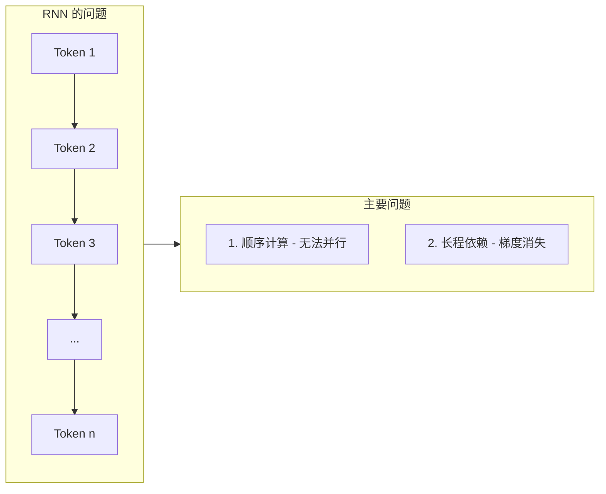
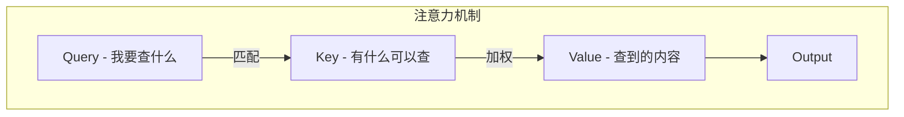
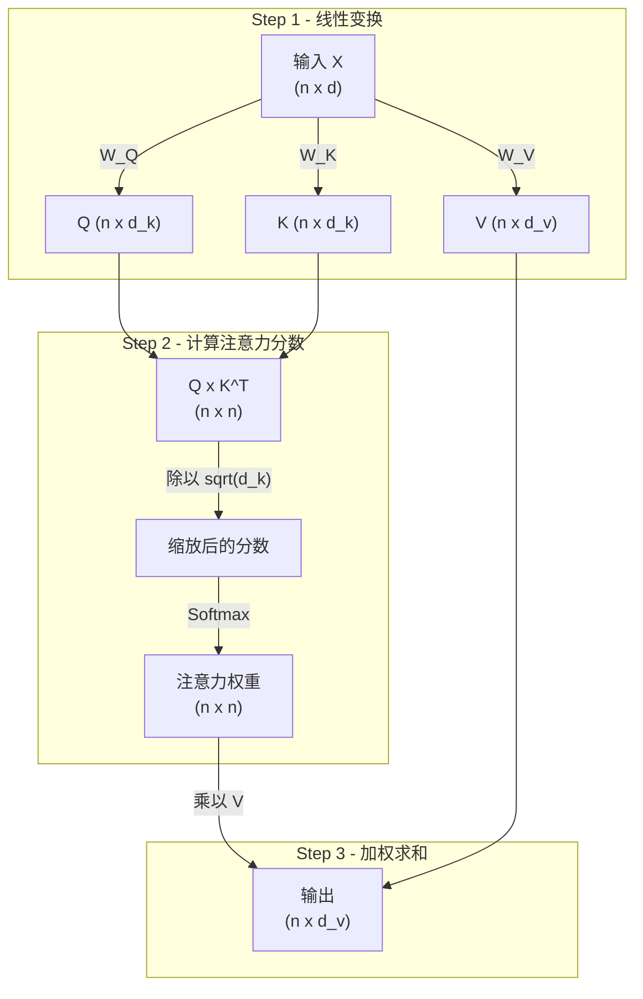
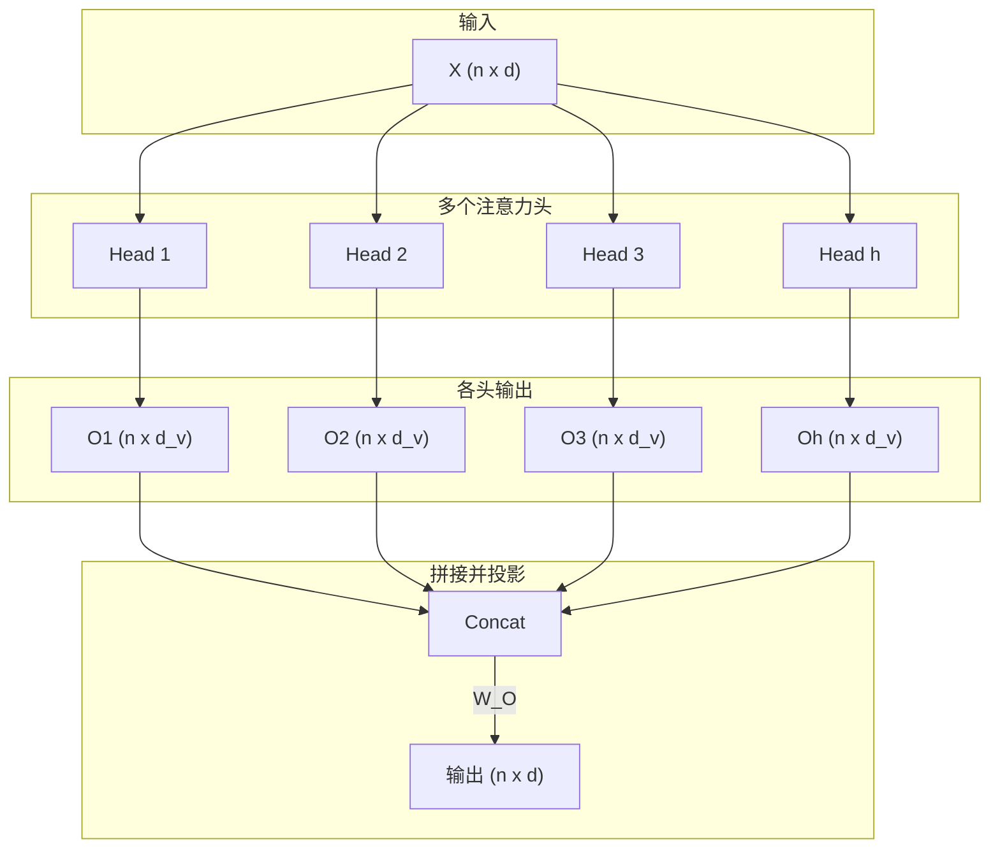
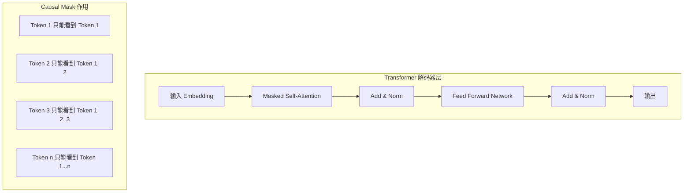
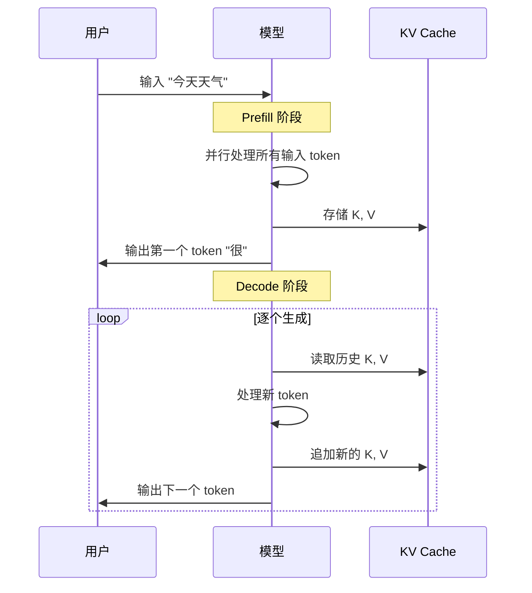
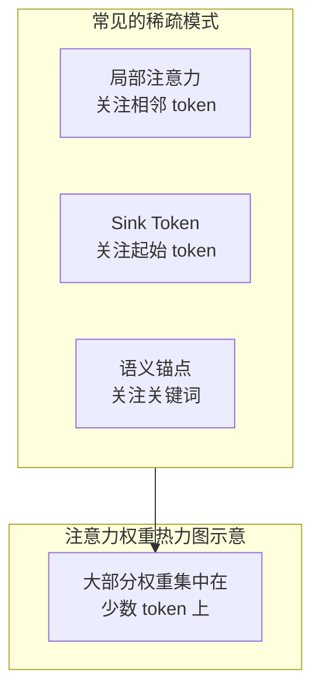

> **阅读时间**: 约 15 分钟
> **前置要求**: 线性代数基础、神经网络基本概念

---

## 概述

本文介绍 Transformer 架构中的注意力机制，这是理解 KV Cache 和 UCM 优化的基础。

---

## 1. 为什么需要注意力机制

### 1.1 序列建模的挑战

传统的 RNN/LSTM 在处理长序列时面临两个核心问题：


- **顺序依赖**: RNN 必须按顺序处理 token，无法并行化
- **长程依赖**: 信息在长序列中逐渐衰减，难以捕捉远距离关系

### 1.2 注意力的核心思想

注意力机制允许模型直接关注输入序列的任意位置，而不需要通过中间状态传递信息：


**类比理解**:
- **Query (Q)**: 你想要查找的问题
- **Key (K)**: 数据库中的索引
- **Value (V)**: 索引对应的实际内容

---

## 2. 自注意力机制（Self-Attention）

### 2.1 数学定义

给定输入序列 $X \in \mathbb{R}^{n \times d}$（n 个 token，每个 d 维），自注意力计算如下：

$$
\text{Attention}(Q, K, V) = \text{softmax}\left(\frac{QK^T}{\sqrt{d_k}}\right)V
$$

其中：
- $Q = XW_Q$ （Query 矩阵）
- $K = XW_K$ （Key 矩阵）
- $V = XW_V$ （Value 矩阵）
- $d_k$ 是 Key 的维度，用于缩放

### 2.2 计算步骤详解



**步骤说明**:

1. **线性变换**: 将输入通过三个不同的权重矩阵，得到 Q、K、V
2. **计算相似度**: $QK^T$ 计算每对 token 之间的相似度
3. **缩放**: 除以 $\sqrt{d_k}$ 防止点积值过大导致梯度消失
4. **归一化**: Softmax 将分数转换为概率分布
5. **加权求和**: 用注意力权重对 V 进行加权求和

### 2.3 计算复杂度分析

| 操作 | 复杂度 | 说明 |
|------|--------|------|
| $QK^T$ | $O(n^2 \cdot d_k)$ | 两个 (n x d_k) 矩阵相乘 |
| Softmax | $O(n^2)$ | 对 n x n 矩阵操作 |
| 乘以 V | $O(n^2 \cdot d_v)$ | (n x n) 乘以 (n x d_v) |
| **总计** | $O(n^2 \cdot d)$ | **随序列长度平方增长** |
**关键洞察**: 自注意力的计算复杂度是 $O(n^2)$，这意味着：
- 序列长度翻倍，计算量变为 4 倍
- 长序列场景下成为瓶颈
---
## 3. 多头注意力（Multi-Head Attention）

### 3.1 为什么需要多头

单个注意力头只能学习一种关注模式。多头注意力允许模型在不同的表示子空间中学习不同的关注模式：



### 3.2 数学定义

$$
\text{MultiHead}(Q, K, V) = \text{Concat}(\text{head}_1, ..., \text{head}_h)W^O
$$

其中：
$$
\text{head}_i = \text{Attention}(QW_i^Q, KW_i^K, VW_i^V)
$$

### 3.3 维度分配

对于 h 个头，每个头的维度是：
- $d_k = d_{model} / h$
- $d_v = d_{model} / h$

这样总计算量与单头相同，但模型可以学习多种注意力模式。

---
## 4. Transformer 解码器架构
UCM 主要优化的是**解码器**（Decoder）部分，用于自回归生成。
### 4.1 解码器结构

### 4.2 因果掩码（Causal Mask）
在解码过程中，每个 token 只能关注它之前的 token（包括自己），不能"看到未来"：
```
注意力掩码矩阵（4x4 示例）：
     T1  T2  T3  T4
T1 [  1   0   0   0 ]
T2 [  1   1   0   0 ]
T3 [  1   1   1   0 ]
T4 [  1   1   1   1 ]
1 = 可以关注
0 = 被掩盖（置为 -inf）
```
这确保了模型在生成第 i 个 token 时，只使用前 i-1 个 token 的信息。
### 4.3 自回归生成过程

---
## 5. 注意力的稀疏性

### 5.1 观察到的稀疏模式

研究发现，注意力权重在实际应用中通常是稀疏的：



### 5.2 稀疏性的意义

- 大多数 token 对最终输出贡献很小
- 只需要关注"重要"的 token 即可保持生成质量
- 这为 **稀疏注意力优化** 提供了理论基础

---
## 6. 关键概念总结
| 概念 | 说明 | 与 UCM 的关系 |
|------|------|--------------|
| Self-Attention | 序列内 token 间的相互关注 | UCM 优化其计算过程 |
| Multi-Head | 多种注意力模式并行 | 每层每头都有独立的 KV |
| Causal Mask | 防止看到未来 token | 决定了 KV Cache 的累积特性 |
| $O(n^2)$ 复杂度 | 随序列长度平方增长 | UCM 稀疏注意力降低复杂度 |
| 注意力稀疏性 | 权重集中在少数 token | UCM 稀疏算法的理论基础 |
---
## 延伸阅读

- [Attention Is All You Need](https://arxiv.org/abs/1706.03762) - Transformer 原论文
- [The Illustrated Transformer](https://jalammar.github.io/illustrated-transformer/) - 可视化讲解
